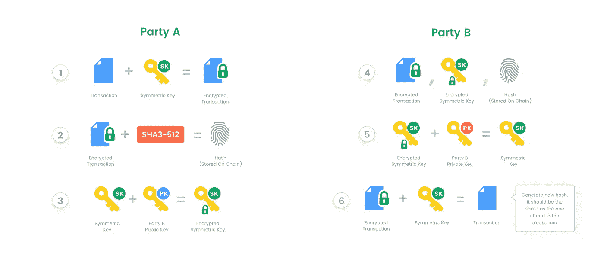

# 选择私立区块链理工大学:法定人数

> 原文：<https://medium.com/hackernoon/choosing-private-blockchain-tech-quorum-d33221d40b54>

越来越多的公司对区块链技术感兴趣。这项技术的前景是巨大的:增加透明度，减少对中介的依赖，减少欺诈和许多其他问题。有许多关于区块链未来的文章；然而，它们往往过于抽象。在我看来，还没有足够的脚踏实地的，有具体实现例子的具体用例。毕竟，例如，当我们选择一种数据库技术时，我们真正关心的是它如何改进我们的业务，而不是它如何破坏整个社会结构。

在接下来的系列文章中，我将在单个用例的上下文中查看不同的区块链产品。该用例假设一组组织实施私有区块链来存储和共享数据。

私人区块链不像公共(如比特币和以太坊)那样不可改变和不可信。然而，这并不意味着运行私有区块链没有任何好处，因为数据的共享和复制是企业环境中的常见需求。因此，这里我们将探讨一些最流行的解决方案，以及它们的优缺点。但是首先，我们将从我们的用例开始。

# 用例

为了简单明了，让我们考虑一个来自金融业的现实生活场景的简化版本。一旦理解了这个简单的用例，就很容易将其推广到更复杂的场景。

以下是该场景中的各方:

*   **非托管资产管理人** ( **对冲基金**)做出投资决策(交易)。非托管意味着他们实际上不持有客户的钱。相反，在交易完成后，他们会向托管人发送指令，让托管人适当地转移资金。
*   **保管人**。通常是持有客户资金并代表对冲基金执行转账的大型可信金融机构。托管人需要了解每笔交易，以便向交易对手支付款项。
*   **客户端**。投资对冲基金。每个客户需要查看自己账户中的交易，而不是其他客户的账户。

显而易见，这三方之间需要共享交易数据。我们有意不考虑使用区块链转移实际资金，因为这是一个众所周知的用例。相反，我们将关注一个传输数据对象的简单用例，它包含以下字段:

*   TradeID
*   交易时间戳
*   交易商名称
*   贸易规模
*   批发价
*   交易对手名称
*   ClientID
*   也可以添加其他元数据，包括特定于该交易类型的其他字段，例如期权到期日等。

# 要求

该信息流有几个要求:

1.  **可送达性**:每笔交易，无一例外，都要向托管人报告。不向托管人交付指令可能引发严重的不利后果(如交易违约)。
2.  **有效性**:仅将有效信息交付给托管人非常重要。
3.  **不变性**:交易日志应一直保存，不得更改。
4.  安全:只有授权方才能查看和发送交易数据。

在接下来的系列文章中，我们将探讨不同的区块链技术如何实现这一场景，以及与传统方法相比是否有任何优势。然而，为了进行比较，让我们先来看看解决这个问题的一些常规方法。

# 传统方法

目前，这种场景可以通过许多不同的方式实现。以下是从最简单到更复杂的解决方案的非详尽列表:

*   对冲基金可以通过电子邮件手动发送交易信息。然后，保管人的一名雇员阅读这些电子邮件，并将数据输入保管人的数据库。
*   对冲基金将一份交易文件上传到托管人的安全 FTP 上，由一个脚本提取，然后导入数据库。
*   对冲基金执行托管人的安全 API 调用来提交交易数据。

# 区块链方法

由于区块链本质上是一个分布式分类帐，具有在节点间同步数据的内在能力，乍一看，在这个用例中使用它是有意义的。简而言之，它看起来像这样:每一方都运行一个本地区块链节点(一个在后台运行的应用程序)，该节点与其他节点同步，能够近乎实时地发送和/或接收交易数据。这种设置被称为“私有区块链”，因为该网络由有限数量的对其具有独占访问权的实体运营。

在本系列的第一部分中，我们将了解由 JP 摩根开发的区块链解决方案 Quorum。在未来的文章中，我们将关注 Hyperledger Fabric、BigchainDB、Tendermint 等。

# 法定人数

Quorum 是以太坊代码基础的一个分支，它添加了不同的共识协议、加密存储和对以太坊标准功能集的许可访问，如分布式账本和智能合同。此外，它还提供星座协议来交换加密消息。为什么不直接用私人以太坊链？为此，以太坊有 2 个主要缺点:a)任何人都可以连接到网络；b)智能合约中的所有数据对所有节点都可见。Quorum 解决了这些问题，尽管代价是将一些数据传输和存储移出链外。

你可以在 Quorum 的 [wiki](https://github.com/jpmorganchase/quorum/wiki) 中找到实现细节。简而言之，私有事务的工作方式如下:每个节点都有一个公钥和一个私钥。当甲方向乙发送私人交易时，它会经历以下步骤(为了简单起见，我省略了一些实现细节):

1.  生成新的对称密钥，并使用该密钥加密交易。
2.  从加密的交易中生成 SHA3–512 哈希。
3.  使用乙方的公钥加密(1)中的对称密钥。
4.  在链上传输来自(2)的散列，然后在链下将交易和对称密钥(均加密)传输给乙方。
5.  B 方使用 B 方的私钥解密对称密钥，然后生成加密交易的散列，确认它与链上散列匹配，以确保交易数据是正确的。
6.  乙方使用来自(5)的对称密钥完全解密交易。



Private transactions in Quorum

我们不能在链上存储完整事务的原因是，根据定义，每个节点都有区块链的精确副本。因此，如果我们将它存储在链上，每个人都可以看到它。解决方法是只在链上存储散列，其余的在链外存储。哈希不允许我们重建交易数据；但是，它允许我们验证事务数据是正确的(如果数据被更改，它的散列将会不同，并且与链上散列不匹配)。这就是我们如何同时获得不变性和隐私。

# 履行

完整的示例代码可以在 [github repo](https://github.com/andrei-anisimov/quorum-example) 中看到。解决方案非常简单，包括以下几个部分:智能合约、私人交易和新的交易通知。让我们来看看每一个。

## 智能合同

智能合同是以太坊的一个特性，它允许你在区块链上发布一个程序。然后，您可以通过发出一个事务来执行它的代码。智能合约可以将数据存储在“自身内部”,并有一个逻辑来确定谁可以修改和查看其数据以及其他功能。当节点收到引用智能合约方法的事务时，它们会执行该事务，并在区块链中记录数据更改(如果有)。

以下是 TradeData 智能合约代码的简化版本。该合同具有以下特点:

*   使用 *addTrade* 方法添加新交易的能力。只有合约的所有者，在我们的例子中是对冲基金，才被允许增加新的交易。
*   通过 ID 检索交易对象的能力。
*   当一个新的交易被增加的时候接收通知的能力。

```
contract TradeData is mortal {struct Trade {
    string internalTradeID;
    uint utcTimestamp;
    string traderName;
    int sizeBig;
    uint priceBig;
    string counterparty;
    string client;
  }event NewTradeEvent(uint tradeID);function addTrade(string internalTradeID, uint utcTimestamp, string traderName, int sizeBig, uint priceBig, string counterparty, string client) public returns(uint) {...}function getTradeByID(uint tradeID) public constant returns  (string, uint, string, int, uint, string, string) {...}function getLastTradeID() public constant returns (uint retVal) {...}}
```

(您可以在此查看完整的合同代码

## 私人交易

如前所述，与纯以太坊实现不同，Quorum 允许用户发送私有事务。这包括修改合同状态的交易。这是通过将*private for:[" recipient _ PUBLIC _ KEY "]*参数添加到事务有效负载来完成的。通过私有事务添加的状态仅对 *privateFor* 中指定的方可见。这使得只与一个客户而不是所有客户分享交易变得容易。

## 新贸易活动

区块链出现新交易时，节点可以订阅通知。一个节点只有在被允许查看相应的交易时才会收到通知。这就是托管人如何监控新交易的到来并进行处理。

# 结论

尽管在撰写本文时，Quorum 似乎还没有完全准备好投入生产，但它的架构非常简单且有意义。它基于以太坊，继承了它所有的优秀特性，如智能契约、可靠的契约语言、广泛的开发者采用和易于使用的 JavaScript API。

鉴于它是一项免费的开源技术，很容易看到它在未来如何成为传统专有数据共享解决方案的一个令人信服的替代方案。这种解决方案通常昂贵、容易出错、难以维护和扩展。开源标准的实现将促进公司之间的数据共享，而不需要多个定制集成。

既然我们已经展示了私有区块链技术的真实应用，我们将在下一篇文章中采用相同的用例并查看 HyperLedger Fabric 实现。评论、问题或建议？欢迎并感谢反馈。