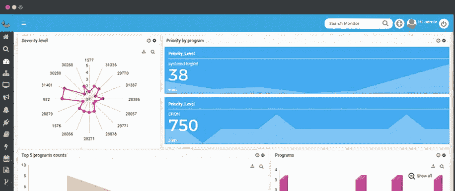

# 为您的系统选择最佳的日志管理工具

> 原文：<https://medium.com/hackernoon/choosing-the-best-log-management-tool-for-your-system-81399b5c27ad>

非技术人员不讨论日志管理和 SIEM，对它们的了解也不多。如果我们更进一步，许多东西可以生成日志文件，如防火墙、路由器、操作系统等。但问题是，您如何识别日志消息、记录或任何类型的踪迹的存在呢？因为有成百上千个生成的日志文件，并且有必要检测它们。所以为了您的安全起见，您应该保持日志监控工具是最新的。

市场上有各种各样的**日志管理工具，您可以根据自己的方便选择它们，因为每个工具都是为一个目的而设计的，并且每个工具都各不相同。**

****

**Log Mangement Tool**

**所以在这篇博客中，我们将讨论几个在极客市场上成功运行并且非常坚固的 [**日志管理工具**](https://www.motadata.com/product/log-management-and-flow-analytics/log-management/) 。但是在比较它们之前，让我们稍微了解一下日志管理。**

**日志管理处理大量计算机生成的日志消息。这些消息也因审计记录、审计跟踪、事件日志等而出名。他们所做的是:**

*   **日志收集**
*   **集中式日志聚合**
*   **长期日志存储和保留**
*   **原木旋转**
*   **存储日志分析后的实时和批量**
*   **日志搜索和报告**

**作为一种简单的做法，您应该在一个地方收集所有的数据。检查它，你会得到信息，这就是你想要的正确。因为你会用这些数据做什么？将会有巨大的数量，如果你不知道它是什么，它是没有用的。**

**现在，管理它们是必要的，为此你需要各种日志工具。看到有多复杂了吧？因此，让我们来看看哪些工具可以支持您管理日志文件的复杂性。**

1.  **[**Motadata**](https://www.motadata.com/)**

**[Motadata](https://hackernoon.com/tagged/motadata) 处理任何给定格式以及来自任何来源的任何类型的数据。它带有 HIDS、SIEM、文件完整性和入侵检测。**

**Motadata 软件平台具有高度的可扩展性和灵活性，支持集中聚合。它保护您的机密数据，避免未经授权的进入或访问您的文件和文件夹。它能非常迅速地发现安全漏洞。**

****Motadata 数据模型驱动的日志监控平台自带****

*   **集中式日志管理**
*   **对数相关**
*   **无代理或基于代理的收集**
*   **合规报告**
*   **聚合多个异构资源**
*   **规范化日志数据**
*   **使用原始邮件进行全文搜索**
*   **任何设备/服务器/应用程序/文本**

**通过 Motadata，我们提供了完美管理当今日益多样化的业务运营和 IT 基础设施管理问题所需的理想解决方案。最棒的是，我们 Motadata 目前为您提供 30 天的日志管理软件平台免费试用，所以现在就来探索 Motadata 吧。**

**2.****。******

****Splunk enterprise 根据机器生成的数据为您提供运营智能。它附带了一系列搜索、可视化和预打包的用例内容，任何用户都可以探索这些内容以发现和分享见解。Splunk 还具有内置的报告功能，包括高级图表和仪表板以及一个透视界面，可通过拖放操作轻松生成可视化报告。****

****当你特别需要时，它会为你服务****

*   ****实时搜索、分析和可视化****
*   ****舒适的内置警报和报告****
*   ****图表和仪表板的简单手动配置****

******splunk 也有一些主要缺点******

****作为一种内部部署的解决方案，它更加主观，会导致设置成本。处理起来很复杂，需要在大规模环境中部署。您将需要安装和配置专用集群。****

****因此，为了利用这个平台，您需要手动设置所有的源，这有点复杂、昂贵且耗时。****

******3。**[**log packer**](/@LogPacker)****

****LogPacker 特别针对不同用途制作了两个版本:独立版和云版。独立版本显示代理和服务器的协作。它可以在 Unix、Windows、Android 和 iOS 上运行。而服务器存储来自所有代理的日志并将它们保存在一个存储位置。它提供了一个完整的 web 界面，带有仪表盘和搜索功能。****

****Splunk 和 LogPacker 几乎在同一个舞台上表演，但它们在不同的领域征服了对方。您应该在 Splunk 中设置所有资源，而 LogPacker 内置了对 100 多个日志源的支持。就可视化界面而言，Splunk 比 LogPacker 简单得多，也更好。Splunk 有最容易处理的接口，而 LogPacker 没有特定的接口。****

******所以 LogPacker 帮了你大忙:******

*   ****因为它支持多达 100 个可用的源****
*   ****它为你提供了多种储物选择****
*   ****它通过您的电子邮件或短信提供并启用警报****

******然而有一些缺点:******

*   ****独立版本没有任何内置 web 界面****
*   ****免费版本有局限性，最多只能支持集群中的 5 台服务器****

******4。******

******[Loggly](https://hackernoon.com/tagged/loggly) 是另一个基于云的日志管理服务，它实时穿透日志数据的根源，同时为您提供最重要的信息，告诉您如何改进代码并提供更好的客户体验。它有一个旗舰日志数据收集功能，这意味着您可以使用传统标准，如 HTTP 和 Syslog。它实际上是非常轻量级的，而且完全免费，如果你愿意测试的话，它肯定会让你满意，因为它可以在数据的海洋中潜得太深，有时即使是著名的大型工具也做不到。它还有三种版本标准版、专业版和企业版。******

******三种讨论过的日志管理工具之间没有太大的区别。一点点改变可以让你提高效率，这取决于你的选择。它还为您提供了云版本的工具，但是如果您使用 LogPacker 来满足这一需求，那么它会为您提供比 Loggly 更好的结果。******

********缺点********

*   ****在配置或源配置中不透明****
*   ****云基础架构不灵活****
*   ****不完全安全****

******5。** [**日志条目**](https://en.wikipedia.org/wiki/Logentries)****

****正如我们前面所说的，在一个地方收集所有日志文件的过程，Logentries 就是一个完美的例子。就像一个简单的任务，它自动收集和集中任何格式的所有日志数据在一个位置，您可以搜索，聚合和可视化日志数据，以获得您的问题的答案，在几秒钟内。很简单，不是吗？我们发现这个日志管理工具是最好的、简单的和安全的。****

****优点包括聚合的 live tail 搜索、日志的自定义标签、电子邮件报告，支持多种编程语言，并提供不错的文档。****

******缺点******

*   ****相同的手动安装和手动日志源管理****
*   ****每台服务器有 100 个日志的限制****
*   ****无法跟踪第三方库中的错误来源****
*   ****不够安全的 web 客户端日志程序****
*   ****没有专门针对 JavaScript 的报告****

******关键要点******

****读者们，就是这样。现在市场上有许多[日志管理工具](https://dzone.com/articles/why-use-log-management-tools)可用，即使是这些工具也可能会带来激烈的竞争。这些是总体上表现良好的。我们根据消费者的要求展示了最好的产品。所以我们希望它能让你的肤色变得容易。****