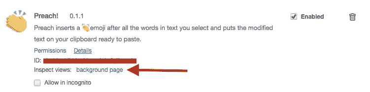

# Chrome 扩展开发:经验教训

> 原文：<https://medium.com/hackernoon/chrome-extension-development-lessons-learned-13feff93c9de>

我最近花了一个晚上来做基本的 Chrome 扩展，并在我的 Twitch 编码频道上播放了整个过程。

我让[传道了！](https://chrome.google.com/webstore/detail/preach/ohobigchjhkjogkjmpaipkcfgjjhacah) —一个简单的扩展，帮助您获得👏你的👏要点👏穿过👏。

以下是我一路走来学到的一些东西，对于一个相当初级的 JavaScript 开发人员来说，这些东西似乎并不明显。享受吧。

## 您可以调试扩展

实际上可以通过使用“背景页面”来调试扩展。为此，使用与加载扩展相同的扩展页面，并简单地点击*背景页面*。

一旦打开，你就有了完整的 Chrome 检查器来找到你绝对没有忘记的分号。

## 只有内容脚本可以修改 DOM

这完全有道理，而且做起来相当容易。只需将权限添加到您的扩展清单中。这将定义这些在什么页面上运行，在页面中嵌入什么文件，以及何时运行相关的 JS。

## 使用 JS 消息传递将消息从一个传递到另一个

那么如何从我的 background.js 或 popout.js 对页面 DOM 进行 DOM 更改呢？使用 [JavaScript 消息传递](https://developer.mozilla.org/en-US/docs/Web/API/Window/postMessage)。这种技术允许您在上下文中发布消息，并在其他上下文中接收它们。对于我的扩展，我想接收扩展生成的修改文本，并在屏幕上显示一个警告(修改 DOM)。

The success dialog of ***Preach*!**

这里有一个在**传道中如何工作的例子！**

## Chrome 网络商店列表不是免费的

没有。加入谷歌开发者计划的费用是 5 美元。这并不奇怪，而且比苹果开发者项目便宜多了。我怀疑 5 美元的费用有助于消除垃圾邮件和低质量的扩展。但这并没有阻止我😏😅。

## Chrome 扩展列表很容易

说真的，一个扩展的整个列表过程超级简单。除了制作 Chrome 网络商店资产(3 张图片)，列出一个免费扩展(说教是免费的)的整个过程真的很简单。

## Chrome 扩展统计需要一段时间

Chrome 扩展的统计数据(如果你不使用 Google Analytics)可能需要几天才能出来，它们将保持类似的延迟。很烦。如果你真的关心这些的速度，我会推荐 GA。

总的来说，Chrome extension dev 真的很好玩。如果你是编程新手，这是一个很好的方法，写一些小东西，发布到许多国家，多达 10 亿人，看看谁喜欢它。如果你是一个老帽，这是一个伟大而简单的方法来抓痒“我想船舶的东西”。对我来说当然是。

在这里看我码上 Twitch:****。**你也可以在推特上关注我: **@samjarman。**这篇文章最初发表在[我的博客](http://www.samjarman.co.nz/blog/chrome-extension-development-lessons-learned/)上。**

**最后，感谢本和雅各布的帮助。没有你我做不到。**

************

> **[黑客中午](http://bit.ly/Hackernoon)是黑客如何开始他们的下午。我们是阿妹家庭的一员。我们现在[接受投稿](http://bit.ly/hackernoonsubmission)并乐意[讨论广告&赞助](mailto:partners@amipublications.com)机会。**
> 
> **如果你喜欢这个故事，我们推荐你阅读我们的[最新科技故事](http://bit.ly/hackernoonlatestt)和[趋势科技故事](https://hackernoon.com/trending)。直到下一次，不要把世界的现实想当然！**

****