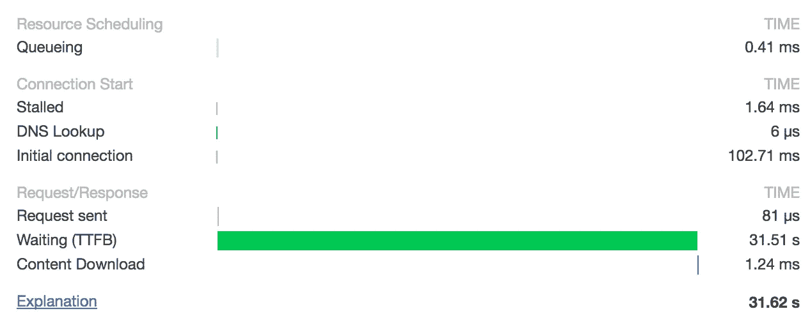

# Chrome Preconnect 打破了单线程服务器

> 原文：<https://medium.com/hackernoon/chrome-preconnect-breaks-singly-threaded-servers-95944be16400>

我想分享我在使用 [RevenueCat](https://www.revenuecat.com) 网络应用和 [API](https://hackernoon.com/tagged/api) 时的一个小发现。

我注意到，我的 AJAX 请求经常被“卡住”,近一分钟都没有完成。

.Chrome inspector showed the following.

请求的首字节时间(TTFB)太高。我运行的是一个简单的单线程 Flask 服务器，只处理来自 web 应用程序的一个 GET 请求，但是这种情况几乎每次都会发生。

在[发现](https://github.com/corydolphin/flask-cors/issues/147) [许多](https://github.com/pallets/flask/issues/2169) [其他](https://github.com/benoitc/gunicorn/issues/1284)人有同样的问题后，我开始清除我的堆栈的某些部分，以找出导致挂起的原因。最终，我发现唯一能解决这个问题的方法，也是许多其他人发现的方法，是将 Flask dev 服务器切换到线程模式来解决这个问题。

我只发送了一个请求，服务器怎么会被锁定？

# 铬预连接

原来写 Chrome 的人真的很聪明。它们所做的事情之一是先发制人地打开与服务器的 TCP 连接，您可能会向这些服务器发出后续的 HTTP 请求。这很有意义，当你的网站要求 Chrome 从你的服务器加载 index.css 时，你很有可能会在那之后加载另一个资源。为了加快速度，Chrome 在加载第一个请求时会打开第二个与服务器的推测性 TCP 连接。

## 僵局

如果您使用单线程服务器进行开发，这可能是一个真正的问题。通常，服务器会处理你的真实请求，然后 Chrome 会关闭未使用的推测连接。然而，如果推测性连接是由你的服务器首先打开的，Chrome 只是保持它打开，而服务器无法服务真正的请求。这导致大多数单线程服务器超时等待推测连接发出请求。最终超时，实际的请求很快完成。

## 工作区

对于 Flask，dev 环境中最简单的解决方法是用`threaded=True`运行 dev 服务器，这允许服务器在不阻塞的情况下服务两个连接。但是生产呢？这取决于您的应用程序是如何部署的。如果你的应用程序背后是一个像 nginx 这样的重型反向代理，你不需要担心，因为它会同时正确地服务两个请求，并将真正的请求代理到你的服务器。如果你只使用类似 gunicorn 的东西，你将需要确保你使用一个异步工作器模型，因为同步工作器仍然会被挂起。