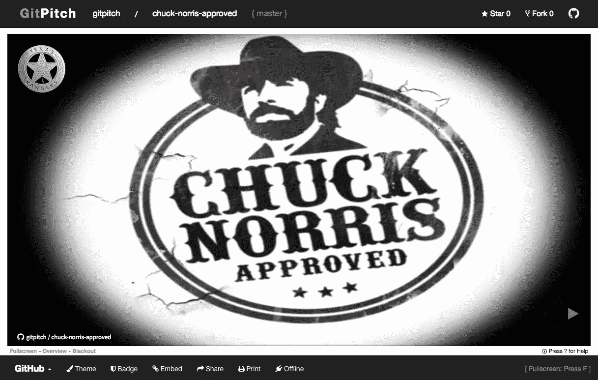

# 查克·诺里斯批准了！

> 原文：<https://medium.com/hackernoon/chuck-norris-approved-90c057aff4a8>

今天我邀请了查克·诺里斯和我一起分享一个使用 [GitPitch](https://gitpitch.com) 的惊人(真实)故事。可悲的是，他拒绝了这个邀请！尽管遇到了这个小挫折，我还是要给你们讲一个关于传奇人物诺里斯先生的故事，以此为借口，带你们完成第一个真正引人注目的 GitPitch 演示。

只需几行 Markdown 和一个 *git-commit* 你就能与世界分享一个看起来像这样的演示:

[](https://gitpitch.com/gitpitch/chuck-norris-approved)

[ GitPitch Presentation ] — Chuck Norris Approved!

# 入门指南

在这篇简短的教程中，你唯一需要做的就是在 GitHub、GitLab、Bitbucket、Gitea 或 Gogs 上注册一个帐户，并建立一个 git 库。

# **话的力量**

创建 GitPitch 演示文稿的第一步是启动您最喜欢的文本编辑器，打开一个名为 *PITCHME.md* 的新文件。这个文件应该创建在 git 存储库的根目录下。

GitPitch 引入了 *PITCHME.md* 作为新的约定，类似于流行的 Git 服务如何使用常规项目 doc 的 *README.md* 约定。

在这个 *PITCHME.md* 文件中，我们将使用 plain Markdown 添加 Norris 先生的故事作为我们的演示内容:

```
One day a cobra bit Chuck Norris’s leg.---After five days of excruciating pain, the cobra died.
```

如你所见，我们讲述了一个有点悲伤的故事。至少对蛇来说是这样。

你在这里看到的是简单的降价。简单吧？唯一可能让你吃惊的是两行文字之间出现的 3-破折号。这被称为 GitPitch *滑动分隔符*。分隔符告诉 GitPitch 您想要在演示幻灯片中的连续幻灯片之间分割内容。

如果我们现在保存我们的 *PITCHME.md* 文件，提交并将其推送到我们的 repo，我们可以立即打开并在线欣赏一个非常简单的双幻灯片演示。但是只要再多一点努力，我们可以做得更好。

# 图片胜过千言万语

使用图像可以极大地增强任何演示文稿。出于这个原因，GitPitch 让给你的幻灯片添加一些视觉魅力变得非常简单。

如果你还在跟进，更新你的 *PITCHME.md* 如下所示:

```
---?image=https://gitpitch.com/chuck-norris-approved.jpg---> One day a cobra bit Chuck Norris's leg.---> After five days of excruciating pain, the cobra died.---?image=https://gitpitch.com/chuck-norris-thumbs-up.gif
```

在这次降价中，我在演示开始时添加了一张新幻灯片，它使用了特殊的*？开始幻灯片分隔符上的语法。这告诉 GitPitch 插入一个背景闪屏图像，填充整张幻灯片。*

在每张幻灯片的文本前添加的 **>** 字符只是在 Markdown 中引用文本的标准方式。

我还在最后添加了一个新的幻灯片，它将显示一个动画 gif 背景。当我们最终看到我们的现场演示时，这张幻灯片会给我们带来我们一直暗暗渴望的东西，查克·诺里斯的认可；)

# 查克·诺里斯的认可开始生效

如果我告诉你我们已经完成了引人注目的 GitPitch 演示，你会相信吗？是的，是真的。是时候把我们的新文件推送到我们的 Git repo 了，如果您在命令行工作，它应该是这样的:

```
> git add -A
> git commit -m "Chuck Norris counted to infinity. Twice."
> git push
```

现在我们所有的 GitPitch 演示文件都是我们回购的一部分，我们可以立即使用[GitPitch.com](https://gitpitch.com)在线打开我们的新演示。你可以在这里打开我的版本:

[](https://gitpitch.com/gitpitch/chuck-norris-approved) [## [git pitch]git pitch/chuck-Norris-批准/主

### 查克·诺里斯会赞同的 GitPitch 演示；)

gitpitch.com](https://gitpitch.com/gitpitch/chuck-norris-approved) 

只需在 URL 上替换您的 Git 用户名和存储库名称，就可以查看、共享和展示您自己版本的演示文稿。

# 告诫**概不负责**！

买家当心。我觉得必须发布这个警告，因为如果你打开[我的版本](https://gitpitch.com/gitpitch/chuck-norris-approved)这个演示，你可能会注意到它看起来和你自己的有点不同。原因很简单，我作弊了；)

GitPitch 提供了广泛的定制，让你满足自己的*内在创意*需求。这是一个我将在以后的帖子中广泛讨论的话题，但是现在让我把你引向 [GitPitch Wiki](https://github.com/gitpitch/gitpitch/wiki) 作为如何开始你自己的定制的最佳文档来源。

# 释放魔力

但是在我结束之前，我想我应该让你看看你是如何欺骗别人的。大多数 GitPitch 定制是使用一个 *PITCHME.yaml* 文件激活的。这个文件需要与 Git repo 的根目录中的 *PITCHME.md* 文件放在一起。这是一个非常简单但功能强大的属性文件，释放了一些 GitPitch *的魔力*。

继续添加，然后将下面的 *PITCHME.yaml* 文件推送到您自己的 repo 中:

```
theme: black
logo: https://gitpitch.com/texas-rangers.png
```

完成这些更改后，在浏览器中重新加载您的演示文稿，看看它是如何转换的。GitPitch 可能需要一段时间来获取您的最新更改。详见 GitPitch [缓存策略](https://github.com/gitpitch/gitpitch/wiki/GitPitch-Caching)。

# 那是一个包裹

这个简短的教程到此结束。我希望您能理解并喜欢创建您自己的 GitPitch 演示文稿。如果查克·诺里斯今天参加了比赛，我毫不怀疑他会对我们的努力竖起大拇指。请在 Medium 或 Twitter 上关注我， [@gitpitch](https://twitter.com/gitpitch) 了解更多来自 gitpitch 社区的新闻、技巧和令人惊叹的创作。

[](http://bit.ly/HackernoonFB)[](https://goo.gl/k7XYbx)[](https://goo.gl/4ofytp)

> [黑客中午](http://bit.ly/Hackernoon)是黑客如何开始他们的下午。我们是 [@AMI](http://bit.ly/atAMIatAMI) 家庭的一员。我们现在[接受投稿](http://bit.ly/hackernoonsubmission)，并乐意[讨论广告&赞助](mailto:partners@amipublications.com)机会。
> 
> 如果你喜欢这个故事，我们推荐你阅读我们的[最新科技故事](http://bit.ly/hackernoonlatestt)和[趋势科技故事](https://hackernoon.com/trending)。直到下一次，不要把世界的现实想当然！

