# 使用 Github、Docker、CircleCI 和 Heroku 的 CI/CD 管道

> 原文：<https://medium.com/hackernoon/ci-cd-pipeline-using-github-docker-circleci-heroku-ef7f8a90a6f9>

这篇文章将带你了解如何用 **CircleCI** 、 **Docker** 、 **Heroku** 轻松设置一个**持续集成**、&、**持续部署** (CI/CD)管道。在本教程的最后，你应该能够设置你自己的 **CI/CD** ，如上图所示。

本教程假设您已经:

*   一个 **Heroku** 账号— [免费注册](https://signup.heroku.com/signup/dc)。
*   安装了一个 [Heroku CLI](https://devcenter.heroku.com/articles/heroku-cli) 。
*   一个 **CircleCI** 账号— [用你的 Github 账号免费注册](https://circleci.com/signup/)。
*   **Python**3.5 版本本地安装。

本演示中使用的应用程序的源代码可以在我的 [Github](https://github.com/mlabouardy/circleci-heroku-flask) 上找到。

1 — Heroku

首先，使用您创建 **Heroku** 账户时使用的电子邮件地址和密码登录:

> heroku 登录

要克隆示例应用程序，以便您拥有可以部署到 **Heroku** 的代码的本地版本，请在本地命令 shell 或终端中执行以下命令

> git 克隆[https://github.com/mlabouardy/circleci-heroku-flask.git](https://github.com/mlabouardy/circleci-heroku-flask.git)
> CD circle ci-heroku-flask/

注意:如果您使用自己的应用程序，您应该将以下文件添加到代码库中:

1.  ***Procfile*** :它告诉 **Heroku** 应该运行什么命令
2.  ***requirements . txt***:在这个文件中你会列出 **pip** 应该为你安装的包/依赖

在 **Heroku** 上创建一个应用程序，让 **Heroku** 准备好接收你的源代码:

> heroku 创建电影-商店-演示

提供一个 **MySQL** 数据库附件:

> heroku addons:添加 cleardb:ignite —应用程序电影—商店—演示

Heroku 会自动添加一个配置变量，其中包含 URL 形式的数据库凭证。在设置选项卡下找到配置变量，点击按钮“**显示配置变量**

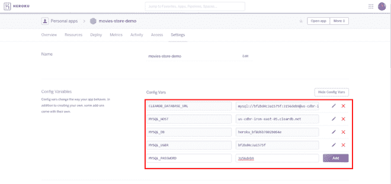

现在部署应用程序:

> git 远程添加 heroku[https://git.heroku.com/movies-store-demo.git](https://git.heroku.com/movies-store-demo.git)

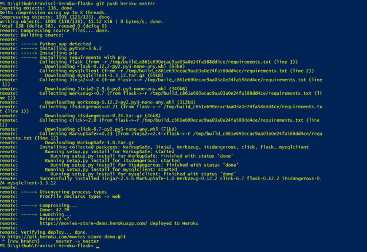

进入 **Heroku 仪表盘**，点击**打开 App** 按钮:

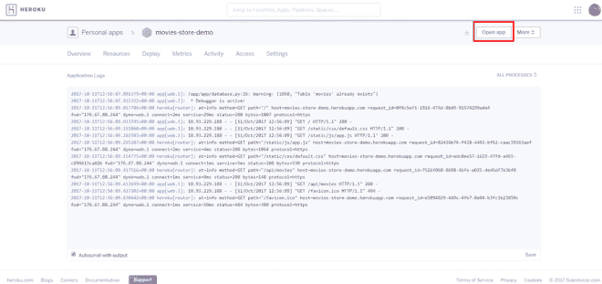

您应该看到:

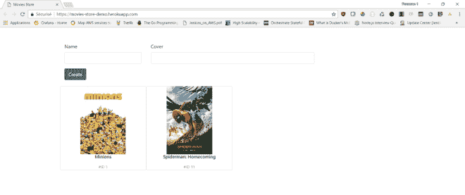

注意:作为一种方便的快捷方式，您可以按如下方式打开应用程序:

> heroku 公开赛

**2 — CircleCI**

以下部分将介绍如何为该应用程序配置 **CI/CD** 步骤，如何运行单元测试，构建&将 **Docker 映像**推送到 [DockerHub](https://hub.docker.com/) ，以及如何将演示应用程序部署到 **Heroku** :

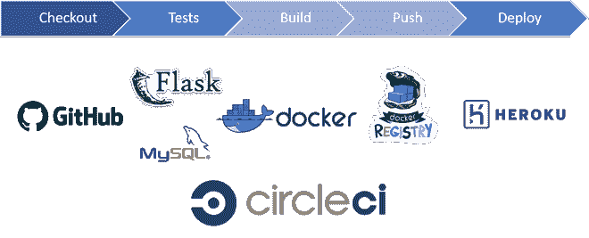

*。circleci/config.yml* 包含 **CI/CD** 步骤:

*   我们使用 **Python 3.5** 作为构建环境的主要容器& **MySQL** 。
*   为了加速构建，我们将 Python **virtualenv** 放入 CircleCi 缓存，并在运行 **pip install 之前恢复缓存。**
*   单元测试需要 MySQL 数据库，因此我们需要等待容器准备好。
*   我们安装 **Docker 客户端**，从 **Github** 库中存储的**Docker 文件**构建 **docker 镜像**，然后将镜像推送到 **DockerHub** 。
*   最后，我们安装**Heroku CLI**把修改推送给 **Heroku。**

如上面的配置文件所示，我们需要设置一些**环境变量**，因此导航到项目设置:

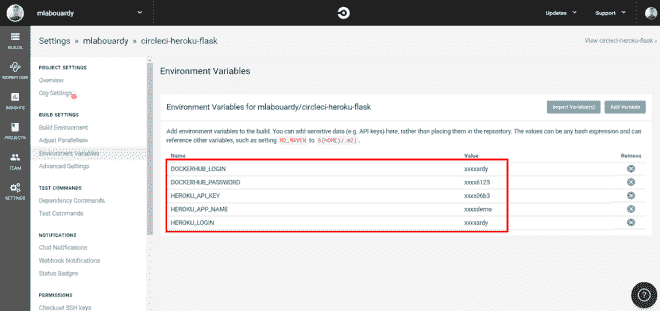

最后，为了启用从 **CircleCI** 到 **Heroku Git 服务器**的连接，我们需要创建一个不带密码短语的 SSH 密钥。发出以下命令:

> ssh-keygen -t rsa

然后，在主机名为**git.heroku.com**的 CircleCI UI SSH 权限页面中添加私钥，如下所示:

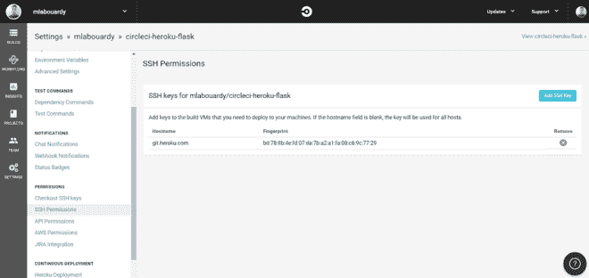

公钥被添加到 Heroku 的[账户](https://dashboard.heroku.com/account)页面:

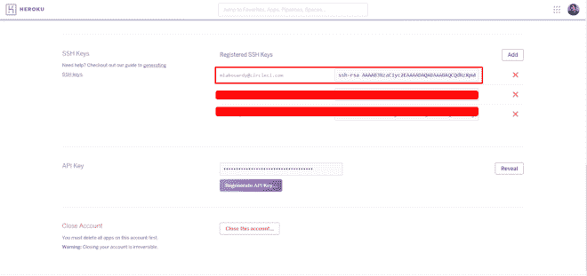

现在，每当你对你的 **Github** repo 进行修改时， **CircleCI** 会自动将修改部署到 **Heroku** 。这是一个临时构建:

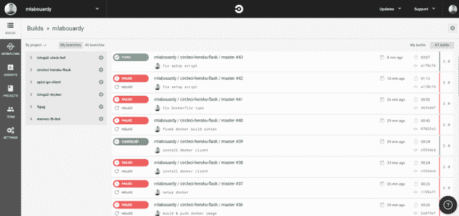

**CI/CD 管道**步骤如 *config.yml* 文件所述:

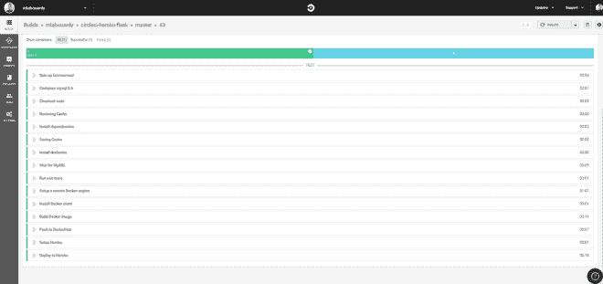

**Docker hub**上的**Docker 镜像**库:

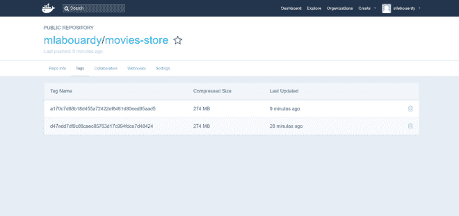

来自 **CircleCI** 的 Heroku 最后一次建造:

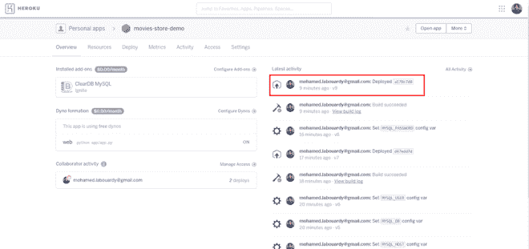

更多文章请查看我的[博客](http://labouardy.com) ❤