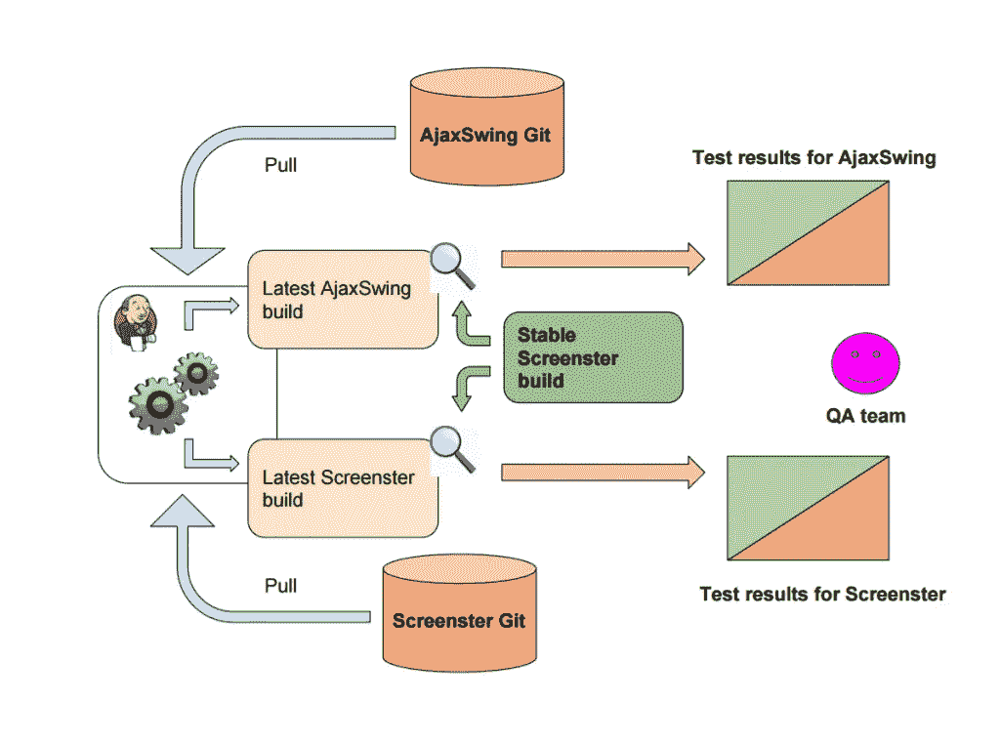

# 自动化测试工具世界中的 CI 友好选项

> 原文：<https://medium.com/hackernoon/ci-friendly-options-in-the-world-of-automation-testing-tools-78f9cd19d753>

很少有人会不同意 CI 支持对于 UI 测试自动化解决方案非常重要，因为它增加了针对 bug 和错误的多一道防线。让我们看看 QA 自动化[工具](https://hackernoon.com/tagged/tools)的市场在 CI 支持方面提供了什么，以及这些解决方案中有多少擅长处理 web UIs 的可视化[回归测试挑战](http://screenster.io/ui-regression-testing-challenges-and-how-screenster-handles-them/)。

## 有人需要将视觉测试与 CI 整合吗？

下面是一个典型的过程:一个任务创建一个版本，而另一个任务在这个版本上启动单元测试，这样可以尽早发现最容易发现的问题。如果构建成功地通过了这个阶段，测试人员就可以进入他们的日常工作了。他们将快速浏览一下 UI，如果一切正常，就继续进行功能测试。

现在，这个过程似乎有很大的改进空间，不是吗？

特别是，如果能自动进行这种快速的 UI 完整性检查，以及整体的可视化测试例程，那将会非常棒。让另一个 CI 作业针对新的构建运行自动化的可视化测试。

听起来很棒，但是这个任务需要一个可靠的 QA 自动化工具和 CI 支持。那么我们可以选择哪些工具呢？

## 在 CI 上运行 Selenium 的现有 UI 测试自动化解决方案

先说可以说是最知名的组合，Selenium + Jenkins。

您可能已经注意到有多少自制的 Selenium-for-Jenkins 解决方案，被全球各种开发团队使用。基本上，这些解决方案中的每一个都旨在提供一个针对特定环境的最佳自动化测试工具。然而，对于大多数这类解决方案来说，有许多共同的复杂性:

*   您需要建立另一个测试框架(如 jUnit ),并以此为基础。
*   Selenium Grid 通常是必要的，因为在一台计算机上运行 Selenium 测试的全部负载是有问题的。
*   最有可能的是，其中至少有几个实例需要单独微调访问权限(例如，当启用 Jenkins 启动浏览器时)。
*   您必须花时间确保 Jenkins 和 Selenium 默认使用的所有端口在网络的每个节点上都是空闲的。
*   最后，您需要在“测试”模式下运行该系统几次，以检测任何可能的问题；然后在开始全面的 UI 测试自动化之前，投入更多的代码来解决它们，创建额外的批处理文件等等。

现在，这看起来不像是一大堆工作吗？幸运的是，Jenkins 团队提出了他们自己的[解决方案](https://wiki.jenkins-ci.org/display/JENKINS/Selenium+Plugin)，这让事情变得简单了一些。他们已经在 2016 年夏天更新过了，好像也有不少用户来下载了。TeamCity、Travis 和 Bamboo 的情况也差不多。然而，仍然存在的一个问题是:Selenium 本身没有为 CI 集成提供统一的解决方案。

## 使用 TestComplete plus Jenkins 进行 UI 自动化测试

另一个大型自动化测试工具 TestComplete 有自己的[解决方案](https://support.smartbear.com/testcomplete/docs/working-with/integration/jenkins/index.html)用于与 Jenkins 集成。然而，统一集成插件仍然是用户的梦想，他们必须发明自己的方法来将他们的 UI 自动化测试过程与 CI 平台集成。

这可能看起来很烦人，除非一个开发人员和网络集成商团队被分配到这个任务中。这仅仅是开始。

一旦完成了 CI 环境的设置，就该开始考虑测试的维护了。随着项目的进展，一些测试将不可避免地被更新或替换。除此之外，即使是对你的项目的一个小的改变也可能带来重组整个网络的需要。

一个不太专业的人(比如一个主要有手工测试经验的中级 QA 工程师或者一个业务人员)在做这项工作时会面临许多复杂的情况。事实上，这些复杂性是如此之大，以至于最终会导致 UI 测试自动化过程的延迟。难怪今天如此多的团队仍然喜欢雇佣几个额外的手工初级 QA 来避免在早期开发阶段投入太多。

## Selenium 替代品和测试自动化的新兴工具:它们是如何解决这个问题的

众所周知，Selenium 在全球拥有无数粉丝。他们中的许多人协调他们的努力来开发一些本地的改进，后者与公众分享。

最终，Selenium 和其他著名的自动化测试工具如 Cucumber 和 TestComplete 为他们的 CI 集成提供了足够的第三方解决方案，这将满足他们大多数用户的需求。那么，有问题吗？是的——UI 测试自动化领域需要一个更简单、更高效的解决方案。

可视化回归测试自动化是底层框架无法交付的最明显的利基。事实是，Selenium 和 Cucumber 等传统平台无法执行这种 web UI 验证。他们可以执行功能测试并检查某些字段是否存在，但是他们无法检测到字体改变、文本错误甚至图像损坏。但是这些 bug 同样重要！

那么，在持续集成环境中运行自动化测试时，Selenium 的替代方案是什么呢？

**幻想曲**

最受欢迎的选项之一是幻像。与 Selenium 不同，这个自动化测试工具实际上能够进行 CSS 测试。更重要的是，它可以以逐张截图的格式比较网页。每当测试步骤失败时，Phantom 都会向用户显示一个屏幕截图。

至于缺点，PhantomCSS 是一个麻烦的解决方案。它的安装意味着下载和设置几个独立的模块，一旦你完成了它的组件，你还需要微调整个框架。基本上，在开始创建测试之前，还有很多事情要做。

除此之外，Phantom 使用自己内置的浏览器模拟器，不能在真正的 Chrome 或 Firefox 中运行。这意味着它将无法跟踪特定于浏览器的 CSS 问题。

Phantom 的另一个常见问题是学习曲线。与 Selenium 和 TestComplete 类似，PhantomJS 需要一个有经验的开发人员来平稳地部署一切并维护测试。但这意味着 UI 测试自动化实际上是由程序员执行的，而非编码人员则被排除在游戏之外。让测试人员创建和管理所有的测试不是更有效率吗？

最后，CI 整合呢？事实上，Phantom 本身并不提供任何与任何流行 CI 客户端的特殊集成工具。它可以单独安装在 Jenkins 或 TeamCity 的从属/构建实例上，这样它的测试就可以在那里运行。另一个客户 Travis 为 Phantom 创建了自己的[插件](https://docs.travis-ci.com/user/gui-and-headless-browsers/#Using-PhantomJS)，但是它也没有多供应商 CI 集成解决方案。

**编剧**

Screenster 是一个新的 CSS 自动化测试工具(2016 年 6 月 1 日正式推出测试版)，是目前市场上唯一一个可以完全支持包括 Jenkins、TeamCity、Travis 和 Bamboo 在内的所有主要 CI 工具的项目。由于 Screenster 功能集的简单性，它的 [CI 插件](http://screenster.io/ci-integration-plugin-for-screenster-is-officially-released/)不需要安装任何额外的框架。唯一需要的是用户首选 CI 工具设置的基本配置。

下载完 [CI 集成插件](http://screenster.io/documentation/screenster-ci-client/)后，只需在选定的 CI 客户端实例中添加它的路径。必须指定一些参数，包括项目列表、用户电子邮件、用户密码、浏览器列表和 Screenster 主机地址。一旦完成，您就可以在 CI 服务器上开始使用 [CSS 回归测试自动化](http://screenster.io/ci-for-css-regression-testing-with-screenster/)了。

Screenster 为您的视觉回归测试过程带来了以下好处:

*   **无脚本记录器**:不需要编码就可以开始你的视觉测试。Screenster 在录制过程中捕捉每个用户动作，然后在回放过程中重复它。
*   **视觉和 DOM 基线**:在测试被记录之后，DOM 模型和实际截图被存储用于一个选择的 web UI。Screenster 将在[未来](https://hackernoon.com/tagged/future)运行期间检查与基线的差异。
*   **智能 CSS 选择器** : Screenster 通过捕获 CSS IDs 来检测网页元素。选择器可以通过点击手动更新。Screenster 轻松处理 AJAX，可以自动检测动态区域。
*   **易维护**:您可以编辑测试，添加或删除步骤，一次批量覆盖多个测试的 URL，导出和导入它们，甚至在另一个测试中调用一个测试。

Screenster 是一个活生生的例子，证明了拥有一个通用的解决方案是可能的:与所有主要的 CI 解决方案无缝集成，然后在每个新版本之后运行 UI 自动化测试。那么，为什么不自己去看看呢？

> [黑客中午](http://bit.ly/Hackernoon)是黑客如何开始他们的下午。我们是阿妹家庭的一员。我们现在[接受投稿](http://bit.ly/hackernoonsubmission)并乐意[讨论广告&赞助](mailto:partners@amipublications.com)的机会。
> 
> 如果你喜欢这个故事，我们推荐你阅读我们的[最新科技故事](http://bit.ly/hackernoonlatestt)和[趋势科技故事](https://hackernoon.com/trending)。直到下一次，不要把世界的现实想当然！

