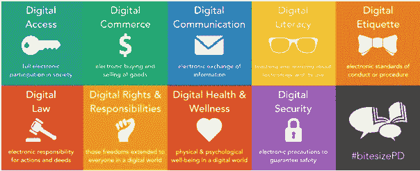

# 数字化转型时代的公民身份

> 原文：<https://medium.com/hackernoon/citizenship-in-the-age-of-digital-transformation-fa95f17ba989>

[数字化转型](https://hackernoon.com/tagged/digital-transformation)的力量正在我们的日常生活中根深蒂固，并强烈影响着我们的生活、工作和相互沟通的方式。随着颠覆性技术、多种电子设备和互联网的快速进入，数字在我们的生活中扮演着关键角色，我们的大部分时间都花在访问所有这些设备和技术上。目前，我们的生活由两个部分组成:现实生活，在现实生活中，我们与物理元素(我们周围的人)进行交互；以及虚拟世界，其中包含我们在线共享和消费的内容。

目前，我们的虚拟世界和现实世界同时相互联系和重叠，使得不可能区分和分离，并且随着每一步，虚拟世界都在拦截和替代我们现实世界中的动作和元素。

我们现在是全球数字国家的数字公民。在这个地方，社区和网络由分享共同兴趣和背景的虚拟人物组成。在这个地方，国籍、人口特征在某些情况下不复存在，而在另一些情况下会出现。

然而，数字公民更进一步，确保数字公民适当地使用[技术](https://hackernoon.com/tagged/technology)来授权他们自己和彼此。

# 数字公民的九个要素:

# 数字接入

确保平等地获得技术，并将数字足迹扩展到社会中的每一个人。脸书/推特等社交平台的广泛覆盖和访问，以及自带设备(BYOD)、电子书等概念，以及数字印度、智能城市、数字村等计划的推出，是实现每个公民平等获得数字服务的重要步骤。

# 数字商务

数字商务就是利用互联网、移动网络和商务基础设施平台买卖商品和服务。它促进网上市场交易，保护买方、卖方和媒体免受非法活动。最近推出的政府电子市场就是一个例子，政府官员可以在这个平台上购买商品。卓越的[电子商务](http://www.happiestminds.com/industries/ecommerce/)玩家如易趣、亚马逊的影响力也是这一点的证明。

# 数字通信系统

数字通信就是帮助和教育数字公民有效地利用在线渠道相互交流和协作。引入电子邮件、手机、Skype、电话会议和其他模式的[统一通信](http://www.happiestminds.com/services/unified-communications-services/)是使公民能够步入数字通信世界的步骤。

# 数字素养

数字素养是关于培训和教育公民关于基本的技术元素，8C-文化，认知，建设性，沟通，自信，创造性，批判性，公民方面。它包括查找、分类、评估、管理和创建数字格式的信息。数字素养对于创建一个通过万维网连接的包容各方的社会至关重要。

信息设计、[数据可视化](http://www.happiestminds.com/services/bi-visualization/)、动态讲故事、[、利用媒体/ ICT/信息技术的游戏化](http://www.happiestminds.com/Insights/gamification/)等。是我们目前使用的一些数字教育方法。

# 数字礼仪

数字礼仪就是在数字世界中设定正确的行为准则。它教导公民承担责任，并维护行为/程序标准，而不仅仅是制定技术规则和条例。网络犯罪控制、防范网络欺凌的意识、关于电子邮件礼仪和企业礼仪的培训是获得公众数字礼仪意识的一些手段。

# 数字法律

数字法律在公众中创造了遵守法律和社会技术道德的意识，从而可以控制和预见行动和行为。它关注数字技术使用的道德标准，适用于在数字世界中扮演重要角色的贡献者或消费者。遵守法律——软件隐私、非法文件共享、黑客攻击、版权侵犯、身份盗窃等。属于这一类。

# 数字权利和责任

数字权利和责任涵盖了需要强加给数字公民的基本权利和责任。每个公民都需要意识到自己在数字世界中的特权和责任。基于位置(例如:家庭/办公室)和实践负责任地使用互联网，例如维护网上生成的内容的原创性、在内容中给出适当的引用、维护数据的机密性和隐私性、合并加密、必要时使用电子签名等。属于数字公民的范畴。

# 数字健康与保健

数字健康和福祉要求让公民意识到技术的内在危险，这些危险会对他们的身体和心理产生影响。使用者需要接受关于这些健康问题的教育，并需要接受保护自己免受这些问题的培训。他们需要意识到在数字世界中保持良好姿势和合理使用时间的重要性，而不是沉迷于虚拟世界。还应关注其他健康问题，包括肥胖、耳朵和眼睛视力问题等。

# 数字安全

数字安全就是通过成为负责任的公民，保护信息免受外部破坏性力量的影响，来保护我们自己免受数字世界的灾难。拥有正确的数字安全姿态来保护我们的个人信息或业务/客户信息是非常必要的。保护我们的在线身份、创建强密码、针对病毒和恶意软件实施适当的保护策略、定期更新它们以及保持深度防御方法都属于数字安全方面。

# 结论

可以有把握地说，数字公民在未来的时代只会变得更加显著。我们的身份本身基本上包括数字公民的 9 个要素。

我们目前的互联世界已经开始模糊真实和虚拟身份之间的界限。如今，一个人的虚拟身份已经变得和真实身份一样重要，不可分割。这 9 个要素整体上描述了一个人的数字会员资格的组成部分。

启用这 9 个要素将帮助政府实现**数字化转型带来的协同效应。例如，我们自己的印度政府已经采用 Twitter 和 Android 应用程序，允许公民以数字方式连接政府服务。“MyGov”安卓应用程序向好奇的市民通报中央政府推出的项目和政策。它还寻求公民对正在进行的项目的反馈。印度铁路公司开发了最先进的社交媒体响应团队，以尽快帮助铁路旅客。这极大地改善了旅行者的体验，并迅速纠正了问题。受这些例子的启发，其他政府机构也提出了自己的数字访问和设施。**

**增强数字公民身份显然将为积极主动的国家带来丰厚的红利。与此同时，像我们这样的数字公民将看到创新和包容性的平行增长。就像 Morpheus 在《黑客帝国》中对 Neo 提到的那样，“我只能带你去看门，你是一个必须走过的人”，我们数字公民是这个向上的数字转型之旅中必须迈出步伐的人。**

**作者简介: Richa Shukla 是 happy Minds Technologies 的商业顾问，在多个领域拥有 5 年的经验。她的经验涉及医疗保健、零售银行和治理、风险&合规产品/服务。她相信利用和拥抱数字技术可以跟上竞争激烈的市场格局。**

***原博客此处发布***。****