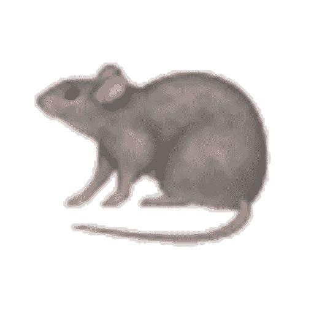

# 游戏人工智能分类

> 原文：<https://medium.com/hackernoon/classifying-game-ais-b5df6b08a031>

就像在自然界一样，当环境遇到潜力时，游戏人工智能可以出奇地聪明。

class

以一个简单的人工智能为例，它随机地向四个方向移动:上、下、左、右。这种最简单的智能在推广时会变得更有趣。与其将随机数生成器绑定到动作上，为什么不从所有可能动作的空间中生成一个数字呢？

所以，让我们假设我们增加了三个新的选项:战斗、拾取物品和丢弃物品。突然间，这个随机的代理可以与环境进行有意义的互动。它可以自卫或建立领土。它还可以改变周围的环境，甚至使用工具。所有这些都是通过掷骰子从 1 比 4 变成 1 比 7 得到的。

现在想想我们可以用逻辑和激励做些什么！现在我们进入人工智能分类的混乱部分。有许多方法，包括标准理论，可以解决这个问题。在这里，我只是把一些模糊的想法扔到墙上，感兴趣的读者可以稍后回来看看，了解哪些想法被卡住了。

1:人工智能在选择行动或计划时有“自由意志”吗？

2:人工智能有个人记忆吗？

3:人工智能有遗传记忆还是共享记忆？

4:人工智能有一个具有挑战性的环境吗？

5:人工智能有一个挑战个人的环境吗？

6:环境的效果空间有多大？

7:环境中是否存在其他人工智能？

8:人工智能图灵完成了吗？

9:环境中还有其他图灵完全 ai 吗？

这些都是我现在能想到的。我肯定还有其他同样重要或更重要的，但我想这些必须等等。

> [黑客中午](http://bit.ly/Hackernoon)是黑客如何开始他们的下午。我们是 [@AMI](http://bit.ly/atAMIatAMI) 家庭的一员。我们现在[接受投稿](http://bit.ly/hackernoonsubmission)，并乐意[讨论广告&赞助](mailto:partners@amipublications.com)机会。
> 
> 如果你喜欢这个故事，我们推荐你阅读我们的[最新科技故事](http://bit.ly/hackernoonlatestt)和[趋势科技故事](https://hackernoon.com/trending)。直到下一次，不要把世界的现实想当然！

