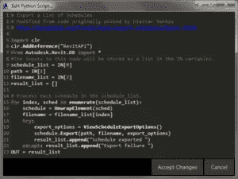

# 教室安排软件:如何建立自己的

> 原文：<https://medium.com/hackernoon/classroom-scheduling-software-how-to-build-own-440d5e700c4c>

**享受课堂调度软件带来的便利**

厌倦了手动准备时间表并不时修改？如果你是一名教育工作者，那么你一定非常了解这个系统。令人欣慰的是，随着技术的出现，以及教室安排软件的引入，管理变得非常容易。在它的帮助下，人们可以很好地[非常有效地安排时间表](https://techeries.com/classroom-scheduling-software-how-to-build-own/)，从而为学生和学校带来巨大的好处。

# 如何创作？

创建软件相当容易。要开发一个教室调度系统，你只需要联系一个开发人员为你做这项工作。然而，Python 是编程语言的一个很好的例子，可以在几个小时内轻松地制作一个教室安排系统。因为它有一个开源许可，这个特性使得它非常用户友好，非常适合商业使用，而且开发成本也很低。

# 是什么让这个软件成为一个伟大的工具？

在需要创建各种课程模式、课堂计划甚至学术报告的大学中，手动完成是一项非常艰巨的任务。因此，利用这项技术不仅能缓解压力，还能帮助[以经济简单的方式管理学生的时间表](https://www.scheduleit.co.uk/features.htm)。让我们看看它有什么帮助

1.  **消除基于纸张的流程** : *手动准备涉及大量的纸张工作，非常繁琐，同时甚至会导致录入过程中出现某种形式的错误。因此，它会影响机构的生产力。大学排课软件可以在这方面帮到你。*
2.  **直观和用户友好** : *课程安排软件非常易于使用，因此不需要任何技术知识来操作。*
3.  **自动教室安排** : *软件的使用使得教室安排系统变得非常容易。没有太多的麻烦，人们可以很容易地为每门课和每门学科制定时间表。*
4.  **生成多个时间表** : *除了同时创建多个时间表，该软件还帮助管理不同的*时间表*数据库以及可定制的通知和警报。*
5.  **定制和灵活性** : *该软件可以根据需要轻松定制，因此任何关于时间表或课程结构的修改都可以轻松更新。*
6.  **安全** : *通过基于角色的权限，它为用户提供受限的访问权限，从而非常严格和保密地保护信息。*
7.  **易于集成:** *在它的帮助下，人们可以轻松地发送电子邮件通知、短信提醒，甚至是关于任何变化的提醒。*
8.  **本地化支持** : *该软件旨在提供多语言支持，确保流程快速顺畅。*

因此，简而言之，可以得出结论，使用这些软件可以有效地帮助提高效率，同时降低成本。因此，现在需要做的是建立一个教室调度系统，非常方便地执行工作流程。

# 特征

该软件具有使整个过程变得非常简单的功能。让我们来看看这些特性。

1.  **快速简单的日程安排:** *只需点击鼠标，即可轻松添加、编辑、重新定位和移动事件。通过快速资源重定位，它节省了您的时间，并使更新事件变得非常容易。*
2.  **工作量调度:** *该软件可以帮助您在一个单独的框架内调度多个组资源。因此，您可以跟踪任何形式的活动或简单地计划您的员工、客户、设备、任务和记录。*
3.  **无限的事件和任务历史** : *任何时候你想查看报告，你总能在那里找到。您的员工或客户的任何活动，如果计划也是可用的。*
4.  **集成** : *借助该软件，您可以接收提醒、*更新*和提醒，如果需要，您还可以使用您以前使用过的任何其他软件或服务进行日程安排。*
5.  **报告和数据** : *用户可以轻松找到统计信息，并获得关于任何资源或事件的报告。*
6.  **从任何地方访问:** *一些桌面软件允许访问网络，甚至可以在手机上访问。这也有助于在其他工具中查看。*

# 优势

完整的解决方案包含在一个包中，任何人都可以选择这个包来同时使事情变得更好更快。这个软件为你提供了如此多的优势，这为你在学校、学院和大学的使用提供了一系列的选择。它的[各种优点](http://www.schoolmangtaa.com/site/Advantages.aspx)和用途在下面提到。

*   **自动时间表:** *自动创建学生的时间表，软件的使用使得这个过程非常流畅。自动时间表有助于学校了解教室、课程和教师的真实情况。*
*   **管理学生的候补名单:** *候补名单上的学生的名字会自动注册，并通过电子邮件或短信等不同的在线方式轻松通知学生。*
*   **管理替换** : *可以自动生成报告，并且在*情况下*任何缺席、缺席或在场的教员的替换都可以被管理。*
*   **锁定选项** : *通过此流程，机构可以在不同的时间段锁定时间表，如在分配的固定时间段内进行注册。*
*   **分配学生和班级** : *调度软件帮助根据课程选择将学生分配到不同的时间表。同时，它还自动分配教室，课程，和不同时期的教师。*
*   **移动时间安排** : *借助时间安排软件，还可以存储所有考试时间表和时间安排，学生和工作人员可以在 Android 和 iPhone 上浏览信息。*
*   **用户友好界面:** *混合、集中、分布式策略有助于合理调度信息。该软件有一个直观的和用户友好的界面，有效地管理学院和学校的时间表或课程安排系统。*
*   轻松分配工作有效地管理整个课程体系，帮助学生最大限度地减少课程冲突。即使在处理复杂的时间表时，也不存在任何形式的错误。
*   **简单经济:** *多用户访问数据，避免了延迟，不给任何混淆空间，简单易用。*

> [黑客中午](http://bit.ly/Hackernoon)是黑客如何开始他们的下午。我们是 [@AMI](http://bit.ly/atAMIatAMI) 家庭的一员。我们现在[接受投稿](http://bit.ly/hackernoonsubmission)并乐意[讨论广告&赞助](mailto:partners@amipublications.com)机会。
> 
> 如果你喜欢这个故事，我们推荐你阅读我们的[最新科技故事](http://bit.ly/hackernoonlatestt)和[趋势科技故事](https://hackernoon.com/trending)。直到下一次，不要把世界的现实想当然！

