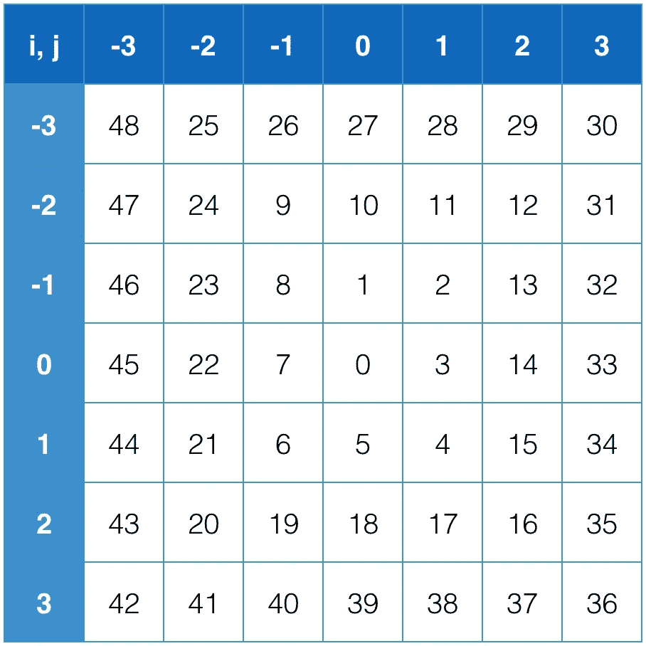

# 干净代码挑战:非 spiral

> 原文：<https://medium.com/hackernoon/clean-code-challenge-unspiral-b607a8bc7e83>

我有一个挑战给你尝试。首先，请看这段代码。

```
**function** unspiral (i, j) {
  **const** n = Math.max(Math.abs(i), Math.abs(j))
  **return** 4 * n * n + (j > i ? -1 : 1) * (2 * n - i - j)
}
```

通过阅读代码，你明白代码是做什么的吗？

你花了多长时间才明白？

# 螺旋

这是一个 2D 螺旋模式:



正如你在上图中看到的，螺旋以(0，0)为中心。它从中心上方的瓷砖开始，然后顺时针方向移动。

函数`unspiral(i, j)`获取坐标`(i, j)`并返回相应的数字。让我们假设`i`和`j`可以任意大。

例如:

*   `unspiral(0, 0) === 0`
*   `unspiral(-2, -1) === 9`
*   `unspiral(-123, 456) === 831165`

以下是我想到的解决方案:

```
**function** unspiral (i, j) {
  **const** n = Math.max(Math.abs(i), Math.abs(j))
  **return** 4 * n * n + (j > i ? -1 : 1) * (2 * n - i - j)
}
```

但是如你所见，代码看起来非常神秘和数学化。理解代码可能需要几分钟。你需要深入思考，以便根据你的需要改变或扩展它。

**一个需求变更可能需要螺旋来:**

*   以不同的坐标为中心。
*   从不同的号码开始跑步。
*   向相反方向旋转(逆时针)。
*   从不同的方面开始。

我已经写了几段这样的代码，很少有人能修改它。

虽然它是一个纯粹的、小的、可测试的、不依赖于任何东西的函数，但是它读起来并不那么愉快，而且很难扩展。所以我想，可能，[我的代码不够干净](https://blog.goyello.com/2013/01/21/top-9-principles-clean-code/)。

我希望向其他开发者学习，这就是我提出这个挑战的原因。

你的挑战是重写`unspiral`函数，以这样的方式:

*   通过阅读函数的代码，程序员可以很容易地理解它做什么以及如何工作。[允许评论](https://github.com/facebook/react/blob/e464cf2deffdd4139784674698e871161c42b0d5/src/renderers/shared/stack/reconciler/Transaction.js#L19)。
*   程序员可以很容易地修改、扩展或重用该功能，以满足他们的需要。
*   该算法的运行时间为 O(1)。

我想看看你的解决方案。感谢阅读。