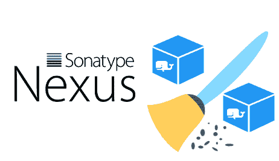
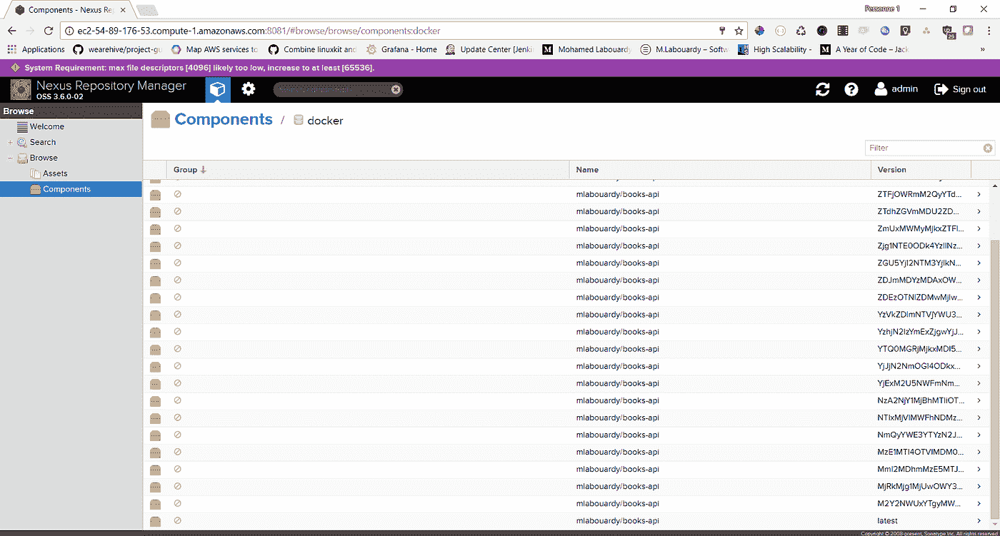
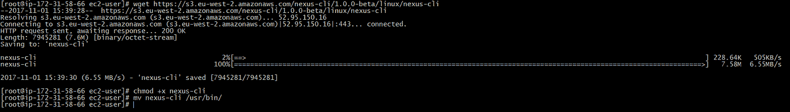
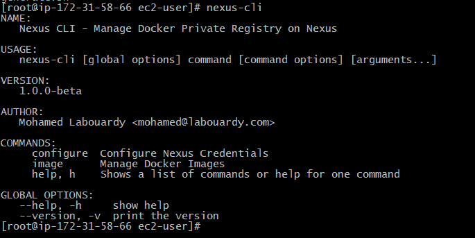
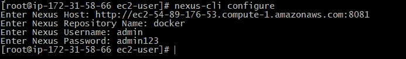
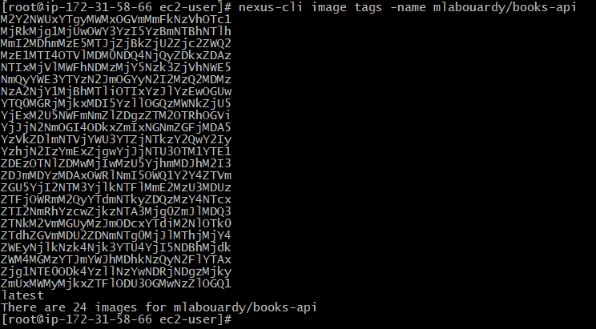
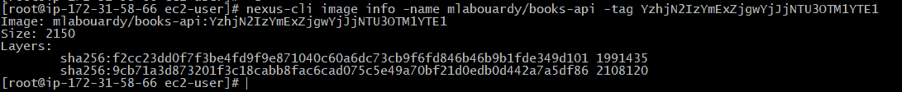
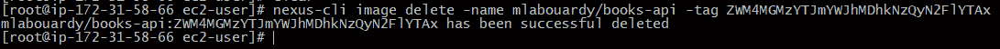
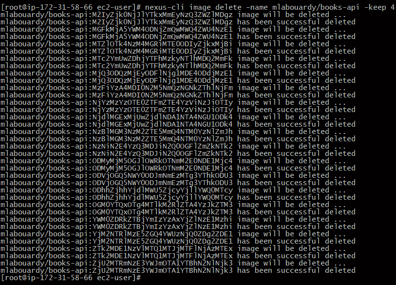
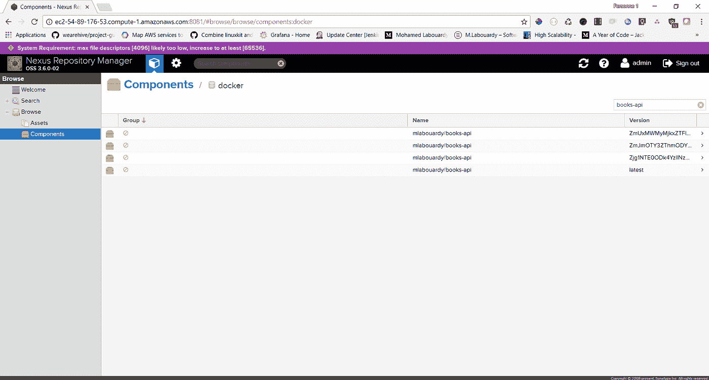

# 从 Nexus 存储库中清除旧的 Docker 图像

> 原文：<https://medium.com/hackernoon/cleanup-old-docker-images-from-nexus-repository-617b1004dad8>

我们中的许多人都在使用 **Nexus** 作为发布 **Docker 图片**的仓库。通常，在 **SCM** 在 **CI** 中自动改变之后，我们构建标记有**提交散列**(或者理想情况下使用 [semver](http://semver.org/) )的图像，并将它们推送到注册表。因此，有许多“不需要的”&“旧的”映像，在我们的例子中，它们占用了大量的磁盘空间。

我看了看 Nexus 的图形界面，显然没有什么可以同时删除几个 Docker 图片。或者甚至是清理旧的托管 Docker 图像并且还清理不再被任何托管图像使用的层的计划任务。

所以我想出了一个简单的 bash 脚本，它使用 **Docker 注册表 API** 清除 **Docker** 图像，保留最后的 **X 图像**并删除所有其他图像。但是，有更好的解决办法吗？是啊！我建了一个 [Nexus CLI](https://github.com/mlabouardy/nexus-cli)

要安装 [Nexus CLI](https://github.com/mlabouardy/nexus-cli) ，请找到适合您系统的软件包并下载。对于 linux:

> wget[https://S3 . eu-west-2 . Amazon AWS . com/nexus-CLI/1 . 0 . 0-beta/Linux/nexus-CLI](https://s3.eu-west-2.amazonaws.com/nexus-cli/1.0.0-beta/linux/nexus-cli)

下载 **Nexus CLI** 后。向二进制文件添加执行权限:

> chmod +x nexus-cli

注:对于**窗口**，确保 **nexus-cli** 二进制文件在**路径**上可用。[本页](https://stackoverflow.com/questions/1618280/where-can-i-set-path-to-make-exe-on-windows)包含在**窗口**上设置**路径**的说明。

安装后，通过打开新的终端会话并检查 **nexus-cli** 是否可用来验证安装是否有效:

完成后，配置 **Nexus** 凭证:

> nexus-cli 配置

通过 *nexus-cli 配置，*Nexus CLI 将提示您输入四条信息。**用户名**和**密码**是你的账户凭证。 **Nexus 主机名** & **Docker 库**名称。

应该就是这样了。在 cmd 提示符下尝试以下命令，如果您有任何图像，您应该会看到它们被列出

> nexus-cli 映像 ls

显示图像标签:

> nexus-cli 图像标记-名称图像名称

图像描述:

> nexus-cli 图像信息名称图像名称标签标签

要删除特定图像:

> nexus-CLI IMAGE delete-NAME IMAGE _ NAME-TAG 标记

要仅保留最后的 X 图像并删除所有其他图像:

> nexus-cli 映像删除-名称映像名称-保留 X

就是这样！让我们回到 **Nexus 仪表盘**:

你可以看到，Nexus 只保留了最后 4 张图片，删除了其他的。

CLI 仍处于早期阶段，因此欢迎您对 [Github](https://github.com/mlabouardy/nexus-cli) 中的项目做出贡献。