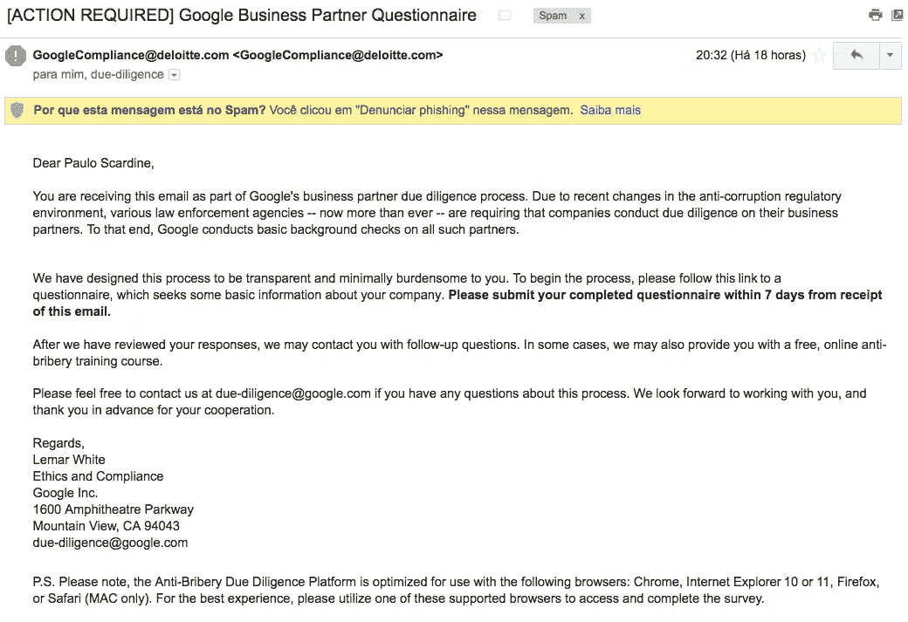
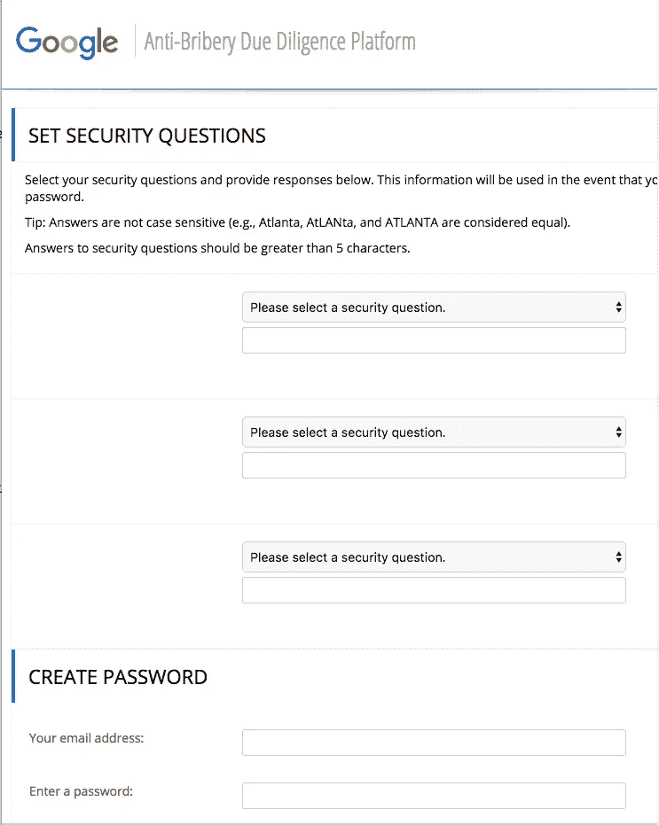
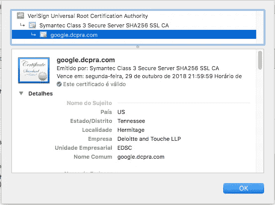

# 当今最聪明的网络钓鱼骗局

> 原文：<https://medium.com/hackernoon/clever-phishing-scam-of-the-day-225ac70f0c21>

今天收到这条短信，差点上当:

这链接到一个带有加密参数的[页面](https://google.dcpra.com/Account/CreatePassword.aspx)，该参数似乎会自动填写我在表单中的电子邮件地址。

我想知道有多少人会听从自称是谷歌的第三方的指示，填写像安全问题这样的敏感信息。

这非常聪明:

1.  谈论一件非常严肃的事情
2.  紧迫感(7 天期限)
3.  邮件不是从 google.com 发来的，而是抄送给 due-diligence@google.com 的。

网站证书看起来是合法的，但是得到一个这样的证书并不困难:

# [更新]

即使这条消息具有典型的钓鱼攻击手法，我还是打开了一张谷歌支持票以防万一。原来这个消息是合法的！！！说真的谷歌？

> [黑客中午](http://bit.ly/Hackernoon)是黑客如何开始他们的下午。我们是 [@AMI](http://bit.ly/atAMIatAMI) 家庭的一员。我们现在[接受投稿](http://bit.ly/hackernoonsubmission)并乐意[讨论广告&赞助](mailto:partners@amipublications.com)机会。
> 
> 如果你喜欢这个故事，我们推荐你阅读我们的[最新科技故事](http://bit.ly/hackernoonlatestt)和[趋势科技故事](https://hackernoon.com/trending)。直到下一次，不要把世界的现实想当然！

