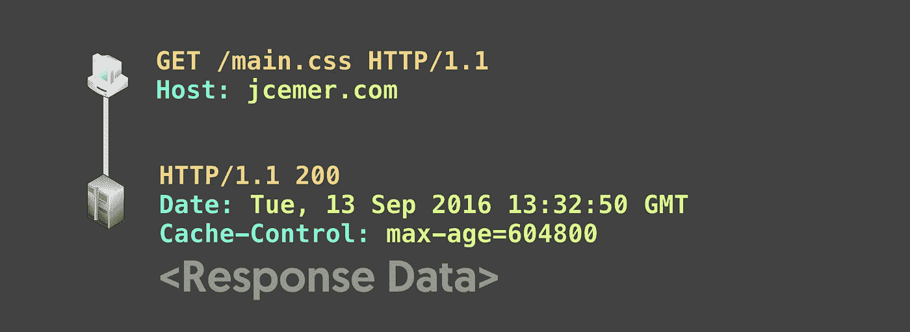
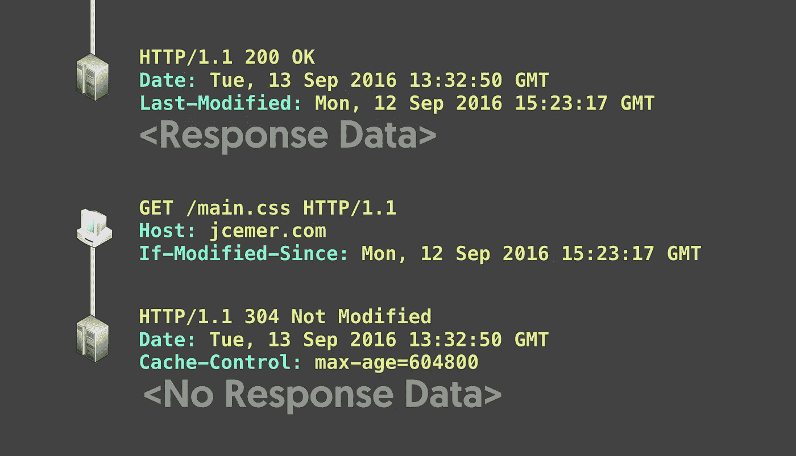
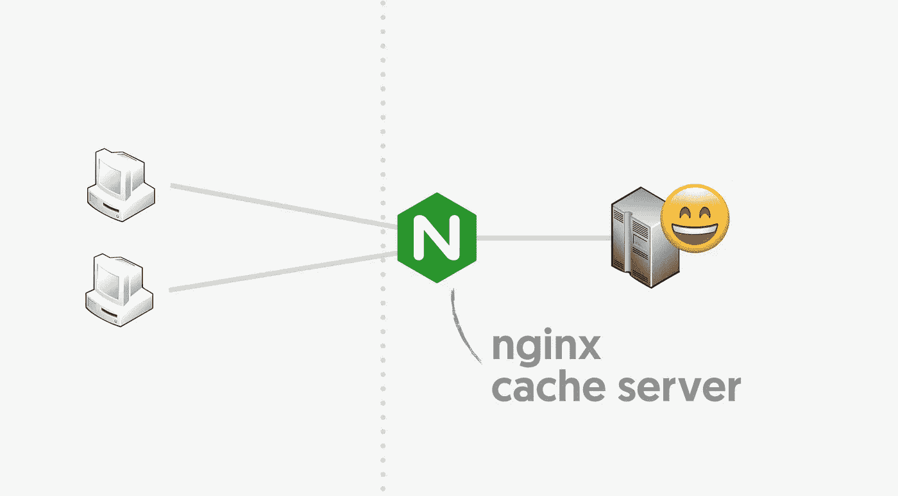
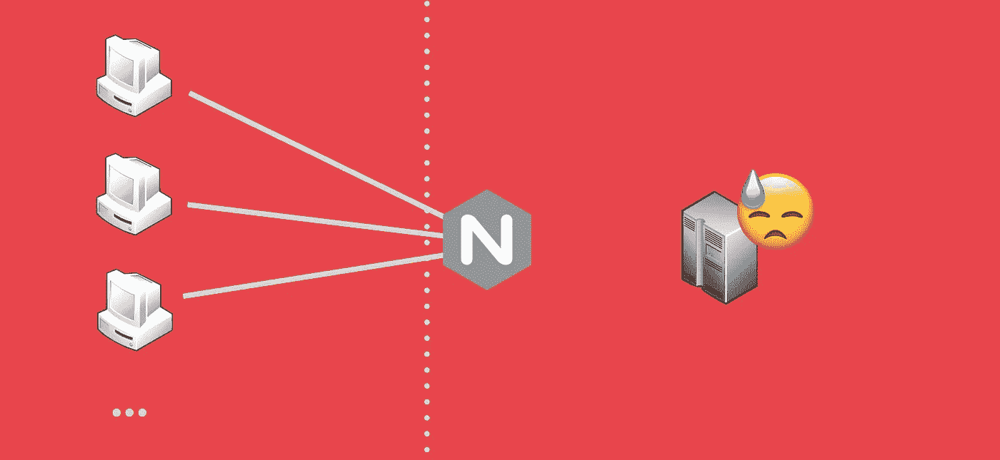
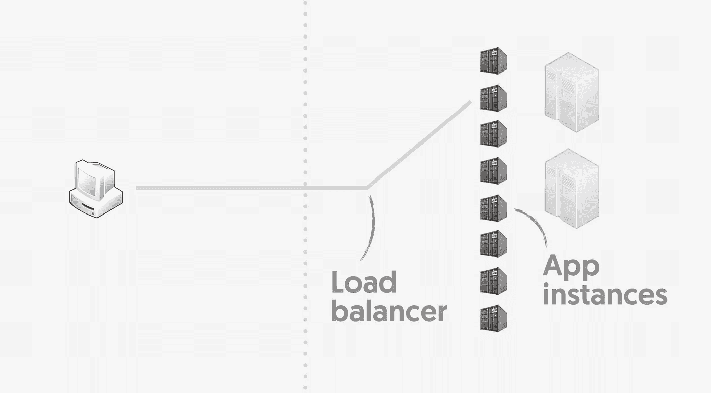

# Web 上的客户端、网络、服务器和应用程序缓存

> 原文：<https://medium.com/hackernoon/client-network-server-and-application-caching-on-the-web-2fcdcd856886>

Web Caching

本文涵盖了高可伸缩性和高性能的秘密之一。一篇关于 Flickr 架构的[博客文章](http://highscalability.com/flickr-architecture)有超过[50 亿张照片](https://www.flickr.com/photos/franckmichel/6855169886)带给我们以下内容:*缓存和 RAM 是一切的答案*。

一个[网站](https://hackernoon.com/tagged/website)可以在三个不同的层和环境上存储数据以加速未来的请求:1)客户端，2) [网络](https://hackernoon.com/tagged/network)，3)服务器，以及 4)应用程序。

Chapter 1\. Client Caching

网站的不同页面通常共享相同的资源。用户应该在导航过程中重用资产。*图像*、*脚本、*和*样式*可以缓存数月，文档页面本身也可以在客户端浏览器上缓存数分钟。

HTTP 头负责定义是否可以缓存响应**以及缓存多长时间**。下面的`Cache-Control`头示例表明响应可能会被缓存 7 天。只有当缓存过期或者用户强制刷新页面时，浏览器才会再次请求它:

Request and response that could be cached for 604800 seconds

响应还可以包括一个`Last-Modified`报头或一个`Etag`报头。这些头用于验证过期的响应是否可以重用。响应状态 304 指示内容没有改变并且**不需要再次下载**。注意下面的`Last-Modified`和`If-Modified-Since`标题对和日期:

Response with Last-Modified header and subsequent request using it

`Etag`标题与`If-None-Match`一起使用，以类似的方式交换代码来识别内容是否改变。

明智地定义 HTTP 头的网站将为用户提供更好的体验。基于此，浏览器可以节省时间和网络带宽。

Chapter 2\. Network Caching

维基百科将内容交付网络(CDN)定义为代理服务器的全球分布式网络。cdn 是关于缓存的——共享缓存。

HTTP header 指令允许网络的不同部分缓存响应。在任何地方，发现带有`Cache-Control: public, max-age=31536000`的资产意味着它可以持续一年是很常见的。

你可能知道还有其他的[头缓存指令](https://developer.mozilla.org/en-US/docs/Web/HTTP/Headers/Cache-Control)。还有一个[强大的头](https://developer.mozilla.org/en-US/docs/Web/HTTP/Headers/Vary)来处理认证和其他类型的动态响应。

Chapter 3\. Server Caching

最后，控制权全在你手上，开发者！除了设置正确的响应头和正确处理请求头之外，在服务器端和应用程序端还有许多可以改进的地方。

更快响应和节省资源的第一种方法是在应用程序和客户端之间建立一个缓存服务器。

Clients requesting the same content to a proxy server

像 [Varnish](https://varnish-cache.org) 、 [Squid](http://www.squid-cache.org) 和 [nginx](https://www.nginx.com) 这样的工具可能会缓存*图像*、*脚本*和其他用户共享的内容。下面的例子设置了一个 nginx 服务器代理，它只依靠应用程序 HTTP 头上的**来缓存内容:**

还有一个叫做`proxy_cache_lock`的指令，它允许代理服务器一次只为应用程序**委托第一个类似的客户端请求**。如果设置为 on，客户机将在第一个请求返回时收到响应。

Many clients requesting the same content at the same time

这是一个简单而强大的机制，当内容过期、**、**并且许多客户端请求它时，**避免了应用程序端的混乱。**

服务器代理还可以使用指令`proxy_cache_use_stale: updating;`为后续的类似请求传递过期的内容。这加快了响应时间，减少了等待服务器响应的客户端数量。

最后但同样重要的是，**代理可以提高应用程序**的容错能力。当应用程序返回错误状态或者当服务器代理和应用程序之间的通信没有按预期工作时，`proxy_cache_use_stale`指令有标志来传递过期的内容。

文章[使用 NGINX 和 NGINX Plus 进行缓存的指南](https://www.nginx.com/blog/nginx-caching-guide/)有更多的细节和配置选项。

Chapter 4\. Application Caching

应用程序缓存减少了特定操作的时间。复杂的计算、对其他服务的数据请求或跨请求共享的公共数据就是一些例子。

## 4.1.记忆化

上面的 Ruby 代码使用了简单的 ***内存缓存*技术**。它存储*产品* *价格*以避免将来的计算。在这种情况下，它将把数据存储在对象实例上，并且只在请求期间节省资源。

这种技术可以应用于代码中的任何地方。但是它的使用带来了一些问题。例如，记住你的数据不会过期是很重要的。**全局代码*记忆*将在整个应用程序执行周期中持续存在于内存中。**

## 4.2.智能内存缓存

上面的代码使用 [Rails 缓存 API](http://guides.rubyonrails.org/caching_with_rails.html#low-level-caching) 在一分钟**内跨请求**存储和重用*类别税*。*缓存键*定义使用`category_id`来识别数据。该技术用于减少对外部类别 Tax Service 的请求量，从而节省资源和时间。

有许多库提供这种模式。但是重要的是要提到应用程序内存是一种有限的资源。例如，[节点缓存模块不管理消耗的内存量](https://github.com/ptarjan/node-cache/issues/77)。如果您的应用程序大量缓存数据，消耗所有可用的内存，这可能是一个问题。

Rails 内存缓存 **通过删除最近最少使用的条目，在缓存数据超过分配的内存大小时明智地删除缓存数据。它允许缓存不可变的数据，而无需定义到期时间。**

## 4.3.缓存存储—共享缓存

处理越来越多用户和请求是 Web 开发的一个重要主题。扩展应用程序的方法之一是添加更多的应用程序实例(水平扩展)。正如您可能想象的那样，简单的内存缓存不能在实例之间共享。

十二因素应用，一种构建软件即服务(SaaS)的方法，指出[一个应用程序永远不应该假设缓存在内存或磁盘上的任何东西在未来的请求](https://12factor.net/processes)或作业中是可用的——随着每种类型的许多进程的运行，未来的请求将由不同的进程服务的可能性很高。

像 [Memcached](http://memcached.org) 或 [Redis](http://redis.io) 这样的键值存储可以用来在应用程序实例之间共享缓存数据。这些工具有[不同的](https://github.com/memcached/memcached/wiki/UserInternals#when-are-items-evicted) [策略](https://redis.io/topics/lru-cache)来修剪缓存的数据量。缓存存储也可以通过[复制](http://redis.io/topics/replication)和[持续](http://redis.io/topics/persistence)来容错。它应该有如此不同的要求，以至于[网飞建立了自己的工具](https://www.slideshare.net/ShashiShekarMadappa/evcache-at-netflix)。

在使用缓存存储时要考虑的另一个重要方面是*竞争条件*，当不同的应用程序实例同时获取未缓存的数据时会发生这种情况。 [Rails 缓存获取 API](http://api.rubyonrails.org/classes/ActiveSupport/Cache/Store.html#method-i-fetch) 有`race_condition_ttl`来最小化这种影响。

很难完全消除多个应用程序实例的缓存更新竞争条件问题。一个解决方案是在应用程序流之外更新缓存数据，只使用应用程序上的缓存数据。在微服务架构上，也可以使用 nginx 代理服务器保护应用程序和服务之间的通信，如上所述。

我希望这篇文章能帮助您理解并选择最适合您的应用程序的策略。**用于缓存的 HTTP 头很简单，你应该尽快设置。当您解决一些性能问题时，您应该设置其他缓存策略，请记住“过早优化是万恶之源”**

> [黑客中午](http://bit.ly/Hackernoon)是黑客如何开始他们的下午。我们是 [@AMI](http://bit.ly/atAMIatAMI) 家庭的一员。我们现在[接受投稿](http://bit.ly/hackernoonsubmission)，并乐意[讨论广告&赞助](mailto:partners@amipublications.com)机会。
> 
> 如果你喜欢这个故事，我们推荐你阅读我们的[最新科技故事](http://bit.ly/hackernoonlatestt)和[趋势科技故事](https://hackernoon.com/trending)。直到下一次，不要把世界的现实想当然！

