# 攀岩和编程:7 个能让你在这两方面都做得更好的见解

> 原文：<https://medium.com/hackernoon/climbing-and-programming-7-insights-that-will-make-you-better-at-both-50d18322413b>

*来自埃琳娜和罗希特的提示*

[在采访 VEON 的敏捷负责人 Elena 和这里的后端工程师 Rohit 时，](/@VEONCareers/a-programmers-life-create-improve-chill-repeat-a48d8b8560b0)我们了解到他们都喜欢攀岩。这让我们开始思考。

攀岩和编码有联系吗？

简短的回答是:是的！

因此，我们从 Elena 和 Rohit 那里收集了七条真知灼见，可以让你更擅长攀岩和编码(或者至少其中之一)。

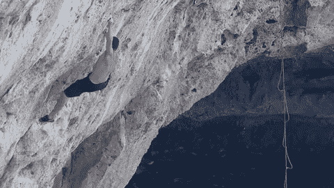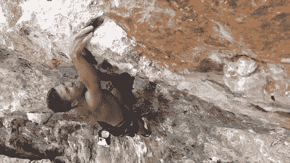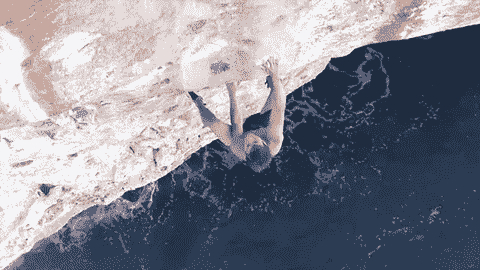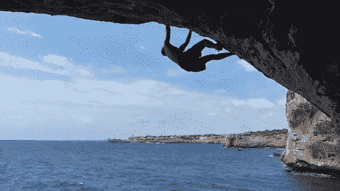

# 1.第一，理解；第二，做

要成为一名成功的程序员，Elena 认为“你必须将分析性思维应用到你所做的每一件事情中。你要明白问题再开口。”

所以，这是退一步看问题。这也和攀岩有关。

例如，如果你[计划攀登世界上最难攀登的山峰之一——西班牙的拉杜拉山](http://www.rockandice.com/features/what-it-took-to-climb-la-dura-dura-5-15c-the-worlds-hardest-route)，你可能会想要做些研究。你需要在开始之前抓住这个任务，否则你会摔倒的。

 [## 程序员的生活:创造、改进、冷却、重复

### 哦，程序员的生活！这是一段平稳的旅程——直到疯狂发生。

medium.com](/veon-careers/a-programmers-life-create-improve-chill-repeat-a48d8b8560b0) 

# 2.到野外去

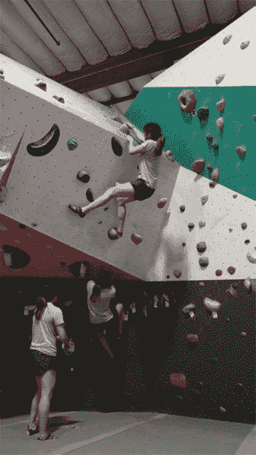

正如埃琳娜所说，“直到你把它放到野外，你才知道它是否有用。”

在编码中，你只需要看看你能做些什么来改进。

Dropbox 就是一个可以效仿的例子，这家公司迅速实现了 100 亿美元的估值。Dropbox 很快取得了成功，因为他们没有浪费时间向市场推出产品。之后，他们运行了一个严格的测试和优化时间表，以便在最初的五年里实现曲棍球棒般的增长。

这个想法同样适用于攀岩。首先，努力练习简单的室内和室外攀岩。一旦你变得更好，开始攻击越来越难的攀岩。每次你出去攀岩，做 Dropbox 做的事情:从你自己和你的向导或朋友那里收集反馈，并采取措施提高你的表现。

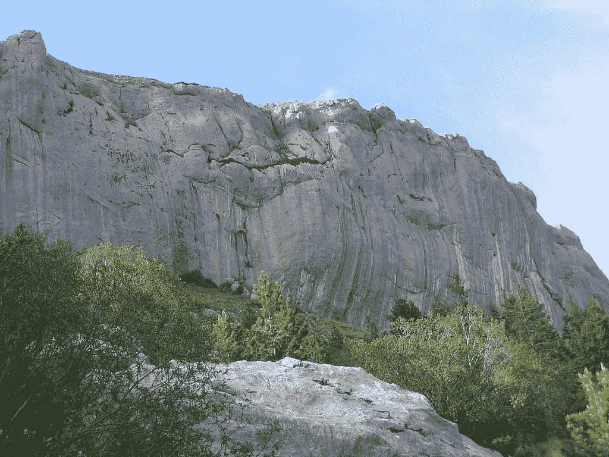

谁知道呢？也许你最终可以征服法国的 [Biographie(又名 Realization)](https://en.wikipedia.org/wiki/Realization_(climb))，成为现实生活中的蜘蛛侠。《传记文学》是克里斯·夏尔马完成世界上第一次确认的 5.15 米攀登的地方。

# 3.测试测试测试！

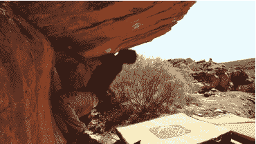

大声说出来:*需要更多反馈*！如果你不知道顾客在说什么，你就无法改进产品(提示:他们总是在说些什么)。

在为一家失败的初创公司工作时，Rohit 意识到了像 Dropbox 一样进行测试的重要性。

“我们太专注于为 10 亿人提供解决方案，而没有向最初的客户征求建议和反馈。正因为如此，[我们在工程上花了太多时间，而没有足够的](/veon-careers/how-to-improve-as-you-go-wisdom-and-espresso-from-a-test-automation-engineer-c4a0c012a6c2)测试。这导致了失败。”

这个测试思想也适用于抱石。你必须练习。否则，你会被挂到墙上——真的。

# 4.确定上面的立足点

专业攀岩者和教练卢克·利弗西建议攀岩者“[在开始攀岩之前确定岩壁上所有的立足点](https://greatist.com/move/rock-climbing-tips)因为你必须学会如何从一步过渡到下一步。

将这种想法转化为软件开发。意思是利用眼前的东西。Elena 和 Rohit 在职业生涯中都这么做过。

> “我学的是商业和会计。但是我的第一份工作是在一家 IT 公司。我从经验中学习，边走边学。事实上，我是偶然进入这个领域的，”埃琳娜证实道。
> 
> “当我在法国做研究，准备攻读计算机科学的博士学位时，我渴望编码。编程融入了我的血液，我终于意识到我需要利用我的技能，跟随我的欲望。Rohit 说:“全力投入编程生涯是正确的一步。

# 5.你的计划不可靠

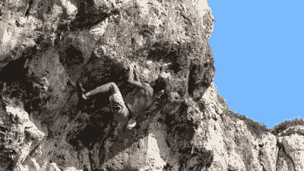

Jeff Atwood 是一名软件开发人员，也是广受欢迎的[编码恐怖博客](https://blog.codinghorror.com/)的作者，他强调了编码和攀岩之间的联系，即[“不可预见的、不可预见的、纯粹偶然的障碍”总是会出现](https://blog.codinghorror.com/software-projects-as-rock-climbing/)，即使是在“最精心计划的”项目或探险中。

如果你开始一次史诗般的攀岩，你必须为意想不到的事情做好准备。这是通往巅峰之旅的一部分。

Elena 在她的编程工作中呼应了这个想法。

> “没有一种理论是 100%可靠的。你所知道的不一定都是正确的。作为一个 scrum 大师，我有一个迭代的过程要遵循，但是我也知道我们必须自制我们自己的 scrum 过程。独特的挑战需要独特的解决方案。”

# 6.以富有想象力的方式使用你的设备

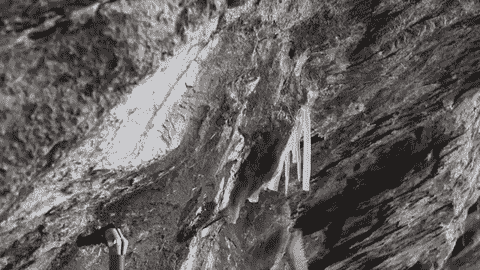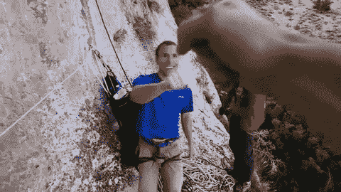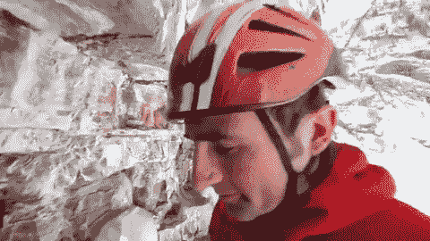

让我们解决第五点。因为当计划失败时，你必须有处理情况的方法。

在攀岩运动中，你有安全带、绳索、头盔、登山扣和其他装备。为了成为最好的攀岩者，你必须学会如何最有效地使用这些工具。这意味着不时地即兴创作或创造独特的解决方案，尤其是当你陷入困境时。

这个想法与编程有关。如果你向 Rohit 寻求成为后端工程师的建议，他会强调选择正确工具的重要性。

 [## 程序员的生活:创造、改进、冷却、重复

### 哦，程序员的生活！这是一段平稳的旅程——直到疯狂发生。

medium.com](/@VEONCareers/a-programmers-life-create-improve-chill-repeat-a48d8b8560b0) 

> “在我的职业生涯中，我已经学习了 7 种编程语言(Java、Ruby、Scala 等)。为了充分利用我的工具，我把注意力集中在问题上——而不是和语言斗争。如果你明智地使用你的工具，你就能想出高效的解决方案。”

# 7.不要做一只恐龙

从技术上来说，如果你想成为一名攀岩者，那么变成能够攀爬的恐龙之一[可能会有好处，比如恐爪龙(“可怕的爪蜥”)](http://www.abc.net.au/science/articles/2012/04/18/3476915.htm)

不管怎样，你明白了。Elena 和 Rohit 都警告不要变成恐龙。[恐龙在地球上统治了超过 1 亿年](https://www.scientificamerican.com/article/was-the-dinosaurs-long-reign-a-fluke/)，但是如果你现在不学会如何迈出下一步，你在编程世界的统治将会非常非常短暂。

“老狗必须学会新把戏，”埃琳娜大声说道。

“永远不要犹豫学习。在编程领域，要么学习，要么死亡，”Rohit 解释道。

# 最后的话

希望这些见解对你的下一个编程项目或攀岩(或两者)有所帮助。跟随他们——你将真的和象征性地走上顶峰。

您可以在这里找到我们所有的空缺职位:

 [## 在此申请

### 要了解更多有关 VEON 当前所有职位的信息，请点击此处:

medium.com](/veon-careers/apply-here-1c8366d85e87)