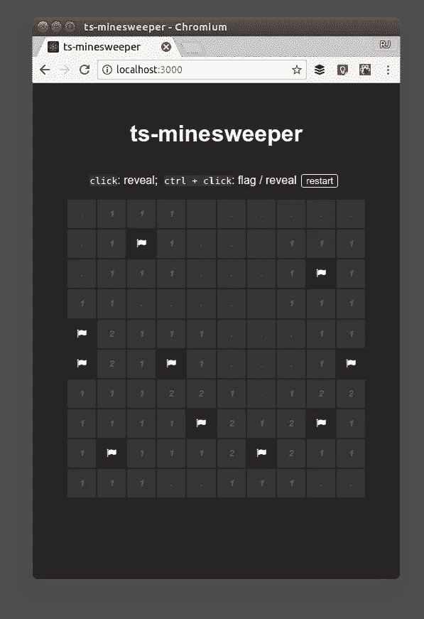

# 用 TypeScript，React 和 Redux 在 15 分钟内克隆扫雷

> 原文：<https://medium.com/hackernoon/clone-minesweeper-in-15-minutes-with-typescript-react-and-redux-64be1a7a0264>


当[扫雷](https://en.wikipedia.org/wiki/Minesweeper_(video_game))搭载 Windows 3.1 时，它不仅仅是为了娱乐。令人上瘾的小游戏掩盖了一个不可告人的目的:[向用户介绍鼠标右键](http://mentalfloss.com/uk/technology/32106/the-true-purpose-of-solitaire-minesweeper-hearts-and-freecell)。两键鼠标现在已经是旧闻了，但是扫雷对于不同的介绍来说仍然是合适的尺寸。

在接下来的十五分钟里，我们将构建一个扫雷克隆( [github](https://github.com/rjz/ts-minesweeper) )，它使用 [TypeScript](https://www.typescriptlang.org/) 、 [React](https://reactjs.org/) 和 [Redux](http://redux.js.org) 来构建一个健壮的浏览器应用程序。这是一个简单的同步项目，但是引入使用 [Redux 和 TypeScript](http://rjzaworski.com/c/typescript) 的模式来帮助驯服大得多的应用程序的复杂性就足够了。



# 入门指南

没有时间进行配置，时间紧迫！我们可以使用[create-react-app-typescript](https://github.com/wmonk/create-react-app-typescript)来建立一个具有合理默认值的项目。微调可以以后再来。

```
$ create-react-app minesweeper — scripts-version=react-scripts-ts
$ cd minesweeper
$ yarn install
```

我们还需要为后者添加`redux`、`redux-react`和[类型定义](https://github.com/DefinitelyTyped/DefinitelyTyped)(`redux`为[带来了自己的](https://github.com/reactjs/redux/blob/master/index.d.ts))。

```
$ yarn add redux react-redux
$ yarn add [@types/react-redux](http://twitter.com/types/react-redux)
```

# 游戏逻辑

接下来，我们要作弊(但只是一点点)。虽然我们将对前端 UI 使用 React，对持久性使用 Redux，但我们可以通过借用游戏本身现有的[模型](http://wiki.c2.com/?FourLayerArchitecture)来节省时间。

这个特殊的[实现](https://github.com/rjz/ts-minesweeper/blob/master/src/minesweeper.ts)碰巧是友好的、本地的和同步的，但是很容易想象将`MinesweeperAPI`移到 HTTP 请求的远端。它的行为在两种情况下都是一样的:给定`Game`的当前状态和显示或标记单个单元格的请求，`MinesweeperAPI`将返回一个更新的新状态来反映请求的结果。

接下来，我们需要告诉 TypeScript 关于`Game`的“形状”。这包括`Options`——棋盘的大小和有多少地雷藏在上面——一个`moveCount`，以及组成棋盘状态的几个指数。完成的类型声明很好地证明了这一点:

# 这次是 Redux

我们有一个游戏——我们只是需要一个地方来放它。我们将准备 Redux 来存储和更新`Game`的状态，方法是在我们自己的类型化操作中镜像公共`MinesweeperAPI`:

除了[类型定义](https://rjzaworski.com/2016/09/typescript-redux-async-actions#actions)之外，这些看起来就像我们用普通 JavaScript 编写的动作创建器。但是通过预先声明我们的假设，TypeScript 编译器可以在应用程序的其他地方强制执行这些操作。如果我们试图创建一个没有在`Action` [联合](https://www.typescriptlang.org/docs/handbook/advanced-types.html#union-types)中声明的动作，程序将无法编译。

## 玩游戏

我们将从商店内部的静态类型中获得更多的好处。伸缩 Redux 的挑战之一是日益“深入”的 reducers、accessors 和 state 的复杂性。通过先发制人地声明它们的形状，TypeScript 编译器可以警告我们输入错误、缺少参数和引用错误。

为了简单起见，我们将根据领域模型围绕现有的`Game`类型构建商店。即使有了这种相对扁平的数据结构，在 TypeScript 保证应用程序的其余部分遵守规则的情况下，我们晚上也会睡得更安稳。

打破它！尝试访问`'REVEAL_LOCATION'`分支中的`action.options`，并检查产生的编译器错误。

# 构建前端

说到“退房”，钟！时间很紧，但我们还有时间美化一下城市。

为了让事情进展顺利，让我们通过在根元素周围包装一个`[Provider](https://github.com/reactjs/react-redux/blob/4c2670dc11cc067ef106f6c527e6e8b9d47f8af8/docs/api.md#provider-store)`来将 Redux 存储到组件树中。这与 JavaScript 中的工作方式完全一样:

```
ReactDOM.render(
  <Provider store={store}>
    <App />
  </Provider>,
  document.getElementById('root') as HTMLElement
);
```

接下来，我们将搭建一个根应用程序组件并将它`[connect](https://github.com/reactjs/react-redux/blob/4c2670dc11cc067ef106f6c527e6e8b9d47f8af8/docs/api.md#connect)`到所提供的`store`。

TypeScript 在这里添加了几个新的方面。传递给`connect`的`mapStateToProps`和`mapDispatchToProps`函数都有自己的类型声明，它们的交集代表组件自己的`Props`。当尘埃落定时，`<App />` 将接收整个 Redux `Game`加上三个可用的动作和一个`grid`数组来简化渲染。作为附加仪式的回报，我们得到了完全的类型安全:未知的动作、畸形的道具和未定义的引用现在都将在编译时触发错误。

## 呈现单元格

`<App />`已接入商店，但还没什么好看的。为了解决这个问题，让我们创建一个表示网格上单个单元格的组件:

将 CSS 和渲染优化留到将来[的](https://hackernoon.com/tagged/future)练习中(我们有时间表，这里！)这看起来很像 JavaScript 中的样子。 [*推断*](https://www.typescriptlang.org/docs/handbook/type-inference.html) 是游戏的名字:一旦 TypeScript 理解了应用程序的边界，它就可以为里面的大部分细节推断出正确的类型。这对我们的小速跑来说没什么大不了的，但是随着项目规模的扩大，它会省去很多仪式。

编译器不能很好地推断出的一件事是跨越应用程序边界的新数据。例如，当一个单元格被点击时，我们需要告诉 [TypeScript](https://hackernoon.com/tagged/typescript) 一个独立的事件处理程序准备接收什么类型的事件:

```
e: React.MouseEvent<HTMLButtonElement>
```

编译器现在可以验证我们正在正确地处理事件。如果我们传递一个`KeyboardEvent`或者将处理程序附加到一个`<button />`之外的东西上，我们会在编译时遇到一个错误。

## 完成棋盘

我们快到了！我们还需要两样东西来让游戏在`<App />`中运行:一个`[componentDidMount](https://reactjs.org/docs/react-component.html#componentdidmount)`钩子来创建初始游戏状态，一个`render`方法来将`CellComponent`网格放到屏幕上。

这只是 JavaScript——所有的类型都在上游声明，TypeScript 将在下游推断细节。

# 包扎

放下铅笔。14:59.加上一个漂亮的设计，这就是:静态验证的扫雷舰，只需不到 15 分钟。我们已经为其他 [TypeScript 教程](http://rjzaworski.com/c/typescript)留下了大量的细节，但是这里介绍的模式可以适用于所有规模和形状的项目。

完成的游戏并不是最漂亮的东西。没有测试，次优的渲染，设计团队有很多机会，但我们终于到了 TypeScript 最闪亮的地方。随着项目的发展，我们的类型声明中包含的所有假设都将被保留以供参考——并且在任何违反规则的时候都会有友好的警告作为支持。

在 Github 上查看[完成的项目！](https://github.com/rjz/ts-minesweeper)