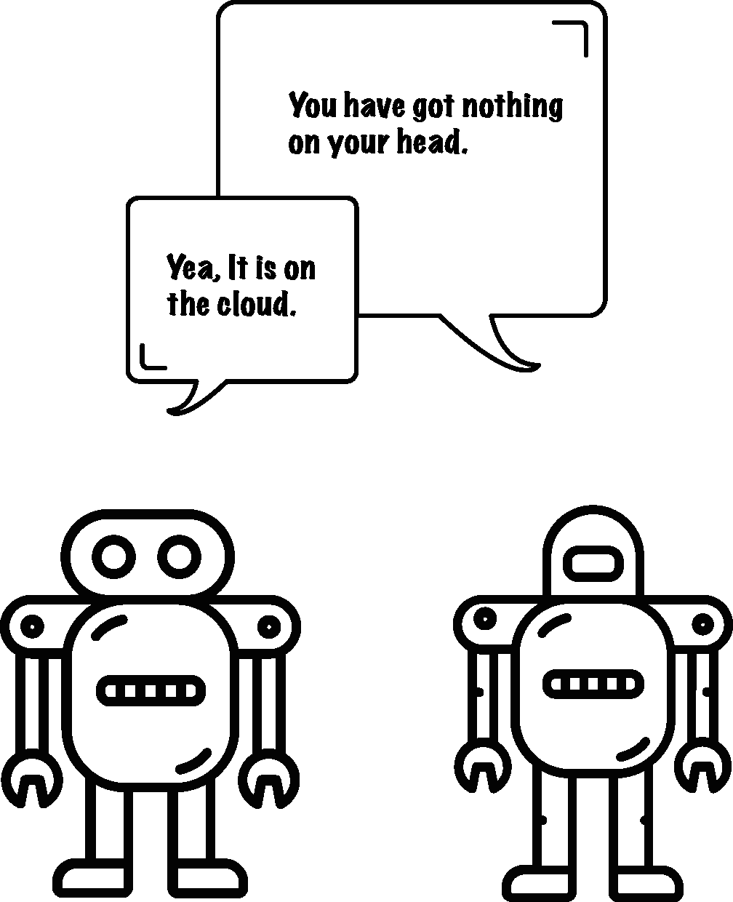
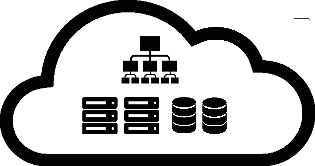
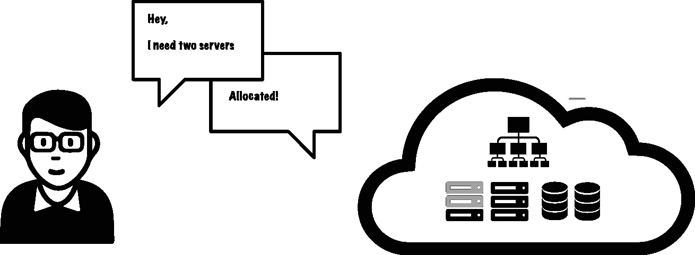

# 面向初学者的云计算

> 原文：<https://medium.com/hackernoon/cloud-computing-for-beginners-85d168959afb>

**云简介**

以下摘自《云是小菜一碟》一书。[在这里了解更多关于这本书的信息。](http://bit.ly/2igvcIt)

假设您想要托管一个电影预订服务。在云出现之前，你必须购买一台物理服务器并托管它。因此，每当顾客想订票时，他就从他的计算机向你的服务器发送一个请求。服务器处理请求并将数据发送回客户端(客户的计算机)。如果服务器和客户端正在进行对话，它应该是这样的。

*客户:我需要《美国队长:内战》的票。*

服务员:这是电影{P1，P2，P4，A3 …} 的座位

*客户:我正在预订 P2 P1*

*服务器:封锁席位，等待付款*

*客户:这是我的付款明细{卡号:XXXXXX，CVV…}*

服务员:恭喜，他们被预订了。

*客户的计算机和服务器通过数据包进行通信。*

根据配置，您的服务器将能够处理 1000 个这样的请求。

然而，当需求超过服务器的极限时会发生什么呢？比如 10k — 20k 请求？当十到二十个人在 Whatsapp 上向你发送 ping 命令时，情况也是如此。你将尝试一个接一个地回答这些问题。然而，你会花很多时间。然而，在互联网上，这种延迟是不可接受的。

**为什么我们不能添加更多的服务器？**

是的，这是一个解决办法。假设您购买或租赁了十多台服务器。现在，他们可以作为一个团队工作，分担负荷。那很有效。但是，你的服务不会一直有这样的请求。比较内战电影的第一天和第五十天。请求的数量下降了。您购买的额外服务器现在没有工作。你仍然要为他们的电费和带宽付费。在某些情况下，您永远无法预测请求何时达到峰值。所以服务器必须准备好。当下一个高峰时间到来时，您的服务器可能已经过时了。物理托管有很多其他问题，如停电、维护成本等。因为这会浪费资源，所以这不是一个有效的解决方案。云就是为了解决这个问题而开发的。

云能有什么帮助？

在云中，我们有一个共享的计算机资源池(服务器、存储、应用程序等)。)由我们支配。当你需要更多资源的时候，你只需要开口。对于云来说，立即供应资源是小菜一碟。您可以在不需要资源时释放它们。这样，你只为你所使用的东西付费。您的云提供商将负责所有维护工作。

**云在哪里？**

计算机资源的共享池存在于称为数据中心的物理位置。您的云提供商在世界各地拥有多个数据中心。因此，您的数据会在多个站点复制。即使一个数据中心因为自然灾害而关闭，它在另一个位置仍然是安全的。

什么是 IaaS、PaaS 和 SaaS？

在 IaaS(基础设施即服务)中，您将获得水泥、砖块、板材等材料。盖房子。同样，在这里您可以选择您想要创建云服务的硬件。你可以灵活地按照自己想要的方式去做。例如:亚马逊网络服务，微软 Azure，谷歌计算引擎等。

在 PaaS(平台即服务)中，房子是为你建造的，你只需要提供家具。同样，这里为您提供了预配置的硬件。因此它只能运行它支持的应用程序。与 IAAS 相比，你得不到灵活性。Ex: Heroku，Google App Engine 等。

SaaS(软件即服务)你需要占领的一切。在这里，您可以在订阅的基础上获得软件。例如:Gmail，雅虎等。

喜欢读这个吗？你想学习创建虚拟机、构建云应用程序、保护和扩展它吗？以上只是《T2》一书的节选【云易如反掌 。

> [黑客中午](http://bit.ly/Hackernoon)是黑客如何开始他们的下午。我们是 [@AMI](http://bit.ly/atAMIatAMI) 家庭的一员。我们现在[接受投稿](http://bit.ly/hackernoonsubmission)并乐意[讨论广告&赞助](mailto:partners@amipublications.com)机会。
> 
> 如果你喜欢这个故事，我们推荐你阅读我们的[最新科技故事](http://bit.ly/hackernoonlatestt)和[趋势科技故事](https://hackernoon.com/trending)。直到下一次，不要把世界的现实想当然！

