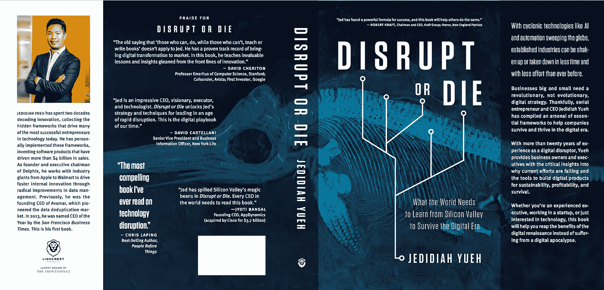

# 云不是数字化转型战略(除非你是亚马逊)

> 原文：<https://medium.com/hackernoon/cloud-is-not-a-digital-transformation-strategy-unless-you-are-amazon-aec1c470cf8f>

一个网上书店是怎么吃到云的？

2002 年，杰夫·贝索斯做了一件奇怪而不寻常的事情。他将 IT 架构(SOA)应用于亚马逊的文化、流程和组织结构。

贝佐斯发出了一个内部[命令](https://plus.google.com/+RipRowan/posts/eVeouesvaVX)，要求亚马逊团队通过“通过服务接口公开他们的数据和功能”来相互交流任何不服从命令的人都将被解雇。

不为世人所知的是，贝佐斯已经悄悄地将亚马逊改造成了一家平台公司。

而且成功了。几年后，亚马逊的转型催生了 S3，这是亚马逊的第一个网络服务，我们现在统称为云。

贝索斯授权一年后，尼古拉斯·卡尔在*《哈佛商业评论》*上发表了一篇文章，题为“[没关系](https://hbr.org/2003/05/it-doesnt-matter)”卡尔认为，它已经改变了几乎每个行业，缺乏差异化的机会意味着公司应该专注于防御:风险管理和成本控制。

IT 组织变得非常注重成本，为考虑的每项新技术创建了决策层和体系结构审查层，这一切都是为了提高标准化并最大限度地降低成本。

但是，信息技术不能与从蒸汽机到铁路或从电报到电话的转变相提并论——这些技术变成了商品化的公用事业，对今天的商业几乎没有什么区别。

信息技术以自身为基础，每一层创新都开辟了改变世界的新途径。

智能手机激增，GPS 和地图技术成熟，初创公司开始建立在无限容量的云之上。这些分层创新使网飞、Airbnb、Spotify，甚至亚马逊本身能够像浪潮一样突破传统行业。

贝佐斯的使命改变了世界。他将战术技术转变为有史以来最具战略意义的产品之一。

该是进攻的时候了，而不是防守。

如今，你很难找到一家没有云战略的公司。“云优先”和“云转移”是 Gartner 分析师和 IT 高管信奉的流行口号，所有这些都推动了未来四年云支出的[万亿美元](http://www.gartner.com/newsroom/id/3384720)预测。

从表面上看，叙述清晰而引人注目。如果你不从事云计算业务，管理数据中心和 IT 系统就不是核心能力。相反，由于共享的规模经济，您可以用更低的成本购买更好的服务。此外，您可以利用旨在加速开发的工具和服务生态系统。

但企业无法通过迁移到云来与更精简、更快速的初创公司竞争。从众不是数字时代的生存策略。

**首先，**迁移到云(私有云、公共云或混合云)是一项巨大的 IT 事业。如果它是为应用程序开发而交付的，并且目标是缩短上市时间，那么再增加一个大的 IT 项目只会把目标推得更远。

**第二个**，即使公司真的实现了云计算，他们也经常发现自己以传统的速度发布软件。

更快地发布软件需要架构(例如微服务)、流程(例如敏捷、CI/CD)、工具(例如开发运维)和新技能的改变。此外，如果您想要高质量的发布，您需要快速、有代表性的环境(例如 Docker)和数据集(例如 Delphix)。

**第三**，大多数企业投资于增量、边际创新，为其最大的现有客户开发更多功能。

但是当今世界有一个基本等式在起作用:

> 传统产业+数字时代=数字重构产业

你不能以增量的方式进入未来。从遗留位置玩*防御*是无法生存的。 ***你要打进攻才能赢得未来。***

进攻看起来像亚马逊和杰夫·贝索斯购买全食超市，以立即获得临界质量的客户和实体店作为当地配送中心，以扰乱杂货业务。Defense 看起来像是又一家将移动支票存款添加到 iPhone 或 Android 应用程序中的银行。

企业比以往任何时候都更需要关注真正推动革命性创新的东西:公司内部或外部将为数字时代重构行业的少数伟大创意。

从你所有的项目中拿出最大、最好的想法，问自己一个简单、诚实的问题:

> 这个项目会定义你所在行业的未来吗？

如果答案是否定的，那么是时候重新审视你的未来战略了。

云无所谓。这甚至不是亚马逊的目标——只是经济高效地扩大零售业务的副产品。如果你问你的团队关于创新的问题，他们最好的想法是迁移到云，那么你知道你正在走向过时。

相反，专注并执行将赢得未来的伟大想法。否则你将成为另一家迷失在云端的传统公司。

如果你想了解更多关于我用来推动颠覆性创新的框架，现在就注册订阅这本书的发布更新，获取前几章。

You can also find the signup page here: [https://disruptordie.net/](https://disruptordie.net/)

这是这本书精装版的预览:

