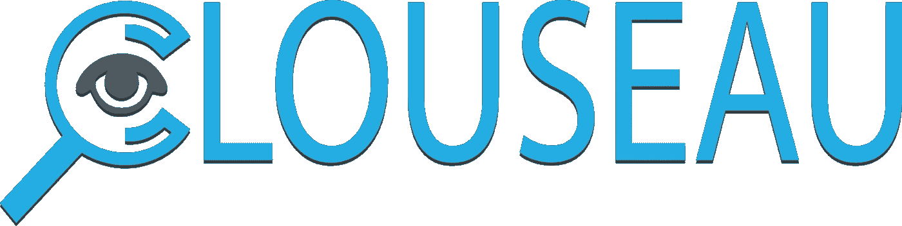

# 克劳修:一个死后的尸体

> 原文：<https://medium.com/hackernoon/clouseau-a-postmortem-ed6192f32ae3>

我是如何在大约 20 个小时内，以不到 1000 美元的代价，审查并放弃一个创业想法的。

The cheesy logo for the project

作为谷歌快速部署实验室的负责人，我帮助指导我们的团队如何影响互联网基础设施的设计、建造和运营的速度和成本。我也是一些初创公司的投资者(例如，通过我的 [drone.vc](http://drone.vc) 和 [neuron.vc](http://neuron.vc) 辛迪加)，我认为周末练习将“快速原型”风格的探索与和我日常工作毫不相关的商业概念结合起来会很有趣。强调一下:下面所有的探索都是在我自己的时间和预算内完成的，不属于任何谷歌探索。

这里的总体想法是，帮助启动一个小企业并让我的一个朋友来经营它会很有趣。即使它永远不会变得巨大，它也有可能通过股息为一个单独的投资者(我)产生有意义的回报。

**问题陈述:**去年夏天，我带着妻子和年幼的儿子去北欧旅行时，令我惊讶的一件事是，即使是更高档的酒店也没有做好让房间变得黑暗的工作。事实上，一些便宜的酒店做得更好。对我来说，如何挑选一家能让我睡个好觉的酒店，或者让我的儿子在中午能睡个好觉的酒店，似乎并不明显。因此，我开始考虑一种数据产品，可以提供客观的第三方服务来测量重要的酒店数据，例如房间内窗帘的“变暗能力”，以了解房间的黑暗程度。在这种事情上，似乎真的没有可信的权威，在提供这种服务的过程中，实际上会产生一种自然垄断。

那么，如果我们可以创建这样一种客观的服务，来衡量一个房间的所有不同属性，从而影响一个人的住宿质量，会怎么样呢？我们甚至可以得到酒店的布局和 3D 模型来预测遮阳和日照。我想，如果你能让不同房产中的各个房间相互竞争，那岂不是很酷？也许在稍微不那么高档的酒店朝北的房间实际上比尼斯酒店遮阴差的朝南的房间更好的整体体验，因为它嘈杂地俯瞰着游泳池？酒店可以适当地将他们的资产货币化*和*可以通过实际投资于那些众所周知能显著改善睡眠质量的因素来提高收入。灌篮！你把整个事情框定为睡眠质量的捍卫者和仲裁者。每个人都知道睡眠有多重要，也喜欢睡眠，这是酒店应该向你推销的大部分体验。我很兴奋。

我决定从测光开始；使用测光表来测量当灯关闭、门关闭但窗帘打开时房间的亮度，然后在窗帘完全拉上的情况下进行第二次测量。这两个数字应该告诉你很多:理想的房间在窗帘打开的白天非常明亮和通风，但在窗帘关闭时却非常黑暗。这在理论上很容易捕捉到，并可能导致后续的数据产品，如淋浴压力，两分钟后设置为最热的水温，互联网质量，空气质量，噪音抑制等。

于是买了三个测光表([dr . Meter LX 1010 bs；18.99 美元](https://www.amazon.com/Dr-Meter-LX1010BS-display-Digital-Illuminance/dp/B004KP8RE2/ref=sr_1_2?s=electronics&ie=UTF8&qid=1469508089&sr=1-2&keywords=Dr.+Meter+LX1010BS)，并开始让我的朋友去测量酒店房间。令人惊讶的是，当他们发现我是在让他们通过对话来看房时，他们中的很多人都退出了。我让我的律师起草了一份简单的 NDA / IP 发布表格，我通过一个 [HelloSign](http://hellosign.com) 模板发送出去，并保存到一个 Google Drive 文件夹中。我用 Google Drive 整理概念，进度电子表格，一切；这可能只是因为我在谷歌的项目中习惯了这样做，但这是一种非常快速的方式来管理与媒体、演示文稿、电子表格等的共享探索。

我还认为为这个项目想出一个聪明的代号会很有趣。由于我们要“检查”酒店房间，我决定“Clouseau”将是一个有趣的项目名称。我注册了 clouseau.co(30 美元；Google Domains)、 [@ClouseauCo](https://twitter.com/clouseauco) 、 [FB/Clouseau.co](https://www.facebook.com/Clouseau.co/) 、【angel.co/clouseau】T4 并得到了一个设计好的俗气的矢量 logo 美元； [Fiverr](http://fiverr.com) 因为嘿，logo！

多亏了亚马逊 Prime 的魔力，测光表第二天就出现了。我在我的卧室里测试了几种不同的测量方法，很快发现它无法区分有点暗和真的暗(所有的都是<1 lux) meant it wasn’t all that helpful. Whoops. So I bought a fancier light meter ([Extech lt 300；$ 124.24](https://www.amazon.com/Extech-LT300-Light-Meter/dp/B000NI69ZY))——这次只有一个——发现我们可以用那个进行有用的亚勒克斯测量。

在这次探险中，我的朋友克里斯·马修斯成了我的合伙人，并接受了挑战，住进了当地各种酒店房间。我们不想撒谎，但我们也不想实际上必须预订很多房间，所以我们使用了一个脚本“我有一个主管，我正在和他一起工作，睡眠质量对他来说很重要，所以我想测量一下你的房间有多暗——你有时间给我看一个可用的房间吗？”效果很好。

我们注意到，fancier 测光表具有在一个时间窗口内测量最低和最高光线测量值的功能，对这些测量值进行平均会产生更加一致的结果，但测量值仍有相当大的变化(尽管变化较小，甚至是百分比方面，测量值较暗)。我的隔壁邻居兼朋友乔纳森为我们安装了一个带光电二极管的小型模拟测光表，以说明作为测量设备什么是可能可测量/可构造的。我们得到了一些水测量设备，但没有发现它们非常一致或可用，它们需要更多的校准才能正常工作。

我授权了一个美国所有酒店的数据库( [$47，美国商业数据](http://www.usbizdata.com/us-hotel-motel-database.php))，同时让一组来自 [Upwork](http://upwork.com) 的远程工作人员整理了一个各县的数据库，包括加州多个县的每个酒店的纬度/长度、名称、地址和星级。一个很大的惊喜是，实际上有这么少的财产；虽然美国有几百万间酒店客房，但只有大约 5 万间不同的酒店！我让四名工作人员每人工作几个小时，收集几个加州县的数据，以判断大概的数据采集成本和质量。我最终为这些收购总共花费了 496.24 美元，或 0.17-0.82 美元/家酒店(取决于员工)。不算太坏。

我们围绕创建一个可以测量我们正在谈论的一些数据的应用程序或手机配件进行了一点头脑风暴——这可以让我们在理论上捕捉到更大范围的数据，比如找出市区凯悦酒店(Hyatt downtown)537 房间的亮度，或者周五晚上酒吧对面一楼的房间有多吵。

但是，在进入下一轮测量和校准之前，我们决定深入研究业务验证方面的内容；许可这些数据会是什么样子？对于想租房子的人来说，这有多可行？我决定直接接触业内人士，分享这个概念。

我打电话给我的表弟，他在继续工作之前已经在希尔顿工作了十年。她向我介绍了酒店早上分配房间的重要性；必须保留某些房间对灵活性和效率是一个巨大的障碍，因为他们很难预测哪些客人会在何时出现，甚至哪些客人会在哪天退房。因此，为特定的客人预订特定的房间对他们来说是一个巨大的麻烦，他们通常只会在真正重要的约束条件下这样做(例如，一个残疾人需要一个残疾人友好型房间)，而不是开玩笑。其他的一切都被记录为客人账户上的“注释”,以帮助指导当天的分配过程。

这是一个相当大的挫折，因为这意味着我们收集的每个房间的数据对旅行者来说实际上是不可行的，因为他们无法预订特定的房间。我们只能对整体物业的质量给出一般性的指导，而不能实现我们的愿景，即把不同物业中的各个房间进行对比。

然后，我与一位曾在该行业工作过的熟人交谈，他创办了一家提供房间级酒店数据的初创公司，他也证实了同样的事情——对于一家酒店来说，即使是像获取楼层平面图这样的琐碎交易，也可能需要长达一年的时间，而且每个房间的提前预订也不太可能实现。(我们注意到 HHonors 应用程序允许会员在他们的移动设备上登记入住时选择房间*，这很简洁。)他还指出了 [TrustYou](http://www.trustyou.com/) ，它汇总了房产评论，并从语义上分析了它们在几个不同类别中的积极性和具体反馈，并将这些反馈提供给许多公司。虽然它不是“100%准确”,但它足以为一个物业提取可操作的见解。可悲的是，增量数据并没有明显产生巨大的转换提升——价格似乎是唯一可以让大量人转向一个房地产而不是另一个的东西。*

因此，即使我们能够直接、客观、有效地测量房间属性，并将其作为一种数据服务提供，它也只能极小程度地影响消费者在一个酒店预订另一个酒店的决定。你可以将数据授权给有限的几家公司:谷歌、Kayak、猫途鹰等。，所以你的潜在市场总规模会非常小。考虑到对转化率的低影响，这些数据的真正价值是值得怀疑的。

那些对话真的让我停顿了；虽然没有人收集和提供数据，但如果它实际上不可行，不能推动决策，也不能促使属性改进，那么它可能是一个寻找问题的解决方案。虽然手动收集美国每处房产中至少一个房间的房间质量数据的成本可能不到 100 万美元，但这可能需要数年时间，而且这项业务也没有足够的吸引力来追求现状。所以我决定在开始后不到两个月就按下暂停键，大概总共花了 20 个小时探索，再加上另外两个小时写这篇文章。

总的来说，我尽量节省时间和成本；利用现有资源、第三方公司、朋友、公共数据和业内人士的反馈，避免在不太可能产生成果的事情上浪费时间。

我很想听听你对这一过程的看法，你是否认为我得出了正确的结论，以及你本可以采取什么不同的做法。我认为公开分享“失败的创业想法”可能有助于让人们了解一个典型的相当不透明的过程，对于那些倾向于试图隐藏早期探索和他们已知的坏想法的人来说。

> 黑客午间是黑客们从下午开始的时间。我们是 [@AMI](http://bit.ly/atAMIatAMI) 家庭的一员。我们现在[接受提交](http://bit.ly/hackernoonsubmission)并乐于[讨论广告&赞助](mailto:partners@amipublications.com)机会。
> 
> 如果你喜欢这个故事，我们建议你读一读我们的[最新科技故事](http://bit.ly/hackernoonlatestt)和[趋势科技故事](https://hackernoon.com/trending)。直到下一次，不要把现实世界视为理所当然！

