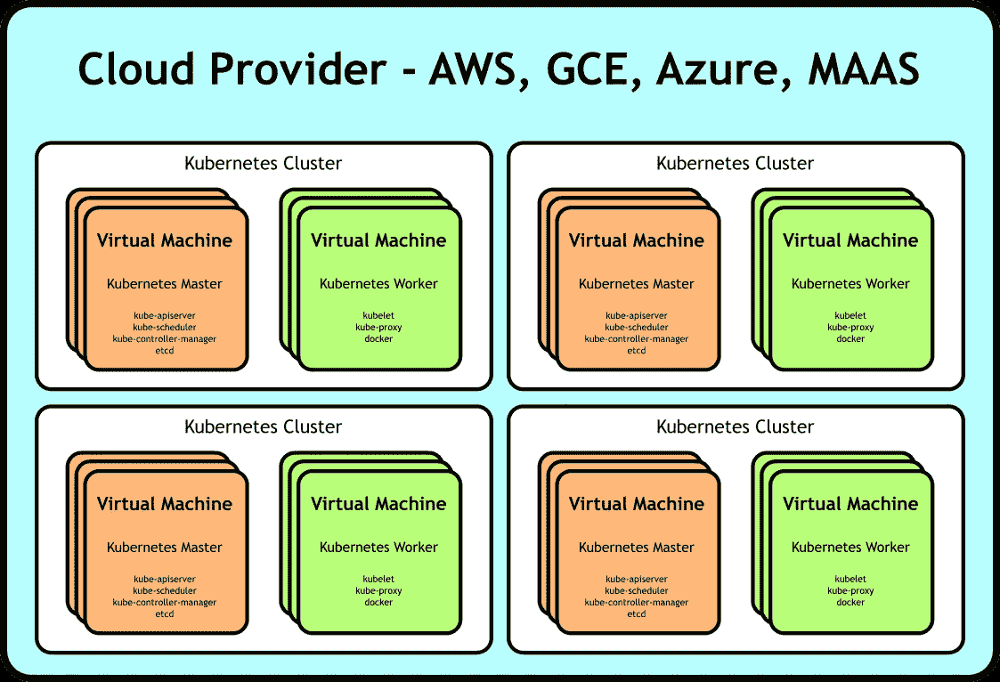
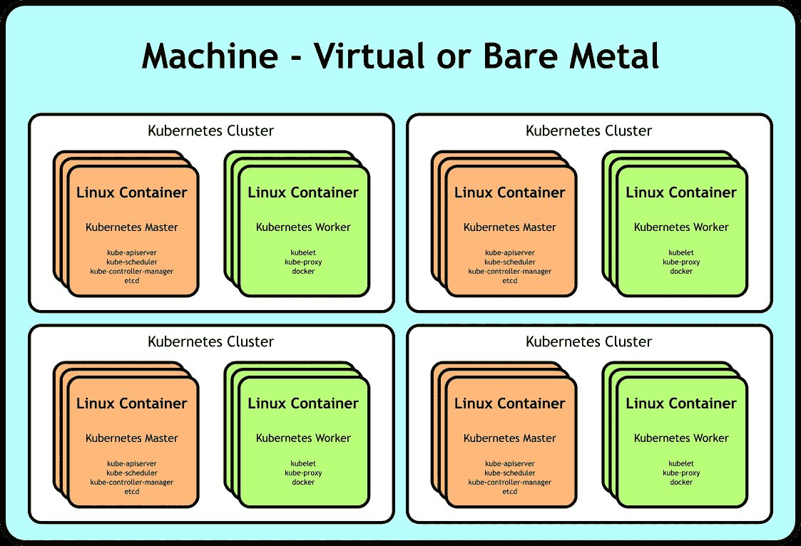
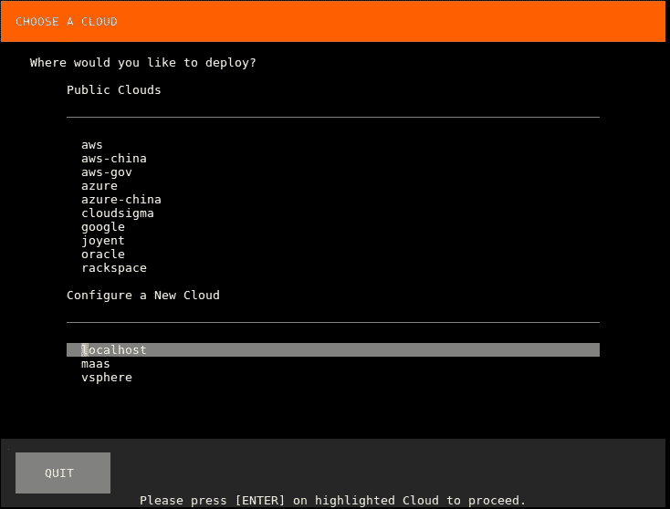
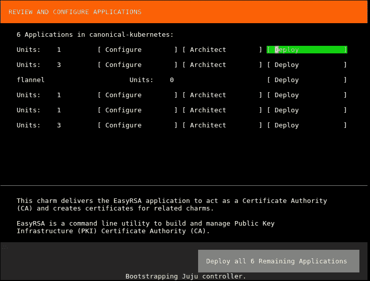
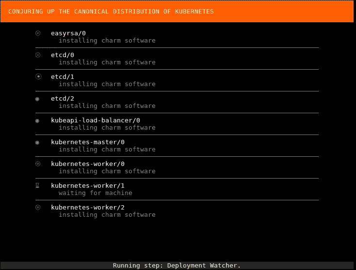
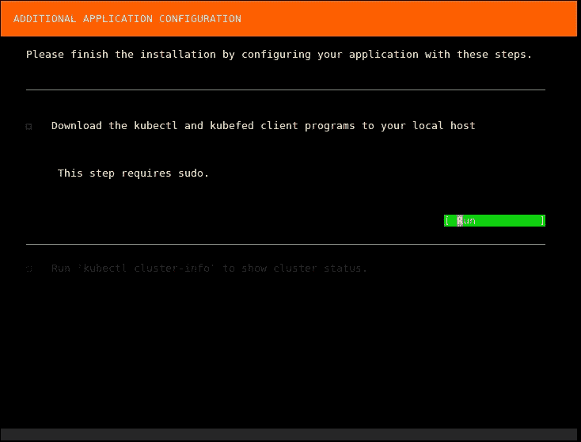

# 集群系统:如何将一个或多个 Kubernetes 集群部署到一个单独的系统中。

> 原文：<https://medium.com/hackernoon/cluster-in-a-box-how-to-deploy-one-or-more-kubernetes-clusters-to-a-single-box-76ff3b8e92d7>

在 Linux 基金会和 Canonical 最近的一次合作中，我们为 CKA 考试[](https://www.cncf.io/certification/expert)**设计了一个架构。为了让考试尽可能地经济实惠，我们需要优化我们的资源利用率——理想情况下，通过在单个虚拟机上运行多个 Kubernetes 集群。我们是这样做的。**

*Kubernetes 开发了一个专门的追随者，因为它允许我们以声明的方式构建高效、健壮的架构。高效是因为它们构建在容器[技术](https://hackernoon.com/tagged/technology)之上，健壮是因为它们是分布式的。*

*虽然我们在 Kubernetes 上构建的应用程序的分布式本质允许它们在可用性方面更加健壮，但具有讽刺意味的是，同样的架构有可能在测试的容易性方面降低应用程序的健壮性。考虑以下通用架构:*

**

*Generic multi-cluster deployment of Kubernetes on top of VMs*

*测试构建在这种部署之上的应用程序至少有两个主要挑战。一个是测试[部署](https://hackernoon.com/tagged/deployment)所需的资源成本。您可能需要许多虚拟机来充分模拟您的应用程序。如果您想要并行化您的测试，您将为每个部署支付该成本。*

*另一个挑战是启动部署所需的时间，我们需要等待虚拟机实例化、可用、调配和联网。任何可以节省的时间都可以用于更多的测试。*

# *我们需要更深入。*

**

*我们通过利用容器技术对抗我们的*流程*，使我们的应用程序更加高效。如果我们可以做同样的事情，但是用它来对抗我们的*机器*会怎么样？如果我们能让我们的部署看起来像这样会怎么样:*

**

*Generic multi-cluster deployment of Kubernetes on top of Linux containers*

*…一个带有多个容器的盒子，充当我们集群的节点。使用这种体系结构，我们可以节省资源，因为虽然我们可能需要一台较大的机器作为主机，但我们不会将资源浪费在许多未充分利用的较小机器上。此外，我们节省了大量时间，无需等待容器被实例化并变得可用——它们几乎与 docker 容器一样即时。也许最令人兴奋的是，我们可以将此部署保存为虚拟机映像，从而极大地降低配置时间成本，并使我们的部署具有可重复性。*

# *我们可以重建他。我们有技术。*

**

*虽然 Kubernetes 使用了容器技术来包装流程，但我们需要一种能够将整个系统容器化的技术。从他们的文档来看，Linux 容器非常适合这一点:*

> *LXC 的目标是创建一个尽可能接近标准 Linux 安装的环境，但不需要一个单独的内核。*

*完美。让我们试一试。*

```
*$ lxc launch ubuntu:16.04 hello-kubernetesCreating hello-kubernetes
Starting hello-kubernetes$ lxc exec hello-kubernetes /bin/bashroot@hello-kubernetes:~# lsb_release -aNo LSB modules are available.
Distributor ID: Ubuntu
Description: Ubuntu 16.04.3 LTS
Release: 16.04
Codename: xenialroot@hello-kubernetes:~# systemctl list-units UNIT                                    LOAD   ACTIVE     SUB       DESCRIPTION
  dev-sda1.device                         loaded activating tentative dev-sda1.device
  -.mount                                 loaded active     mounted   /
  dev-.lxd\x2dmounts.mount                loaded active     mounted   /dev/.lxd-mounts
  dev-full.mount                          loaded active     mounted   /dev/full
  dev-fuse.mount                          loaded active     mounted   /dev/fuse...*
```

*嘣。完整的集装箱系统。*

# *它还活着！*

**

*现在我们知道了如何在我们的主机上创建一个容器化的系统，构建一个 Kubernetes 集群看起来很正常。你可以使用任何你喜欢的工具，但是我在这里将使用[召唤](https://conjure-up.io/)和 [CDK](https://www.ubuntu.com/kubernetes) ，因为它已经知道如何创建 linux 容器并将 kubernetes 部署到这些容器中。*

*让我们开始吧。首先，我们将告诉 dream-up 我们想要部署 Kubernetes:*

```
*$ conjure-up canonical-kubernetes*
```

*这将在终端中打开一个向导，它将首先询问我们希望部署到哪里。我们将选择本地主机:*

**

*接下来单击“部署所有 6 个剩余的应用程序”:*

**

*然后在集群启动时稍等片刻:*

**

*召唤术会帮你抓到库伯菲德和库伯特尔。单击运行:*

**

*就这样，现在有一个 Kubernetes 集群运行在您的虚拟机上的 Linux 容器之上:*

```
*$ kubectl cluster-infoKubernetes master is running at [http://localhost:8080](http://localhost:8080)
Heapster is running at [http://localhost:8080/api/v1/namespaces/kube-system/services/heapster/proxy](http://localhost:8080/api/v1/namespaces/kube-system/services/heapster/proxy)
KubeDNS is running at [http://localhost:8080/api/v1/namespaces/kube-system/services/kube-dns/proxy](http://localhost:8080/api/v1/namespaces/kube-system/services/kube-dns/proxy)
kubernetes-dashboard is running at [http://localhost:8080/api/v1/namespaces/kube-system/services/kubernetes-dashboard/proxy](http://localhost:8080/api/v1/namespaces/kube-system/services/kubernetes-dashboard/proxy)
Grafana is running at [http://localhost:8080/api/v1/namespaces/kube-system/services/monitoring-grafana/proxy](http://localhost:8080/api/v1/namespaces/kube-system/services/monitoring-grafana/proxy)
InfluxDB is running at [http://localhost:8080/api/v1/namespaces/kube-system/services/monitoring-influxdb/proxy](http://localhost:8080/api/v1/namespaces/kube-system/services/monitoring-influxdb/proxy)*
```

# *我们再做一个吧。*

**

*我们也没有理由不能部署多个 Kubernetes 集群。我将在这里继续使用变戏法，因为它使它变得容易，但你可以随意使用你选择的工具。这次让我们以无头模式运行召唤:*

```
*$ conjure-up canonical-kubernetes localhost conjure-up-localhost-642 cluster2[info] Summoning canonical-kubernetes to localhost
[info] Creating Juju model.
[info] Juju model created.
[info] Running step: pre-deploy.
[info] Deploying kubernetes-master...
[info] Deploying flannel...
[info] Deploying kubernetes-worker...
[info] Deploying easyrsa...
[info] Deploying kubeapi-load-balancer...
[info] Deploying etcd...
[info] Exposing kubeapi-load-balancer.
[info] etcd: deployed, installing.
[info] kubeapi-load-balancer: deployed, installing.
[info] easyrsa: deployed, installing.
[info] flannel: deployed, installing.
[info] kubernetes-master: deployed, installing.
[info] Setting relation easyrsa:client <-> etcd:certificates
[info] Exposing kubernetes-worker.
[info] kubernetes-worker: deployed, installing.
[info] Setting relation flannel:cni <-> kubernetes-worker:cni
[info] Setting relation easyrsa:client <-> kubeapi-load-balancer:certificates
[info] Setting relation kubeapi-load-balancer:apiserver <-> kubernetes-master:kube-api-endpoint
[info] Setting relation kubeapi-load-balancer:website <-> kubernetes-worker:kube-api-endpoint
[info] Setting relation flannel:cni <-> kubernetes-master:cni
[info] Setting relation etcd:db <-> flannel:etcd
[info] Setting relation easyrsa:client <-> kubernetes-master:certificates
[info] Setting relation kubernetes-master:kube-control <-> kubernetes-worker:kube-control
[info] Setting relation kubeapi-load-balancer:loadbalancer <-> kubernetes-master:loadbalancer
[info] Setting relation easyrsa:client <-> kubernetes-worker:certificates
[info] Setting relation etcd:db <-> kubernetes-master:etcd
[info] Waiting for deployment to settle.
[info] Running step: 00_deploy-done.
[info] Model settled.
[info] Running post-deployment steps
[info] Running step: step-01_get-kubectl.
[info] Running step: step-02_cluster-info.
[info] Running step: step-03_enable-cni.
[info] Installation of your big software is now complete.
[warning] Shutting down*
```

*这是我们的第二个集群:*

```
*$ kubectl cluster-infoKubernetes master is running at [http://localhost:8080](http://localhost:8080)
Heapster is running at [http://localhost:8080/api/v1/namespaces/kube-system/services/heapster/proxy](http://localhost:8080/api/v1/namespaces/kube-system/services/heapster/proxy)
KubeDNS is running at [http://localhost:8080/api/v1/namespaces/kube-system/services/kube-dns/proxy](http://localhost:8080/api/v1/namespaces/kube-system/services/kube-dns/proxy)
kubernetes-dashboard is running at [http://localhost:8080/api/v1/namespaces/kube-system/services/kubernetes-dashboard/proxy](http://localhost:8080/api/v1/namespaces/kube-system/services/kubernetes-dashboard/proxy)
Grafana is running at [http://localhost:8080/api/v1/namespaces/kube-system/services/monitoring-grafana/proxy](http://localhost:8080/api/v1/namespaces/kube-system/services/monitoring-grafana/proxy)
InfluxDB is running at [http://localhost:8080/api/v1/namespaces/kube-system/services/monitoring-influxdb/proxy](http://localhost:8080/api/v1/namespaces/kube-system/services/monitoring-influxdb/proxy)*
```

# *让它具有可复制性。*

**

> *我被刺伤、枪击、毒死、冷冻、绞死、电死、烧伤。每天早上我醒来时身上没有一点擦伤，挡泥板上也没有一点凹痕。我是神仙。*

*现在我们已经有了一个相当复杂的部署，让我们看看如何快速复制它。首先，我们将创建实例的 AMI:*

```
*$ aws ec2 create-image --instance-id i-02c547825d34d345e --name cluster-in-a-box
ami-5f9eb33a*
```

*然后在下面的代码中启动它和 ssh 的实例:*

```
*$ aws ec2 run-instances --count 1 --image-id ami-5f9eb33a --instance-type t2.xlarge --key-name mykey*
```

*让我们检查一下我们的集群。首先是原始集群:*

```
*$ kubectl cluster-infoKubernetes master is running at [http://localhost:8080](http://localhost:8080)
Heapster is running at [http://localhost:8080/api/v1/namespaces/kube-system/services/heapster/proxy](http://localhost:8080/api/v1/namespaces/kube-system/services/heapster/proxy)
KubeDNS is running at [http://localhost:8080/api/v1/namespaces/kube-system/services/kube-dns/proxy](http://localhost:8080/api/v1/namespaces/kube-system/services/kube-dns/proxy)
kubernetes-dashboard is running at [http://localhost:8080/api/v1/namespaces/kube-system/services/kubernetes-dashboard/proxy](http://localhost:8080/api/v1/namespaces/kube-system/services/kubernetes-dashboard/proxy)
Grafana is running at [http://localhost:8080/api/v1/namespaces/kube-system/services/monitoring-grafana/proxy](http://localhost:8080/api/v1/namespaces/kube-system/services/monitoring-grafana/proxy)
InfluxDB is running at [http://localhost:8080/api/v1/namespaces/kube-system/services/monitoring-influxdb/proxy](http://localhost:8080/api/v1/namespaces/kube-system/services/monitoring-influxdb/proxy)*
```

*我们的第二个集群:*

```
*$ kubectl cluster-infoKubernetes master is running at [http://localhost:8080](http://localhost:8080)
Heapster is running at [http://localhost:8080/api/v1/namespaces/kube-system/services/heapster/proxy](http://localhost:8080/api/v1/namespaces/kube-system/services/heapster/proxy)
KubeDNS is running at [http://localhost:8080/api/v1/namespaces/kube-system/services/kube-dns/proxy](http://localhost:8080/api/v1/namespaces/kube-system/services/kube-dns/proxy)
kubernetes-dashboard is running at [http://localhost:8080/api/v1/namespaces/kube-system/services/kubernetes-dashboard/proxy](http://localhost:8080/api/v1/namespaces/kube-system/services/kubernetes-dashboard/proxy)
Grafana is running at [http://localhost:8080/api/v1/namespaces/kube-system/services/monitoring-grafana/proxy](http://localhost:8080/api/v1/namespaces/kube-system/services/monitoring-grafana/proxy)
InfluxDB is running at [http://localhost:8080/api/v1/namespaces/kube-system/services/monitoring-influxdb/proxy](http://localhost:8080/api/v1/namespaces/kube-system/services/monitoring-influxdb/proxy)*
```

*看起来不错！*

# *结论*

*linux 容器允许我们将完整的 Linux 系统容器化。我们可以利用这一点快速、廉价地部署 Kubernetes 集群——非常适合测试部署，而不会产生不必要的资源和时间开销。*

*你能想到 Kubernetes 盒中集群的其他用途吗？我很想听听这件事——请在下面留言！*

*如果你对此感兴趣， [Marco Ceppi](/@marcoceppi) 和我将[在 Kubecon 2017](https://events.linuxfoundation.org/events/kubecon-and-cloudnativecon-north-america/program/schedule) 上就此发表演讲。希望在那里见到你！*