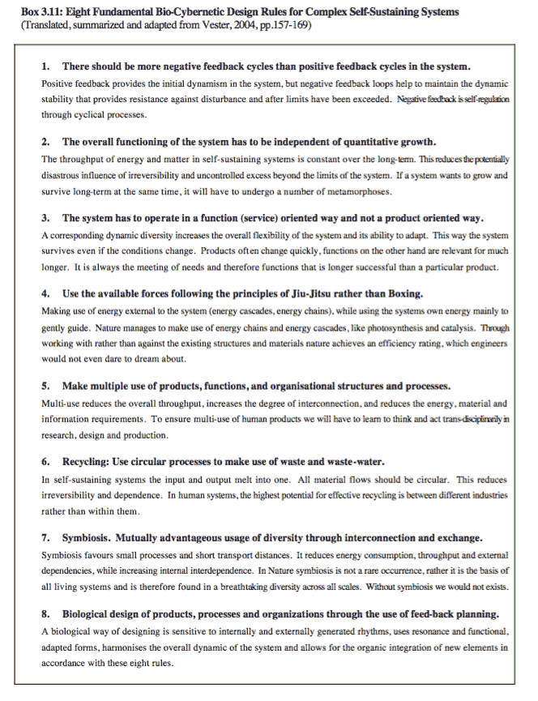
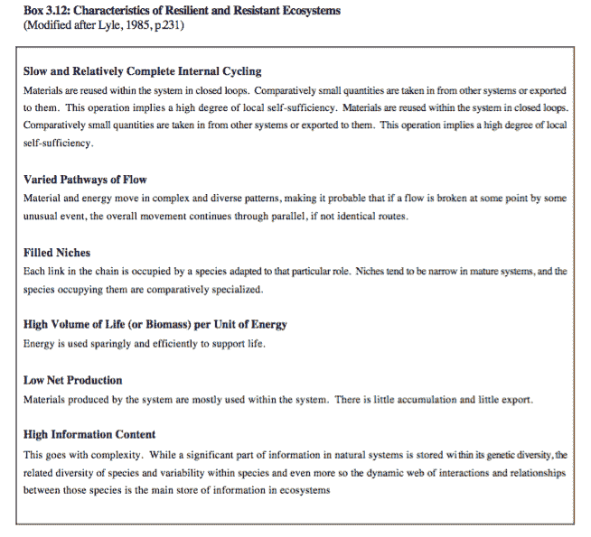
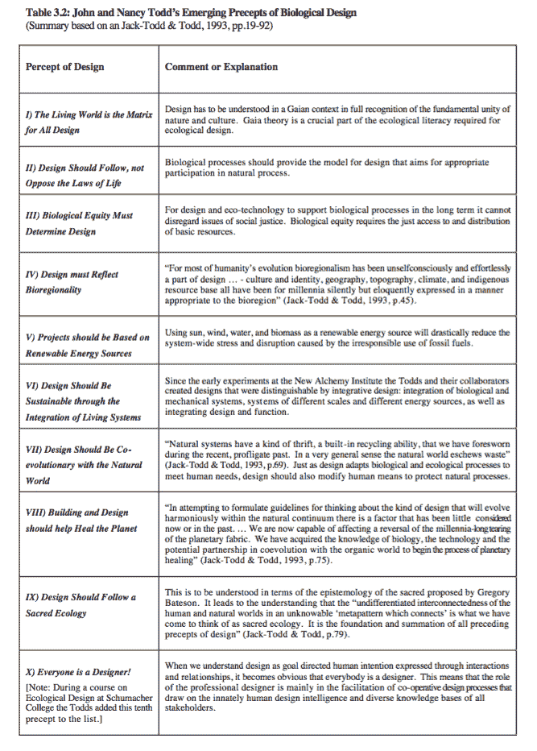
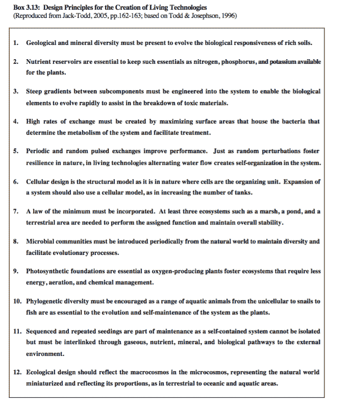
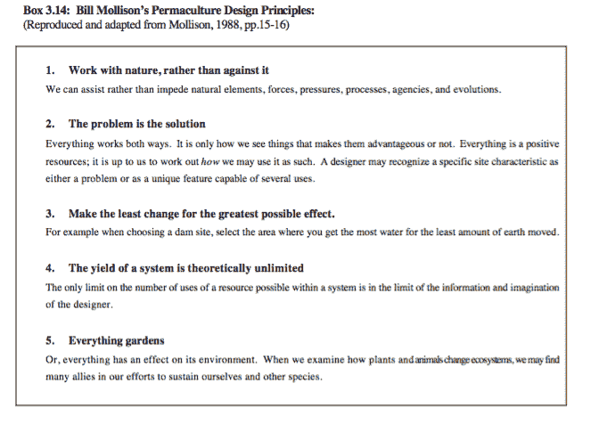
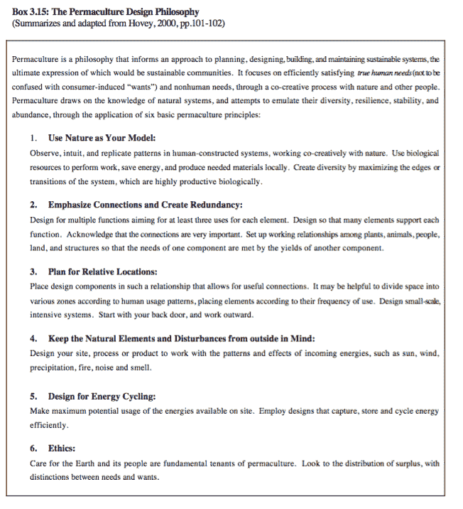
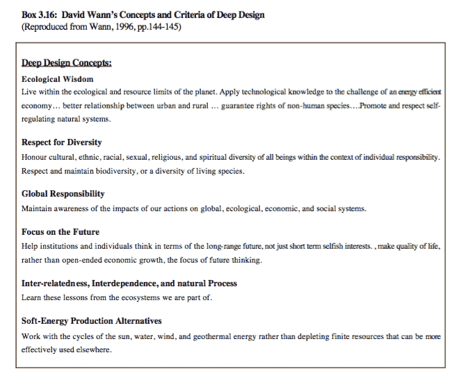
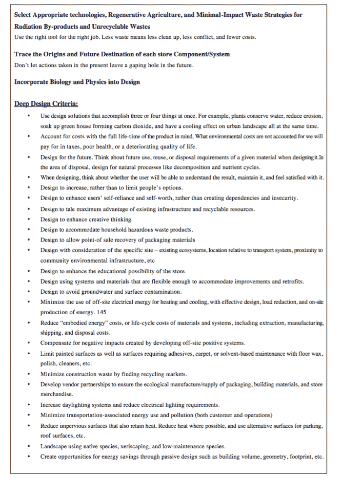
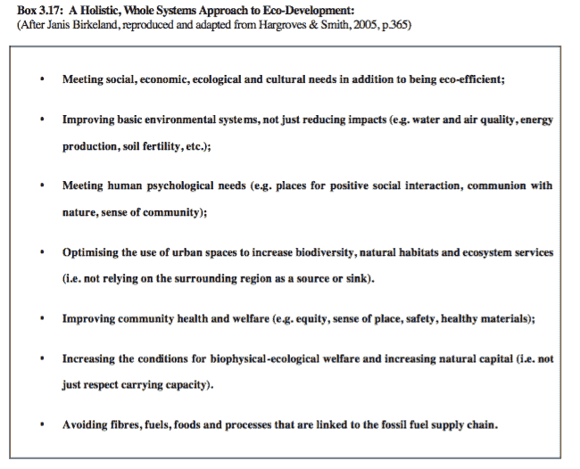
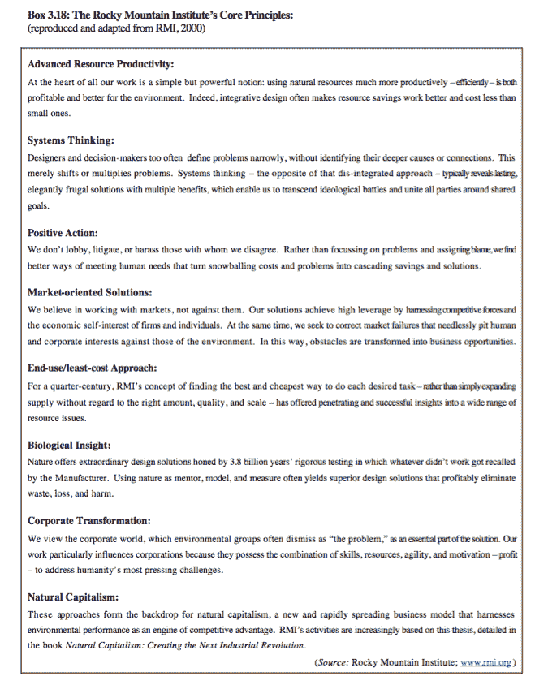

# 合作设计复杂系统

> 原文：<https://medium.com/hackernoon/co-designing-complex-systems-d88a6c554c1d>

## 摘自华盛顿沃尔 2006 年出版的《人类和地球健康设计》

> 来到事物的光里，让自然成为你的老师。
> —威廉·华兹华斯 1770–1850

人类社会和他们所居住的生态系统本身都可以作为复杂的动态系统来研究。在这样做的时候，我们必须意识到，我们已经在我们的方法中引入了高度的理论抽象，因为最终文化和自然从根本上是联系在一起的，并且不断地相互作用。

文化实际上是潜在自然过程的自然附带现象。文化在与自然环境的相互依赖中进化，不管他们是否认为自己独立于自然过程或者是自然过程的表现。自然和文化的分离从来不仅仅是概念上的，但概念分离的元设计可以极大地影响我们的认识论、我们的感知，从而影响我们如何体验现实。

在本文探讨的视角中，所有的文化表达都在包含它们的更广泛的复杂动态系统——自然或自然过程——的背景下被理解和重新评价。这种观点承认，人类只能改变他们居住的环境，同时当地环境的条件会影响在特定生态系统中可能出现的人类文化表达方式。

虽然自然包含文化，但如果我区分这两者，我认为自然和文化通过相互依存的复杂动态共同进化。因此，文化进化可以被视为一个过程，在这个过程中，人类群体根据自然和文化之间的不断反馈，共同设计他们对自然过程的复杂文化表达和适应。我们正在处理一个复杂的动态系统(和过程)中的有意识参与。

[这是我 2006 年**博士论文“为人类和地球健康而设计:复杂性和可持续性的整体/整合方法”的摘录。]**

****

**Stone Circle by Martin Hill ([Source](http://www.thisiscolossal.com/2014/01/ephemeral-environmental-sculptures-evoke-cycles-of-nature/))**

**丹尼尔·奇拉对高协同社会和低协同社会进行了有趣的区分。他认为，旨在增强对自然的控制力的西方“前沿”心态导致了文化和自然过程之间协同作用的日益丧失。Chiras 区分了协同作用的社会和生态层面。**

**生态协同作用最好理解为“人类与自然之间合作的一种措施”(Chiras，1992 年，第 24 页)。相应地，社会协同“仅仅是一个社会中合作的衡量标准。”Chiras 提出:“像我们这样的低协同社会的特点是对资源的激烈冲突，以及对这些资源的低效利用”(Chiras，1992，第 25 页)。他提供了以下例子来描述和区分高协同社会和低协同社会之间的差异。**

> **例如，一个低协同社会以牺牲土壤、鸟类和有益昆虫为代价来种植作物。它破坏了鱼类和野生动物的栖息地，危及我们自己的食物供应。它在河漫滩上建造房屋和办公室。它用单一作物取代了多样的生态系统，而单一作物往往极易受到虫害和疾病的侵害。**
> 
> **相比之下，一个高度协同的社会满足了人们的需求，而没有减少自然的资本。也就是说，它种植作物不会耗尽土壤，也不会毒害野生动物和益虫。它在砍伐树木的同时保护森林，不会用从土地上侵蚀下来的沉积物堵塞附近的河流和湖泊。它设计了与自然和谐相处的社区——而不是在洪泛区。**
> 
> **一个高度协同的社会不仅仅是防止破坏的发生，它还寻求增强自然的方法。也就是说，它收获了地球的利益，但也促进了生态系统的长期健康和福祉(Chiras，1992 年，第 25 页)。**

**Chiras 指出，成熟和相对未受干扰的生态系统的复杂食物网和营养循环可以作为如何设计高度协同作用的天然例子。"数十亿年的进化创造了自然界优雅的协同效应."然而，正如奇拉所强调的那样:“在很短的时间内……人类已经开始瓦解生态协同的结构，代之以一个与自然格格不入、被对有限资源的激烈竞争撕裂的系统。”他认为:“创造可持续性意味着大大提高社会和环境协同作用的水平”，并建议“只有建立一种新的价值体系，尊重极限，为其他物种提供更公平的份额，承认我们在自然秩序中的地位，并支持合作而不是统治”，这才有可能实现(Chiras，1992 年，第 26 页)。**

**在人类社会所处的生态系统的可持续限度内共同设计可持续的人类社会的过程中，重点应该是增加我们所参与的复杂自然过程的所有尺度之间的协同作用。**

**杰西卡·利普纳克(Jessica Lipnack)和杰弗里·斯坦普斯(Jeffrey Stamps)在他们的资料丰富的书《网络时代——21 世纪的组织原则》中强调了意识到这一点的重要性，即根据我们是否将设计思维集中在结构或流程上，我们将基于层级或基于这些层级之间和内部的动态关系(全息档案)进行概念化。他们写道:“层次和补充:哪里有系统结构，哪里就有层次结构。哪里有系统过程，哪里就有互补关系”(Lipnack & Stamps，1994 年，第 229 页)。当我们概念化和描述复杂动态系统的协同设计时，这是一个重要的区别。**

**Frederic Vester 教授提出，自然系统及其经济可以根据一些生物控制论原理得到最好的理解。根据 Vester 的说法，这些原则有助于解释数百万年来大自然如何设法保持自我调节和自我繁殖的过程。在生命进化的过程中，进化出越来越复杂的生命形式和越来越复杂的相互作用和关系的系统和子系统。然而，在很长一段时间里，地球上的总生物量似乎相对稳定。据估计，地球上大约有 20 亿吨生物质(Vester，2004 年，第 118 页)。**

**尽管生物量的总体增长接近于零，但大自然转化了数千亿吨的氧气和碳水化合物，以及数十亿吨的重金属和轻金属，如铁、钒、钴、镁、钠、钾和钙。这主要以广泛的方式发生，但有时也密集地、高密度地和在非常小的空间内发生。通常，自然界的生产系统是分散的，通常是采用最精密技术的小型生产单位(Vester，2004 年，第 118 页)。**

**Vester 教授认为，可持续设计的生物控制论方法将考虑到自然的基本相互联系，并将认识到人类和我们创造的所有技术都依赖于自然，是自然的一部分。他认为有必要将我们的技术重新连接到他们存在的这个基础上，并使他们与之一致。有生命的自然，而不是没有技术的死物质，创造了所有的人类制品。“自然和技术并不像许多人认为的那样是两个独立的世界，自然本身和我们自己的有机体都使用复杂的技术”(transl。Vester，2004 年，第 122 页)。**

**根据 Vester 教授的说法，人类迄今为止一直依赖于——往往是无意识的——模仿自然结构和功能，并假设人类技术不会危及整个系统——生物圈——的整体健康。**

**虽然我们从自然的功能和结构中学到了东西，但我们忽略了对自然作为一个复杂的动态系统的动态相互作用和关系的足够重视，这指导了自然使用技术的方式。Vester 强调:“为了实现与生物圈的长期可持续融合，我们必须向大自然学习如何创造结构和功能，以及从她的生物控制论组织原则和过程中学习”(transl。Vester，2004 年，第 122-123 页)。维斯特写道:**

> **作为一名受过科学训练的系统分析师，在深入研究了生命世界的控制论结构及其巧妙的仿生组织原则和过程之后，我敢说，我们并没有处于技术和经济创新时代的末期，而是处于其开端。有一个条件:我们必须学会放弃自工业时代开始以来我们用来衡量经济繁荣的进步标准。Vester，2004 年，第 123 页)**

**弗雷德里克·维斯特(Frederick Vester)提出了生物控制论组织的八条基本规则。他经常强调，在处理复杂系统时，最重要的目标是维护整个生命支持系统，使该系统能够继续其自身的维护。因此，Vester 显然是健康设计方法的另一个支持者(见第二章)。他认为，为了保持系统的生存能力，必须遵循这八条规则。结合一种联合的思维方式，这些将帮助人类至少在我们的规划中避免严重的错误。**

**Vester 教授在 25 年前为联合国教科文组织的一个研究项目中首次提出了这些生物控制论设计规则。他强调，它们不是发明出来的，而是他从自然中学会的，它们不会告诉你如何不去做，而是它们既是创新的指南，也是对适当系统设计的挑战。下面的方框总结了自持系统的生物控制论组织的这八条规则(见方框 3.11)。**

****

**Vester 认为，我们必须让每一件产品、每一项功能和每一个组织都为我们人类的生存能力做出贡献，而不是继续创造让我们变得贫穷并可能导致我们过早灭绝的东西。我们必须设计出与人类生物学和自然相容的东西，这些东西必须符合自我维持、自我生成过程或系统的结构。**

**维斯特强调，这是一种生态、心理和经济需求。对生物设计的坚持不应孤立于规划和实现阶段，而应与当地环境中的自然过程不断反馈(Vester，2004 年，第 170 页)。**

**复杂系统的协同设计不是一个终点，而是一个连续的过程。由于自然——包含系统——正在经历不断的变化，我们为应对自然条件而设计的适应措施也必须足够灵活，以便能够适应短期和长期的变化。**

**根据 Vester 的说法，八个生物控制论规则适用于所有的生命系统，从微小的单细胞到区域性的生态系统。这种普遍适用性的原因是，所有复杂的自然系统都是同一高阶的纠缠部分，因此有着共同的模式，这种模式在所有数量级上重复出现。**

**Vester 指出，这种洞察力先于混沌理论的确证。他认为这些生物控制论设计规则普遍适用于整个生态圈，因此它们也适用于技术圈和人类创造的所有系统:公司、社区、交通和能源系统，以及政治和教育系统(Vester，2004，第 172 页)。**

**Vester 教授认为“与自然合作——而不是与她作对——总是更经济明智的策略，从长远来看，它总是会产生更少的财务成本”(trans。Vester，2004 年，第 172 页)。作为瑞士圣加伦大学的经济学客座教授和国际顾问，Frederic Vester 在许多公司和机构中推广使用了这八个生物控制论设计规则。这些都包括在他给罗马俱乐部的报告中，他自 1993 年以来就是该俱乐部的成员。**

**Frederick Vester 对我们理解复杂系统的协同设计、他开发的建模软件以及他参与的许多实际设计项目的贡献将继续影响新兴的自然设计运动。像格雷戈里·贝特森和多内拉·梅多斯一样，弗雷德里克·维斯特一直致力于提高我们在复杂的自然系统动力学中的参与意识。**

**将文化融入生态系统的动态需要我们参与人类生态系统的设计。景观建筑师和生态设计教育家约翰·蒂尔曼·莱尔提出，在人类生态系统的设计中，我们必须特别小心地模仿一些支持自然生态系统动态稳定性的特征，我们的人类设计必须适应这些特征，同时我们也在适应人类的参与。**

**莱尔指出，这种动态稳定，也可以理解为生态系统的健康，有两个重要因素:抵抗力和恢复力。抵抗力是关于生态系统抵抗破坏性影响的能力；恢复力是指生态系统从扰乱物质和能量流动以及系统内部关系的扰动中恢复的能力。莱尔的工作是新兴的有益健康的设计方法的又一个例子，在自然设计运动的成员中很常见。**

**为了设计合适的人类生态系统，我们必须保持系统的动态稳定或健康。莱尔在先驱生态学家尤金·奥德姆的工作中列出了稳定生态系统的六个特征。虽然它们主要是指生态系统的动态，但 Lyle 认为它们可以作为人类生态系统在共同适应自然过程中的设计指导原则(见框注 3.12)。**

****

**以这样一种方式有效地共同设计我们的人类系统，使它们融入生态系统的复杂动态，这一任务将要求设计者密切关注健康生态系统的这些特征。**

**John Todd 和 Nancy Jack-Todd (1993)提出的生态或生物设计的九条规则是文化和自然作为一个适当整合的复杂动态系统的创造性共同设计的另一套有价值的准则。此后，他们增加了第十条规则，见下表(见表 3.2)。**

****

**这份设计规则清单构成了生态设计和自然设计的宣言**

**运动。在这篇论文的过程中，所有的戒律已经或将要被详细地探讨。约翰·托德(John Todd)在生态围隔设计方面的工作——生活机器或生态机器——是一个实用的按比例缩小的模拟过程，即当我们试图创造适当的人类生态系统并在其中创造适当的参与模式时，与我们所从事的自然复杂系统共同设计的过程。**

> **与生活世界一起工作并从可辨别的模式中得到提示的困难在于，一个人对其存在的感知是迂回、重叠而又不完整的。流程、结构和功能交织在一起；所有的东西都被回收以获得新生。一切都是运动。一切都在变化。也不是所有的事情都是完全可以预测的(Jack-Todd & Todd，1993 年，第 75 页)。**

**根据生命机器和各种其他生命技术的发明者约翰·托德的说法，描述这些技术所基于的生态设计科学的最佳方式是解释所有的生命机器或生态机器都将阳光作为其主要能源。它们是主要由光合作用驱动的技术。**

**生态机器就像是微型的、封闭的生态系统(中介宇宙)。它们的大部分零件不是机械齿轮和螺栓，而是成千上万个活的有机体。在大多数生态机器中，这些有机体生活在一系列相连的水箱中，形成一种人工河流。这些有机体的生物生产力究竟是如何发挥作用的，取决于特定系统的设计和社会的需要。设计师和生态工程师将各种不同的子生态系统连接起来，并为它们播种各种不同的物种和矿物质，他们可以针对特定用途优化自己的表现，但他们是按照大自然的指示来做的。**

> **活体机器是由各种类型的活体生物体组成的设备，通常容纳在由极轻材料制成的外壳或结构中。像传统的机器一样，它由具有独立功能的相互关联的部件组成，用于执行某些类型的工作。这种机器可以设计成生产燃料或食物、处理废物、净化空气、调节气候，甚至可以同时完成所有这些任务。它们是根据自然界同样的原理设计的，用来建造和管理森林、湖泊、草原或河口的生态。像地球一样，它们也有水文和矿物循环。然而，它们是全新的封闭环境。约翰·托德(摘自《杰克·托德》，2005 年，第 168 页)。**

**约翰的意图一直是更多地了解他在自然界中遇到的设计规则和方法。他和他在新炼金术研究所和海洋方舟国际公司的同事们一起，将他们通过研究和探索自然生态系统收集的指令和信息用于生物技术——复杂的动态系统——的设计中。生态机器有多种用途。最近，人们探索了它们以生态工业园的形式将各种工业过程相互连接成共生网络的潜力(见关于工业生态学的第 4 章)。**

**生态机器包含了各种各样的生物成分。这种多样性使这些微型生态系统非常灵活，并赋予它们自然生态系统固有的自我设计能力。生态机器是第一章中讨论的许多科学见解的实际应用。生态机器所展示的自我设计、进化和适应的能力，可以被理解为复杂和动态互连系统的一种突现特性。**

**生态机器的所有不同的生命组成部分都相互作用，通过食物网和营养循环联系在一起，通过应用系统方法和生物控制论原理，可以可视化和更好地理解，这些原理涉及正反馈回路中的多重非线性相互作用。**

**阳光、温度、可利用的营养物或能量的形式和质量的变化，在整个系统中产生一连串的反应。以纯粹的还原论和分析方法来理解和处理这种复杂的相互作用和关系，将无法理解它们的动态。活的技术拥抱自然过程的不可预测性和不可控制性，并与自然一起工作，而不是旨在严格控制系统。**

**生态系统自我设计的能力在很大程度上是基于生物的多样性及其相互之间的关系以及该生态系统的特定环境条件。一个系统的多样性和丰富的互联性越强，它就越容易响应和适应变化。这反过来又会增加系统的自然恢复能力及其整体健康状况。**

**生态机器有能力适应环境的变化并随着环境的变化而发展。这意味着它们可能会存在很长一段时间。通过对设计设置的一些改变，也有可能改变人类在有生之年对生态机器的使用。例如，将用于综合园艺和水产养殖的生态机器转换为处理废水的生态机器相对容易。**

**活的技术利用自然自身的创造力。正如复杂性科学的见解所表明的，任何接近混沌边缘的系统都有高度创造性的潜力。换句话说，经历了内部和外部变化、失去了旧的结构、互动过程和内部秩序的系统，同时在适应这些变化方面受到的限制更少，也更灵活。通常正是在这个混乱的阶段，一些新的和创造性的东西出现，作为对整体变化的适应性反应。**

**约翰·托德解释说，在他所有关于生物技术的工作中，他经常被提醒，他所创造的微型生态系统比他所能了解的要多得多。他的目标总是仔细引导这些系统的自我设计，而不是强迫或控制它们。他认为他的工作是与自然的合作和欢乐。**

**在最好的情况下，生态技术利用了自然界固有的智慧。如果我们设法获得大自然的智慧，我们将能够创造出与周围环境生态契合的设计，最终这些设计将不再看起来像是人造的，因为它们完美地融入了自然过程。一旦人类的健康从根本上取决于我们所居住的生态系统和生物圈的健康这一意识在所有文化中传播开来，我们就可以开始创造真正的自然设计。**

**作为自然界更广泛的过程和循环的参与者，在生命的持续进化中，我们都是大自然的设计。一旦自然被理解为包含和滋养文化，一个人就开始理解万物是如何从根本上是自然的。然而，我们创造的人工设计参与并影响了自然过程。它们这样做可能是有益的，也可能是有益的——因此是恰当的——或者它们可能会损害和破坏生态系统和生物圈中的生命支持系统——因此是不恰当和不可持续的参与。生物技术旨在适当参与自然过程！**

**事实是，我们对自然和人工的区分令人费解。最好区分那些以良性甚至有益的方式融入生命和环境共同进化的事物，以及那些通过破坏自然循环、通过降低最终养育我们的自然系统的健康程度而降低人类健康的事物。**

**约翰·托德创造的生态设计肯定属于前一类。基于对生态过程和相互作用的深刻理解，生物技术旨在提供满足人类需求的解决方案，同时以适当的方式融入其直接和全球环境的自然循环中。**

**到目前为止，我对有生命的机器的描述主要是基于约翰·托德和贝丝·约瑟夫森在《生态工程杂志》上发表的一篇极具启发性的论文。本文详细阐述了生态机械的各种设计原则。他们确定了应该成为活技术设计一部分的 12 个重要组成部分(Todd & Josephson，1996)。南希·杰克-托德(Nancy Jack-Todd)最近以不太详细和技术性的方式总结了这些原则，并转载于下文方框(见方框 3.13)。**

****

**约翰·托德开发的生活技术对自然设计运动具有极高的教育价值。作为一个大尺度的类比，对生命机器及其设计原则的研究可以用来向设计者介绍关于大尺度生态系统中健康和复原力动态的重要见解。**

**生态机器提供了体验生态学习的机会，所有设计师都可以从中受益。参与到它们的设计或维护中来，将会得到有生态素养的理解的回报，这使得自然的复杂性变得更容易理解。约翰·托德(John Todd)解释了它们所传达的见解及其广泛应用的巨大潜力:**

> **[生态机器]从根本上不同于传统机器或生物技术。从本质上说，它们代表了森林或湖泊应用于人类目的的智慧。像森林或湖泊一样，它们的主要能源是太阳。像自然生态系统一样，它们有自我设计的能力。它们依靠生物多样性进行自我修复和保护，并提高整个系统的效率。它们的新陈代谢包括生命形式的独立质量，如复制、摄食和废物排泄，与气体、矿物质和营养交换等相互依赖的功能保持动态平衡。**
> 
> **这种生态引擎对二十一世纪的潜在贡献是不可思议的。它们在制造中只需要使用一次化石燃料。它们将废物重新整合到更大的系统中，分解有毒物质，或者在金属的情况下，将它们锁定在长周期中。它们有潜力全年帮助养活人们，尤其是在城市地区。**
> 
> **这些生活技术的广泛应用可以将自然系统从束缚中解放出来。通过缩小基本人类服务的足迹，他们将让大自然回归自然，并允许大片荒野的恢复。**
> 
> **—约翰·托德(载于杰克·托德，2005 年，第 168 页)。**

**另一种复杂系统协同设计的重要方法是永久栽培设计方法，这种方法在学术讨论中很大程度上被忽略了。比尔·莫里森和大卫·霍尔姆格伦在 20 世纪 70 年代初首次开发了这种设计方法，致力于他们所谓的跨学科地球科学。它经常被误解为简单的有机农业方法，但是永久农业远不止这些。这是另一个整体导向的参与式设计系统，旨在满足人类需求，同时适当融入自然过程。因此，永久栽培运动可以被描述为新兴自然设计运动的另一种表现形式。它的潜在意图显然是有益健康的。其目的是将人类可持续性纳入生物圈的生命支持系统。**

**虽然直到最近永久文化还完全被高等教育机构所忽视，但该运动本身已经建立了一个极其有效的课程体系和连续的培训步骤，这使它在过去三十年中创建了一个巨大的国际网络。**

**不仅在大多数大洲的许多国家都有永久性农业网络，而且在地球上的许多生物区域都有当地活跃的永久性农业团体。因此，永久农业网络本身遵循合作的、自下而上的、网络中的网络的自然设计原则。比尔·莫里森提出的基础永久文化设计课程为 140 小时，涵盖了广泛的设计主题。莫里森解释道:**

> **永久农业……是有意识地设计和维护农业生产生态系统，它具有自然生态系统的多样性、稳定性和弹性。它是景观与人类的和谐融合，以可持续的方式提供食物、能源、住所以及其他物质和非物质需求。没有永久农业，就不可能有稳定的社会秩序。**
> 
> **永久文化设计是一个将概念、材料和战略组成部分组装成一个模式的系统，其功能是造福于各种形式的生活。永久农业背后的哲学是与自然合作，而不是对抗自然；持久和深思熟虑的观察，而不是持久和轻率的行动；着眼于系统的所有功能，而不是只问一个产量；以及允许系统展示它们自己的进化(Mollison，1988，第九页)**

**Permaculture 是一个非常详细的设计系统，它从世界各地的草根和基于行动主义的研究项目中获益匪浅。尽管它最初是为澳大利亚的气候开发的，但现在在不同的气候带和生态系统中有深刻的出版物和有指导意义的实际项目。永久文化建立在“合作原则”的基础上它认为:“合作，而不是竞争，是现存生命系统和未来生存的基础”(Mollison，1988 年，第 2 页)。**

**莫里森认为:“有益权威的作用是把功能和责任还给生活，还给人；如果成功，不需要进一步授权。成功设计的作用是创造一个自我管理的系统”(Mollison，1988，第 11 页)。这清楚地反映出，永久文化的目的不是预测和控制系统，而是希望在所有规模上促进健康的自我管理的出现。**

**莫利森指出:“在混乱中蕴藏着无与伦比的机会来强加创造性的秩序”(莫利森，1988 年，第 12 页)。Permaculture 是一种参与式的方法，通过反复试验，进行细致入微的观察和谦逊的参与。它与不确定性和不可预测性一起工作，而不是与之对抗。这显然是一个合作设计复杂系统的合适系统。Mollison 提出的一些永久栽培的基本原则总结在下面的方框中(见方框 3.14)。**

****

**在复杂的人类生态系统的共同设计中，这些永久性的设计原则是有用的建议。Bill Mollision 的经典著作《永久栽培——设计者手册》仍然是一个非常有用和信息丰富的文本，既是对永久栽培的深入介绍，也是创建综合人类生态系统或多产永久栽培景观的实用设计手册(见 Mollision，1988)。**

**各种各样的人都发表过关于永久植物设计的文章。我将避免在这里进行广泛的文献综述。还有各种各样的永久文化设计原则，我将只提到其中的几个，以证实这样一个事实，即永久文化现在是一个健康和多样化的运动，它有一个以上的基本原则，而不是盲目地遵循一些创始人-大师的指示。Jill Hovey 对永久文化设计积极分子的设计哲学进行了深刻而简明的描述(见方框 3.15)。**

****

**这些设计原则再次重申了贯穿本文所讨论的不同设计方法的许多共同主题。尽管自然设计运动的不同贡献者提出的各种原则之间有很大程度的重叠，我还是选择重复这些原则，以表明可持续设计的共同主题已经出现。**

**在自然科学中，当不同组独立操作的研究人员重复相同的实验并得到相似或相同的结果时，它被认为是支持工作假说的确证。虽然我们在自然和可持续设计中处理的相关主题领域的复杂性要求我们超越传统的科学方法，但令人欣慰的是，有一个共同的主题正在出现，表明如何设计以适当参与自然过程。**

**也许生态学研究给人类上的最重要的一课就是事物是整体运作的。一个生态系统的特征不能通过累加其各部分的特征来预测。这是一个完整的系统，其中所有部分相互作用，形成一个复杂的整体。事实上，已经变得很清楚的是，地球本身以一种非常相似的方式工作，所有不同的组成部分以一种维持适合生命的条件的方式相互作用(Whitefield，2004，第 35 页)**

**帕特里克·怀特菲尔德(Patrick Whitefield)是英国最受尊敬和最有经验的永久农业设计方法的实践者和教师之一，他最近出版了一本关于温带地区永久农业的详尽而全面的手册，名为《地球护理手册》。可持续设计的基本目标必须是将人类活动和我们满足需求的方式整合到整个互动过程中，称为生物圈、地球或盖亚。**

**可持续发展是指以一种我们维护和支持适合生命的条件的方式参与其中。怀特菲尔德认为:“我们有一个机会之窗。我们有机会改变我们的吃穿住行方式，使之既高产又可持续。未来可以永久丰富”(Whitefield，2004，第 37 页)。**

**全球生态村运动，我将在第四章更详细地描述，已经在世界各地的有意可持续人类社区的设计中最成功地采用了永久农业设计方法。**

**瑞士工程师马克斯·林德格(Max Lindegger)在澳大利亚创建“水晶水永久农业村”中发挥了重要作用，这是永久农业如何在社区范围内成功应用的一个有效的活生生的例子。他的国际设计咨询公司“生态解决方案”为世界各地有抱负的生态村社区提供了必要的技能和基于社区的方法，以可持续地将他们的定居点融入他们当地栖息地的独特条件。Lindegger 描述了永久农业在生态村设计中的应用，如下所示:**

> **人们可以称之为整体设计。每一个元素都应该有被包含的理由，并且被很好地和彻底地考虑。最终，元素之间的联系将决定设计的成败……一个精心设计的设计肯定会避免严重的错误，但它不能保证即时的快乐、精神启迪或持续的财富。然而，已经安全地迈出了第一步，下一步可能会稍微容易一点……为了财富、健康和幸福(Lindegger，2002 年，第 23 页)。**

**在这篇论文的开始，我将设计广义地定义为通过交互和关系表达的意向性。新兴自然设计运动的所有成员所共有的可持续设计方法，是试图更加了解和意识到我们必须考虑的所有相互作用的因素，以便创造和参与健康和可持续的复杂系统。正如 Lindegger 所强调的，最终是元素之间的联系决定了设计的成败。在一个从根本上相互联系的世界中，如果我们希望从事有益健康的设计，就要考虑许多这样的联系。**

**不可否认，对于作为意义的明智的共同设计者和解释者(智人设计者)的人类来说，这是一个复杂的挑战，但如果我们考虑一下利害攸关的是什么——人类的未来和宇宙意识的持续进化——有没有一个更有意义和更恰当的挑战值得我们用生命去应对？**

**然而，我想再次强调，共同设计健康的复杂动态系统的主题不可能在一章或一册书中穷尽。在一个健康的星球上创造一个健康和可持续的人类文明的挑战永远没有终点。**

**自然系统处于持续和间歇的变化过程中，因此学习如何将人类可持续地融入这一过程的过程将永远不会停止。本论文希望提供一个健康的、可持续的、适当参与自然过程的设计框架。它是一个集体的、基于社区和地方的参与性学习过程的框架，而不是如何共同设计复杂系统的明确解决方案的列表。**

> **最好的与自然兼容的新设计——无论是产品、建筑、技术还是社区——对它们所接触的生命系统都很敏感，完成它们的使命而没有污染、侵蚀、拥堵和压力等不良副作用。**
> 
> **这些“深度”设计增加了选择、灵活性、文化平等和个人权力。…肤浅的设计是匿名的、普通的，除了物质上的满足感之外，什么都不能提供，而深层的设计则体现了工艺和质量，以获得持久的满足感。深度设计承认生物和文化健康以及物质财富(Wann，1996 年，第十三至十四页)。**

**在《深度设计——通向宜居未来之路》一书中，大卫·万对协同设计复杂系统的挑战做出了回应。“我们为地球所做的，都是为了我们自己。这是深度设计的整体实用主义，是经济学、物理学、生物学和伦理学的融合”(Wann，1996，第 22 页)。他预测了自然设计运动的未来发展，认为“当我们进入新千年时，我们对自然如何工作的理解的突破将在生物学、化学和物理学以及社会学和经济学之间形成革命性的新联盟，设计是关键的催化剂”(Wann，1996 年，第 21 页)。他解释道:**

> **深度设计是明智的设计，但它是一种超越信息的信念到想象和直觉的飞跃。它可能被认为是一种催化剂，将幻想转化为有用的东西，或者是引力，将未经尝试的概念拉回到现实。深度设计之所以有效，是因为它们适合，也就是说，它们有助于社会和生物圈的利益。一个类比是自然设计(Wann，1996 年，第 32 页)。**

**将精神带入形式，有意识和负责任地参与自然过程的物质和非物质层面，设想可实现的乌托邦并将其变为现实，这是深度设计和自然设计运动的承诺。最终，可持续设计是人类的共同创造机构，充分意识到我们与周围世界的根本统一——自觉和负责任地参与统一！**

****

**内容**

****

**虽然这个深层设计的概念和标准的列表(见 3.16)还远未完成，但它仍然是可持续设计的具体细节的适当预览，自然设计运动必须关注这些细节，以创建健康和可持续的人类社区和社会。Wann 列出的深度设计的概念和标准几乎都将在下面的章节中重新讨论，因为我们将从理论和情境化领域转移到可持续设计运作的各种规模的实践导向描述。**

**自然设计运动中包含的许多方法都倾向于关注特定的规模。在国家和国际自然设计能力网络的形成过程中，自然设计运动越来越意识到自己，其中一个伟大的承诺是，我们将更有能力创造规模连接的协同作用，这将加强整个系统的健康。**

**Janis Birkeland 指出，“生态设计作为一种解决社会和环境问题的方法，处理复杂的开放系统，因此指定一套固定的解决方案是不合适的。”她看到了负责任的设计师在发明“改善人类体验生活质量的新系统，同时恢复环境、重建社区和创造场所感”中的作用。**

**哈格罗夫和史密斯最近强调:“设计实践改革是关于确保‘绿色思维’是整个设计过程的焦点，需要协作和相互激励来推动团队达到新的成就水平”(2005，第 364 页)。他们在下面的方框中总结了伯克兰合作设计复杂系统的整体方法(见方框 3.17)。**

****

**由 Amory 和 Hunter Lovins 于 1982 年成立的洛基山研究所一直是实现更可持续未来的重要助产士。他们的方法总是意识到包含我们所有设计的复杂系统中的基本相互联系。它在生态或自然设计解决方案方面的工作已经影响了许多国家的政府政策和产业。**

**落基山研究所(RMI)是“一个创业型非营利组织，它促进资源的有效恢复性利用，以创造一个更加安全、繁荣和可持续发展的世界”(RMI，2000)。我强调，我认为本文中提到的所有设计方法和个人贡献者都属于自然设计运动，让我以落基山研究所核心原则的总结来结束这一章(框 3.18)。**

****

**新兴运动的标签是自然、整体、生态、整体还是有益健康的设计，最终并不重要。重要的是，我们开始从更全面的角度认识到设计和规划的潜在好处，并开始适当地参与自然过程。要做到这一点，我们必须在时间和空间尺度上整合和联系设计、规划和决策。**

> **在地球生物圈的历史上，一千年只是一瞬间。在不到一千年的时间里，人类已经将生物圈——生命、生存空间、生活质量、生物多样性和国家经济所必需的产品的给予者——带到了危机点。生物圈现在给了我们许多信号，表明它受到了极大的压力；它正在努力应对自然资源枯竭、臭氧枯竭、酸雨、生态系统丧失、空气污染、陆地河流海洋。然而，我们的未来取决于此。**
> 
> **关于地球面临的创伤已经写了很多。生物多样性已经丧失，不仅仅是基因和物种，还有支持健康生活社区(包括人类社区)所必需的生态系统和功能过程——依赖生产性农业、商品、服务和贸易的社会系统。人们也开始了解，或至少认识到，这些相互关联和相互作用的疾病在空间(和时间)上，甚至在全球范围内的巨大规模(Brunckhorst，2000 年，第 vii 页)。**

**[这是我 2006 年的博士论文“[为人类和地球健康而设计:复杂性和可持续性的整体/整合方法](https://www.academia.edu/8703548/The_Natural_Design_Movement_Design_for_Human_and_Planetary_Health_-_A_Holistic_Integral_Approach_to_Complexity_and_Sustainability_Daniel_C._Wahl_2006_PhD_Thesis_University_of_Dundee_Chapter_3)”的摘录。这项研究以及作为教育家、顾问、活动家和整个系统设计和变革创新专家的 10 年经验，使我在 2016 年 5 月出版了[设计再生文化](http://www.triarchypress.net/designing-regenerative-cultures.html)。]**