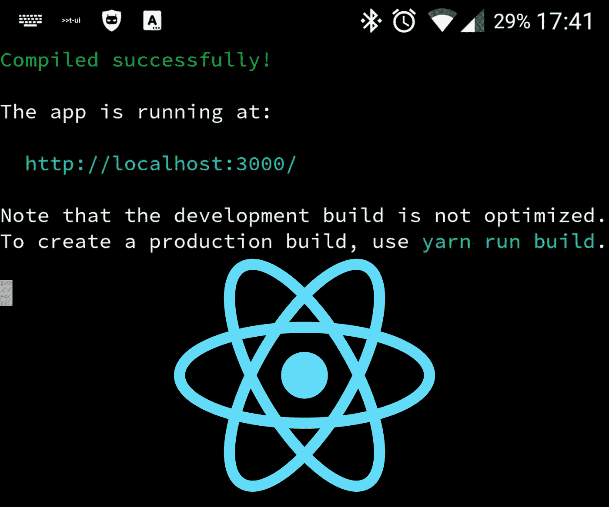
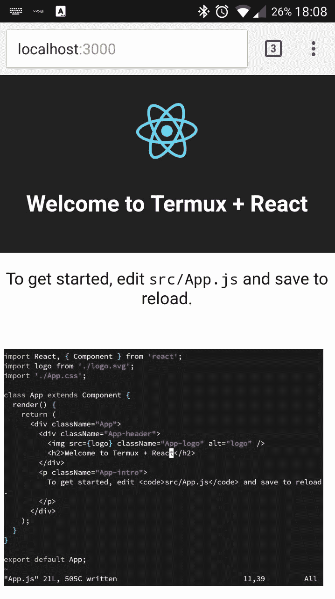

# 在您的 Android 智能手机或平板电脑上编写一个 React 网站，这是您从未想象过的

> 原文：<https://medium.com/hackernoon/code-a-react-website-on-your-android-smartphone-or-tablet-like-you-never-imagined-3e56c534f6e7>



# **TL；博士**

使用 Android with Termux 在智能手机上编写和托管 React webapp。

# 开始

有时当我在附近闲逛时，我就是不能让自己不去想编码，这是作为一名开发人员可能发生的最糟糕的事情之一，因为这有点疏远，但另一方面，它可以为您的应用程序带来一些好处！

嗯，如果你像我一样，当你在购物中心或开车时，你真的喜欢有疯狂的想法，在那些时刻，你可能会感觉到缺少了什么……比如你指尖下的一个漂亮的键盘。

过了一段时间，我意识到这是一个问题，但它主要在我无聊的时候出现，所以毕竟在某些情况下让我活着是件好事！

好吧，最后我得出了以下结论:我一直认为智能手机不仅仅意味着大规模监控和娱乐，是的，它们是团队合作和生产力的巨大帮助，但对我来说还不够。

***我想在智能手机/平板电脑上工作。***

我想用我在 Mac 上使用的方式(或最相似的方式)来做这件事。

# 这是你应该做的

最适合这项工作的键盘是[黑客的键盘](https://play.google.com/store/apps/details?id=org.pocketworkstation.pckeyboard)，更好的是一个[外置蓝牙键盘](https://www.amazon.com/s/ref=nb_sb_ss_c_3_18?url=search-alias%3Dcomputers&field-keywords=bluetooth+keyboard&sprefix=bluetooth+keyboard%2Caps%2C324&crid=2ZCEHUCIYLYMC)。

安装 [Termux](https://termux.com/) ，用 [apt 命令](https://termux.com/package-management.html)启动并更新。

```
$ apt update && apt upgrade
```

然后[到达外部存储器](https://termux.com/storage.html)。

```
$ termux-setup-storage
```

安装[一些核心实用程序和其他](https://termux.com/common-packages.html)。

```
$ apt install coreutils
$ apt install curl
$ apt install tar
$ apt install zsh
$ chsh -s zsh //to set zsh as the default login shell
$ apt install gnupg
$ apt install vim
$ apt install nano
$ apt install nodejs
$ apt install git
```

如果你想远程操作你的 shell，你可以使用 OpenSSH(感谢 Oliverse 在这方面的贡献)。

```
$ apt install openssh# create the permission file
$ touch ~/.ssh/authorized_keys# Set Permissions to the file
$ chmod 600 ~/.ssh/authorized_keys# Make sure the folder .ssh folder has the correct permissions
$ chmod 700 ~/.ssh# generate OpenSSH key pair (skip passphrase with enter)
$ ssh-keygen# add the key to authorizex_keys file
$ cat ~/.ssh/id_rsa.pub >> ~/.ssh/authorized_keys$ chmod 600 ~/.ssh/authorized_keys# test from the device itself
$ ssh localhost -p 8022 -i %PATH_TO_KEY-FILE%/%NAME_OF_KEY%# then you can copy ~/.ssh/id_rsa to your client (your computer)
# with this command you will find the file in the root of your device
$ cp ~/.ssh/id_rsa ~/storage/shared# change the file name and copy it on your ~/.ssh folder on the computer or into ~/.ssh/known_hosts file# access your device from the remote shell like this
$ ssh <device_ip> -p 8022 -i ~/.ssh/<your_new_filename>
```

# 让我们反应过来！

现在让我们试着为 React 设置一个最小的开发环境。

```
# install yarn with npm
$ npm install --global yarn# test yarn
$ yarn --version# install react
$ npm install -g create-react-app# go to your home and create a project folder
$ mkdir projects
$ create-react-app my-app
$ cd my-app/
```

命令`npm start`不起作用，所以您必须编辑项目中的 package.json 文件，向 json 的脚本部分添加另一个属性。你可以使用`nano package.json`命令来完成。

```
"onandroid": "node node_modules/react-scripts/scripts/start.js"
```

现在，您可以使用刚刚编写的脚本启动服务器。

```
$ npm run onandroid
# you can access your react website from [http://localhost:3000](http://localhost:3000)
# or from another host of the net from http://<device_ip>:3000
```

从现在起你可以从[*http://localhost:3000*](http://localhost:3000)*访问你的 React 网站。*

或者你甚至可以使用*http://<device _ IP>:3000*从你连接的网络的任何主机上访问它

# 当你编码的时候，注意你的页面



如果你真的想享受这个，你应该尝试使用 [Termux:Float](https://play.google.com/store/apps/details?id=com.termux.window) (付费应用)。使用 Termux 普通会话，您可以访问您的项目文件夹并使用`npm run onandroid`启动开发服务器，然后在它启动后启动 Termux:Float，您将拥有一个可调整大小的移动 shell 窗口，您可以在其中使用 Vim 编码！也可以用浏览器打开[*http://localhost:3000*](http://localhost:3000)*保存在后台。现在在浮动窗口上编写代码，由于 livereloading，每次保存时都可以看到页面变化！*

# *结论*

*多亏了 Termux，在很短的时间内，你就可以让你的移动设备成为一个卫星开发站，并且比你想象的更加舒适地编码。完成后，您可以使用 **git** 提交更改，并保持您的正常工作流程。*

# *其他链接*

*[Termux 帮助页面](https://termux.com/help.html)。*

*另一篇关于使用 Termux 在手机上开发的文章:[在 Android 上构建 Node.js 应用程序——第 1 部分:Termux、Vim 和 Node.js](https://medium.freecodecamp.com/building-a-node-js-application-on-android-part-1-termux-vim-and-node-js-dfa90c28958f#.y8s6mccl0) 和[第 2 部分](https://medium.freecodecamp.com/building-a-node-js-application-on-android-part-2-express-and-nedb-ced04caea7bb#.wic612ull)。*

*[](http://bit.ly/HackernoonFB)**[](https://goo.gl/k7XYbx)**[](https://goo.gl/4ofytp)*

> *[黑客中午](http://bit.ly/Hackernoon)是黑客如何开始他们的下午。我们是阿美族家庭的一员。我们现在[接受投稿](http://bit.ly/hackernoonsubmission)并乐意[讨论广告&赞助](mailto:partners@amipublications.com)机会。*
> 
> *如果你喜欢这个故事，我们推荐你阅读我们的[最新科技故事](http://bit.ly/hackernoonlatestt)和[趋势科技故事](https://hackernoon.com/trending)。直到下一次，不要把世界的现实想当然！*

**