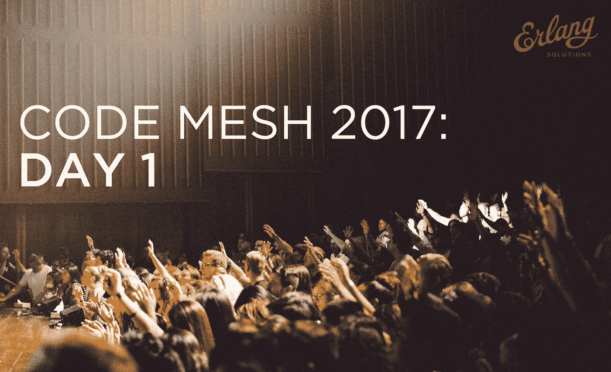

# 代码网格 2017:第一天回顾

> 原文：<https://medium.com/hackernoon/code-mesh-2017-day-1-review-10e626e3e115>

由里卡多·冈萨尔维斯

在你进一步了解之前，你应该知道 Code Mesh 现在是我们全球科技会议新家族 [Code Sync](https://www.erlang-solutions.com/blog/world-meet-code-sync-conferences.html) 的一部分。[了解更多- >](https://www.erlang-solutions.com/blog/world-meet-code-sync-conferences.html)

今年的[码网](http://www.codemesh.io/codemesh2017#home)见证了大会的不断壮大。以至于我无法在一篇博客文章中概括整个会议的要点。

以下是我在 Code Mesh 2017 第一天参加的演讲:

# 主题演讲:可自动扩展的计算——玛格·萨尔茨

演讲者: Margo Seltzer，(当时)是计算机科学的 Herchel Smith 教授，也是哈佛大学 John A. Paulson 工程与应用科学学院计算与社会研究中心的主任

这是 CodeMesh 的第一个主题演讲，也是一个很好的开始。主要的问题基本上是:“通过实践，程序能在运行程序方面做得更好吗？”

这个想法似乎很牵强，甚至 Margo 自己也说，最初她认为这个想法(来自一个年轻的学生)有点“天真”，因为这是不可能的和/或实际的。

还要记住，她说的是将相同的程序输入计算机，它会随着时间的推移而运行得更快，而不是正在使用的某种更高级的“神经网络/深度学习”中间件。

这种想法在尽可能低的级别上工作，即在 CPU 内部运行的位和字节，这就像类固醇上的分支预测，其中程序执行被分成更小的部分并预先计算(可能在不同的核心中)。通过多次运行，为该程序构建了试探法，使这些预计算有些准确，这取决于程序本身。

一些基准测试相当惊人，但要真正进入下一步，似乎需要 CPU 的硬件支持。

除此之外还有很多，但可以说这是 CodeMesh 的一个伟大开端。

# 实用的功能关系架构:用数据构建系统

**演讲者:**大卫·诺兰，Cognitect 的软件工程师

David Nolan 给了我们一个很好的演讲，关于数据库的不变性。

大部分讨论都是关于为什么我们应该关心不可变数据库的动机，这是有意义的，因为实际使用一个数据库(像 Datomic)看起来非常简单，因为您不能搞砸您的数据:)

他认为不变性是函数式编程的一个特征，在 React 或 ClojureScript(Nolan 是其创造者)等技术的前端和函数式语言(Erlang、Clojure、Haskell 等)的后端已经是一个选项。).这使得数据库成为一个例外。

Datomic 诞生于为整个堆栈带来不变性好处的想法。Nolan 简单地查询过去的数据的现场演示也很不错(看起来对审计等真的很有用。).

有趣的是，由于法律原因，Datomic 实际上可以删除数据。

# 超越最终一致性(福纳德布，卡尔文)——杰米·艾伦

演讲者:杰米·艾伦，星巴克统一商务项目的工程总监

Jamie 是一家全球性公司 Starbucks 的工程主管，因此您可以想象他们处理系统/数据库的规模。

当他来到星巴克时，卡珊德拉是他的首选。但事实证明，最终的一致性并不是每个用例都理想的，尤其是对于星巴克的一些用途(我认为这是顾客可以注册的奖励计划)。

因此，杰米领导的工程团队开始了他们的旅程，寻找卡珊德拉的替代品，提供比最终一致性更强的保证。

他还认为，上限定理仍然被误解，可能不是解决数据一致性、可用性等问题的最佳方式。

他建议用空间定理来代替。演讲的其余部分是对他们为下一个数据库考虑的选项的一个小回顾:Amazon Aurora、Microsoft Cosmos、Google Spanner、CockroachDB 和最后的 FaunaDB，这似乎是基于内部评估的当前选项。

# 我们计算的隐喻——阿尔瓦罗·维德拉

**演讲人:** Alvaro Videla，RabbitMQ 的前核心开发人员，合著了《RabbitMQ 在行动》一书

**视频即将发布。** [**订阅**](https://www.youtube.com/user/ErlangSolutions/) **进行通知。**

阿尔瓦罗做了一个非常不同的演讲，一个大多数非技术人员都能看到、理解和欣赏的演讲。

阿尔瓦罗从《我们赖以生存的隐喻》一书中获得了灵感，并为 ACM Queue 撰写了一篇文章。这个报告是根据那篇文章写的。

主要的一点是，作为人，我们总是用隐喻(或抽象)来思考和处理事情。例如，我们可能会从简单的计数示例开始学习数学，这是对底层数学概念的隐喻/抽象。

多年来，我们利用不同的隐喻，在此基础上发展到其他抽象层次。软件开发人员也是如此，对各种问题使用不同的隐喻(例如“散布谣言”或“说闲话”)。

底线是，我们应该意识到这些隐喻，并根据情况选择正确的隐喻。一个不太专业的演讲，给 CodeMesh 这样的技术会议一种全面的感觉。

# 安全、快速、并发程序的代名词——Sophia Drossopoulou

演讲者:伦敦帝国理工学院编程语言教授索菲亚·德罗索普洛斯。

**视频即将发布。** [**订阅**](https://www.youtube.com/user/ErlangSolutions/) **进行通知。**

索菲亚做了一个有趣的关于一种叫做小马的新兴语言的演讲。它是一种基于角色的语言，类似于 Erlang 或 Elixir，但是可以编译成本机代码。

它还有一个非常创新的类型系统，这是这次演讲的重点。所有的类型和它们各自的规则对初学者来说似乎有点吓人，但是 Sophia 说你会很快习惯的。好的一面是，这种类型的系统给了你很多在大多数语言中找不到的保证，比如:可变和不可变数据的安全混合，无数据竞争和高效的程序。

与 Erlang/Elixir 类似，它有一个垃圾收集机制，可以按进程并发运行，没有分布式锁。

我发现有趣的是，它还支持(或需要？)演员之间消息的因果传递，这在语言层面上很少见。

# 一切都很糟糕——弗雷德·赫伯特

**演讲者:**弗雷德·赫伯特，《为了更大的利益向你学习一些 Erlang！》一书的作者和“愤怒的 Erlang”，Genetec 的系统架构师。

**视频即将发布。** [**订阅**](https://www.youtube.com/user/ErlangSolutions/) **进行通知。**

如果你想笑一笑，也对软件的现状感到有点悲伤，这是一个很好的话题。

Fred 经历了我们迟早都会用到的日常软件的多重软件抽象之旅。

他强调了六个“可怕”的话题:数据结构、时间、id、数字、字符串/文本和网络。这显然是一个比阅读像这样的简短摘要更好的演讲。

但本质上，这些恐怖故事涉及:浮点精度、UUIDs(缺乏标准化)、队列/微服务(异步很难)、JSON(每个解析器都不一样)、时间和时区、闰秒、unicode 混乱以及软件的(不)安全性。

[观看 Code Mesh 2017](https://www.youtube.com/watch?v=csHiS8QefJg&list=PLWbHc_FXPo2goQkXS82Yn99HIpQ4G56oF) 的更多视频或了解更多关于 [**Code Sync**](https://www.erlang-solutions.com/blog/world-meet-code-sync-conferences.html) 的信息，这是我们新的全球科技会议系列，现在包括 Code Mesh。

*原载于*[*www.erlang-solutions.com*](http://www2.erlang-solutions.com/l/23452/2017-12-22/57qlgc)*。*