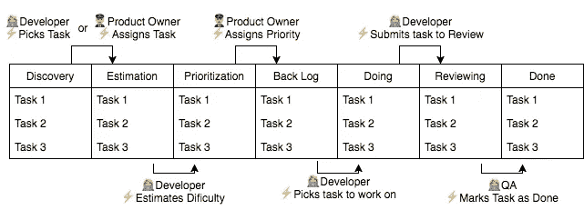

# 代码项目管理快速但巨大的胜利

> 原文：<https://medium.com/hackernoon/code-project-management-quick-but-huge-wins-8f8065cc9269>

完成工作是一门艺术，让团队完成工作是自我、习惯和技能的交响乐。

最佳[管理](https://hackernoon.com/tagged/management)系统通常就在眼前。但是因为一些小错误，它看起来是遥不可及的。
然而，这些错误通常不需要开会或者在 slack 上发几条消息就能解决。

一个经过良好调整的项目管道可能会在 10 倍的时间内完成，从而导致:

*   大量非生产性工作和
*   个人生活质量下降。

或者，提前完成:

*   尽可能少的工作，
*   整个过程中的成就感
*   归属感和自豪感。

所以我收集了一张*总结的*经验教训和方法的清单，我已经看到效果很好。希望你能学到新的东西！

# 弊大于利的事情

## 任务评审小组会议🌪

这些通常只是导致比实际开发更大的精神消耗，由于缺乏时间，不能覆盖所有的任务和误解。

对此的解决方案是具有 QA(质量保证)步骤的任务管道，其中任务在准备就绪时被独立审查。

## 自动化一切⛓

示例:当拉取请求具有特定的关键字和/或任务 ID 时，该任务会自动拖至审阅中

乍一看，这似乎很棒，对开发人员很有吸引力，但是，我们在设置这些自动化时所做的是:

*   创造必须被教导、记忆和记录的隐藏行为，
*   增加项目管理的复杂性
*   变得更加依赖当前的管理技术，从而降低了转换的可能性。

## 通过目标而不是周期来完成冲刺周期🚦

一些公司通过将未完成的冲刺推迟到接下来的几周来处理。然而，这可能会变成一个恶性循环，给整个团队带来巨大的压力。

坚持每次的周期会更健康。因此，如果打印到了最后一天，一些任务没有完成，它们可以被重新评估，并转移(或不转移)到下一个 sprint。

## 积压的🗄

不断地将特性请求和 bug 转储到一个单一的 Backlog 中使得咨询变得非常耗时，并且使得这些任务永远留在那里，被遗忘并且成为负担。

更有效的方法是建立一个流程来:

*   将这些任务添加到当前或后续的 sprints 和
*   在每个 sprint 结束时移动或放弃未完成的任务。

# 通常有用的东西

## 对⚡️的每个行动都有明确的反应

任务应该遵循一个清晰的循环，在每一个时刻，谁应该与它互动都很清楚。

坚持这条规则可以:

*   **所有权**
*   理清个人思路通过清楚每个人接下来必须做什么，可以让你在实际任务中有更多的脑力。
*   **非侵入式进度跟踪**
    通过更容易地在早期识别流程中的问题，并通过直接与当时被指派的人员交谈来缓解这些问题。

## 斐波那契估计📈

估计任务需要多长时间很容易产生偏差。

我见过的一个对这有很大帮助的系统是根据斐波纳契数列(又名规划扑克)给每个任务分配一个难度。

例如:

*   **0** :不需要任何动作，
*   **1** : <小时，
*   **2** : < 1 小时，
*   **3** : <日，
*   **5** : < 1 天，
*   **8** : < 3 天，
*   **13** : < 1 周
*   **20** : < 2 周

注意:不应该有超过 8 分甚至 5 分的任务。如果有，它们应该被分解成更小的任务。

## 不再需要个人列表📃

当一个管理系统被很好地整合时，一个黄金指标是当每个人都在个人层面上使用它，即使是最小的任务或次要任务。

当然，强迫人们使用它并不是实现这一点的方式。这是通过确保该系统是真正简单和方便的个人使用。

## 优化🍱

我们希望在 sprint 中完成的任务数量过于庞大是很常见的，如果处理得好，这是健康的。确保完成重要任务的一个非常简单的方法就是给任务分配优先级。

我对这个系统有很好的体验:

**Live 0** : live bug，防止核心行为
**Live 1** : live bug，不防止核心行为
**Dev 1** :需要下一个版本
**Dev 2** :需要下一个版本
**Dev 3** :很高兴有

## 领导/委托人👨‍✈️

领导者/授权者在以下方面非常有用:

*   处理开发请求和错误报告这使得开发人员能够专注于他们当前的任务，而不会被不断涌入的请求所分心。
*   **区分任务的优先级**
    通过帮助开发人员根据数字而不是业务需求的相关性来选择下一个任务，他们的可交付成果[生产率](https://hackernoon.com/tagged/productivity)提高了。
*   **帮助开发人员了解系统** 开发人员最初不了解系统，甚至后来偏离使用，这是正常的，也是意料之中的。
    因此，当领导者发现不一致时，他们会帮助开发人员更好地与系统保持一致，或者使系统适应开发人员。

## 可预测的通信👁️‍🗨️

人们不喜欢管理系统的一个常见原因是它们有太多的信息。

降低噪音的非常有效的方法是:

*   **创建和评论任务的模式** 有一个通用的格式使得文本更容易吸收。
*   **对任务状态变化的预期注释**
    示例:当一个任务从 done 转移到 QA 时，应该留下注释来解释应该测试什么。

# 结束的

有效的项目管理导致:

*   更大的产量，
*   一种集体成就感，
*   压力也更小。

它患有:

*   无效的会议，
*   隐藏的自动化，
*   基于目标的冲刺周期和
*   永远的积压。

并受益于:

*   在*每个阶段*有明确*预期行动*的任务生命周期*具体人*，
*   防止估计中的偏差，
*   吸引开发者，
*   领导/委托人和
*   减少换向过程中的噪声。

# 保持联络

我写作的目的是为了结识能与之进行有趣对话的人。所以我最希望的就是在评论中或者在 twitter 上得到你的消息。

# 向我学习过的人表示一点感谢

如果没有有幸与伟大的公司合作，比如 [Beamery](http://beamery.com) 、[target . io](http://altar.io)、 [Innowave](http://www.innowave-technologies.com/) 以及最近的 [NearSt](http://Near.st) ，我就不会学到这些话题。谢谢你们，迈克尔、肯特、丹尼尔、安德鲁、亚当和你们所有的智慧。