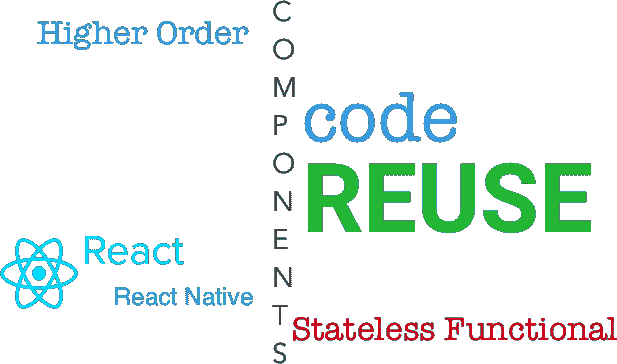
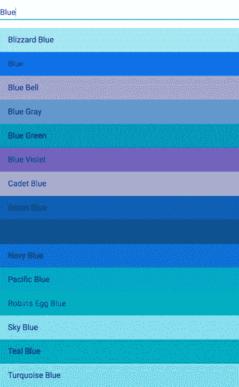
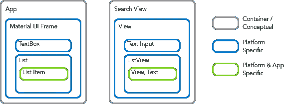
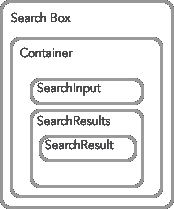
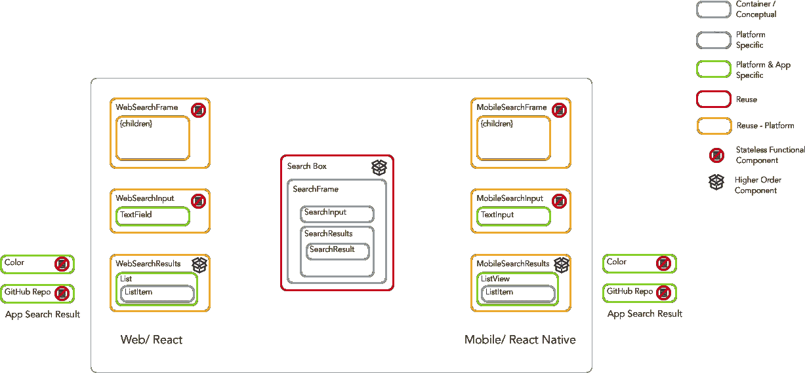

# React 和 React 原生应用之间共享代码

> 原文：<https://medium.com/hackernoon/code-reuse-using-higher-order-hoc-and-stateless-functional-components-in-react-and-react-native-6eeb503c665>



开发人员正在采用高阶组件(HOC)无状态功能组件，这是有充分理由的:它们更容易实现代码重用，这是开发人员梦寐以求的愿望。

有许多关于特设和功能性无状态组件的文章。一些是介绍，另一些描述深层的技术方面；我将探索重构现有组件来创建可重用的元素。

您可能认为代码重用被高估了。或者这太难了，尤其是在 web 和移动设备之间共享代码的时候。但是这里有一些好处需要考虑:

*   应用内和设备间的 UX 一致性
*   进行跨领域升级:改进一个组件并轻松更新其所有用途
*   重用路由和授权规则
*   切换库(例如，下面的应用程序使用 [MobX](https://mobx.js.org/) 进行状态管理，但是 [Redux](http://redux.js.org/) 可以交换进来)

我将重点介绍如何使用 HOC 和功能性无状态组件来实现重用。你应该已经熟悉了 [React](https://facebook.github.io/react/) 和 [React Native](https://facebook.github.io/react-native/) 的基础知识。Alexis Mangin 有一篇很好的[文章](/@alexmngn/from-reactjs-to-react-native-what-are-the-main-differences-between-both-d6e8e88ebf24#.rsas03guz)解释了他们的不同之处。

> 帖子里有很多细节；我解释了重构组件的增量过程。但是如果你已经熟悉这些想法(比如 HOC)，时间紧迫，或者只是不耐烦，你可以跳到 [**收益:重用组件**](#5331) 。( [Final GitHub repo](https://github.com/csepulv/search-box) )您可以看到结果，以及使用重用的组件创建额外的应用程序是多么容易。

# 什么是高阶组件和无状态功能组件？

React 0.14 引入了无状态功能组件。它们是渲染组件的函数。语法更简单；没有类定义，也没有构造函数。而且顾名思义，没有状态管理(没有使用`setState`)。我将在后面对此进行更多的评论，并将示例推迟到本教程的后面。

[这里](https://medium.com/u/e986f7cdb458#.fxlvlf378)。

高阶组件(HOC)是创建新组件的功能。它们包装另一个组件(或多个组件)，封装被包装的组件。例如，假设您有一个简单的文本框。您希望添加自动完成功能。您可以创建一个特设和使用结果作为一个新的组成部分。

```
const AutocompleteTextBox = makeAutocomplete(TextBox);
export AutocompleteTextBox;//…laterimport {AutoCompleteTextBox} from ‘./somefile’;
```

脸书文档在这里是。[帖子](https://medium.com/u/bbc4c2a3a7ae#.d1838xba3)。

一会儿我们将使用特设和无状态功能组件。

# 示例应用程序

我们将从一个非常简单的应用程序开始:一个简单的搜索框。输入一个查询，得到一个结果列表。在这种情况下，我们将按名称搜索颜色。

这将是一个屏幕应用程序。它不会使用路线或多个场景，因为重点是组件重用。

我们将添加第二对应用程序(React 和 React Native)，它们将重用我们提取的组件。

该 [GitHub 回购分支](https://github.com/csepulv/search-box/tree/baseline-apps)有基线申请(最终结果在此为)。).我在 GitHub [README](https://github.com/csepulv/search-box/blob/baseline-apps/README.md) 中包含了构建 React (web)和 React Native (mobile)应用程序的全部细节，但这里有一个大纲:

*   [创建-反应-应用](https://github.com/facebookincubator/create-react-app)启动反应应用
*   我使用[材质 UI](http://www.material-ui.com/#/) 作为 React/web 应用中的 UI 元素
*   `[react-native init](https://facebook.github.io/react-native/docs/getting-started.html)`启动 React 本地应用程序
*   我使用 [MobX](https://mobx.js.org/) 进行状态管理。([在这里](https://medium.com/u/de4496bfa1e2#.vqfntf8r1)和[在这里](https://hackernoon.com/the-fundamental-principles-behind-mobx-7a725f71f3e8#.bg6q97rp9)。)

[https://colors-search-box.firebaseapp.com/](https://colors-search-box.firebaseapp.com/)是网页版的运行演示。两者的截图如下(网络，然后移动):



# 重构以重用

## 实现代码重用与视角有关

代码重用的基础很简单。您从一个代码库中提取方法(或类或组件)，用参数替换包含的值。然后在另一个代码库中使用结果。但是重用元素的价值通常很低，维护共享代码的成本会很高。

我已经通过应用一些指导方针实现了持续的重用:[关注点分离](https://en.wikipedia.org/wiki/Separation_of_concerns)，[单一责任原则](https://en.wikipedia.org/wiki/Single_responsibility_principle)，以及[消除重复](https://en.wikipedia.org/wiki/Duplicate_code)。

关注点分离(SoC)和单一责任原则(SRP)是同一枚硬币的两面；主要思想是给定的代码元素应该有一个主要目的。如果有一个目的，关注点的分离是一个自然的副产品；一个只有一个目的的元素可能不会混合两个责任领域。

许多 IDE 和开发人员工具可以自动合并重复代码。但是消除相似设计中的重复更加困难。您必须“看到”重复，这可能需要重新排列代码块。

应用这些想法就像移动拼图块，找到它们相遇的地方和它们揭示的模式。

让我们从寻找重复开始。

## 看到重复

web 和移动应用程序有两个主要部分。
在网络应用中，`App.js`

在移动应用中，`SearchView.js`

下面概述了它们的结构。



Almost the same, but the platform differences between React and React Native are in the way.

这两个组件具有相似的结构。理想情况下，它们将共享组件，如下所示:



Our goal: a common, shared set of components

在伪代码中，

然而不幸的是，在这两个应用程序中，几乎没有共同的实际代码。React 中使用的组件(本例中为材质 UI)与 React Native 中的组件不同。但是我们可以通过首先分离关注点，然后重构组件，使每个组件都有一个单独的职责，来消除概念上的重复。

## 关注点分离和单一责任

`App.js`和`SearchView.js`都将领域逻辑(我们的应用程序逻辑)与平台实现和库集成混合在一起。如果我们隔离，我们可以改进设计

*   UI 实现:例如将`ListItem`和`ListView`从搜索结果的概念中分离出来
*   来自状态改变的 UX:例如，将提交搜索与更新和显示结果分开
*   组件:搜索输入、搜索结果(列表)和单个搜索结果(列表项)都应该是一个单独的组件

最后，重构应该通过自动化测试来完成，以确保在您进行更改时不会出现任何问题。我再补充一些简单的“冒烟”测试，可以在这个 [GitHub repo/tag](https://github.com/csepulv/search-box/tree/smoke-tests) 中找到。

# 提取无状态功能组件

让我们从重构时容易和明显的地方开始。React 是关于组件的，所以让我们把组件分开。我们将使用无状态的功能组件，因为它们易于阅读。

我们可以创建`SearchInput.js`如下:

React 的本质是一个 UI/视图框架，这就是我们现在在这个组件中拥有的。

导入的元素只有两个:React(对 JSX 的要求)和 Material UI 的`TextField`——没有 MobX，没有`MuiThemeProvider`，没有颜色等等。

事件处理被委托给处理程序(作为参数给出)，除了监视 *Enter* 键的按下。但是这是输入框的实现问题，应该封装在这个组件中。(例如，一个不同的 UI 小部件库可能包含输入时提交行为。)

继续我们的重构，我们可以创建`SearchResults.js`。

类似于`SearchInput.js`，这个无状态的功能组件很简单，只有两个导入。在分离关注点(和 SRP)之后，单独搜索结果的组成部分是一个参数`ListItem`。

> 我们可以创建一个更高阶的组件来包装`ListItem`。但是由于我们目前使用的是无状态功能组件，我们将推迟使用 HOC。(顺便说一下，我们稍后将把`SearchResults.js`重构为一个特设。)

对于单个搜索结果，我们将创建`ColorListItem.js`

现在，我们需要重构`App.js`。

# 提取高阶分量

为了可读性，我们将把`App.js`重命名为`SearchBox.js`。对于它的重构，我们有几个选择。

1.  让`SearchBox`通过`ColorListItem`到`SearchResults`(作为道具)。
2.  让`index.js`将`ColorListItem`传递给`SearchBox`，后者将把它传递给`SearchResults`
3.  转换到`SearchBox`到更高阶组件(HOC)

(1)会是这样的:

这没有错。这将是提取`SearchInput.js`和`SearchResults.js`的逻辑结果。但是它将`SearchBox`绑定到`ColorListItem`(上面的**粗体文本**)，因此违反了关注点分离。(也限制了`SearchResults`的复用。)

(2)解决了这些问题。

(我把属性`colors`重命名为`searchStore`，让概念和复用性更清晰。)

但如果看它的用法，还得把`ColorListItem`当道具传。在`index.js`中，我们会有，

将其与以下内容进行比较:

这就是`index.js` if (3)，一个特设被使用。区别很微妙，但很重要。`ColorListItem`包括`ColorSearchBox`，封装了它使用的特定搜索结果组件。

(这个`searchStore`，`Colors`，是个道具。应用程序中应该有一个实例，而一个给定的组件可以有多个实例，即`ColorSearchBox`。)

因此，我们可以将`SearchBox.js`特设如下。

请注意，`SearchBox.js`看起来更像前面章节中的伪代码， [**看到重复**](#ac93) 。稍后我们将进一步完善它。

# 重构反应本机组件

我们可以按照前面的模式重构移动应用程序并提取组件。我就不一一赘述了，比如提取`SearchInput`。但它们在[自述](https://github.com/csepulv/search-box/blob/refactorings/README.md)中为 [GitHub 回购分支](https://github.com/csepulv/search-box/tree/refactorings)。

相反，我将把重点放在对通用`SearchBox`的重构上，我们的 web (React)和移动(React Native)应用程序都将使用它。

# 提取用于 Web 和移动设备的共享组件

为了清楚起见，我将`SearchInput.js`、`SearchResults.js`和`SearchBox.js`分别重命名为`WebSearchInput.js`、`WebSearchResults.js`和`WebSearchBox.js`。

我们来看看`(Web)SearchBox.js`

第 2–10、19、20、26、27 行是特定于 React 的。

`MuiThemeProvider`是物料 UI 组件的容器，是物料 UI 唯一的直接依赖。但是通过`SearchInput`和`SearchResult`有隐含的依赖关系。我们可以通过引入一个`SearchFrame`组件来分离这些依赖关系。它将封装`MuiThemeProvider`并将`SearchInput`和`SearchResults`呈现为子对象。然后我们可以创建一个新的`SearchBox` HOC。它将使用`SearchFrame`、`SearchResults`和`SearchInput`。

创建新的`SearchBox.js`

这看起来就像我们从 [**看到复制**](#ac93) 的伪代码。

现在，将`WebSearchBox.js`的内容改为

`**WebSearchBox**`(第 26 行)是使用`SearchBox` HOC 的结果。

> `children`是一种特殊的反应道具。在我们的例子中，它允许`WebSearchFrame`包含/渲染`WebSearchInput`和`WebSearchResults`，这是由`SearchBox`提供的参数。更多关于儿童道具的信息可以在[这里](https://facebook.github.io/react/docs/composition-vs-inheritance.html)找到。

我们还将把`WebSearchResults`改为特设。它应该封装`ListItem`作为特设组合的一部分。

我们现在有了一套可重用的组件。(这里是 [GitHub 回购/分支](https://github.com/csepulv/search-box/tree/refactorings)。注意，为了清楚起见，一些目录被重新命名。)

# 回报是:重用组件

我们将创建 GitHub 知识库搜索应用程序。(GitHub 允许在没有 API 密钥的情况下使用 API，这对于本教程来说很方便。)

我将跳过引导的细节，但这里有一个总结

*   web 应用程序的创建-反应-应用程序，移动应用程序的`react-native init`
*   添加这些模块:MobX、Material UI(仅 web)、 [qs](https://www.npmjs.com/package/qs) (用于查询字符串编码)……在各自项目中的`package.json`细节( [web](https://github.com/csepulv/search-box/blob/master/github-mobile/package.json) 和 [mobile](https://github.com/csepulv/search-box/blob/master/github-mobile/package.json) )

大部分工作是编写一个新的搜索商店。它通过 GitHub API 搜索 GitHub 库，而不是颜色。我们可以创造`github.js`

(它的单元测试是[这里的](https://github.com/csepulv/search-box/blob/master/github-web/src/github.test.js)。)

> 为了简单起见，我们将复制一些公共文件。GitHub repo 使用 [webpack](https://webpack.github.io/) 来复制文件，这是一个小小的便利改进。跨 Javascript 项目共享文件/模块通常由 NPM 或鲍尔完成。(你可以[为](https://www.npmjs.com/pricing)[私有模块](https://docs.npmjs.com/private-modules/intro)注册支付。)你也可以使用 [Git 子模块](https://git-scm.com/book/en/v2/Git-Tools-Submodules)，尽管它们可能很笨重。因为我们的重点是组件重用而不是模块发布，所以我们将做一些简单的事情，复制文件。)

剩下的就简单了。删除`App.js`(和`App.test.js`)并将`index.js`的内容替换为

如果你使用 github-web 应用程序，你应该会看到


(也可以去[https://github-repo-search-box.firebaseapp.com](https://github-repo-search-box.firebaseapp.com)看现场版。)

# React Native: GitHub 移动应用

复制`github.js`和`MobileSearch*.js`文件，然后创建`GitHubMobileSearchBox.js`

并将`index.ios.js`内容更改为

两个文件，新手机 app。`react-native run-ios`


我们可能很努力地进行重构，但是重用组件来构建两个新的应用程序是很容易的。

# 回顾和总结

让我们看一下我们的组件图:



box icon is from [thenounproject.com](https://thenounproject.com/), courtesy of [Tinashe Mugayi](https://thenounproject.com/trellva25/)

很高兴看到重构有了回报。我们可以专注于新应用程序的特定领域逻辑。我们只需要定义 GitHub API 客户端以及如何呈现存储库结果。剩下的是“免费”的。

此外，我们的组件不必处理异步问题。例如，他们对`github.js`中的异步获取调用一无所知。这是我们重构方法以及我们如何利用无状态功能组件的**美妙的**好处之一。承诺和异步编程只发生在它需要的地方，`github.js`，也就是发出`fetch`调用的地方。

在您应用这些技术几次之后，提取组件并重用它们将变得更加容易。您甚至可以在一个新的视图元素的开头编写一个可重用的组件，因为模式已经成为编码中的一种规范。

此外，我鼓励研究像 [recompose](https://github.com/acdlite/recompose) 这样的库，这使得编写 hoc 更容易。

看看最后的 [GitHub repo](https://github.com/csepulv/search-box/) ，让我知道它是如何重构可重用组件的。

请♡这个帖子，并关注我的更新，在媒体上，或在 [twitter](http://twitter.com/csepulv) ( [csepulv](http://twitter.com/csepulv) )上。

> [黑客中午](http://bit.ly/Hackernoon)是黑客如何开始他们的下午。我们是 [@AMI](http://bit.ly/atAMIatAMI) 家庭的一员。我们现在[接受投稿](http://bit.ly/hackernoonsubmission)并乐意[讨论广告&赞助](mailto:partners@amipublications.com)机会。
> 
> 如果你喜欢这个故事，我们推荐你阅读我们的[最新科技故事](http://bit.ly/hackernoonlatestt)和[趋势科技故事](https://hackernoon.com/trending)。直到下一次，不要把世界的现实想当然！

