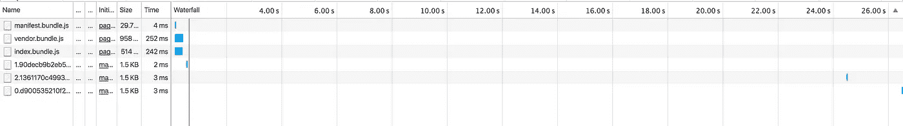
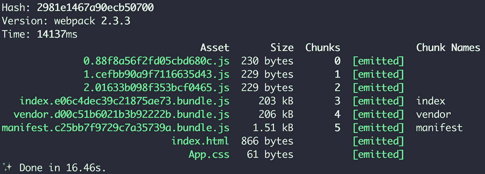

# 具有 Webpack 和 HMR 的 React 路由器的代码拆分

> 原文：<https://medium.com/hackernoon/code-splitting-for-react-router-with-webpack-and-hmr-bb509968e86f>


*在本指南中，我们将创建一个* [*启动器应用程序*](https://github.com/mozilla-neutrino/react-router-starter) *，它使用带代码拆分的路线。*

对于大型 web 应用程序，将所有代码放在一个文件中是没有效率的。大型应用应该只下载启动应用所需的 [JavaScript](https://hackernoon.com/tagged/javascript) 。我们希望能够将单个文件分成许多片段。将你的代码分割成多个块就是我们所说的“代码分割”。当用户四处导航时，块将被加载。

[中微子](https://neutrino.js.org/)，将被用来看看我们如何用 React、Webpack 和 React 路由器实现代码拆分。Neutrino 是一个非常棒的工具，它利用 Webpack 的强大功能，让您在零初始配置的情况下创建和构建现代 JavaScript 应用程序。它的工作原理是允许我们注入共享的预置或配置。我们将使用反应预设。后者需要你在 Node.js v6.9+上。根据[中微子文件](https://neutrino.js.org/presets/neutrino-preset-react/)，React 预置特性:

*   现代巴别塔编译支持 ES 模块，最近两个主要的浏览器版本，异步功能和动态导入
*   支持导入 CSS、HTML、图像、字体和图标
*   摇动树木以产生更小的束
*   热模块替换，没有 HTML 模板，等等

这篇文章的全部源代码可以在 GitHub 上找到。事不宜迟，我们开始吧。

首先，我们需要一个目录来开始工作。从您的终端，创建一个新的目录，并进入其中。然后我们将安装`neutrino`、`neutrino-preset-react`和`react-hot-loader`作为开发依赖项。我们还需要`react`、`react-dom`和`react-router-dom`进行实际的 React 开发。`react-hot-loader@3.0.0-beta-6`是撰写本文时的最新版本。

```
❯ mkdir react-code-splitting
❯ cd react-code-splitting/
❯ yarn add --dev neutrino neutrino-preset-react
❯ yarn add --dev react-hot-loader[@3](http://twitter.com/3).0.0-beta.6
❯ yarn add react react-dom react-router-dom
```

默认情况下，React 预置在主入口点为`index.js`的`src`目录中查找源代码。

```
❯ mkdir src && touch src/index.js
```

让我们用一个简单的 hello world 例子来编辑`index.js`。我们稍后会更改该文件，但现在，为了测试最低限度，我们将保持它的简单。

```
import React from 'react';
import { render } from 'react-dom';

render(<h1>Hello world!</h1>, document.getElementById('root'));
```

现在编辑项目的`package.json`,添加启动和构建应用程序的命令:

```
{
  "scripts": {
    "start": "neutrino start --use neutrino-preset-react",
    "build": "neutrino build --use neutrino-preset-react"
  },
  "devDependencies": {
    "neutrino": "^5.2.0",
    "neutrino-preset-react": "^5.2.0"
  },
  "dependencies": {
    "react": "^15.4.2",
    "react-dom": "^15.4.2",
    "react-hot-loader": "3.0.0-beta.6",
    "react-router-dom": "^4.0.0"
  }
}
```

启动应用程序，然后在控制台中打开浏览器访问该地址。

```
❯ yarn start
✔ Development server running on: http://localhost:5000
✔ Build completed
```


太好了，我们现在可以像真正的忍者一样分解代码了:-)

为支持热模块更换(HMR)，将先前创建的文件`index.js`更改为以下内容:

```
// index.jsimport React from 'react';
import { render } from 'react-dom';
import { AppContainer } from 'react-hot-loader';

import *App* from './App';

const *renderApp* = () => {
  render(
    <AppContainer>
      <App />
    </AppContainer>,
    document.getElementById('root'),
  );
};

// This is needed for Hot Module Replacement
if (module.hot) {
  module.hot.accept('./App', () => *renderApp*());
}

*renderApp*();
```

我们添加了`AppContainer`来指定我们希望 HMR 应用程序的哪一部分，并添加了`if`语句来在开发模式下激活它。我们还导入了下一步要创建的`App.js`。

```
// App.jsimport React from 'react';
import { BrowserRouter as Router, Route, Link } from 'react-router-dom';
import asyncComponent from './components/asyncComponent';

const Page1 = asyncComponent(() => import('./components/Page1')
  .then(module => module.default), { name: 'Page 1' });
const Page2 = asyncComponent(() => import('./components/Page2')
  .then(module => module.default), { name: 'Page 2' });
const Home = asyncComponent(() => import('./components/Home')
  .then(module => module.default), { name: 'Home' });

const App = () => (
  <Router>
    <div className="App">
      <ul>
        <li><Link to="/">Home</Link></li>
        <li><Link to="/page1">Page 1</Link></li>
        <li><Link to="/page2">Page 2</Link></li>
      </ul>

      <Route exact path="/" component={Home} />
      <Route path="/page1" component={Page1} />
      <Route path="/page2" component={Page2} />
    </div>
  </Router>
);

export default App;
```

`App.js`导入`react-router-dom`并返回注入了`routes`的路由器组件。

# 动态路线

从您的终端创建要使用的路线。我们还需要`asyncComponent.js`来延迟加载组件。

```
❯ mkdir src/components
❯ touch src/components/Page1.js
❯ touch src/components/Page2.js
❯ touch src/components/Home.js
❯ touch src/components/asyncComponent.js
```

我们将填写路线的最低要求。

```
// Page1.jsimport React from 'react';

const *Page1* = (props) => <h1>{props.name}</h1>;

export default *Page1*;// Page2.jsimport React from 'react';

const *Page2* = (props) => <h1>{props.name}</h1>;

export default *Page2*;// Home.jsimport React from 'react';

const *Home* = (props) => <h1>{props.name}</h1>;

export default *Home*;
```

我们快完成了。我们最后的任务是编写逻辑来延迟加载组件。我们将通过`asyncComponent.js`来实现。

```
// asyncComponent.jsimport React from 'react';

export default (loader, collection) => (
  class AsyncComponent extends React.Component {
    constructor(props) {
      super(props);

      this.Component = null;
      this.state = { Component: AsyncComponent.Component };
    }

    componentWillMount() {
      if (!this.state.Component) {
        loader().then((Component) => {
          AsyncComponent.Component = Component;

          this.setState({ Component });
        });
      }
    }

    render() {
      if (this.state.Component) {
        return (
          <this.state.Component { ...this.props } { ...collection } />
        )
      }

      return null;
    }
  }
);
```

我们完事了。

# **快速启动**

用`yarn start`启动 app，然后打开浏览器到`[http://localhost:5000](http://localhost:3000.)`。

```
❯ yarn start
✔ Development server running on: [http://localhost:5000](http://localhost:5000)
✔ Build completed
```


打开[网络](https://hackernoon.com/tagged/network)选项卡，查看正在缓慢加载的各个块。



# 建筑物

默认情况下，React 预设会将静态资源构建到构建目录中。



最后，我们使用[中微子](https://github.com/mozilla-neutrino/neutrino-dev)卷起一个 React 应用程序，并将我们的代码分成多个块。我们还加入了 HMR 来注入更新的模块，而无需重新加载页面。完整代码见[反应路由器启动器](https://github.com/mozilla-neutrino/react-router-starter)。

[](http://bit.ly/HackernoonFB)[](https://goo.gl/k7XYbx)[](https://goo.gl/4ofytp)

> [黑客中午](http://bit.ly/Hackernoon)是黑客如何开始他们的下午。我们是 [@AMI](http://bit.ly/atAMIatAMI) 家庭的一员。我们现在[接受投稿](http://bit.ly/hackernoonsubmission)，并乐意[讨论广告&赞助](mailto:partners@amipublications.com)机会。
> 
> 如果你喜欢这个故事，我们推荐你阅读我们的[最新科技故事](http://bit.ly/hackernoonlatestt)和[趋势科技故事](https://hackernoon.com/trending)。直到下一次，不要把世界的现实想当然！

