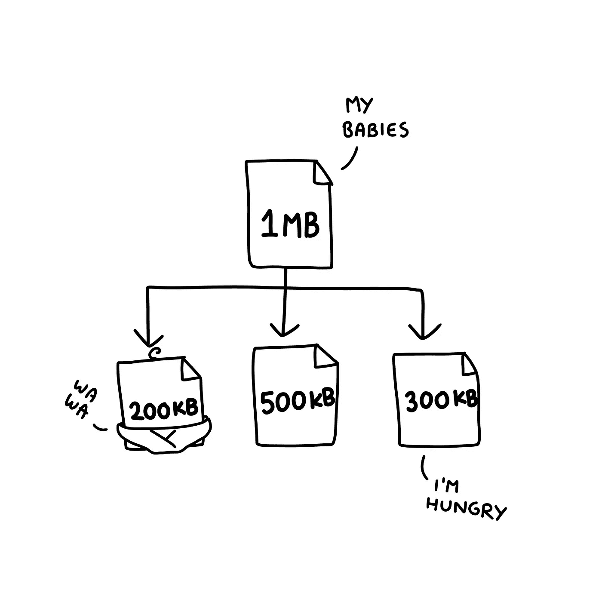
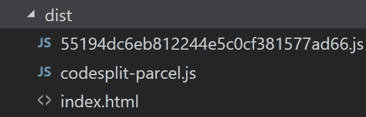
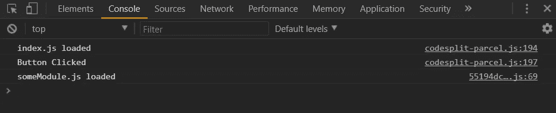
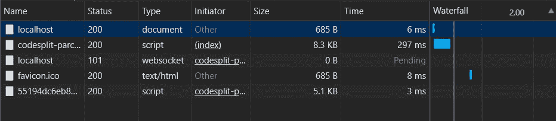

# 使用宗地 Web 应用程序 Bundler 进行代码分割

> 原文：<https://medium.com/hackernoon/code-splitting-with-parcel-web-app-bundler-fe06cc3a20da>


代码拆分！！这是当今 web 开发中的一个时髦词。今天，我们将探索代码分割，看看我们如何用 parcel 超级轻松地做到这一点。

## 什么是代码拆分？

如果你已经很熟悉了…你可以跳过这一部分，其他的，跟着…

如果你已经用任何一个 JavaScript 框架做了前端 web [开发](https://hackernoon.com/tagged/development)，你肯定已经把你所有的模块打包成一个大的 JavaScript 文件包，你可以把它附加到你的网页上，做一些令人惊奇的事情。但是，嘿，那些包裹相当大！你已经写了一个很棒(也很复杂)的 web 应用程序，有这么多部分…它们应该会产生很大的包；而且东西越大，在网速慢的网络上下载需要的时间就越长。问自己一个问题，用户是否一次需要全部的内容？

想象一下它是一个电商单页 app。用户登录查看产品列表，他可能只是来查看产品，但他已经花费了大量的时间和数据，不仅下载 JavaScript 来呈现产品列表，还下载 JavaScript 来呈现关于过滤器、产品详细信息、报价等内容。

这样做我们对用户不公平！！如果我们可以只在用户需要的时候给他们他们需要的东西，这不是很棒吗？。

所以，这种将你的大束分割成多个小束的想法叫做代码分割。这些较小的包是按需异步加载的。这听起来确实很难做到，但像 Webpack 这样的现代捆扎机使它变得非常容易，而 parcel 将这种容易提升到了另一个层次。



The parent is divided into these cute babies. Courtesy console.log("Button Clicked"); import('./someModule').then(function (page) { page.render(document.querySelector(".holder")); });});}

现在代码都写好了，让我们运行包。包将自动处理所有的配置工作！

```
parcel index.html
```

它会生成以下文件。



在您的浏览器中运行并观察。



Console output



Network tab

注意在控制台输出中，`someModule`只有在按钮点击后才被加载。在网络选项卡中，查看`import`函数调用后`codesplit-parcel.js`如何加载模块。

代码分割是一件很棒的事情，如果它可以这么容易地完成，我们没有理由不去做。💞💞

[***点击查看我的 Youtube 频道！！*🤓🤓*我需要你的爱***](https://www.youtube.com/channel/UCgY3bHW4qHKq9aC4i3nO-0g)

***请打些掌声👏如果你喜欢这些内容，你的支持会让我坚持下去。❤❤***