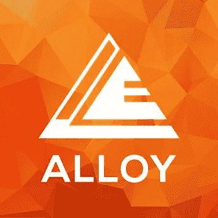
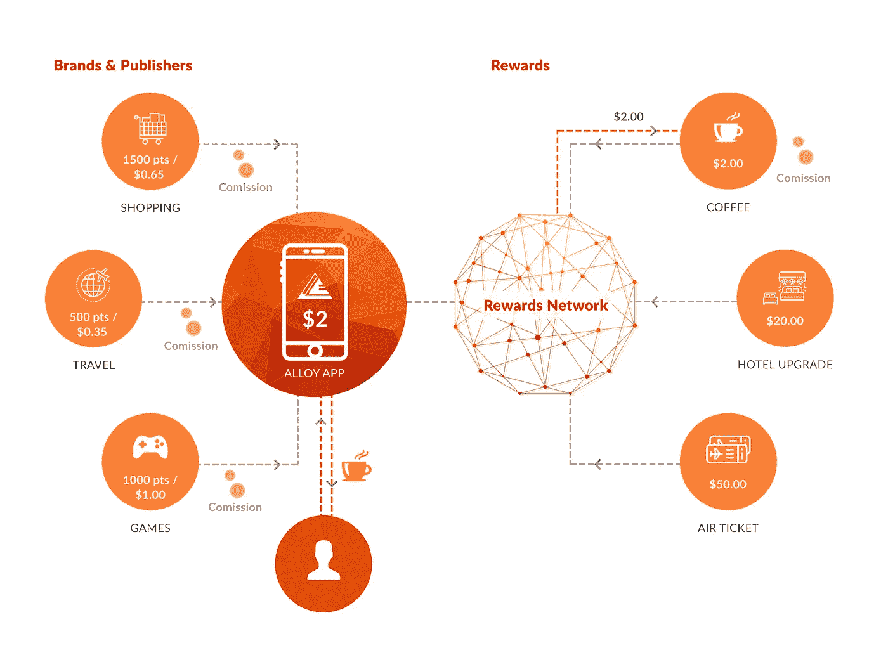

# Codemojo(由 PayPal 支持)将颠覆价值 3600 亿美元的奖励行业

> 原文：<https://medium.com/hackernoon/codemojo-backed-by-paypal-to-disrupt-the-360-bn-worth-rewards-industry-956f5afb4129>

Caption: [ALLOY](https://alloy.rewards.network/)

我们中有多少人的账户里有休眠的奖励积分？追踪他们有多困难？对品牌有什么影响？当奖励积分成为讨论的主题时，更多的问题不断出现。令人欣慰的是，我们并不孤单，由于上述问题，全球有 48 万亿奖励积分闲置在会员账户中。

奖励积分代表一个品牌希望与为其增加价值的客户分享的利益。因此，当它们得不到偿还时，最终会变成它们账面上的负债。根据[座谈会](https://www.colloquy.com/)(全球忠诚度洞察的来源)，以下是一些导致未兑换奖励积分大量积累的消费者事实。

## **原因有:**

*   **57%** 的受访消费者不知道他们的积分余额
*   他们中有 38%的人不知道自己积分的确切数值
*   在奖励计划中，57%的消费者认为赢取积分或里程的时间太长
*   53%的消费者对提供的奖励类型不感兴趣

# **利用区块链调动价值 3600 亿美元的未兑换奖励积分**

了解了这个问题后，Codemojo 提出了一个解决方案，通过一个位于区块链的名为“全球奖励网络”的平台，促进无摩擦的兑换和奖励体验。该平台将是我们现有奖励网络的升级版本，目前每月有 2000 多家发行商(应用和网站)的 600 万数字用户使用 100 多种优质品牌奖励。

[**Codemojo**](http://www.codemojo.io) 、PayPal 和 [CIO 天使投资人网络](https://www.crunchbase.com/organization/codemojo#/entity)支持的科技初创公司，已经有通过**人工智能驱动的奖励网络**服务数百万用户的证明记录，该网络自 2015 年以来一直在**运营。现在，我们的目标是通过用分散的区块链账本取代我们现有的基于钱包的架构，带来无国界的回报生态系统，由我们自己的加密货币 [**ALLOY**](https://alloy.rewards.network/) 提供支持。**

# **什么是全球奖励网** [**合金**](https://alloy.rewards.network/) **？**

**全球奖励网络**是一个连接消费者、品牌和出版商的单一平台，使合作品牌和出版商的用户能够通过一个应用程序界面将他们所有的**奖励积分链接、合并并转换为当地的菲亚特对等物**。整理后的奖励积分可以根据广泛的全球奖励目录中的产品和服务列表进行兑换。

Caption: [ALLOY](https://alloy.rewards.network/)

[**合金**](https://alloy.rewards.network/) token 将作为后台工作的锚货币，方便各方的跨境交易。

# **它是如何工作的？**

Caption: [How does it work?](https://alloy.rewards.network/)

拥有各种奖励计划奖励积分的用户，现在可以在世界任何地方使用 ALLOY app 兑换任何当地品牌的积分。他需要做的就是简单的**下载**合金 app → **报名** → **链接**他所有的奖励计划。在链接上，消费者将能够以其当地货币查看其整理的奖励积分，而这又可以在全球奖励网络中的合作品牌之间兑换。

生态系统将建立在**以太坊**之上，而**全球奖励网络**将使用**智能合约**来促进点击&配置品牌之间的合作关系，这在传统方式下将需要许多握手&文书工作。

# **一个消费者应该了解区块链吗？**

答案很明显，这是一个很大的问题，因为对于消费者来说，这将是一个易于使用的移动应用程序/网站，不需要任何加密货币和区块链知识，他们将在他们访问的国家的法定等价物中看到他们收集的奖励积分的总价值。

Caption: [Real World Merchandise for your Virtual Currencies using ALLOY](https://www.youtube.com/watch?v=AlIMUcX3S6s)

> “通过 **ALLOY** ，我们的目标是弥合虚拟货币和真实世界商品&服务之间的**3600 亿美元缺口。ALLOY 将是一个单一安全的&易用平台，为消费者提供一个轻松的环境，让他们可以根据自己选择的大量产品和服务，整理、合并和兑换各种奖励计划的零散奖励积分。Codemojo** 的**首席技术官[**sho AIB**](https://www.linkedin.com/in/shoaib-a-169a649/)**表示:“对于品牌和出版商来说，这将成为吸引和回报受众的一个界面，从而实现无摩擦赎回。”。****

# ****Codemojo 计划在 ICO 募集多少资金？****

**Codemojo 计划从**主 ICO** 筹集高达 **86，956 ETH，即 2500 万美元**，并在 Pre ICO 筹集接近**300 万美元的资金。根据以太坊目前的市场价格，**一个以太等于 575 个合金**。根据我们的路线图，ALLOY app 的 Alpha 版本将于 2018 年第一季度推出。到 2018 年第二季度，Codemojo 计划将 ALLOY 扩展到日本、韩国、巴西和其他国家和地区。****

# ****有什么好处？****

**消费者在奖励网结账时将获得结账价值的 **0.5%** 作为**合金返现**。**

## ****针对代币持有者****

*   **高达 **2%** 的额外返现和折扣。**
*   ****提前进入**新的奖励网络。**
*   **声望**【优先通行证】**会员资格。**
*   ****提前进入**使用新合金令牌进行**兑换**。**

# **ICO 什么时候发布？**

****Pre ICO** 从 10 月 15 日**开始**到 11 月 5 日结束，而我们的**主 ICO** 安排在 11 月 25 日**。****

****通过利用区块链技术，Codemojo 现在准备通过调动价值 360 美元的未兑换奖励积分来扰乱庞大的客户参与和奖励市场。****

****另外，**合金**已经在 [**ICO 工作台**](https://icobench.com/) 被 ICO 专家团队 [**评为 4.6/5**](https://icobench.com/ico/alloy) 。你想进一步了解这个项目吗？加入我们的[电报](https://t.me/joinchat/GLxiyg2vHj6CwLl3-yydGw)小组，访问我们的 [**网站**](https://alloy.rewards.network/) ，查看我们的 [**白皮书**](https://s3.eu-west-2.amazonaws.com/alloy-token/ico/Blockchain-Based-Universal-Rewards-Network.pdf) **。******