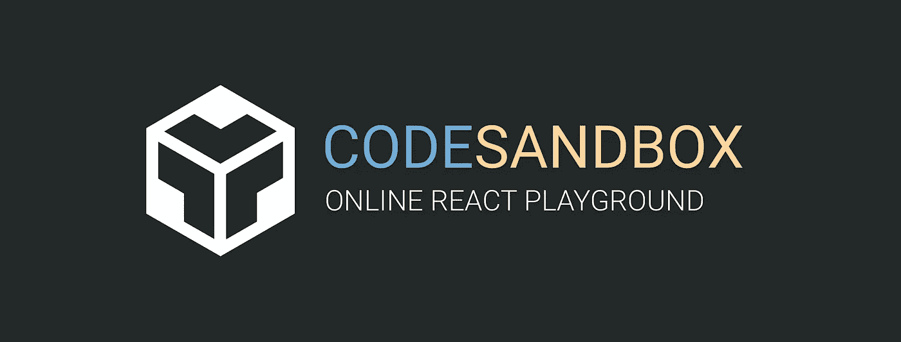
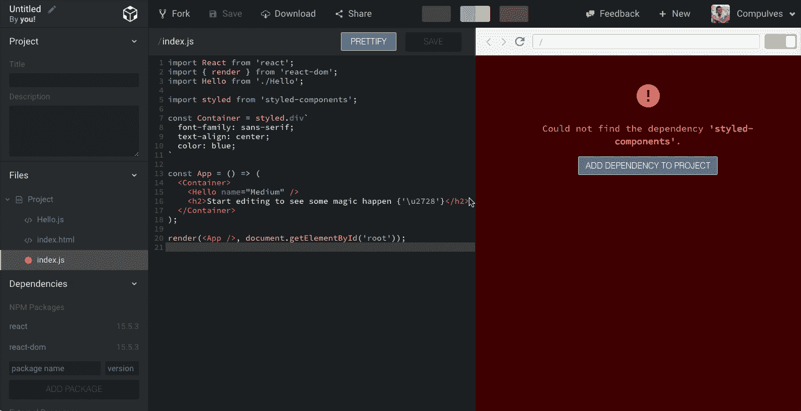
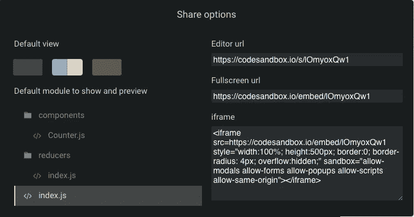
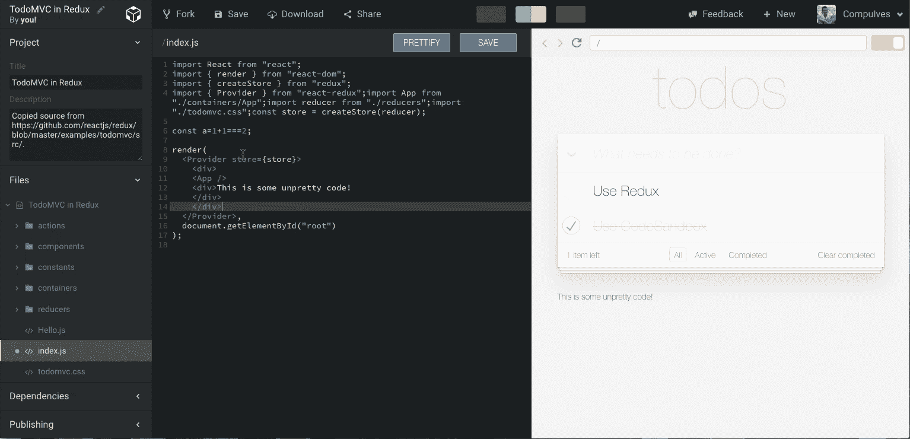

# code sandbox——在线 React 编辑器🏖

> 原文：<https://medium.com/hackernoon/codesandbox-an-online-react-editor-b8945ce095d2>

一个多星期前，Bas Buursma 和我发布了 [CodeSandbox](https://codesandbox.io) :一个在线代码编辑器，专注于 React 中的共享项目。反应超出了我所有的预期:已经有超过 1500 个沙箱被创建，超过 280 个用户通过 Github 登录！

CodeSandbox 的想法是在我去圣艾夫斯旅行的时候开始的(哈！).当时我正在研究 Catawiki 的转换，以便做出反应。当我不在的时候，我从其他开发者那里得到了很多关于 React 的问题，但是我没有简单的方法来回答这些问题，因为我不能使用编辑器来访问我们现有的库。

# 什么是 CodeSandbox

简单说:CodeSandbox 是一个在线代码编辑器。它为你自动化了诸如文件传输、捆绑和依赖管理之类的事情，所以你可以在一次[点击](https://codesandbox.io/s/new)中轻松地创建一个新项目。在创建了一些有趣的东西后，你可以通过分享 url 向其他人展示。CodeSandbox 具有实时预览功能，可以在您键入代码时显示代码的结果。该编辑器适用于所有 javascript 项目，但是它有一些 React 特定的特性，比如能够在 [create-react-app](https://github.com/facebookincubator/create-react-app) 模板中下载项目。

The editor itself

# 特征

在过去的 4 个月里，我们一直在开发 CodeSandbox，所以我想谈谈我开发的很多东西。如果你有任何建议，我也很想听听！我将介绍(双关语)最大的特点。

## NPM 依赖支持

这对我们来说非常重要，因为在一个独立的环境中测试一个库应该很容易，不会有太多的麻烦。我们通过为依赖项的特定组合动态创建依赖项构建来支持 NPM 依赖项。WebpackBin 做了同样的事情，我现在正和 Christian Alfoni 一起工作来创建一个我们都可以使用的服务。还可以添加外部资源，比如 css 和 javascript 文件。

Adding a missing dependency

## 下载

如果你想把你的项目从 CodeSandbox 中取出来，你可以点击标题中的“下载”按钮。您将获得一个带有 [create-react-app](https://github.com/facebookincubator/create-react-app) 模板的 zip 文件。为您生成了 package.json 和 index.html。

## 共享

CodeSandbox 是围绕共享而构建的，这就是为什么这个特性从一开始就是优先考虑的。共享沙盒有两种方式:全屏和编辑模式。在沙盒上工作时，您通常在编辑器视图中工作，但是您可以共享它的全屏版本。全屏版本是 CodeSandbox 的一个小版本，只有编辑器和预览。您可以使用标题中的共享选项指定要显示的文件和视图。应该很快就可以在 Medium 上展示沙盒了。

编辑:现在有可能了！示例:

Example embed

The share options

## 更漂亮，更漂亮-eslint，eslint 和 Tern 支持

我发现这些开发工具(尤其是 T2 漂亮的 T3)是我快速工作的一个要求。您可以在偏好设置中启用或停用所有这些选项。默认情况下,“保存时美化”是启用的(您仍然可以关闭它),因为这确保了沙箱之间的相同样式，并使读取其他沙箱的代码更容易。ESLint 遵循 airbnb 预设的规则，我想在未来也让它成为一个偏好。

So pretty!

# 路线图

我们现在所拥有的是我们需要建立初始计划的基础。我们构建 CodeSandbox 的想法是，它不应该只是可能从其他人那里派生工作。我们想利用 React 的一个非常强大的特性:**可重用性**。

## 将沙盒发布为库

应该可以很容易地将您的沙盒变成一个库，其他人可以在他们的项目中重用。我们从不希望人们锁定，所以在 CodeSandbox 上创建的库也可以安装在本地。我们实际上已经支持它了，但是我决定在支持一些更容易分享的社区特性之前隐藏它。

## 版本控制

库意味着版本控制，您应该能够提交版本并在库的基础上进一步构建，而不用担心破坏任何东西。你可以通过分叉来‘分支’。我们仍在研究如何开始导入/导出到 Github 的选项。

## 更好的用户支持

您可以通过标题中的菜单登录并查看您的沙盒，但目前这一功能非常有限。我正在建立一个个人资料视图，人们可以展示他们的沙箱，其他人可以评论和/或喜欢它。沙盒将获得更多的信息，比如它有多少个视图/收藏夹，还有哪些沙盒分支了它。

## 流行的沙盒

令人印象深刻的创作应该脱颖而出，应该有可能在主页上展示许多观点或收藏夹沙盒。

## 搜索沙箱

库支持将通过这一特性发挥其潜力。当你建立一个沙盒，你应该能够很容易地搜索，如“按钮或互动钢琴”，并看到一个其他沙盒导入的可视化列表。导入项目的创建者将自动作为“贡献者”记入最终项目。

到目前为止，CodeSandbox 是一个很好的平台，反应令人难以置信，支持也是巨大的。如果您对 CodeSandbox 或路线图有任何建议/想法，我们很乐意倾听！你可以通过电子邮件 hello@codesandbox.io 或在 Twitter 上直接发送消息 [@Ives13](https://twitter.com/Ives13) 来访问我们，我们也在这里观看评论。

我想通过分享一些已经创建的很酷的沙箱来结束这篇文章，我们鼓励你分享你的沙箱！😉

*   由[埃里克·拉斯姆森](https://medium.com/u/a9d3e1c4ef5f?source=post_page-----b8945ce095d2--------------------------------)——[https://codesandbox.io/s/mZRjw05yp](https://codesandbox.io/s/mZRjw05yp)制作的复刻表格
*   肯特·c·多兹——[https://codesandbox.io/s/o2yq9MkQk](https://codesandbox.io/s/o2yq9MkQk)
*   RxJS 教程由[扬·图伊特曼](https://medium.com/u/a8f827ba432e?source=post_page-----b8945ce095d2--------------------------------)——[https://codesandbox.io/s/PNkNMk9Z2](https://codesandbox.io/s/PNkNMk9Z2)
*   由我反应路由器 V4—[https://codesandbox.io/s/r0wXp0Njw](https://codesandbox.io/s/r0wXp0Njw)

> [黑客中午](http://bit.ly/Hackernoon)是黑客如何开始他们的下午。我们是 AMI 家庭的一员。我们现在[接受投稿](http://bit.ly/hackernoonsubmission)并乐意[讨论广告&赞助](mailto:partners@amipublications.com)机会。
> 
> 如果你喜欢这个故事，我们推荐你阅读我们的[最新科技故事](http://bit.ly/hackernoonlatestt)和[趋势科技故事](https://hackernoon.com/trending)。直到下一次，不要把世界的现实想当然！

