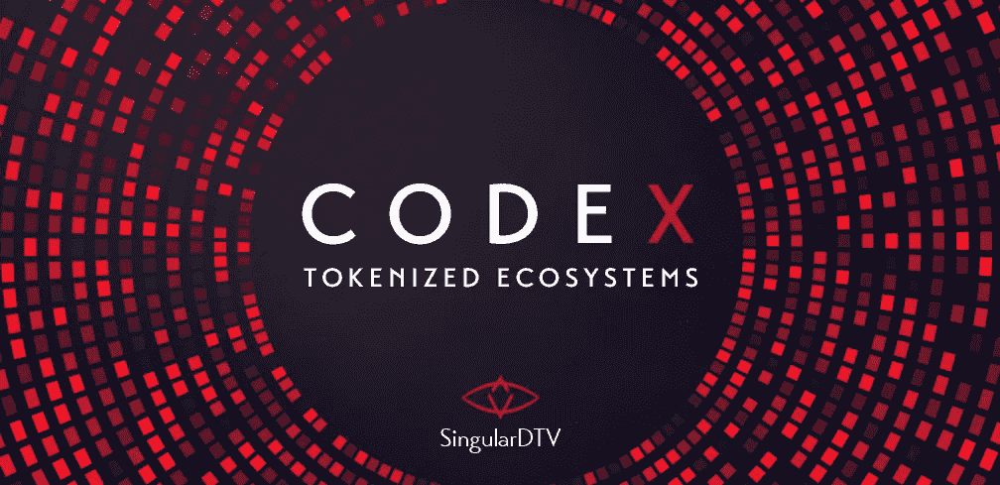

# 法典——符号化的生态系统

> 原文：<https://medium.com/hackernoon/codex-tokenized-ecosystems-908447daafb3>

## 致力于开发符号化生态系统的 SingularDTV 研究和设计实验室

新加坡电视台首席执行官扎克·勒博

我很高兴地宣布 CODEX 的成立，这是一个致力于开发和推广“令牌化生态系统”的研究和设计实验室，特别关注为 SingularDTV 的 SNGLS 令牌不断增加复杂性和功能。

如果比特币和 altcoin 热潮可以被认为是区块链技术的第一阶段，以太坊和 ERC20 令牌化生态系统将是第二阶段。这种转变将在 2018 年和 2019 年大规模发生。没有实际用途或目的的代用币将会消失。建立在链上的低开发能力的替代硬币将不复存在，它们从未真正有机会变得可扩展。到 2020 年，我们所知的替代硬币将被挤出加密领域，取而代之的是 ERC20 令牌化生态系统。我们将牢牢扎根于[【令牌化生态系统时代】](/@SingularDTV/the-age-of-tokenized-ecosystems-27ad2dfb68d2)。以太坊将成为主导的区块链，应用的复兴将遍及全球多个行业。CODEX 将帮助设计、开发和部署下一代复杂、安全可靠的令牌化生态系统和可编程 ERC20 令牌。

SingularDTV 发展阶梯的起点是符号化的生态系统。更具体地说，是“智能合同系统”(SCS)运行着一个令牌化的生态系统。更具体地说，SCS 中的“令牌”被编程为具有“想法”的功能和属性——一个放置在区块链上并转化为效用的想法。为了将 SingularDTV 生态系统发展成娱乐经济，需要将不断增加的功能和复杂性编程到 SNGLS 令牌中。

> 令牌化的生态系统、SCS 和可编程令牌是进化元素，将在区块链理工大学和以太坊采用的第一个伟大阶段扩散去中心化。人们惊叹于 2017 年 Q1 ETH 的崛起，等着瞧吧…

不时有各种各样的实体来找我们，要求我们就构建他们的符号化生态系统向他们提供建议。我们的政策是拒绝这些提议，这样它们就不会干扰 SingularDTV 建设分散娱乐产业的重点。B2B——企业对企业——应用程序不符合 SingularDTV 的最佳利益，也不会为我们的经济模式带来价值。我们正在建立一个“零售”平台。我们正在为人们——个体艺术家和创作者——搭建一个平台。但是在非常罕见的情况下，一个实体会提出这样一个伟大的想法，其发展阶梯与我们完全吻合，同时为 SingularDTV 增加实质性的价值。在这些罕见的同步情况下，我们觉得有义务形成伙伴关系。法典委员会是这些合作关系发生的地方。虽然我们还不能宣布任何具体的合作关系，但是我们可以宣布法典委员会的成立。

CODEX 将确保 SingularDTV 的版权管理网关不断升级，采用不同类别的 SCS，每一类的功能和复杂性都不断增加。这种复杂性必须经过最大限度的测试，然后才能发布到“野外”——我们都知道 DAO 发生了什么——我说的“野外”是指当我们开始实施公共、开源和社区测试时。我们去年以类似的方式运作，在 token 启动前，当时最基本的法典策划由 Milad Mostavi、Joseph Chow 和 Stefan George 代表。他们在封闭环境中的惊人工作和详细测试导致了一个 SCS，当发布供公众审查时——尽管每个 bug 的奖金高达 30 BTC——导致零 bug 或安全问题被发现。这种类型的测试环境和世界上最好的 SCS 开发人员的汇聚是 CODEX 的目标。这将有助于确保 SingularDTV 在为我们的权限管理网关部署新型 SCS 时能够遵守最高标准。

而“Vrs。1”将提供最简单的 SCS 功能，CODEX 将确保一个专门的开发团队不断向不断增加的 SingularDTV 智能合约系统库添加功能。是的，开发人员被雇佣来单独从事这项工作。其他项目的开发人员也被邀请提供建议和贡献，以便他们也可以从 CODEX 中创建的新的和强大的 SCS 类中受益。我们希望这些新系统将成为涉及 ERC20 代币和以太坊的各种努力的标准。水涨船高。这种对 SCS 和 token 功能的不断创新和添加将使 SingularDTV 成为一个极其健壮、通用和强大的平台。

虽然 CODEX 的种子是在 2015 年第一次播下的，但直到 2016 年 5 月我们的代码结构形成后，我们才变得非常清楚。现在，随着关键战略合作伙伴的加入，加上 SingularDTV 从 ETH 的崛起中积累的资源，CODEX 可以以一种为我们的发展阶梯带来重大价值的方式实现，同时巩固 CODEX 作为 SingularDTV 生态系统的另一个收入来源。

我们期待着随着更多法典的发展更新社区。CODEX 的成立为 SingularDTV 生态系统增加了重要价值，也是我们为分散娱乐产业奠定基础的使命。

CODEX 是一家私人实验室，将为 SingularDTV 和一组精选的企业客户/战略合作伙伴提供服务。食品法典委员会不会是一个有网站的面向公众的实体。CODEX 是国际公司 SingularDTV 集团的一部分，在波多黎各自由邦组建，在那里它受益于一系列技术、税收和商业激励措施。波多黎各是 SingularDTV 的一个重要地点，也是 Singular 系列科幻电影的主要拍摄和制作地。

扎克·勒博，新加坡电视台首席执行官

> [黑客中午](http://bit.ly/Hackernoon)是黑客如何开始他们的下午。我们是 [@AMI](http://bit.ly/atAMIatAMI) 家庭的一员。我们现在[接受投稿](http://bit.ly/hackernoonsubmission)，并乐意[讨论广告&赞助](mailto:partners@amipublications.com)机会。
> 
> 如果你喜欢这个故事，我们推荐你阅读我们的[最新科技故事](http://bit.ly/hackernoonlatestt)和[趋势科技故事](https://hackernoon.com/trending)。直到下一次，不要把世界的现实想当然！

