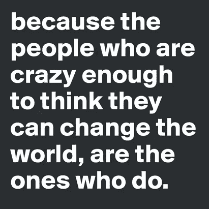

# 为改变而编码

> 原文：<https://medium.com/hackernoon/coding-for-change-8694020b96e8>

> *“人生最执着、最迫切的问题是，‘你在为别人做什么？"*
> 
> *——马丁·路德·金博士*

我是一个创造者。我喜欢建造东西。

不久前，我决定学习如何用[代码](https://hackernoon.com/tagged/code)构建东西。

我决定学习编码的很大一部分是基于我服务的愿望。我相信，实现我的创作热情的最好方式是成为一名开发人员，开发对世界有积极影响的应用程序。

有点理想主义？

我以此闻名。

承认这一点会阻止我努力实现这些梦想吗？

一点也不。我愿意投入 10，000 小时甚至更多的时间来释放这一新工具的潜力。

我目前正在为[黑人运动-法律项目](https://bmlp.org/)开发一个视频上传应用程序。这是一款 [iOS](https://hackernoon.com/tagged/ios) 应用，可以让你轻松录制视频，并立即将片段保存到你的个人云存储中。该应用程序将有助于提供重要的法律证据，在大规模示威和逮捕期间支持活动人士。

对于一个新手开发者来说是一个挑战，但是谁说过拯救世界会很容易呢？

该项目正处于非常早期的阶段，我将在这里记录它的进展，因为它是发达国家。

到目前为止，我已经能够让我的 MVP 运行起来，以便开始一点试验。最基本的功能已经到位，但需要更多的调整，它看起来还不是很漂亮。我的目标就是不断重复，重复，重复。从那里我可以提炼，提炼，提炼。

首次打开应用程序时，系统会提示您登录 Google Drive 帐户。签到一次就这样，下次不用再签到了。成功登录后，摄像机视图会显示在整个屏幕上。

我实现了一个自定义的相机覆盖，以修改相机的外观和行为及其视图。我将在另一篇文章中讨论这方面的技术细节。

目前在屏幕顶部有两个浮动按钮。一个用于打开和关闭闪光灯，另一个用于从前置摄像头切换到面向用户的摄像头。一旦引擎盖下的一切顺利运行，我将修改用户界面元素。

只需在相机视图屏幕上轻按两次即可开始录制。再次轻按两次以停止录制。录制结束后，视频不仅会保存在您的相册中，还会立即上传到您的 Google Drive。安全地存储在云端，以防你的手机被没收或无限期“丢失”。

一旦可以处理 10-15 秒的短视频，我就开始尝试更长的视频和连续录制。我将视频的最大时长设置为一分钟。委托方法设置为在录制结束后立即上传，并重新启动摄像机以立即再次开始录制。摇动您的设备即可结束会话。

理论上，这将每分钟持续上传一分钟的视频，直到你以一个良好的摇动结束会话。

理论上。

摇动手势工作得很好，视频被保存到相册中，但是…突然视频不再保存到我的 Google Drive 中了…

## *未完待续……*

我会跟进这个问题的解决方案，为什么我们决定用摇动手势来换一个不同的功能，并在接下来的帖子中做更多的介绍。

*你想成为一名测试者吗？*

- Steve Jobs

## **更新 04–2017**

该项目目前正在 Swift 中进行更新和重建！一旦基础建立，github 回购将会公之于众。你可以在这里找到原始回购

如果你想为这个项目做贡献，请联系我们！

> [黑客中午](http://bit.ly/Hackernoon)是黑客如何开始他们的下午。我们是 [@AMI](http://bit.ly/atAMIatAMI) 家庭的一员。我们现在[接受投稿](http://bit.ly/hackernoonsubmission)并乐意[讨论广告&赞助](mailto:partners@amipublications.com)机会。
> 
> 如果你喜欢这个故事，我们推荐你阅读我们的[最新科技故事](http://bit.ly/hackernoonlatestt)和[趋势科技故事](https://hackernoon.com/trending)。直到下一次，不要把世界的现实想当然！

