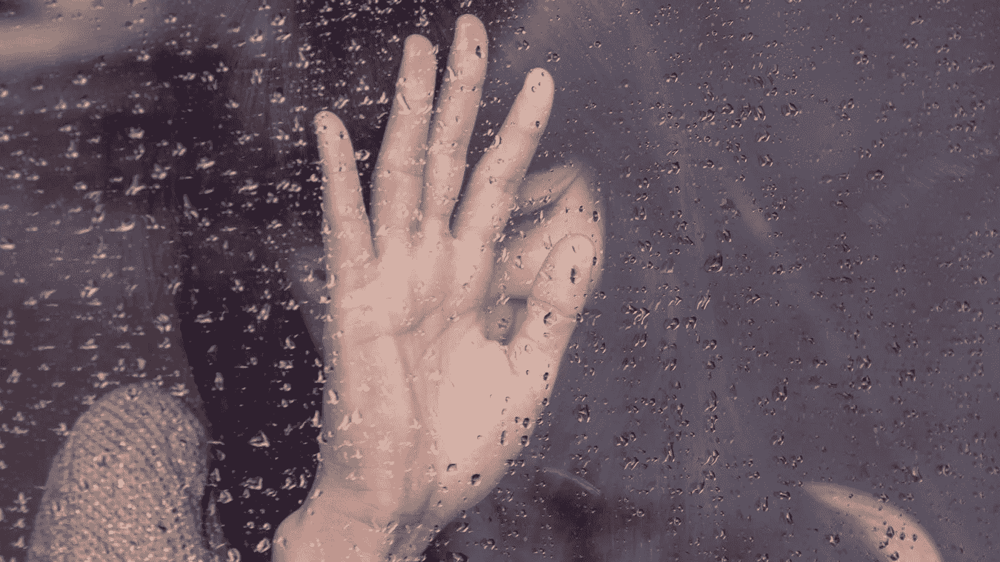

# 从黑暗的地方编码

> 原文：<https://medium.com/hackernoon/coding-from-dark-place-956cc2edcf9f>

生活中有些时刻，我们会意识到自己的轨迹。有时候这些时刻是突然发生的，比如编写我们第一个输出“Hello world”的计算机程序。对许多人来说，这种感觉是神奇而直接的，促使他们无限期地痴迷于编写计算机软件的快速反馈创造过程。其他时候，我们的顿悟随着时间的推移而积累，需要几个月或几年才能发酵成迫使我们改变方向的东西。最终，这些改变生活的事件会推动我们前进，有时会让我们转向新的障碍和努力，我们觉得这证明了我们多年的生活是值得的。

计算机编程一直是我着迷的东西。在我 6 岁的时候，我的父母带回家一台运行 Windows 3.1 的 IBM 兼容 386 和一个基本编译器，我经历了人生中第一次改变轨迹的时刻。我立即被这台机器的内部工作方式迷住了，甚至在观看我父亲在添加一个新硬件时调整主启动文件(Autoexec.bat)时，不小心损坏了电脑。我希望我可以说，我对计算机和编程的持久痴迷源于一种天真的、不可阻挡的玩技术的愿望，就像那种住在地下室的书呆子的刻板印象，他发明酷东西只是因为好玩。对我来说，我对计算机科学的持续关注有着更黑暗的历史，这是由激情、好奇心和避免处理不可想象的情感痛苦的混合物驱动的。

当我 7 岁的时候，我的父亲，一位微生物学家和超级运动员，被诊断患有肌萎缩性侧索硬化症(ALS)，这是一种肌营养不良的晚期形式，没有治疗方法。我清楚地记得一个星期天的下午，我走进我妹妹的卧室，看见我妈妈在地上捡玩具时哭了。当我问她出了什么事时，她泪眼汪汪地转向我，简单地说了一句“你父亲快死了”。

接下来的一两年在当时感觉是无关紧要的，但回过头来看，我可以看到我父亲的死亡过程是多么具有破坏性，即使是在他慢慢死去的早期。我记得最清楚的是一些小事，比如在邻居家的游泳池里玩了一个晚上后，我妈妈告诉我，我应该停止和我父亲玩得这么激烈，因为高强度的体力消耗会让他的病情发展得更快(完全正确)。还有一次，当我和父亲在附近的小溪边钓鱼时，我记得父亲沮丧地试着打了一个多小时的钓鱼结，因为他的精细运动技能失败了。我继续和我的朋友们去钓鱼，留下他一个人纠结这个结。早些年，我发现了电脑游戏《毁灭战士》和《魔兽争霸》。我也开始涉猎基础知识，学习更多关于计算机内部运作的知识。我从未意识到多年后我会感到巨大的内疚，因为我受到强烈的闪回的打击，在我无法避免想起童年的时刻，我沉浸在遗憾、愤怒和羞愧的混合物中。

随着年龄的增长，我越来越迷恋电脑，因为我的父亲变得越来越虚弱。AOL 是在 90 年代中期出现的，历史上人们第一次能够通过互联网建立虚拟关系。对我来说，美国在线成了一个恶作剧的游乐场。软件安全还没有发展成为一件真正的事情，你可以很容易地用 VB 编写简单的程序，向其他用户发送带有无效字符代码的即时消息，使他们的 AOL 会话崩溃。其他有趣的工具，如聊天机器人，允许创造自动化的恶作剧。我写的一个侮辱机器人就是这样一个例子，它会在 AOL 聊天中随机挑选出一些人，然后在聊天室里写下对他们的侮辱语句。如果用户作出反应，侮辱会变得越来越“无礼”。这是网络巨魔的黎明，我正式成为其中的一员。我每天花几个小时在我父亲的 486 工作电脑前，随意地编写程序，发展网上关系，而不是花时间和邻居的真正朋友在一起。当这一切发生时，我父亲失去了自己洗澡的能力，因为保持平衡对他来说成了一个更大的问题。他的说话能力已经退化到了这样的程度，在很多情况下，他不得不重复 4 到 5 次，才能被准确地理解。这使得他在需要帮助时难以沟通，令人沮丧，他已经很抗拒这样做，因为他试图坚持某种个人自力更生的外表。这给我的家庭带来了许多危险和令人沮丧的情况。我记得有一天下午，我听到妈妈在我们家的主浴室里喊我。当我走进浴室时，我父亲正赤裸着躺在地板上，他的一条大腿后侧有一个很大的凹痕，那是他滑倒后留下的。我妈妈个子很高，但她缺乏将我父亲抱起来的上肢力量，这样他就可以被移到床上并检查是否有进一步的损伤。我五年级时身高 5 英尺 10 英寸，是家里唯一能帮忙的人。我记得我用尽全力拉了 30 多分钟，直到他最终躺在床上。我父亲的大腿后部从来没有正确愈合，我从未停止过对这一特殊记忆的闪回，带着某种羞耻感、愤怒和恐惧混合在一起。直到长大后，我才意识到这意味着什么。

当我接近十几岁的时候，我变得一天比一天愤怒。我记得在学校几乎每天都被孩子们取笑我父亲的状况，从开玩笑说我有一天会像他一样到路德评论他在床上无法取悦我母亲。打架成了学校里的一件平常事，我还记得面对学校领导的一阵羞辱。有一次，一群学校管理人员(校长和辅导员)把我拉进一个房间，训斥了我一顿，并表示希望他们的孩子长大后不要像我一样。在家里，我记得我感到愤怒，并把这种愤怒发泄在母亲身上。我变得更加迷恋我的数字生活，这甚至成了一种逃避的方式。我开始玩《帝国时代》的在线游戏，并开始和其他玩家一起构建 mod，为我们最喜欢的数字逃避方式增加额外的功能和乐趣。我记得我觉得比起现实生活，我更喜欢我的数字生活。

我 14 岁的时候，父亲终于在与卢·格里克氏病的斗争中失败了。他去世的那天晚上，我正在和家人的朋友一起吃饭，而我的母亲在医院陪我的父亲，他因肺炎住院，这是 ALS 患者常见的晚期死亡判决。我记得晚餐时电话铃响了，甚至在房间里的一个成年人接起电话之前，我的血液就立刻变冷了。电话一结束，我就以极快的速度驱车穿过奥斯汀市区，前往我父亲所在的医院。我记得走进候诊室，看到我妈妈含着眼泪告诉我，他去世了，他们保持他的身体温暖，以防我想在葬礼前最后一次见到他并拥抱他。我说“不”，我的世界一片漆黑。接下来的两周我记不太清了，包括他的葬礼。

在我青少年生活的剩余几年里，我与电脑和互联网的关系成了一种逃避的方式。沉迷于电子游戏、代码和信息让我无法以一种深刻有力的方式处理我童年早期发生的事情。尽管这是不健康的，但我不相信任何一个孩子真的有能力承受身患绝症的父母的痛苦，而且几乎肯定会找到某种方法来避免承受这种痛苦。这是一个不正常的、令人悲伤的环境，任何孩子都不应该经历。有人告诉我，在被 ALS 诅咒的家庭中长大的孩子，在他们成年后的大部分时间里，经常与 PTSD 和抑郁症作斗争，许多人转向滥用药物作为应对手段。对我来说，童年创伤后应激障碍的影响最终表现为可耻的闪回、整体工作主义、二元思维、失眠、恐慌发作，以及痴迷于空虚的职业成就和财务收益作为感觉完整的手段。

在过去的两年里，我在处理发生在我父亲身上的事情和我失去的童年方面取得了重大进展。这一飞跃是由日复一日、数周的心理治疗、我妻子充满爱意的鼓励，以及感受真实情感和体验人类之美的强烈愿望，而不是像我的创伤后应激障碍触发状态那样保持冷漠的结果。这个过程也挖掘出了一个改变轨迹的认识:**我需要做点什么，这种需求是不可抗拒的，来自我灵魂的最底层**。

让我说清楚:**我很幸运**。我所经历的恰好以一种自我修复的方式击垮了我。我的焦虑和无休止的专注让我去解决引起焦虑和无休止的专注的问题。不是每个人都这么幸运。ALS 之类的疾病让人崩溃；不仅是生病的人，还有他们的孩子和其他直系亲属。**一旦你被诊断患有肌萎缩性侧索硬化症，就没有希望了。唯一活过 ALS 的人是斯蒂芬·霍金，doctor's 也无法解释他为什么还活着。我永远不会“忘记”这一点，而且我运用新教工作伦理的能力并不是“优势”。如果四个人从一栋大楼的窗户掉下来，其中一个没有摔断脊背，这并不意味着这个没有残疾的人比其他人更强壮；他们很幸运以一种不那么糟糕的方式着陆，这甚至不是他们所能控制的。我觉得，作为一个社会，我们经常祝贺那些克服了这种逆境的人变得“坚强”。比什么强？那些最终成为瘾君子的人？那是胡说。**

因此，这是我的轨迹变化:**我将找到一种方法，将我的技术技能引向健康领域，并最终以研究为导向，将我的技术技能引向像 ALS 这样的神经肌肉退行性疾病，无论需要付出什么代价**。没有一个孩子应该经历这种经历，这个世界需要更多有强烈个人兴趣的人来为更好的治疗做出贡献。通过开发商业应用程序和开源软件，我在软件工程师的职业生涯中获得了成功。我想利用我解决复杂软件问题的诀窍，将它与我对肌肉萎缩症怪物的渴望结合起来，并试图帮助找到这些“无法治疗”疾病的治疗方法。

我知道这不会一蹴而就。我喜欢在集体健康公司的当前职位上工作。我完全打算坚持到底，直到我们完成修复医疗保险的使命，这对于今天的大多数美国人来说是一次奇怪而糟糕的经历，也是我父亲生病时我的家人不得不与之斗争的事情。我也不幻想在最好的情况下我会有什么微妙的影响。比我聪明得多的人已经研究这个问题几十年了。然而，从我的角度来看，在这些项目中增加更多有动力的人除了帮助之外什么也做不了。

*如果* ***有人*** *阅读此文恰巧* ***认识某人*******医学研究*** *此人是专注于****ALS*******或类似疾病的话我很乐意介绍一下*** *。我目前在集体卫生组织的角色有望让我接触到公共卫生领域许多有影响力的人，但我知道最强大的联系往往是通过随机和非正式的渠道形成的，比如人们偶然看到一篇博客文章。***

****编辑*** *:我不想给人这样的印象:我所描述的那几段经历甚至接近于经历父母或家人的 ALS 死亡过程中最痛苦的方面。有数不清的更黑暗的一面，让一个家庭成员在这种情况下幸存下来，特别是当我想起这些经历时，会出一身冷汗。出于对我父亲和我直系家庭成员的尊重，我决定远离这些经历，专注于更有尊严和情感上不那么残酷的部分。我知道我父亲也希望这样；不是为了他，而是为了我的家人。**