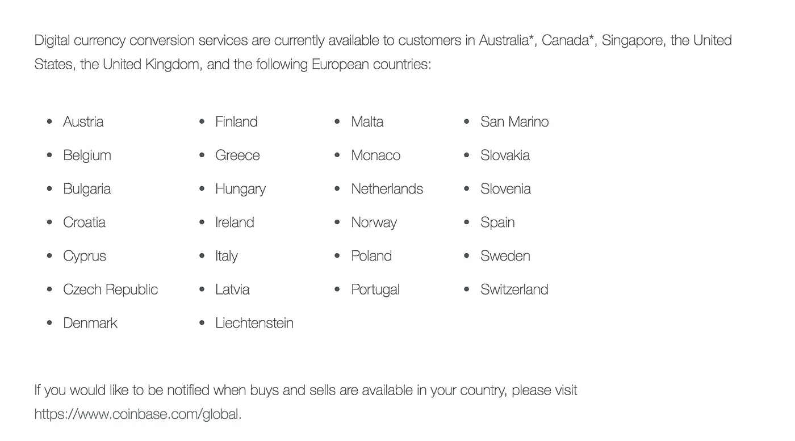
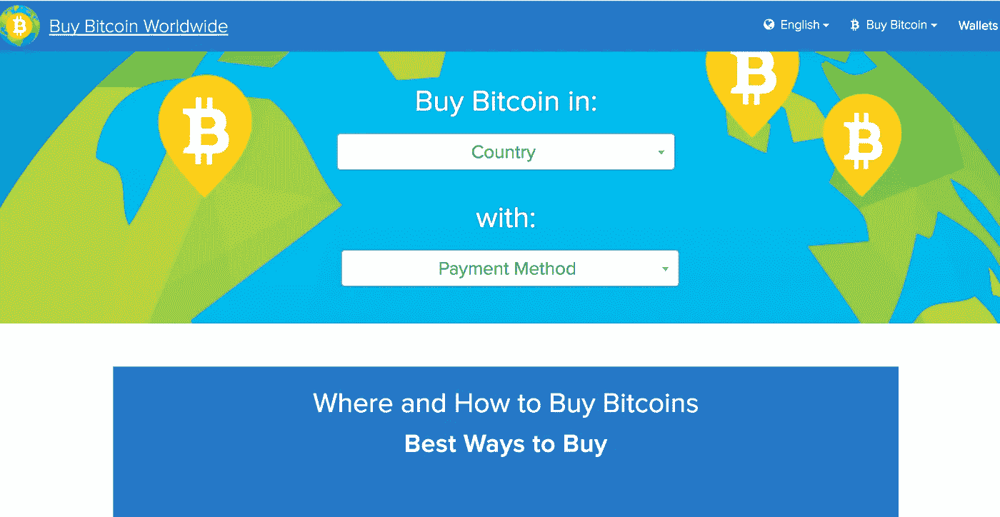
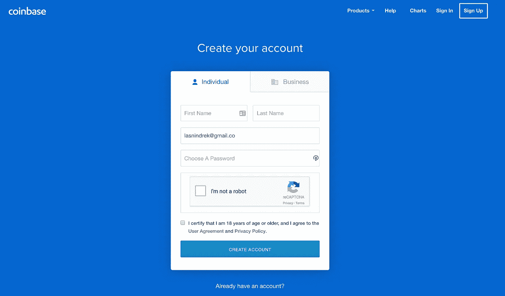
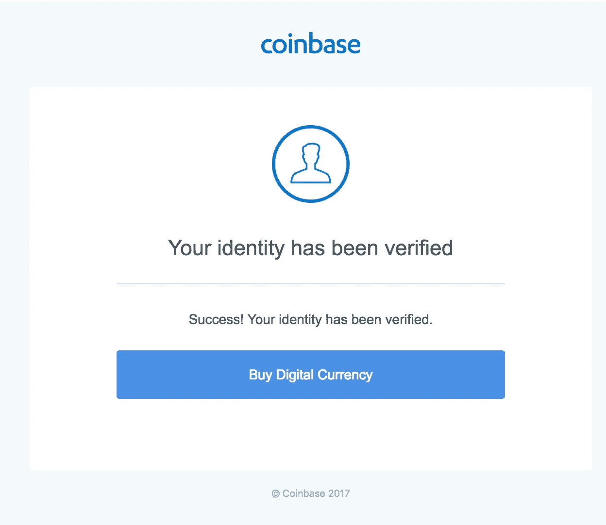
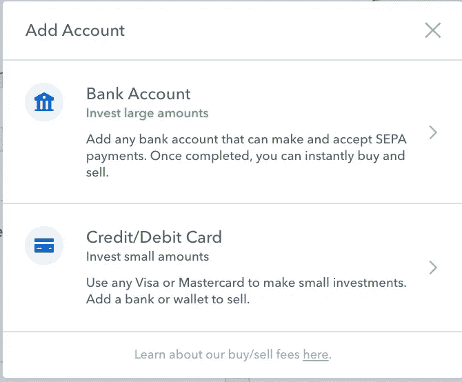
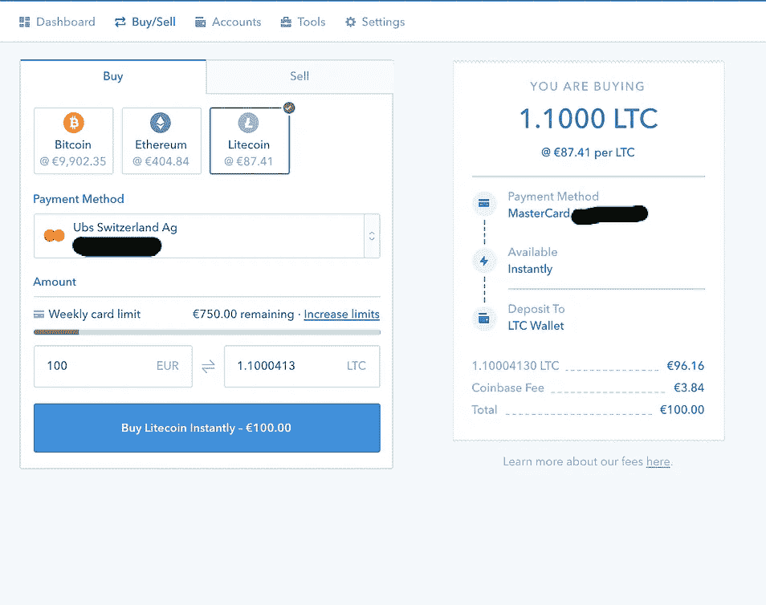
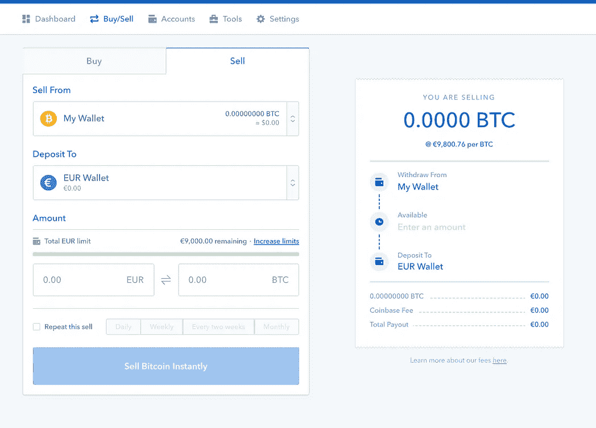
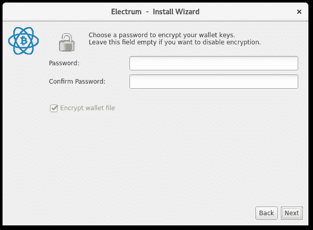
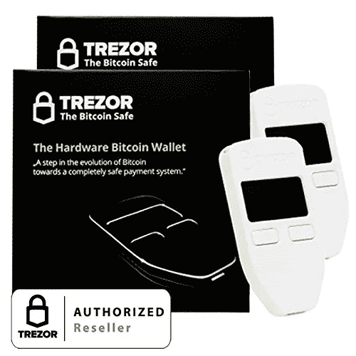
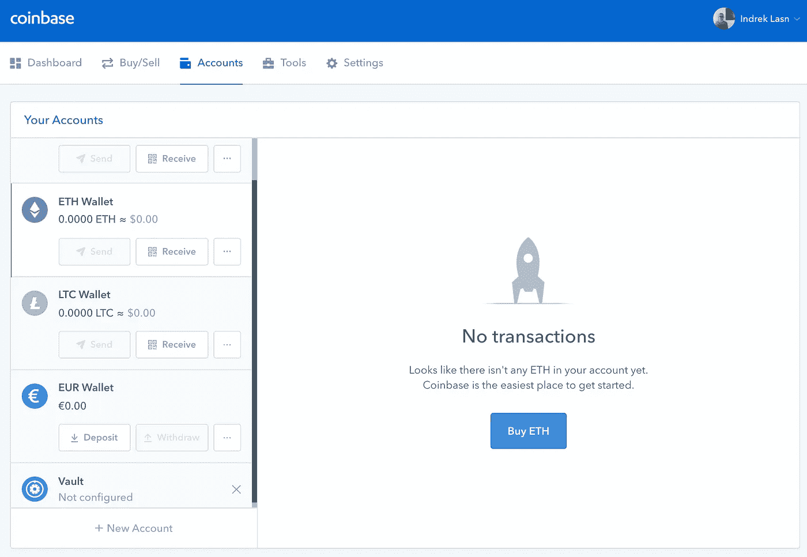

# 如何购买你的第一枚比特币

> 原文：<https://medium.com/hackernoon/coins-for-everybody-buying-your-first-bitcoins-c1ea802c353b>

免责声明#1:永远投资你愿意失去的东西！我建议你不要下超过你愿意输的赌注！加密货币领域非常不稳定，总有可能在明天之前失去一切！我也不会给出任何投资建议， ***购买风险自担！***

免责声明#2:我不为 coinbase 工作。我只是觉得它们很方便。有许多可供选择的选项，但 coinbase 是推荐的一个！

免责声明#3:永远——永远支付你的税款，永远不要试图逃税！

新人经常会带着诸如“我如何开始使用加密货币”之类的温暖问题而来？

假设你已经准备好尝试——购买你的第一枚比特币实际上一点也不复杂。最值得信赖的加密货币交易所叫 [**比特币基地**](https://www.coinbase.com/join/5288df8e344e5a738200043d) (我的推荐链接)。所有我们需要做的是注册一个帐户，验证我们的身份，并添加支付选项。比特币基地有一个非常光滑的仪表板，非常容易使用，而且他们的费用非常低。

比特币基地可以用于在线钱包，跟踪价格，购买和出售密码。

 [## 比特币基地-购买/出售数字货币

### 比特币基地是一个购买、出售、转移和存储数字货币的安全在线平台。

www.coinbase.com](https://www.coinbase.com/join/5288df8e344e5a738200043d) 

# [支持的国家](https://support.coinbase.com/customer/en/portal/articles/1392031-what-countries-are-buys-and-sells-available-in-) — 2017 年 12 月

备选方案:[buybitcoinworldwide.com](https://www.buybitcoinworldwide.com/)

如果你的国家不在列表上，你可以选择使用[**localbitcoins.com**](https://localbitcoins.com/)找到卖家。永远不要先转账，最安全的做法是在公共场所(咖啡馆、图书馆等)面对面，确保卖家是可靠的来源。

让我们 gooo！

# 1.[注册一个 coinbase 账户](https://www.coinbase.com/join/5288df8e344e5a738200043d)

Coinbase registration

去 coinbase 注册你的账户。如果这对你不太麻烦的话，我附上了我的推荐链接，这样你可以支持我和我的写作爱好。我们都赚了 10 美元，这是双赢！

# 2.用**护照**或**驾驶证**或**身份证**签到并验证身份。

Verification success

# 3.添加支付选项(可选，如果你只是想潜伏)

Coinbase payment options

# 4)买/卖！

Buying and selling coins

“种树的最佳时间是 20 年前。第二个**最佳时间**就是现在。”

一旦你买了你的第一枚硬币，把它们转移到一个安全的离线钱包里。离线钱包是存放硬币最安全的地方。[更多关于离线钱包的信息](https://en.bitcoin.it/wiki/Cold_storage)。

我使用的离线钱包是:

*推荐线下钱包:*

**比特币** — [电子钱包](https://electrum.org/#download)离线钱包

**莱特币**——[莱特币](https://litecoin.org/)离线钱包

**乙醚—** [我的乙醚钱包](https://www.myetherwallet.com/)

*推荐硬件钱包:*

[**Trezor 钱包**](https://www.amazon.com/Trezor-bitcoin-wallet-Black/dp/B00R6MKDDE/ref=ice_ac_b_dpb?s=electronics&ie=UTF8&qid=1512322559&sr=1-1&keywords=trezor+wallet)

[**莱杰纳米 S**](https://www.amazon.com/Ledger-Nano-Cryptocurrency-Hardware-Wallet/dp/B01J66NF46)

*推荐 m* 手机钱包:

[**面包**](https://breadapp.com/)

Standard offline wallet and standard cold/hardware wallet

# 发送硬币

输入钱包地址和你要发送的金额，剩下的就交给你了！要格外小心，地址是正确的，一旦交易，这是不可逆转的！

那不是很容易吗？加密货币非常复杂，但入门相当简单！确保你做额外的阅读，不要买你不理解或不相信的东西！我个人希望有一天能用加密货币购买杂货。

感谢阅读！如果你觉得这有用，请给我一些掌声，让更多的人看到它！

## 请随意给我买杯咖啡:

 [## Vaulty

### vaulty . io——只接受一个链接的所有加密货币

www.vaulty.io](https://www.vaulty.io/v/d4a096dd-6773-46f3-9272-4dc223ae1a5d) 

非常感谢！❤