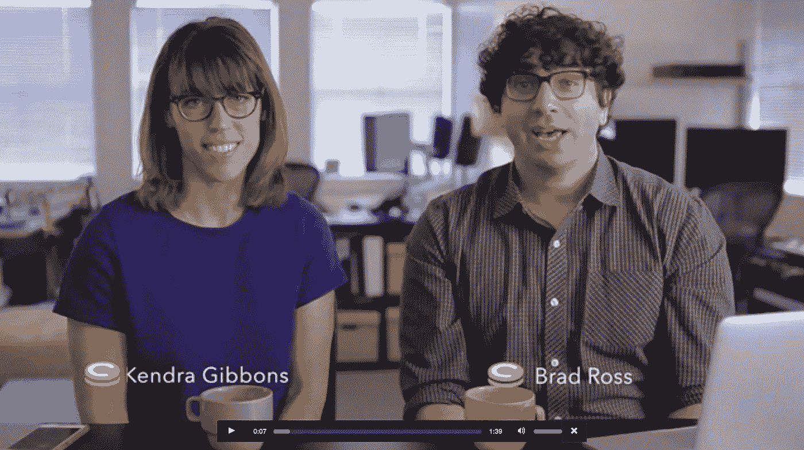
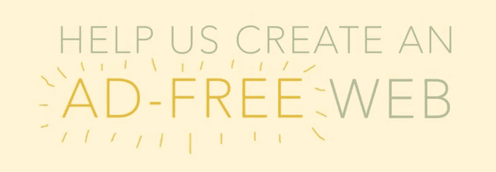

# CoinTent 致力于可持续的无广告网络

> 原文：<https://medium.com/hackernoon/cointent-works-for-a-sustainable-ad-free-web-d49169077b91>

## 我们采访了 CoinTent 首席执行官 T2，讨论他如何建立一个更好的网络和可持续发展的公司。他们最近的 Kickstarter 活动每天产生 1000 多美元。[支持他们的工作，以尽早获得他们的发布者友好的广告拦截 chrome 插件](https://www.kickstarter.com/projects/1475863272/cointent-sustainable-ad-free-web)，以及其他额外待遇。

Photo Credit, [Cointent Kickstarter Video](https://www.kickstarter.com/projects/1475863272/cointent-sustainable-ad-free-web)

## 为什么现在是你的公司存在的时候？

用户受够了网络广告的可怕体验。这使得每月有超过 2.5 亿人使用广告拦截器。但是，网站和出版商正在努力赚足够的钱来生存，特别是当他们 20%的流量屏蔽广告时(美国的平均水平)。需要一个可持续的解决方案，既能给用户更好的体验，又能让网站以可持续的方式赚钱。

## 你喜欢你的团队什么，为什么是你来解决这个问题？

我们的团队在 Zynga 相遇并一起工作。我们喜欢将我们在移动游戏世界的学习和经验，为数以亿计的用户开发游戏，寻找游戏盈利的可持续方式，并将其带到媒体世界。

## 如果你没有创业，你会做什么？

我认为自动驾驶汽车将是未来几年最有趣和最有影响力的变化之一。我也喜欢电子竞技的想法，所以我可能会在那里做点什么！

## 目前，你如何衡量成功？你的衡量标准是什么？

我们有两个客户档案，所以我们对每个都有一个指标。一个衡量标准是每月向支持网站付费的活跃付费用户的数量。另一个是我们能够交付给网站的金额。

## 几句话，你给谁提供什么？

我们为消费者提供无广告的网络体验，支持他们喜欢的网站。它提供了一个更快、更安全、更私密的浏览体验，而不会削弱制作优秀内容的网站。对于网站来说，我们为他们的用户提供一种可持续的方式来删除网络上的广告，同时仍然支持他们喜欢的网站。

## 到目前为止，你的牵引最令人兴奋的是什么？

我们的无广告产品在测试期间立即获得了非常高的转化率，这也是我们对此感到兴奋的部分原因——我们知道对它有巨大的需求！

## 你觉得明年你的成长会在哪里？

不知道。我们有几个场景，但希望成为成千上万的付费用户。

## 请告诉我们您的第一个付费客户以及下一年的收入预期。

我们的第一个付费客户是一个我们仍然不认识的随机软件工程师(尽管我们联系了他！).我们的目标是到明年年底拥有成千上万的付费用户。

## 你最大的威胁是什么？

我们最大的威胁是没有达到临界质量。我们依赖于接触到足够多的用户，我们可以为网站提供大量的资金。

Photo Credit, [Kickstarter Video](https://www.kickstarter.com/projects/1475863272/cointent-sustainable-ad-free-web)

> [黑客中午](http://bit.ly/Hackernoon)是黑客如何开始他们的下午。我们是 [@AMI](http://bit.ly/atAMIatAMI) 家庭的一员。我们现在[接受投稿](http://bit.ly/hackernoonsubmission)，并乐意[讨论广告&赞助](mailto:partners@amipublications.com)机会。
> 
> 如果你喜欢这个故事，我们推荐你阅读我们的[最新科技故事](http://bit.ly/hackernoonlatestt)和[趋势科技故事](https://hackernoon.com/trending)。直到下一次，不要把世界的现实想当然！

