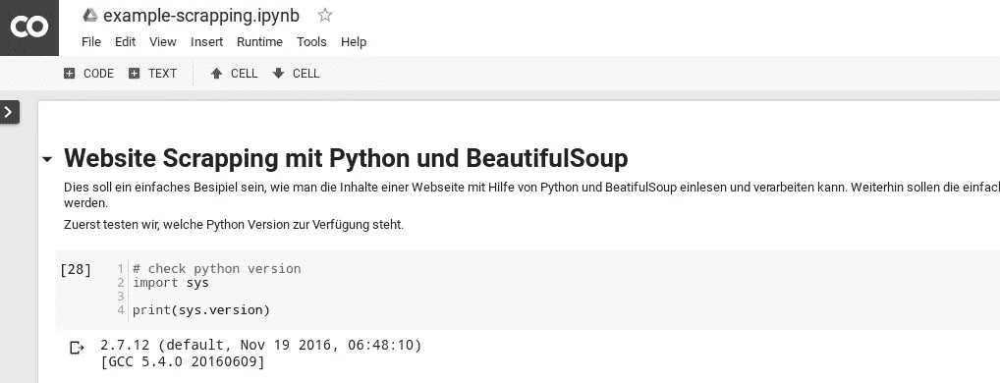

# Collaboratory — Google — Research at Google — Webscraping with Python 的例子

> 原文：<https://medium.com/hackernoon/colaboratory-google-research-at-google-am-beispiel-webscraping-mit-python-d73f1b9bf987>

直到最近才被发现:Google 的平台可以快速创建[Python](https://hackernoon.com/tagged/python)脚本,并以 Jupyter Notebook 的形式进行管理。所有选项都可以在下面看到: [https://colab.research.google.com](https://colab.research.google.com) 。在`matplotlib`上输出,使用`NumPy`,在`pip`上安装额外的 Libs,以及和。

使用它需要一个邀请。当调用 o.g.链接时,您将被告知并可以请求邀请。对我来说,这并没有持续 24 小时。

只是试一试。

这里举一个笔记本的例子:

[使用 Python 和 BeautifulSoup 的网页抓取(T8)](https://drive.google.com/file/d/0B64FHA3lq-xyLUxBSFktbldIRUU/view?usp=sharing)

目前(不幸的是)只有 Python 2.7.x 可用。对于*Jupyter*这样的工作,但绝对值得推荐。特别是与*Google Drive*的无缝集成,我觉得很棒。您可以轻松地从[Google](https://hackernoon.com/tagged/google)Drive 创建一个新的笔记本,当然也可以像 Google Drive 一样共享和共享其他文件的链接。好东西。

希望该产品能够得到进一步的开发和维护。众所周知,谷歌正在迅速埋葬现有产品。在这里,谷歌希望将机器学习(T16)或深度学习(T18)的功能提升到一个简单的平台。因此,我乐观地认为这个项目不会成功。

大拇指为此!

建议,更正和其他意见一如既往的欢迎!

Stay Tuned. :)

*postet on* [*mosenturm.de*](https://mosenturm.de)