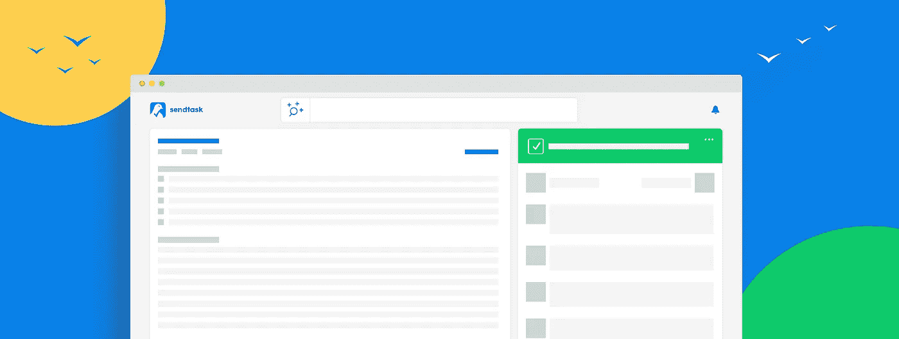
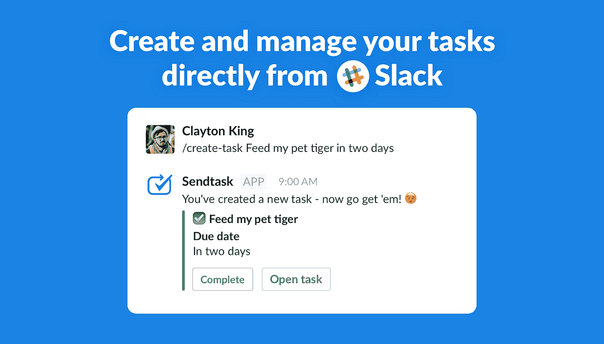
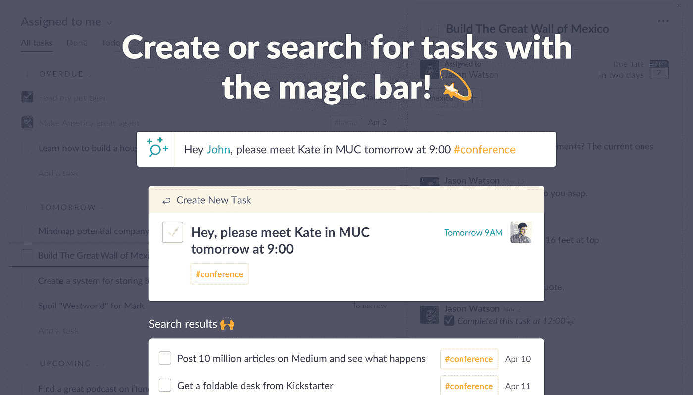
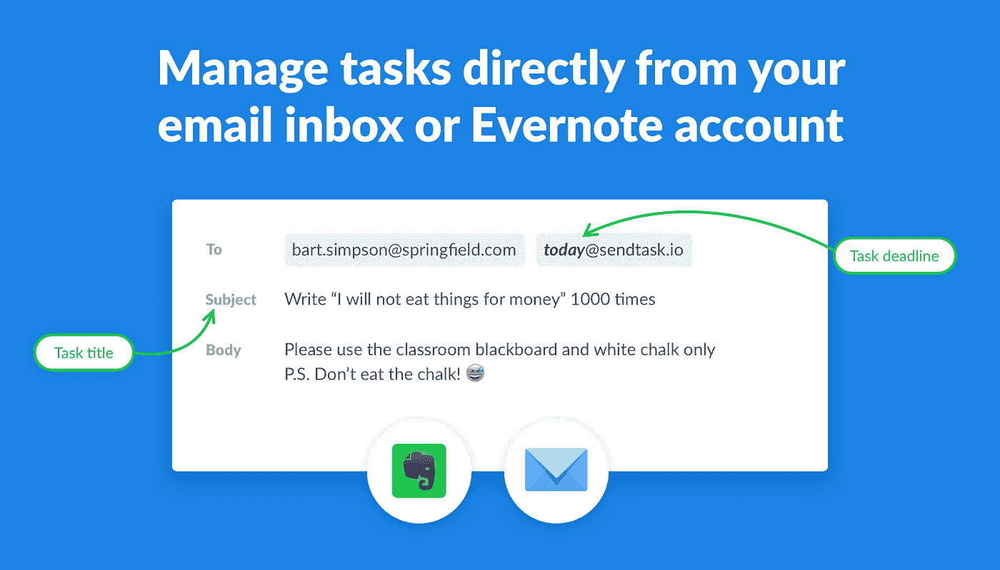

# 轻松地与任何人协作，即使他们没有 Sendtask 帐户

> 原文：<https://medium.com/hackernoon/collaborate-with-anyone-easily-even-if-they-dont-have-an-account-with-sendtask-b75546bfce47>

*最初发表于*[*【siftery.com】*](https://siftery.com/stories/collaborate-with-anyone-easily-even-if-they-dont-have-an-account-with-sendtask)*。*

[**Sendtask**](http://sendtask.io/) 是直接从电子邮件管理项目的最简单方式。它改进了您的在线协作方式，而无需将整个团队转移到新的复杂软件包。

Sendtask 允许您使用电子邮件向任何人分配任务，然后自动构建一个共享工作区，其中包含高效工作流所需的所有[工具](https://hackernoon.com/tagged/tools)。Sendtask 工作区允许您讨论任务、更改截止日期、附加文件等等—所有这些甚至都不需要设置帐户！。

[**凯文威廉大卫**](https://www.linkedin.com/in/kevinwilliamdavid/) 采访了 [**塞德里克瓦尔德伯格**](https://www.linkedin.com/in/cedricwaldburger/)[**send task**](https://siftery.com/sendtask)了解更多。

## 嗨，塞德里克，跟我们说说你在做什么？

我们正在构建世界上最开放的协作任务管理器。我们认为，分享任务以进行协作比发送电子邮件更有效。电子邮件可能会丢失，没有截止日期，也不能重新分配。现有的协作任务管理器的问题是让某人参与进来很麻烦——这就是为什么大多数人只在他们的团队中使用它。Sendtask 使与任何人共享任务变得很容易，即使他们没有帐户。Sendtask 还集成了 email 和 Slack，这样你就可以在任何你觉得最有效率的地方完成工作。

## 请多告诉我一些你想解决的问题？

虽然我们热爱**[**Trello**](https://siftery.com/trello)以及类似的工具，并一直在我们的团队中使用它们，但我们注意到一件事:每当我们与自由职业者、服务提供商或其他第三方合作时，我们不是给他们发任务，而是回到我们的旧习惯，给他们发电子邮件！**

**为什么？因为当你们只在一起工作几周或几个月的时候，没有人愿意经历创建账户和入职的麻烦。**

**这就是我们决定开发 Sendtask 的原因——它结合了协作任务管理的强大功能和电子邮件的便捷性。Sendtask 允许你向任何人发送任务——只要你只需要知道他们的电子邮件地址。收件人不需要创建帐户，但仍然可以完成他应该能够完成的所有任务，包括讨论、添加附件、更改受理人和截止日期，当然还有完成任务。在你能开始有效地与某人一起工作之前，你需要上船的日子已经一去不复返了！**

## **Sendtask 与市场上已有的有何不同？**

**我们与竞争对手的区别主要有几个方面，比如**[**Asana**](https://siftery.com/asana)[**团队合作**](https://siftery.com/teamwork-projects)[**Podio**](https://siftery.com/podio)等等。****

****首先，Sendtask 让你可以和任何人合作——即使他们没有账号。这使得用户搭载人员变得非常容易。****

****其次，因为 Sendtask 使用电子邮件工作，我们能够高效地构建一些很酷的集成。目前，我们的 Slack 和电子邮件集成已经投入使用。有人让你在空闲时间做一些事情，这种情况在你身上发生的频率有多高？过去，您必须手动进入任务管理器，记下笔记，然后返回 slack。通过与 Sendtask 的 Slack 集成，您可以使用超级简单的语法直接从 Slack 发送和创建任务。****

********

****此外，你会发现 Sendtask 可以识别自然语言，所以你可以使用“明天下午 5 点”或“星期五中午”这样的词来设置截止日期。****

********

****本质上，我们已经为在不同团队中从事多项任务和项目的人优化了 Sendtask。我们的竞争对手都无法让您对所有任务有一个良好的 360 度视角。****

## ****有意思，那么给我们讲讲使用 Sendtask 的不同客户群吧？****

****我们服务于创造者——那些充满好奇心并创造新事物的人。目前，Sendtask 正被那些管理多个项目并有任务密集型工作日的人使用。我们在各大洲都有活跃的用户——从瑞士的建筑师到拉丁美洲的社会企业家项目，甚至还有一家在泰国建造公共厕所的公司。企业家和他们的团队、项目经理、自由职业者和教师都支持 Sendtask。****

## ****您的客户如何使用 Sendtask？你能分享一些不同的使用案例吗？****

****Sendtask 是一个相当直观的产品，所以大多数人都按照我们期望的方式使用它。通常，会创建一个新项目，然后用任务填充它。然后，任务被分配给它们的任务所有者，并在此时设置截止日期和优先级。通常，在工作开始时，被分配人和分配任务的人之间会有沟通。人们在完成任务后开始添加评论和附件。通常，工作负责人会将任务重新分配给创建该任务的原始人员进行审阅，并最终将任务标记为完成。****

## ****Sendtask 有没有你没有想到或预料到的独特用例？****

****我们最初认为 Sendtask 将被主要在线工作的严格数字化企业使用。然而，目前我们最活跃的商业用户之一是泰国的一家马桶制造商！我们也有婚礼组织者和其他有物理位置的企业，他们发现使用 Sendtask 组织他们的项目很有用。****

## ****有什么早期的“成长秘诀”或策略促成了你现在的成功吗？****

****迄今为止，我们最大的流量和新用户来源是在像**和 [**BetaList**](https://siftery.com/company/betalist) 这样的网站上发布。我们还从一个波兰博客上获得了令人惊讶的报道，这个博客转化得非常好。******

## ****在早期构建产品时，最大的挑战是什么？你是如何解决的？****

****我们一开始的想法是将任务管理、日程安排和笔记整合在一起。我们建立了一个 MVP，并很快发现市场需要一个开放的解决方案，让他们与任何人分享任务，而不仅仅是他们的直属团队。这个 MVP 演变成了 Sendtask。这与其说是一个挑战，不如说是一个学习的过程，但我觉得这是我们必须克服的，以便达到我们现在的位置。****

## ****你加入的最有趣的整合是什么？有什么对你特别有影响的吗？****

****现在，我们的 Slack 和电子邮件集成正在运行。它们可以让你管理你的任务，而不需要留下你的电子邮件或空闲时间。此外，一个有趣的事情是能够使用 Evernote 的 Sendtask。我们曾打算在这个早期阶段集成 Evernote，但 Evernote 的电子邮件功能允许你将笔记发送到你的 Sendtask 帐户，它们将显示为要完成的任务。因为我们已经建立了这样一个连接到电子邮件的开放系统，我们经常能够以一种快速而简单的方式实现集成。****

********

## ****最后，在我们结束之前，你运营公司所依赖的顶级产品是什么&你如何使用它们？****

****当然，我们使用 [**Sendtask**](https://siftery.com/sendtask) 来管理所有与动作相关的信息(项目和任务)。在我们的团队中，我们使用 [**松弛**](https://siftery.com/slack) 进行一般交流。我们每周都要在 [**上露面**](https://siftery.com/appearin) 。我们使用谷歌日历安排日程。我们将文件和文档存储在 [**Google Drive**](https://siftery.com/google-drive) 中。我们使用 [**对讲机**](https://siftery.com/intercom) 与用户互动和交流。对于分析，我们主要依靠 [**谷歌的**](https://siftery.com/google-analytics) 万能分析。****

************************

> ****[黑客中午](http://bit.ly/Hackernoon)是黑客如何开始他们的下午。我们是阿美族家庭的一员。我们现在[接受投稿](http://bit.ly/hackernoonsubmission)并乐意[讨论广告&赞助](mailto:partners@amipublications.com)机会。****
> 
> ****如果你喜欢这个故事，我们推荐你阅读我们的[最新科技故事](http://bit.ly/hackernoonlatestt)和[趋势科技故事](https://hackernoon.com/trending)。直到下一次，不要把世界的现实想当然！****

********