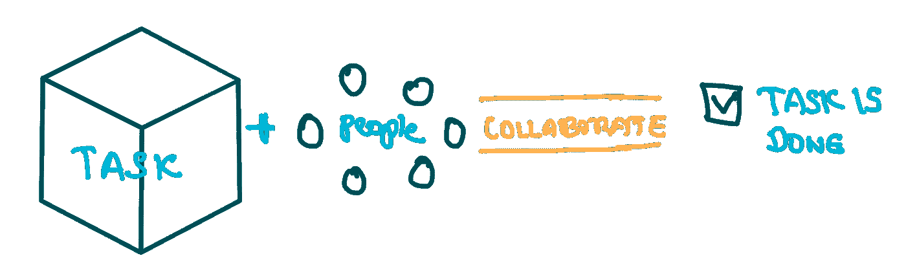
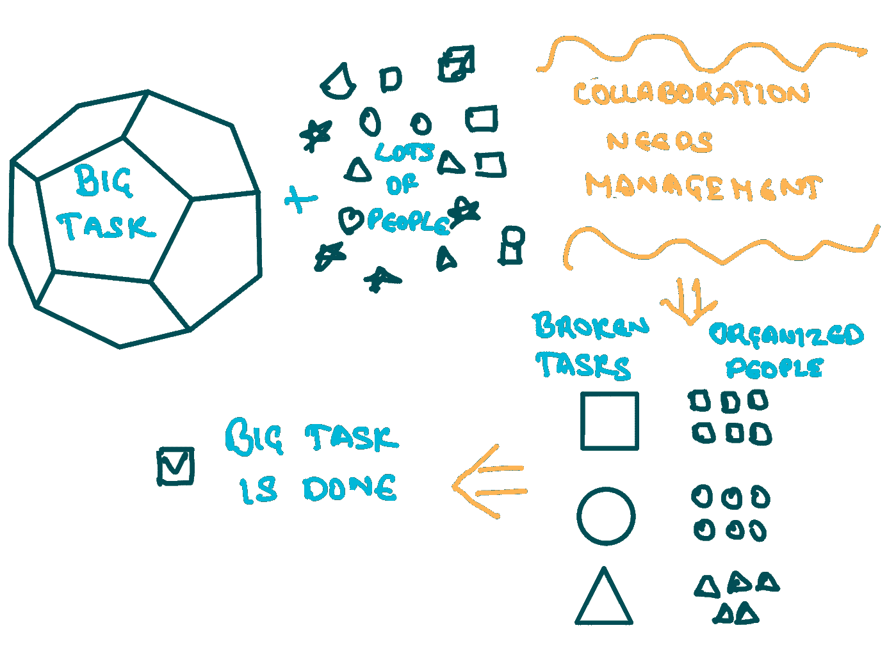
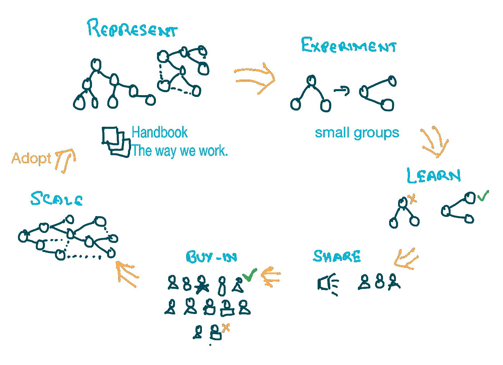

# 大规模协作

> 原文：<https://medium.com/hackernoon/collaboration-at-scale-b27f17b4614a>

## 整体能大于部分之和吗？

在早期，当一头牛拉不动越来越多的货物时，就增加更多的牛。合作之所以发生，是因为等级分明，权力在司机那里，否则，牛会选择自己的路。

> “没有人能吹口哨演奏交响乐；演奏它需要整个管弦乐队”——哈尔福德·勒科克

观看一个管弦乐队是有趣的，指挥不演奏单一的乐器，而是统一整个管弦乐队。她/他将愿景转化为美妙的音乐。这个小组合作，因为他们有一个指挥可以指挥。如果指挥没有集中注意力，或者团队中的任何人在掌权，噪音就会出现。当通信失败时，噪声也可能出现。

> 整体大于部分之和。——亚里士多德

协作是指在一个团体中一起工作以生产某种东西的行为。如下图所示，有一个任务，有一组人一起合作完成。

随着任务的扩展会发生什么？人员规模，要么给人更多的任务，要么增加更多的人。

增加更多人员的主要原因是为了更快地完成任务。这是否意味着个人效率的总和可以线性提高团队生产率？如果 100 天可以用 10 个人造一座桥，1 天可以用 1000 个人造一座类似的桥吗？

大规模的合作需要管理，这就是为什么彼得·德鲁克称管理为 20 世纪最重要的创新。决定协作成功的一个因素是完成任务的速度和敏捷性。

> “协作是指在一个团体中一起工作以生产某种东西的行为。协作的成功是更高的生产力，这是有效决策、敏捷性、有效沟通和参与的结果。”

2012 年，谷歌启动了一项名为 [Project Aristotle](https://www.nytimes.com/2016/02/28/magazine/what-google-learned-from-its-quest-to-build-the-perfect-team.html) 的计划，旨在寻找“为什么对某些团队来说，整体大于部分之和？”。他们查看了全公司 180 个团队，收集了大量数据。他们研究了团队成员在群体环境中的行为。研究结果得出结论，作为一个团队，一群为个人最高效率而优化的聪明人，并不一定比一群相对不聪明的人更聪明。他们发现，第一个最重要的环境是心理安全，正如这里的所写的——“一种团队不会因为某人说了出来而为难、拒绝或惩罚他的信心”。另外四个是可靠性、结构和清晰度、工作的意义和工作的影响。

> 一次成功的合作可以产生“整体大于部分之和”的效果。

# 等级制度

层级是管理结构的一种表现形式。有多种实现方式，如推层次结构、拉层次结构、[线层次结构](http://wirearchy.com/what-is-wirearchy/)等。结构是定义工作职责的角色的表示。

等级制度主要是通过引入经理、在经理下分配团队以及经理管理不同风格的员工来实现的。方向和策略由高层决定，并由团队执行。众所周知，这是一个典型的模式，并且被更成功地采用。许多公司用这种模式建立了成功的团队。这种模式目前正被[质疑](https://hbr.org/2016/07/research-narcissists-dont-like-flat-organizations)和[不被千禧一代](https://workplacetrends.com/the-millennial-leadership-survey/)喜欢。一些主要原因是管理人员的成本，人们花在协作上的时间更少，花在管理上的时间更多，花在等待和说服老板同意简单决策上的时间更多，管理人员偏爱等等。

# 自我管理的兴起

像许多其他人一样，谷歌的工程师认为“管理是破坏性的，而不是有益的”，并尝试了一种完全扁平的层级结构，并将其称为“ [Project Oxygen](https://hbr.org/2013/12/how-google-sold-its-engineers-on-management) ”。来自[来源](https://hbr.org/2013/12/how-google-sold-its-engineers-on-management)、*的实验结果“随着公司的成长，创始人很快意识到管理者在许多其他重要的方面做出了贡献——例如，沟通战略、帮助员工优先考虑项目、促进协作、支持职业发展以及确保流程和系统与公司目标一致”。*Project Oxygen 团队得出结论，管理者确实是必需的，但必须弄清楚最好的管理者做什么，并为一个好的管理者列出一系列素质。

Basecamp 相信一个由 50 名员工为 250 万客户服务的扁平层级结构。他们相信雇佣那些有“横向抱负”而不是“纵向抱负”的人。这意味着他们想要那些想要掌握他们所做的艺术的人，而不是那些想要掌握管理他们所做的事情的人。他们相信自我管理的团队，每个团队都有一个轮换的团队领导。从 5 月到 10 月，他们也有三天的周末，理由是“工作时间越少，浪费的时间就越少”。

Zappos 用一个名为 holacracy 的系统在 1500 名员工的规模上实现了自我管理。 [Holacracy](https://www.holacracy.org/) 是一个自治的组织运作系统。这是一种受城市运作方式启发的结构，在这里，人们和企业是自我组织的，并由一部[宪法](https://www.holacracy.org/constitution)管理。当工作需要完成时，个体聚集在一起，当工作完成时，个体解散。[战术会议](https://www.holacracy.org/tactical-meetings)用于[化解紧张](https://blog.holacracy.org/processing-tensions-5f2712be589a)。Holacracy 是等级制度，等级制度是民主运行的圈子。上层圈子比下层圈子权威。 [Zappos](http://www.zappos.com/) 从 2011 年 12 月开始使用这个系统，声称取得了成功，并提出了[个问题](https://www.forbes.com/sites/stevedenning/2015/05/23/is-holacracy-succeeding-at-zappos/#7f2eed0656dc)。[中等下降 holacracy](https://blog.medium.com/management-and-organization-at-medium-2228cc9d93e9) 称难以大规模协调工作。

晨星公司有 400 名员工，年收入超过 7 亿美元，它有一种激进的管理方式，叫做“自我管理”。40 多年来，他们证明了经营一家成功的公司不需要经理。每年，每位员工都要与相关利益相关者协商[同事谅解书](http://www.managementexchange.com/story/colleague-letter-understanding-replacing-jobs-commitments) (CLOU)。同事们在这里竞争的是交付的价值和责任，而不是晋升。当同事感到超负荷工作时，他/她就会开始招聘，薪酬由同事根据自己的收入决定，没有头衔或晋升，任何人都可以购买任何所需的工具，任何决定都是基于个人责任或共识。

[层级制](http://wirearchy.com/what-is-wirearchy/)，在这里[定义为](http://wirearchy.com/what-is-wirearchy/)，是“权力和权威的动态双向流动，基于知识、信任、信誉和对结果的关注，由相互联系的人和技术实现”。它依靠冠军和渠道来运作——支持创意和创新，而不是命令和控制。这种模式相信有效的知识共享，强调人们通过联系和协作一起工作。

开发像[半条命](https://en.wikipedia.org/wiki/Half-Life_(series))、[反恐精英](https://en.wikipedia.org/wiki/Counter-Strike)这样的游戏的公司有移动工作站，允许你将你的工作站移动到任何楼层，移动到任何团队，做任何员工觉得有趣的事情。还有一个选择是为想法和团队分配时间。在 [Valve](http://valvesoftware.com/) ，从事同一个项目的员工根据生产力、技能和其他贡献进行排名，这些排名用于决定工资的总体排行榜。

[孟买 Dabbawala](https://en.wikipedia.org/wiki/Dabbawala) 是一种令人印象深刻的方式，由近 5000 名 Dabbawala 以极低的成本分拣、运输、交付和返还近 200，000 份午餐盒。它已经运行了 125 年。每天，他们在 6 小时内完成近 260，000 笔交易，错误率为 1/1600 万次交付。员工是半文盲，自我管理，不使用 IT 系统或移动电话就能合作。他们有一个扁平的组织结构，有近 200 个单位，每个单位有 25 名成员，这些成员自主运作。他们遵循一套指导方针，但在招聘、冲突解决、客户获取和保留方面进行自我管理。Dabbawala 是大规模成功合作的一个证明，没有具有非凡才能的人。

> “扩展业务就是扩展人员，以有效解决更多问题。”

# 跨文化的等级

在全球性公司中，权威和等级制度变得令人困惑，尤其是当全球分布的团队需要协作时。原因是预期和实际管理风格的差异。[这篇文章](https://hbr.org/2017/07/being-the-boss-in-brussels-boston-and-beijing)很好地解释了这在不同文化中是如何运作的。

美国经理是平等主义者，但通常实行自上而下的决策。他们也能更快、更灵活地做出决定。日本经理人等级森严，但有着建立共识的强大传统。日本经理人遵循两种达成共识的方法。第一个是 *nemawashi —* 与利益相关者单独谈话以事先达成一致的做法。第二种 *ringi* —从底层开始跨层传递提议的做法。他们需要时间来决定，但是一旦决定了，就不太灵活了。

# 这是否暗示等级制度是错误的？

日本和美国都是成功的经济体，很难说等级制度是对还是错。然而，在全球性的公司里，权威和等级会变得混乱，尤其是当全球分布的团队需要协作的时候。但是让人们跨越文化，更好的办法是教育和明确协作是如何发生的。

# 采用新模式还是改变现有模式？

选择或改变现有模式并不容易，这取决于组织的规模和当前模式的持续时间。相对于职位较低的人来说，职位较高的人可能不喜欢这种变化。对于一个 EVP 或 VP 这样的人来说，这个头衔可能是他加入公司的灵感来源，他应该在多年的努力工作后获得这个头衔。这对他/她来说可能是职业发展的代表，很难为了一个新的模式而在一夜之间放弃它。相信纵向增长的人以及从主流工作岗位转向管理层的人也可能会有抵触情绪。

当公司规模小的时候，更早地开始这种模式相对更容易，因为谢家华认为如果他能做得更好，他会更早地做。晨星很早就开始了。

在管理层选择一种模式，然后推动这种模式[可能也不起作用](http://fortune.com/zappos-tony-hsieh-holacracy/)。最好在较小的小组中进行实验，然后将结果和发现卖给其他团队。结果还可以表明，当前模型比新模型更有成效，唯一的方法是基于从实验中获得的学习和反馈来尝试更多的模型。最好雇佣那些相信你的合作风格的人。

Adopting new model

# 无畏的冒险

要进行协作，因为有许多人参与其中，所以理解决策是如何进行的就变得非常重要。每个人都应该理解并认同权威在团队中是如何运作的，以及如何作为一个团队进行沟通和执行。理解这一点很重要，因为它成为文化的重要维度之一。

一个好的组织将有一个好的层次结构的表示、实现和执行的交集。尽管这些公司中的许多都有有趣的模型，但对每个人来说使用这些模型可能并不容易。一个组织的成功模式对另一个组织可能不一样。As 阀[手册](http://www.valvesoftware.com/company/Valve_Handbook_LowRes.pdf)以副标题开头

> "当没有人告诉你该做什么的时候，知道该做什么是一次无畏的冒险？"

# 大规模协作

随着组织的发展，协作变得越来越困难。因此，随着组织的成长，等级制度可能不容易消除，但可以很好地实施——通过尊重多样性以及采用和实施权威和决策的更好方式。选择一个不妨碍协作并且适合组织环境的模型。

> “首先，我们塑造我们的结构。然后，我们的结构塑造了我们。”——温斯顿·丘吉尔

在目前的经济形势下，人们在公司之间流动非常快，最好明确公司的层级、权威、决策和沟通是如何工作的。最好雇佣那些相信你的合作风格的人。记住他们渴望什么是好的。对一些人来说，头衔和晋升比加薪更重要。

> “如果您打算改变协作模式，最好让框架简单而熟悉，这样就可以轻松采用。”

下一个十年可能会看到命令和控制模式的淡化，在层级实现中看到更多的创新会很有趣。看到能够处理组织规模、保持基础正确并能使整体大于部分之和的模型将会很有趣。

我的文章副本[https://www . LinkedIn . com/pulse/collaboration-scale-can-whole-than-sum-its-balashanmugam](https://www.linkedin.com/pulse/collaboration-scale-can-whole-greater-than-sum-its-balashanmugam)