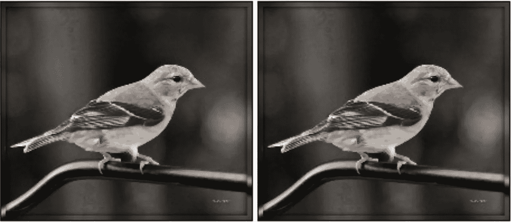
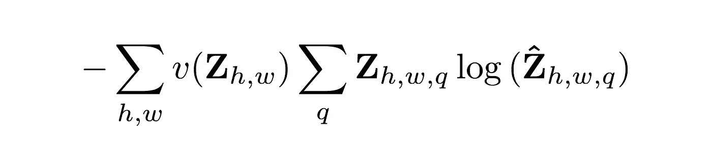
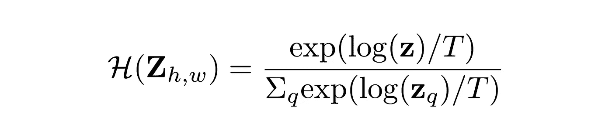
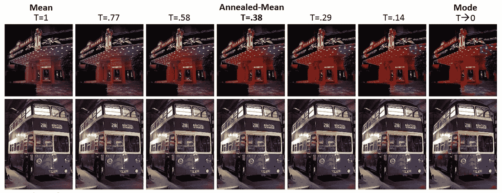
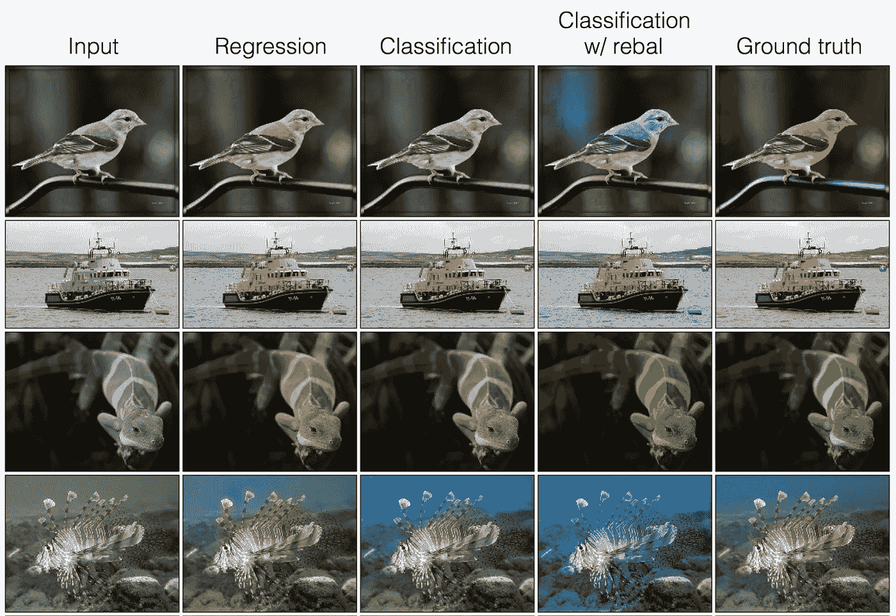
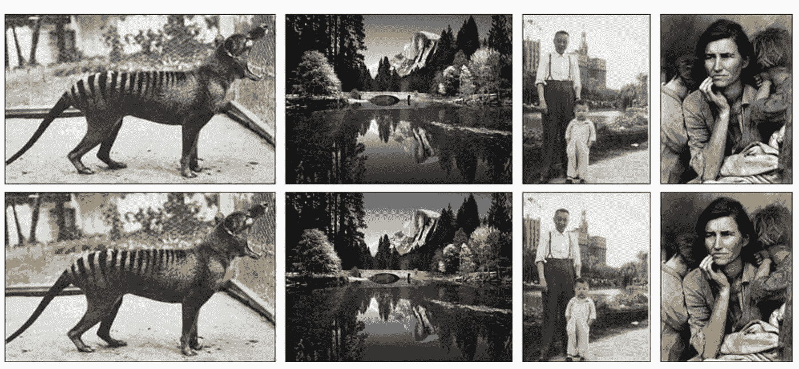

# 使用深度学习给黑白照片着色

> 原文：<https://medium.com/hackernoon/colorising-black-white-photos-using-deep-learning-4da22a05f531>

eep 学习增强了视觉和语言处理等“认知”任务。甚至谷歌也转而使用基于神经网络的翻译。一个可能的原因是，它不需要特定领域的知识来获得最先进的结果。此外，GPU 等无限并行的硬件，加上 TensorFlow 等精心设计的框架，引发了人工智能革命。这篇文章谈到了另一个这样的“认知”任务:使用[深度学习](https://hackernoon.com/tagged/deep-learning)给黑白照片着色。

这篇文章基于最近的一篇论文:[https://arxiv.org/pdf/1603.08511.pdf](https://arxiv.org/pdf/1603.08511.pdf)

本文假设关于**神经网络**和**损失函数**的基本知识。

# 任务

这项任务相当简单:拍摄一张黑白照片，然后将其制作成彩色版本。直觉上，这个想法很简单。根据图片中的内容，可以判断出应该是什么颜色。树叶通常是绿色的，天空是蓝色的，云是白色的，等等。所有需要做的就是让计算机能够做到这一点。

# 以前的工作和问题

之前的作品都使用了深度学习。他们使用回归分析来预测每个像素的颜色。然而，这产生了相当平淡无奇的结果。

Figure 1.0 Results of a regression based model. **Left:** Input to the model. **Right:** Output of the model

先前的工作使用均方误差(MSE)作为损失函数来训练模型。作者指出，MSE 将尝试“平均”出颜色，以获得最小的平均误差，这将导致平淡无奇的外观。相反，作者把给图片着色的任务作为一个分类问题。

# 模型的输入和输出

作者使用 LAB 色彩空间(最常见的色彩空间是 RGB)。在实验室方案中，L 通道记录光强度值，另外两个通道分别记录颜色对手绿色-红色和蓝色-黄色。你可以在这里阅读关于 LAB 的详细[。](https://en.wikipedia.org/wiki/Lab_color_space)

使用 LAB 色彩空间的一个很好的理由是它可以保持光强度值的分离。B/W 图片可以被认为只是 L 通道，该模型在进行预测时不必学习如何保持光强度正确(如果使用 RGB，则必须这样做)。该模型将只学习如何给图像着色，让它专注于重要的事情。

该模型输出 AB 值，然后可以将其应用于黑白图像以获得彩色版本。

模型本身就是一个相当标准的卷积神经[网络](https://hackernoon.com/tagged/network)。作者没有使用任何池层，而是选择使用上采样/下采样层。

# 颜色量化

如上所述，作者使用了分类模型而不是回归模型。因此，班级的数量需要固定。作者选择 313 个 AB 对作为类别数。即使这看起来是一个非常低的值，他们使用了一些方法来确保更多的颜色值是可能的(这将在本文后面讨论)。

# 损失函数

作者使用的损失函数是标准交叉熵。Z 是一个像素的实际类，而 Z hat 是模型的输出。

**Equation 1.0** Standard Cross Entropy

作者还指出，颜色值会有等级不平衡。交叉熵是一种损失函数，它不能很好地处理类别不平衡，通常具有较少实例的类别被赋予较高的权重。作者指出，与其他颜色相比，像灰色和浅蓝色这样的不饱和颜色更丰富，因为它们出现在背景中。因此，他们想出了他们的称重方案。

**Equation 1.1** Weighing scheme

作者从 ImageNet 数据库中计算~p，这是类的分布。记住 Q 是类的数量(313)。作者使用λ值为 0.5 效果很好。注意作者平滑了分布~p，但是我将在这里跳过细节。有兴趣的可以在原论文里看一下。

所以在考虑了重量之后，最终的损失函数看起来是这样的:

**Equation 1.3** Loss function after weighing scheme

新的项 v()就是每个类的权重值。h 和 w 分别是图像的高度和宽度。

# 从类别中预测颜色

直接使用类别号 313 来给图像着色会太粗糙。颜色实在太少了，无法真实地表现颜色的真实范围。

作者使用了后处理步骤，以便从模型的预测中获得更多样化的颜色范围。

**Equation 2.0** Calculating color from class probabilities

h 是函数，Z 是模型的输出。t 是一个超参数，作者用几个不同的值进行了实验。

**Figure 1.0** Effect of different values of T

这是一个好步骤的原因是因为模型的输出将具有关于类概率的非常有价值的信息。上面的函数不是只取具有最大概率的类(就像我们在图像分类中所做的那样)，而是试图利用关于模型输出的整个概率分布的信息。

# 培训框架

训练这样的网络分为两部分。首先，数据通过模型传递(正向传递)，然后计算最终预测。为了计算损耗，需要计算 H 的倒数。

# 结果

结果更加生动，而且在大多数情况下，非常接近真实。请注意，很多时候它与地面真实情况并不完全相同，但它在语义上仍然是正确的(模型用正确的颜色给正确的对象着色)。

**Figure 2.0** Comparison between different colouring frameworks

## 给传统黑白照片着色

**Figure 2.1** Colouring photos that were originally taken in Black & White

# 结论

在这篇文章中，我们讨论了一种新的方法来彩色图像使用一个修改的损失函数。我们讨论了如何使用超参数来控制活力，以及为什么类再平衡在自然图像着色中起着重要作用。

# 行动呼吁

如果你喜欢这篇文章，**只要你认为这篇文章有价值，就按住那个拍手图标**。我总是在寻找反馈来改进我的文章。如果你有建议或问题，请随时回复。