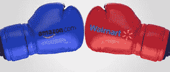
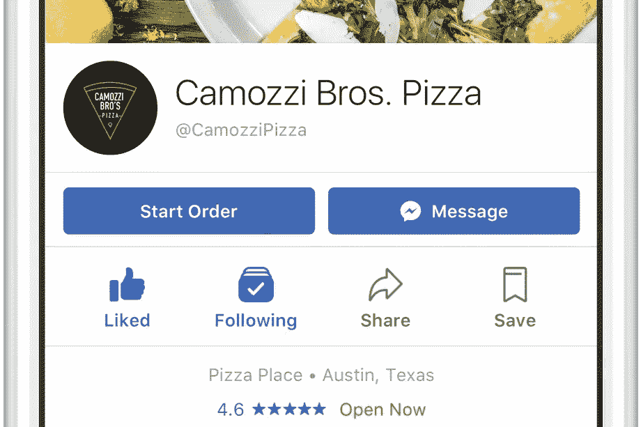
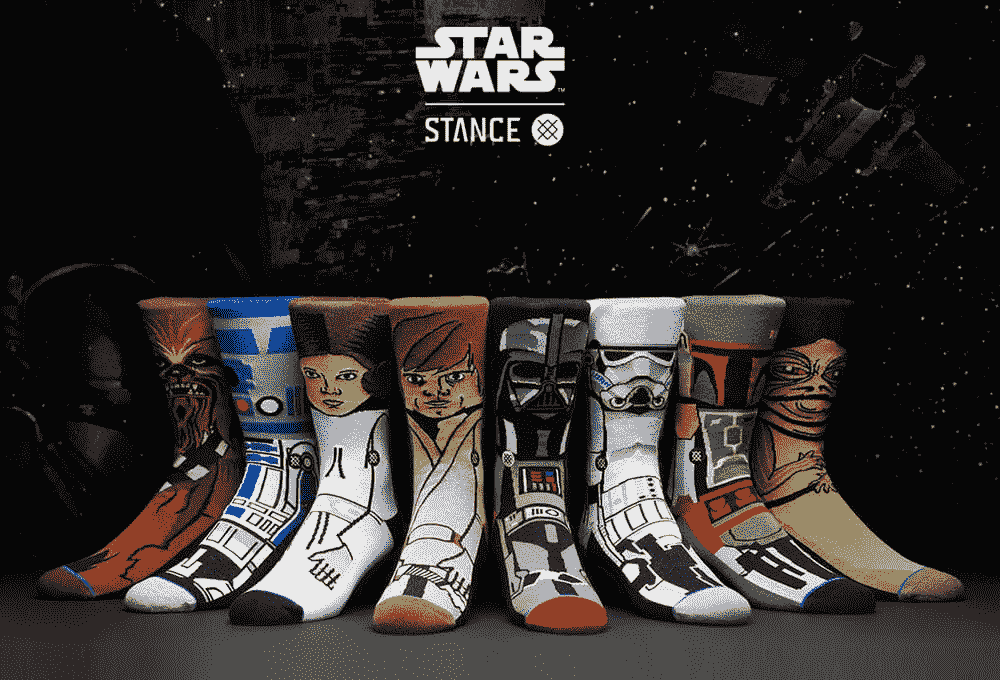

# 商业战争周刊#3

> 原文：<https://medium.com/hackernoon/commercewars-weekly-3-6a20a846acd8>

## 过去一周的电子商务新闻&巨头之战。

这是商业战争日志，第三周，第一天。

在上周关注了亚马逊- [谷歌](https://hackernoon.com/tagged/google)战线(主要围绕人工智能助手)之后，本周更多的是关于亚马逊与沃尔玛的大战。沃尔玛度过了美好的一周，其股价上涨 4.5%，达到两年来的最高水平，此前该公司预测明年美国在线销售额将增长约 40%，并宣布了 200 亿美元的股票回购。该公司作为大型游戏中可能的幸存者的积极看法的驱动因素之一是其电子商务将军马克“约翰·斯诺”的传说。Lore 是沃尔玛电子商务部门强有力的领导者，他的工作可能是当今世界上最具挑战性和最有趣的工作。他与亚马逊的个人历史强化了关于 Lore 的传说，亚马逊几乎杀死了他的旧公司 Quidsi，然后收购了它。这是他在 [***采访***](https://www.linkedin.com/feed/update/urn:li:activity:6323624764908806144) 中不得不说的话。

在 Lore 的采访中，我发现最有趣的事情之一是沃尔玛杂货提货实验有多成功。根据传说，该服务的 NPS 分数为 87(！).NPS(净推介值)是一种可以用来衡量公司客户关系的工具。它是一个从 0 到 100 的指数，衡量客户向他人推荐公司产品或服务的意愿。NPS 87 分，不可思议。

但是现在还不需要担心亚马逊……虽然沃尔玛在利用其数以千计的物理位置方面做得很好，但亚马逊在利用其技术、数据、客户基础和物流优势方面做得更好。如果你有时间，请阅读 Jon Nordmark 写的这篇非常长、非常有趣的文章，内容是关于亚马逊的自有品牌，以及它如何利用数据来建立一个庞大的业务。

虽然亚马逊通常从投资者那里获得无限的信贷，但一些人对其视频投资越来越持批评态度:[亚马逊的视频业务只是分散注意力吗？](https://www.bloomberg.com/gadfly/articles/2017-10-10/amazon-needs-to-prove-video-isn-t-just-a-prime-distraction)

据美国消费者新闻与商业频道称，[**亚马逊正致力于创造一种智能门铃设备**](https://www.cnbc.com/2017/10/10/amazon-is-in-talks-with-phrame-and-is-working-on-a-smarhttps:/www.cnbc.com/2017/10/10/amazon-is-in-talks-with-phrame-and-is-working-on-a-smart-doorbell.htmlt-doorbell.html) ，这将使送货司机能够进入顾客的家中。该公司还在与智能车牌公司 Phrame 进行谈判，以允许将货物送到一个人的汽车后备箱。

亚马逊的最后一点是，美国的每个城市都在争夺成为亚马逊在君临(又名西雅图)之后的第二个总部的机会。[***《财富》*称其为**](http://fortune.com/2017/09/11/amazon-hq2-headquarters-cities-search/) **:** “美国现代史上最重大的企业选址决策”，因其具有改造获胜城市的潜力。

Facebook Pizza

[**脸书进军食品配送。**](https://newsroom.fb.com/news/2017/10/order_food/) **这可能很有意义。周五，脸书推出了一项服务，美国用户可以通过其应用程序或网站直接订购外卖或送货上门。脸书表示，它已经与包括 Chipotle Mexican Grill Inc .、Jack in the Box Inc .、Five Guys 等餐厅合作。该公司在一篇博客中表示，它还签署了 EatStreet、Delivery.com、DoorDash 和 Olo 等食品订购服务。**

据彭博马卡洛特工业公司称，亚马逊正在进军耐克的地盘。为 Gap Inc .、优衣库和美国柯尔百货公司公司生产服装的台湾供应商正在为亚马逊运动系列生产服装。这发生在耐克开始在亚马逊平台销售后不久。Emm…

微软和亚马逊凭借其 Cortana 和 Alexa 虚拟助手 **之间的合作关系** [**震惊了科技界，现在**](https://www.geekwire.com/2017/microsoft-amazon-will-link-cortana-alexa-surprising-collaboration-tech-giants/) [**又回来了。**](https://www-geekwire-com.cdn.ampproject.org/c/s/www.geekwire.com/2017/amazon-microsoft-announce-gluon-neural-network-technology-teaming-machine-learning/amp/) 亚马逊网络服务和微软的人工智能和研究小组宣布了一个新的开源深度学习接口，名为 Gluon，由两家公司联合开发，让开发人员“为云、边缘设备和移动应用程序原型化、构建、训练和部署复杂的机器学习模型，”根据[两家公司发布的公告](http://phoenix.corporate-ir.net/phoenix.zhtml?c=176060&p=irol-newsArticle&ID=2306307)。

本周最酷的事情

星球大战袜子！Stance.com 是一家风投支持的电子商务公司，它因名人(上一位是加拿大总理 T21)穿着它的酷袜子而出名(感谢 Erez Copper)。我刚刚订购了一双。更多 [**见此处**](https://www.bloomberg.com/news/features/2017-10-03/silicon-valley-s-next-target-for-disruption-is-socks) **。**

Stance Star Wars socks collection

# 这周我错过了什么令人兴奋的事情吗？LMK！！

下周见，愿原力与你同在。