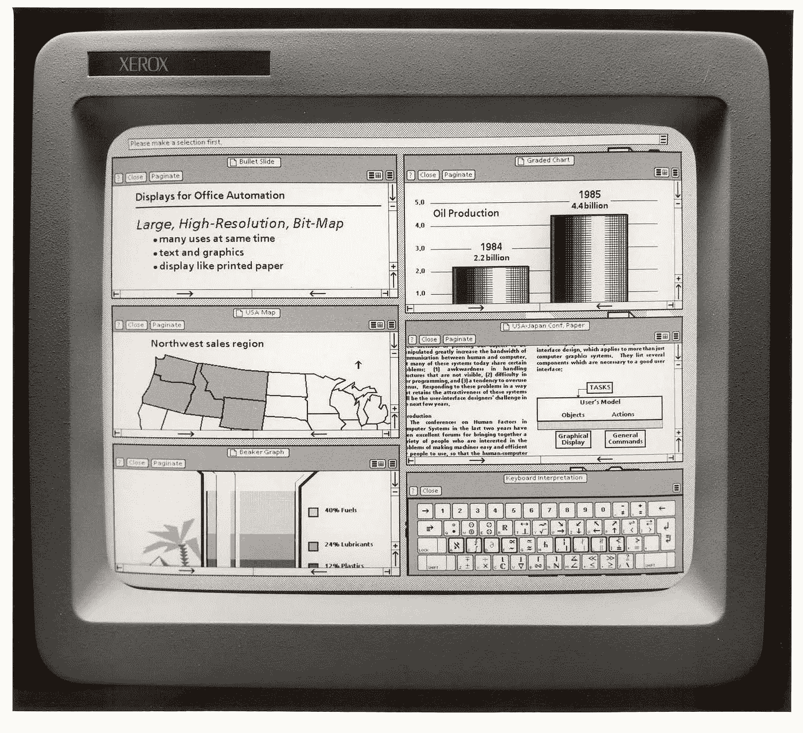
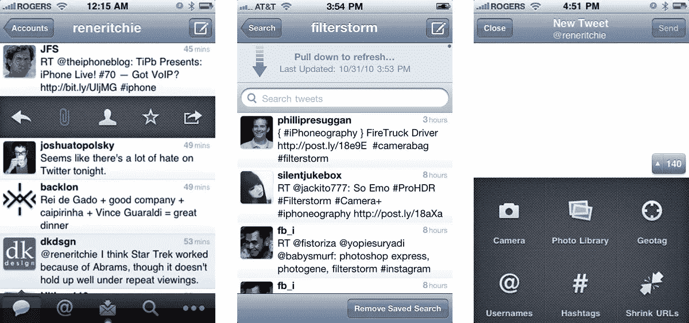
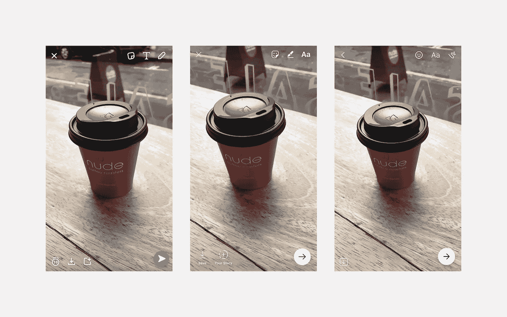
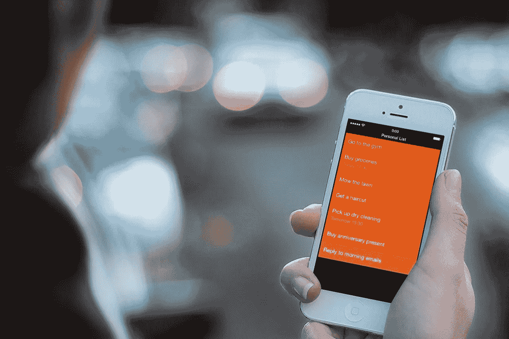

# 用户界面商品化

> 原文：<https://medium.com/hackernoon/commoditisation-of-ui-36a5abbeb3c0>

## 为什么独特的用户界面不会让你的产品成功或失败

许多设计师高估了独特的 UI 设计对于产品成功的价值。事实是，它实际上一点也不重要。

不管你的用户界面有多独特，竞争对手最终都会抄袭它，它最终会被商品化。

> 商品化(商业理论中的 20 世纪 90 年代初)是一个过程，在这个过程中，具有经济价值且在属性(独特性或品牌)方面可区分的商品最终在市场或消费者眼中变成简单的商品。它是市场从差异化到无差别价格竞争，从垄断到完全竞争的运动。[维基百科](https://en.wikipedia.org/wiki/Commoditization)

过去有很多这样的例子。

**图形用户界面**

Xerox Alto (later Xerox Star 8010) was the first ever computer to use desktop metaphor and graphic user interface. [Source](http://www.digibarn.com/collections/screenshots/xerox-star-8010/index.html)

微软的 Windows 是世界上最流行的桌面操作系统。但是微软并没有在第一时间提出图形用户界面的想法。他们从苹果麦金塔电脑上复制了它，而后者又从施乐奥拓上窃取了它。

**拉至刷新**

Tweetie was the first ever application that used pull-to-refresh interaction. [Source](http://www.imore.com/hall-fame-loren-brichter-and-tweetie)

拉动刷新是移动设计中最普遍的交互模式之一。每个有某种提要的应用程序都使用拉至刷新手势。这些天来，这被认为是理所当然的，但从前它是 Loren Brichter 的 Tweetie 应用程序的签名交互。他甚至[申请了](http://patft.uspto.gov/netacgi/nph-Parser?Sect1=PTO1&Sect2=HITOFF&d=PALL&p=1&u=%2Fnetahtml%2FPTO%2Fsrchnum.htm&r=1&f=G&l=50&s1=8,448,084.PN.&OS=PN/8,448,084&RS=PN/8,448,084)它的专利！这并不妨碍它被许多其他应用程序复制。

**摄像机作为输入**

From left to right: Snapchat, Instagram, Facebook Messenger

这可能有点争议，但我要说，相机作为一种输入也变得商品化了。没错，Snapchat 是这方面的先驱，但脸书设法在他们所有的应用程序中使用它，从 Instagram 到 Messenger 和 Whatsapp，这是完全正常的。

事实上，有人发明了好的或有用的东西，并不意味着其他人不能使用它。所有伟大的发明都不可避免地会被他人复制和广泛采用。这就是进步的方式。

# 这是什么意思？

首先，独一无二的好设计本身并不能带来成功的产品。在后 iPhone 世界里，好的 UI 不是一个差异化点，而是一种廉价商品，一种事实上的标准。在新时代的早期，有一些创新产品仅仅通过出色的设计就成功击败了现有公司(例如，Slack 拥有与 Hipchat 相同的核心技术，但设计却好 10 倍)。好的设计现在是一个新的基线(现在即使是 Android 也有好的设计)。

第二，你的用户不在乎你的设计是否独特。他们只是想让它为他们工作。事实上，使用现有的模式增加了你的产品更容易理解和被更广泛采用的机会。

第三，随着行业的成熟，用户界面会更加趋同:想想对话聊天机器人或语音。接口实际上是不可见的。

这意味着是时候更多地关注那些不能商品化或不容易复制的东西了。例如，你的产品为人们或你的设计文化创造的独特价值。其他一切都会水到渠成。

这并不意味着你不需要突破可能的界限，尝试创新的方法来设计用户界面。只是不要高估独一无二的价值。毕竟，你的设计明天就会被你的竞争对手获得。

好的艺术家复制，伟大的艺术家偷窃，不是吗？

汤姆·卡维尔指出，这条规则有一个例外——清除。

Clear is a to-do application that looks like no other iOS productivity app. [Source](https://9to5mac.com/2014/04/29/clear-for-ios-and-mac-updated-with-reminders-feature-and-new-sound-packs/)

Clear 拥有如此独特和大胆的设计，以至于无法复制(我的意思是这完全有可能，但复制看起来会像一双阿迪达斯运动鞋的赝品)。虽然，这很可能是一个证明规律的例外。此外，还有一个问题是，这种设计的可扩展性将如何超越非常狭窄的移动待办应用领域。

*如果你喜欢这个，点击💚所以其他人会在媒体上看到这个。*

> [黑客中午](http://bit.ly/Hackernoon)是黑客如何开始他们的下午。我们是 [@AMI](http://bit.ly/atAMIatAMI) 家庭的一员。我们现在[接受投稿](http://bit.ly/hackernoonsubmission)并乐意[讨论广告&赞助](mailto:partners@amipublications.com)机会。
> 
> 如果你喜欢这个故事，我们推荐你阅读我们的[最新科技故事](http://bit.ly/hackernoonlatestt)和[趋势科技故事](https://hackernoon.com/trending)。直到下一次，不要把世界的现实想当然！

