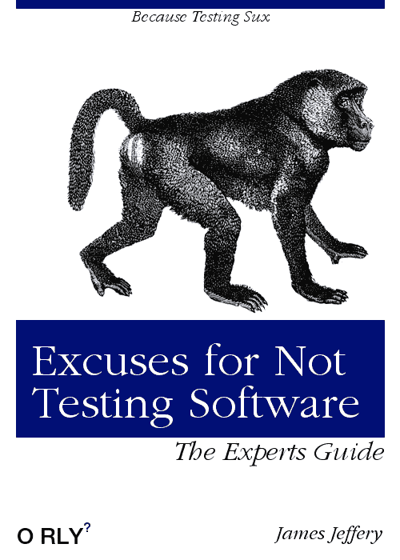

# 开发人员不测试他们的软件的常见借口

> 原文：<https://medium.com/hackernoon/common-excuses-why-developers-dont-test-their-software-908a465e122c>

Excuses for Not Testing Software — The Experts Guide (ISBN 6c6d66616f)

> 我从来没有见过一个程序员能完美地编码。我觉得这样的人不存在。

从前我**讨厌**测试软件。这对我不重要。我没看出目的。这似乎是对每个人的时间和金钱的巨大浪费。

在我的职业生涯中，从来没有人教我应该如何或者为什么测试我的软件。我为不想学找了很多借口。我和许多开发者交谈过，他们也为不想学习找借口。他们今天仍然在找同样的借口。我最终学会了，他们没有。

在我和其他人一起工作的过程中，我遇到了许多不同的反对软件测试的观点(有些观点是正确的，但那是另一篇博文)。以下是开发人员不给软件测试机会的一些最常见的原因…

# 我的代码运行完美。为什么我需要测试？

我从来没有见过一个程序员能完美地编码。我觉得这样的人不存在。

以世界上最大的科技公司为例。谷歌，脸书，摇滚明星，索尼等。他们雇佣世界上最聪明的开发人员。然而，他们的开发人员仍然设法编写不安全的代码。证据就在布丁里乡亲们:【https://h1.sintheticlabs.com

(FWIW 任何在生产代码中留下 XSS 或 SQLi 漏洞的 web 开发人员都需要被踢一脚！)

对于那些宣称自己的代码完美的人，我的回答是:*你怎么知道你的代码运行完美。你测试过吗？你现在能测试一下并告诉我它运行得很好吗？*

# 但是，不知道考什么？！

测试所有的东西！—第三方代码除外，它应该已经自带测试。

我将引用[这个 StackExchange 答案](https://softwareengineering.stackexchange.com/questions/750/what-should-you-test-with-unit-tests)中的一段话，因为它很有意义:

> 1.尽可能测试所有常见的情况。这将告诉你在你做了一些改变后，代码何时中断(在我看来，这是自动化单元测试最大的好处)。
> 
> 2.测试一些您认为可能有错误的异常复杂的代码的边缘情况。
> 
> 3.每当你发现一个 bug，在修复它之前写一个测试用例来覆盖它
> 
> 4.只要有人有时间，就在不太关键的代码中加入边缘测试。

当你刚接触软件测试时，很难知道从哪里开始。有许多不同类型的软件测试。我一直推荐初学者从**单元测试**、**集成测试**和**回归测试**开始。

有一大堆软件测试方法。大多数你永远不需要使用，但是至少知道不同类型的软件测试之间的区别是有用的:

*   验收测试
*   阿尔法测试
*   Beta 测试
*   黑盒测试
*   比较测试
*   兼容性测试
*   端到端测试
*   功能测试
*   增量集成测试
*   安装/卸载测试
*   集成测试
*   负载测试
*   性能试验
*   恢复测试
*   回归测试
*   健全性测试
*   安全测试
*   压力测试
*   系统试验
*   单元测试
*   可用性测试
*   白盒测试

如果你想了解更多不同类型的软件测试，你应该看看这篇文章。

重要的是让测试成为一种必要，而不是一种选择。

# 测试既困难又令人困惑

如果你不知道怎么做，任何事情都是困难的。这需要时间、练习、经验和耐心。学习的时候放松，放松，享受乐趣。期待最初的失败和困惑。你只是个人！

一旦你学会了如何测试，并开始感到舒服，你会发现这其实很简单！

拿一本好书。阅读文档。与其他开发人员讨论 IRC/Slack/Discord 等。

# 测试增加了开发时间:(

这是与最后一个借口相关的常见误解。

任何初涉测试的人最初都会有困难。新的土地正在被开发。感觉不舒服。你是人，这很正常。

在早期阶段，这将花费大量的时间。坚持下去，不断学习，最终会成为第二天性。诀窍是让它成为你软件开发工作流程的一部分，让它成为习惯。

从长远来看，编写测试节省了大量时间，也减少了许多麻烦。点击一个按钮就能重复测试并确认一切正常，这让你有信心将软件投入生产。如果出现任何问题，您可以简单地运行您的测试来帮助发现错误的来源。

当你发布通过所有测试的代码时，会有一种成就感。维护可测试的代码总是比在没有可重复测试的系统上工作更容易，也更愉快。

# 推荐阅读

如果你是软件测试新手，或者想了解更多，我强烈推荐以下书籍。我从我的私人图书馆里手工挑选了这些。他们太棒了！

*   [软件测试中的经验教训:一种上下文驱动的方法](https://www.amazon.com/gp/product/0471081124?tag=sw-testing-books-20)
*   [漂亮的测试:领先的专业人士揭示他们如何改进软件](https://www.amazon.com/Beautiful-Testing-Professionals-Software-Practice/dp/0596159811/ref=sr_1_1?s=books&ie=UTF8&qid=1506803156&sr=1-1&keywords=Beautiful+Testing%3A+Leading+Professionals+Reveal+How+They+Improve+Software)
*   [测试电脑软件](https://www.amazon.com/Testing-Computer-Software-2nd-Kaner/dp/0471358460/ref=pd_sim_14_5?_encoding=UTF8&pd_rd_i=0471358460&pd_rd_r=KJDD0TQPEX9ZKE91JRAV&pd_rd_w=vMH3w&pd_rd_wg=9BRuV&psc=1&refRID=KJDD0TQPEX9ZKE91JRAV)
*   [敏捷测试:测试人员和敏捷团队实用指南](https://www.amazon.com/Agile-Testing-Practical-Guide-Testers/dp/0321534468/ref=pd_sim_14_3?_encoding=UTF8&pd_rd_i=0321534468&pd_rd_r=6ECVMKP8652YEZ47VQJV&pd_rd_w=F6Z51&pd_rd_wg=TBP44&psc=1&refRID=6ECVMKP8652YEZ47VQJV)

快乐测试😀