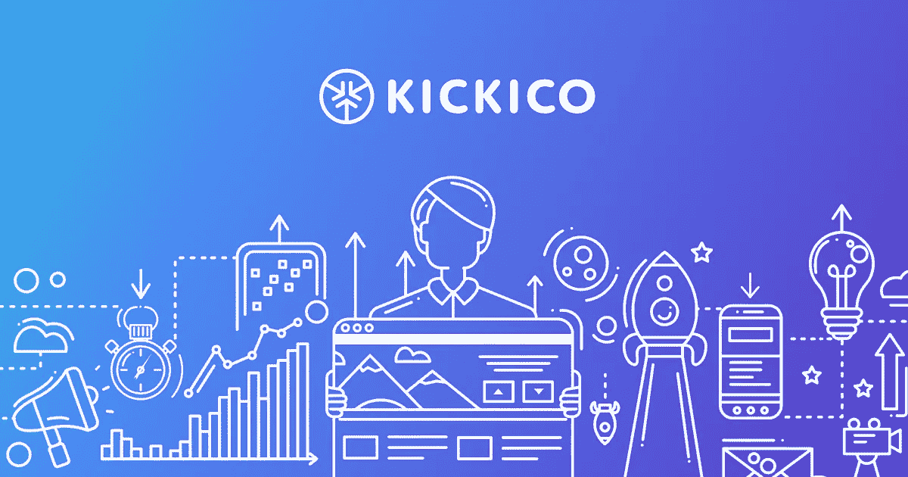

# 社区选择

> 原文：<https://medium.com/hackernoon/community-choice-ff9dac51f5ad>

在过去的几个月里，KICKICO 平台的工作人员一直在努力工作，审阅许多公司已经提交给我们的所有项目草案。对 KICKICO 平台的反应是相当令人震惊的，因为到目前为止已经提交的草案数量很快将达到 1000 个项目！很快将有四个大型 ico 在平台上推出。

很自然，KICKICO 的工作人员会全天候努力工作，将最好的想法付诸实践，同时非常关注每个项目的质量以及项目背后人员的资质。我们大幅增加了员工人数。然而，由于每天都有新的申请涌入，我们知道在某些时候，即使是我们在 KICKICO 的专业人员也无法亲自检查所有的申请。

考虑到这一点，我们也从 Kickstarter 的悲惨经历中获得了宝贵的洞察力。世卫组织无法应对涌入其平台的大量项目，导致许多活动陷入“核查僵局”,或者活动完全是骗局，可以继续进入 ICO 阶段。我们还仔细分析了这个平台上特定项目的结果，其中一些可行的项目被淹没在堆积如山的垃圾项目中。考虑到所有这些因素，我们正在慎重考虑采用群体投票系统。

**对 KICKICO 团队来说，这一投票系统至关重要:**

1.  功能流畅，用户友好。
2.  允许社区控制活动的数量。
3.  允许社区控制活动的质量。
4.  允许社区直接支持我们的经济。
5.  允许社区投票否决和丢弃不合标准的活动，以避免平台“乱丢垃圾”。

我们试图看到这个过程的每个角度，考虑到一切，为整个 KICKICO 平台创建最佳的通用解决方案。这个项目仍处于积极发展阶段，但将很快向社会公布！**我们称之为“社区选择”。**所以，你只要看名字就能猜到这是怎么回事。

**目前，它是这样工作的。作者在 KICKICO 平台上创建活动，描述它们，然后提交进行审核。我们的主持人将手动审查每个活动，并预先选择最有希望的。然而，在不久的将来，活动提交后立即进行的人工审查程序将被算法或原始人工智能机器人取代。通过描述输入，这些机器人将确定内容可用性以及非规范性词汇或禁止的内容。基于机器人的算法，决定放弃提交或让它传递给社区投票。**

这就是乐趣的开始！所有在 KICKICO 平台上注册的社区成员都有机会投票支持或反对。因此，机构群体将决定哪些项目值得使用该平台，哪些项目不应该运行，以及哪些活动需要在启动前进行改进和/或全球变更。一个项目获得的“赞成”票数越多，社区对它的评价就越高。所以，每一票都很重要！最好的、评分最高的活动将有主持人来帮助推出他们的 ICO，并在推出前提出最终建议。

现在，如前所述，投票不是“赞成”就是“反对”。因此，最受欢迎的活动将被列在网站主页上，并获得启动的“绿灯”，而其余的将根据他们获得的“支持”或“反对”票数进行评级。收到许多反对票的活动将被放弃，并转换回“草案”状态。我们完全理解我们的社区成员是非常聪明的，你明白质量与骗局。这就是为什么我们相信你，KICKICO 社区，应该参与保持我们的社区成长和健康，通过投票淘汰无用或诈骗活动，但保留那些完全支持我们的 KICKONOMY。

我们都是人。而且，在我们人类的现实中没有多少事情是全黑全白的，“赞成”或“反对”。一个人可能喜欢一个项目，但不喜欢它的某些方面。我们对此也有解决方案。“减号”实际上不是“赞成”或“反对”，而是投票者向项目作者提供反馈的机会。“负”票加反馈是给作者的一个信号，表明项目可能没有正确定位，如果没有改进，成功的机会很小。投票人给出的反馈必须提供建设性的改进建议。公开的负面或包罗万象的反馈，如“我不喜欢任何东西”或“一切都很糟糕”将不会被容忍。当投反对票时，请考虑周到并尊重您的建议。(作者，这也是您在发布前测试项目的好方法！)记住，作者和团队成员在开始项目时投入了大量的时间、精力和金钱，所以要诚实和乐于助人，而不要过分挑剔。

说到关键，到处都有巨魔！是的，很不幸，即使是在 KICKICO 平台上。然而，为了减少巨魔对社区的影响，我们将公开提供某些投票和反馈统计数据。除了这些公开信息之外，我们还开发了一些算法，可以让这些巨魔随着时间的推移保持沉默。当然，我们值得信赖的版主将每天都在“巨魔巡逻”中寻找这些讨厌的生物。

你可能会问，“是一个成员，一张选票，每个人在这个新的投票过程中都有平等的发言权吗？”最初，答案是肯定的。然而，随着 KICKICO 平台的快速建立，投票过程将转向一种加权格式，这种格式基于投票者在投票者的验证钱包中持有的 KickCoins 的数量。其他事情，如平台上的活动和因果报应也将被考虑在内，但最重要的是投票者验证钱包中的 KickCoins 数量。例如，拥有 100 万枚 KickCoin 的投票人在投票中的影响力会比只有 1 枚 kick coin 的投票人更大。现在，投票者

100 万个 KickCoins 不会比只有 100 万个 kick coins 的人有 100 万倍的影响力

1 KickCoin，而是一个缩小的、非线性的 3-10 倍加权影响力。

KICKICO 团队非常努力地涵盖了社区投票的各个方面。此外，通过让我们的社区参与平台上的决策过程，这将允许我们的主持人只关注那些已准备好启动 lCO 或非常接近完成的项目。作为一个整体社区，您将为我们的版主和作者提供关于提交的每一个项目的宝贵见解。我们希望每个成员积极投票并提供建设性的反馈，以使 KICKICO 健康、成功。

一起工作，更容易清除骗局和欺骗，通过反馈直接与项目作者联系，并发现其他人可能忽略的错误。社区也将帮助那些需要一点改进的项目，因为向版主提交项目以获得 ICO 发布批准确实需要花费 KickCoins。作者需要在提交之前完善一切，所以如果你看到一个错误或认为有些东西可以更好，不要害羞，让他们知道。而且，随着更多的草案提交，我们将通过专注于那些不仅对 KICKICO 社区，而且对整个 Cryptospace 都有意义和有用的项目来增加对我们 KickCoins 的需求。这将有助于确保我们的社区纯粹的有机增长。这一令人兴奋的新社区选择功能将于今年 10 月推出，有 50(50)份精心准备的草案等待您的投票！

## 加入我们的社区吧！

如果您有任何我们尚未解决的问题，我们欢迎您加入我们的小组！我们的技术支持是全天候的。

[电报](https://t.me/kickico)(英文)[推特](https://twitter.com/KICKICOplatform)(英文)[脸书](https://www.facebook.com/kickicoplatform)(英文)[脸书集团](https://www.facebook.com/groups/kickico/)(英文)