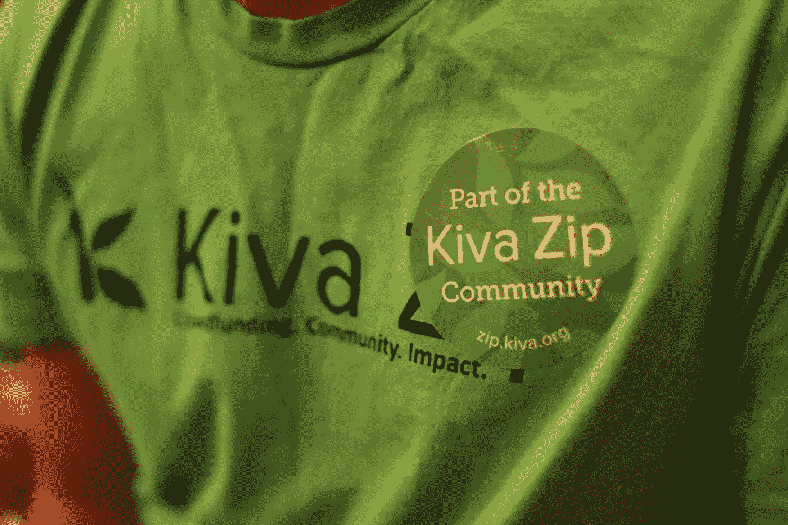
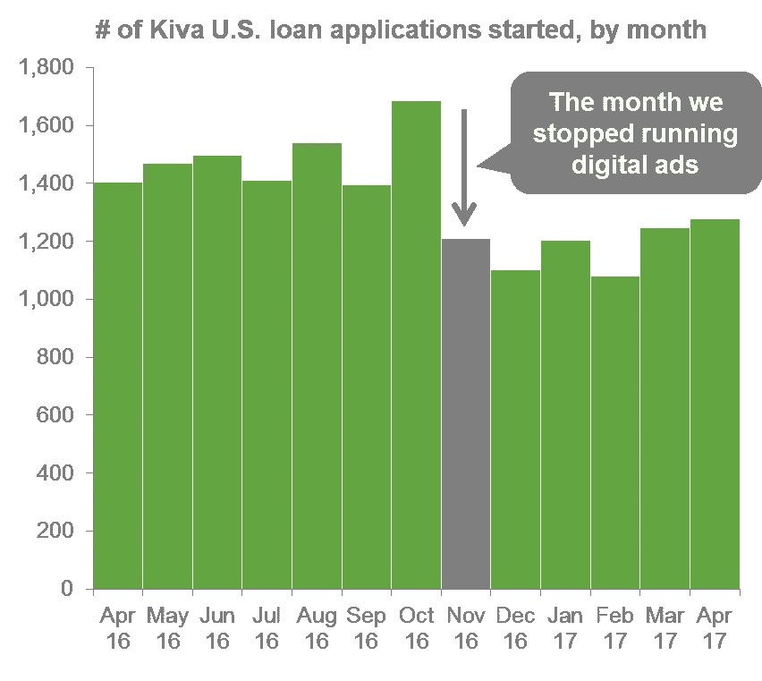
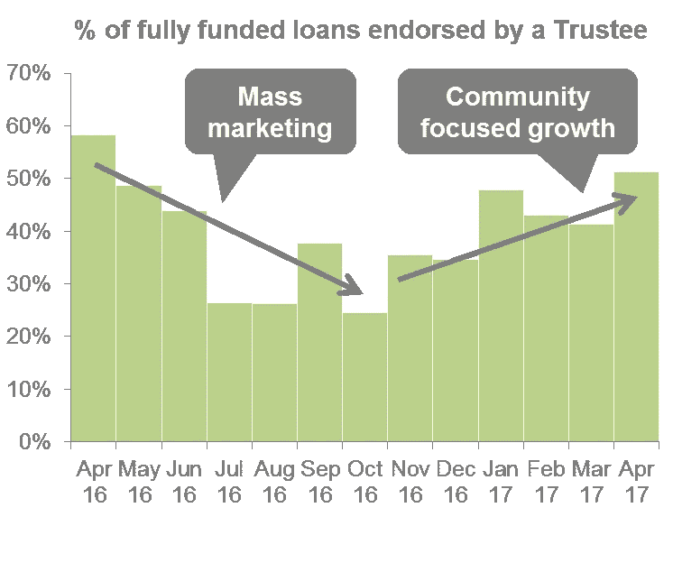
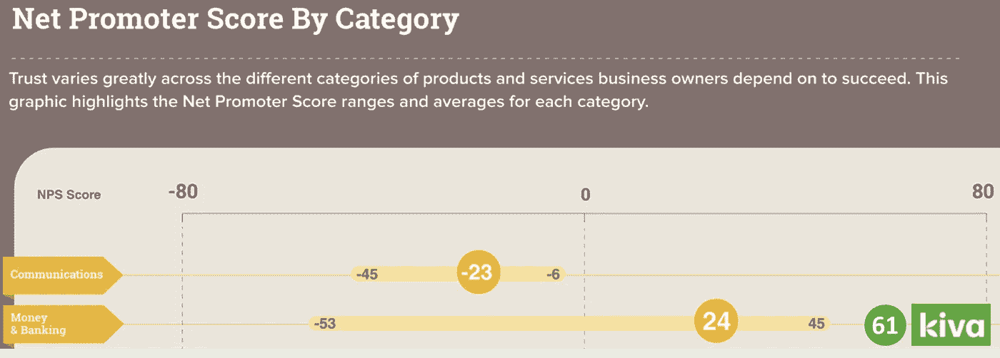
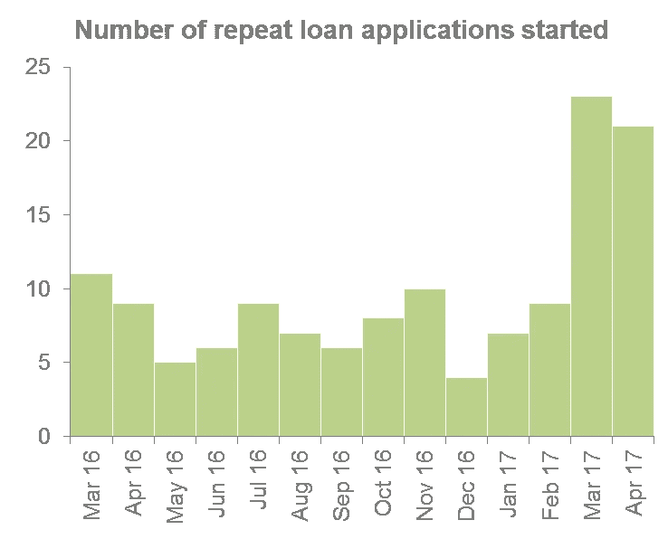
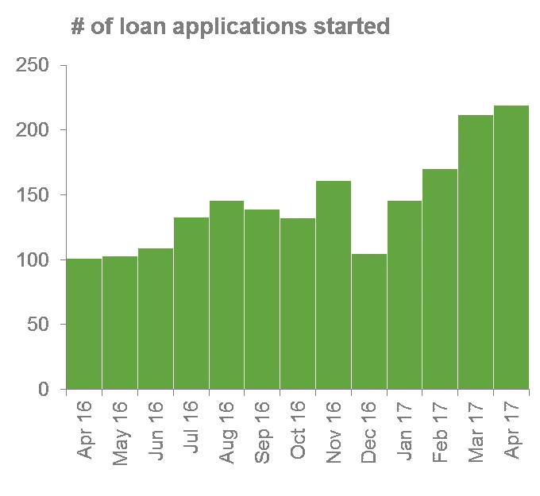
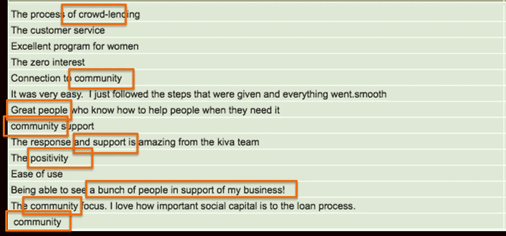

# 以社区为中心的增长

> 原文：<https://medium.com/hackernoon/community-focused-growth-8a4c5a686def>

在过去的六个月里，我们的 Kiva 美国团队经历了一次重大转变，改变了我们实现项目[增长](https://hackernoon.com/tagged/growth)的方式。我认为这可能是一种不流行的转变——尤其是在硅谷。谁知道呢——也许这将是一个被误导的转变。但在 Kiva 美国团队，我们对此感到兴奋，并支持它。一年前，我们的增长战略更侧重于“大众营销”，而在 2017 年，我们专注于基于**社区的**增长方式。

## ***大众营销:扎实的执行力，令人失望的结果***

在我们的 2016 年预算中，我们的 Kiva 美国团队首次获得了一些重要的营销预算。我们希望能找到一个广告/营销渠道，让经济学发挥作用。我们在 Kiva 发放的美国贷款不收取任何利息或费用，但我们确实认为每笔贷款都有相关的收入——以几种方式。首先，每一笔 Kiva 贷款，一般贷款人都会给我们“小费”。因此，如果我们在美国的平均贷款规模是 6000 美元，那么我们就可以从这笔贷款中获得大约 300 美元的收入。其次，平均每个美国借款人邀请 25 个新的贷款人资助他们的贷款，并加入 Kiva 运动。如果平均每个贷款人在一生中给 Kiva 12 美元小费，那么每笔贷款的收益也是 300 美元。因此，当我们在 2016 年初尝试不同的营销渠道时，我们的问题是，我们能否找到一种渠道，在这种渠道中，我们每次获得全额贷款的成本(理想情况下是大幅)低于我们可以从与该贷款相关的收入中预算的 300 美元“终身价值”。

不幸的是，答案是断然的“不”。

在我们的营销经理 Adam Kirk 的带领下，我们尝试在我们有大量实地业务的地区，针对小企业主受众投放脸书广告。我们尝试在谷歌 AdWords 上竞价，比如“小企业贷款”。我们开展了直邮活动——既有我们自己的，也有与“绿角”或“农民退伍军人联盟”等合作伙伴联合开展的。我们与更传统的贷款人建立了推荐合作关系，他们会把他们拒绝的贷款申请发给我们。我们从 Radius 购买了全国各地小企业主的联系信息，并使用 Unbounce 和 Optimost 优化了我们的登录页面。

亚当和我们的团队在这些策略上执行得非常好。但是，尽管我们在漏斗顶部看到了显著增长(即贷款申请开始)，但通过这些“大众营销”(通常是数字)渠道，我们漏斗的转化率(提交的贷款申请、发布到 Kiva 网站的贷款，然后贷款完全到位)非常非常低。

思考我们为什么会看到这种低漏斗转化率，我认为有三种主要的可能解释:

**1)低质量的销售线索。**与社区合作伙伴(Kiva“受托人”)向我们提交的贷款申请相比，通过这些大众营销渠道提交的贷款申请质量较低。当他们还是小企业主的时候，这些小企业主对短期获得 Kiva 贷款不太感兴趣，也不太愿意这样做。

**2)缺乏信任。**有一天，在奥克兰与我们的一位借款人聊天时，她告诉了我一些很有启发性的事情:“你知道，这个社区的人过去已经被贷款人烧伤过无数次了。这里真的缺乏信任。”当我们的受托人向他们的社区成员推荐 Kiva 贷款时，他们在社区眼中的信誉就传达给了 Kiva。但是，当有人看到一个零利率贷款的广告时，他们很可能会认为这听起来太好了，不像是真的，并问自己“这其中有什么猫腻？”

**3)感知进入壁垒。**最后，尽管我们已经尽力简化 Kiva 贷款流程(不需要银行对账单、纳税申报表、商业计划、繁琐的财务表格等)。等等。)，对于一个以前从未进行过众筹活动的小企业主来说，这仍然是令人望而生畏的，他们每周工作 100 小时，拼命想让他们的业务继续发展，资源极其有限。同样，我们的受托人可以握住他们推荐给 Kiva 的小企业主的手，帮助回答他们可能对该过程如何运作有任何疑问，并向他们保证申请 Kiva 贷款的好处将大大超过成本。

由于我们通过这些大众营销渠道的漏斗转化率非常低，2016 年秋季，我们决定放弃这种方法。“关闭”这些数字广告渠道有点可怕——见下图。我们从 10 月份有数字广告的 1685 份贷款申请下降到 11 月份没有数字广告的 1210 份，下降了 28%。但是我们有一个愿景——一个更加基于社区的增长方式——我们很高兴朝着这个方向前进。

## ***迈向社区聚焦增长战略***

从高层次来看，我们认为以社区为中心的增长更多地来自于我们现有的社区，而不是对我们尚未联系到的新朋友的冷漠接触。在某种意义上，这类似于病毒式增长(事实上，这在硅谷非常流行！)，但是我们对以社区为中心的增长的定义还包括其他因素，我试图在下面概述这些因素。这份(非详尽的)以社区为重点的增长战略的组成部分清单显然与我们的 Kiva 美国项目最相关，但我认为它与其他行业和公司也有许多相似之处:

*   **受托人背书贷款超过无受托人贷款**。在过去的几年里，超过 700 个信托合伙人已经认可了 Kiva 贷款。其中大部分都是非盈利性的，旨在支持他们社区的企业家，比如底特律的 Build Institute，奥克兰的 Centro Community Partners，或者泽西城的 Rising Tide Capital。但是，如果小企业主尚未与我们的受托人建立联系，我们不希望他们被阻止获得 Kiva 美国贷款，因此，在 2014 年，我们推出了“无受托人”模式，借款人可以直接申请 Kiva 贷款，而不需要受托人的认可。这种无受托人模式发展迅速，但我们发现，这些贷款的还款低于受托人认可的贷款，而且通常这些无受托人贷款的社会影响也不深。我们以社区为中心的增长的一个核心组成部分包括重新关注与我们的受托人，尤其是我们最活跃和最优秀的受托人的合作关系。自 2016 年底聘请冉凡领导受托人参与工作以来，我们看到受托人认可的贷款数量显著增加，如下图所示。

*   **花更多时间与现有客户建立关系，而不是接触新客户**。2017 年，我们的团队试图稍微改变我们的时间分配——从“漏斗顶端”的增长和拓展，转向吸引现有客户。在我们实习生 Porter Montgomery 和 Katie Powers 领导的借款人参与计划中，我们承诺每个月都会尝试给六个月前获得贷款的每一位借款人打电话——只是为了确认一下，看看我们是否能做些什么来支持他们或他们的业务。
*   **借款人之间的病毒式传播**。与我们现有的借款人建立更牢固的关系，并通过将他们与客户、商业顾问或对他们有价值的资源联系起来，增强他们的社会资本，这本身就是目的。但这也是加速以社区为中心的增长的一种手段。取悦我们的客户将增加他们向朋友、家人和邻居推荐 Kiva 的可能性。正如我们在哥伦布的一位企业家所说:“从 Kiva 获得无息贷款很棒，但正是 Kiva 为我打开的大门，以及我由此建立的联系，使我成为 Kiva 最大的传播者。”我们试图通过推广使用推荐链接来促进这种借款人对借款人的病毒式传播，然后我们可以跟踪这些链接的使用情况。当通过推荐链接进入的借款人进行第一次还款时，我们将给予借款人和推荐人 25 美元的 Kiva 信贷，用于贷款支持另一位企业家。下图显示了美国小企业主对“金钱&银行”领域公司的净推广得分范围。最差的公司 NPS 为-53，最好的公司 NPS 为+45。今年到目前为止，Kiva 美国一直在+61。这将导致病毒式的、社区主导的增长。

*   **重复贷款**。我们最有希望的社区增长计划之一是增加对现有 Kiva 美国借款人的重复贷款。回归的借款人已经信任 Kiva，可以更容易地驾驭这个过程，因为他们以前经历过，所以知道会发生什么，并且(也许最重要的是)知道 Kiva 真的有用，值得投入前期努力。我们典型的漏斗转换率约为 7-8%，也就是说，每开始 100 笔贷款申请(请记住，其中一些可能来自不符合 Kiva 美国贷款资格的海外人士，或寻找我们不提供服务的消费贷款的人士)，就有 7 或 8 人继续获得 Kiva 贷款。重复贷款的话，转化率差不多是那个的 10 倍。在过去的几个月里，随着一些产品的改进，消除了重复贷款申请的障碍，Adam 一直专注于确保我们有资格获得重复贷款的任何借款人都了解这一机会，以防他们从中受益。下图清楚地显示了立竿见影的效果:

*   **针对特定受众的内容营销**。我们对内容营销的大众营销方法是专注于吸引尽可能广泛的小企业主受众的更通用的内容——比如我去年写的这篇博文 中的 [**将 Kiva U.S 和 Kickstarter 进行了比较。我们公关策略的重点更多的是在大型刊物上获取报道，比如**](/@Kiva/kiva-zip-vs-kickstarter-where-should-small-businesses-rally-support-62035d5c2b9c) **[**FastCompany**](https://www.fastcompany.com/3052439/screw-fico-how-social-underwriting-could-expand-access-to-credit) 或《华尔街日报》**。在转向以社区为中心的内容营销策略时，我们更倾向于制作针对更小的利基受众的内容——比如我们与我们的受托伙伴之一 Greenhorns 制作的关于用 Kiva 贷款为您的餐车融资的博客**，或者播客** 。从公共关系的角度来看，如今我们对《米德维尔·论坛报》中的一篇文章感到兴奋，就像对《纽约时报》中的一篇文章感到兴奋一样。同样，使用基于当地社区的方法时，印象的数量要少得多(至少，直到您在当地出版物(如我们正在研究的《米德维尔·论坛报》)上发表数百篇文章)，但这些印象的质量要高得多。****
*   ******社交媒体营销**。以社区为重点的营销也增加了社交媒体的重要性，因此，在实习生 Junho Hyun-Sack 和 Kathy Gledhill 的带领下，我们在过去几个月里花了更多的时间来积极管理我们的 Kiva 美国 Twitter 账户。这里的想法不太侧重于“外向营销”——在 Twitter 上让 Kiva 的品牌出现在更多眼球面前，而更侧重于“社区参与”。如果我们能够认识到一个刚刚在 Kiva 上成功融资的小企业主，或者一个在他们的地区做了大量工作来支持金融排斥的企业家的受托人，以一种小小的方式在我们的社区中建立善意和感激。****
*   ******Kiva 领导计划**。大多数网上银行的总部都有集中的“内部销售”人员团队。通过 Kiva Leads 计划，我们正在推广一种更加分散的方法，即 Kiva 代表在当地社区实地工作，与小企业主、社区组织、政府官员和有影响力的人士建立持久的关系。领导是否是像奥克兰的布莱恩·麦克欧文或圣何塞的莎拉·阿德埃尔那样的 Kiva 的全职员工；无论他们是在像匹兹堡城市创新 21 的艾米丽·基布勒或密尔沃基 WWBIC 的蒋曦儿·考斯特这样的非营利合作伙伴那里工作；无论他们是像罗切斯特的 Brad Willows 或费城的 Jossiel Cruseta 这样的当地市政府雇员，我们的 Kiva 领导都是 Kiva 在他们生活和工作的社区中的代表，他们非常关心丰富这些社区。在我们团队的凯瑟琳·林奇(Katherine Lynch)的管理下，2017 年前几个月，在潜在客户市场(我们在当地有专门的 Kiva 潜在客户)启动的贷款申请数量增加了一倍多，这些市场在我们全国管道中所占的份额越来越大。此外，正如重复贷款一样，来自这些领先市场的贷款申请具有比全国平均水平高得多的漏斗转换率，因为当地领先市场可以在 Kiva 过程中帮助握住借款人的手。****

********

*   ******人类牵手无人值守自动化**。在 Kiva，我们陷入了困境。我们是一家科技公司，总部设在硅谷。但我们也是一个非盈利组织，梦想重塑以人为本的金融体系。我们在这个街区已经呆了足够长的时间，知道我们最感兴趣的企业家有时需要帮助来建立 PayPal 账户，或度过我们的私人筹款期。所以我们试图取得微妙的平衡。一方面，我们不断努力改进我们的网站，并改进我们向我们所服务的小企业主发出的自动通知。但另一方面，我们向发布在 Kiva 美国网站上的任何小企业主提供专门的、真正的人性化客户服务。通读我们借款人的 NPS 调查回复中的一些评论，不难看出我们的客户真正重视这项服务和支持，以及我们 Kiva 美国项目更广泛的面向社区的性质。

    正如这些评论所暗示的，Kiva 模式最令人兴奋的一个方面是，我们的众筹方法将我们的小企业主与数百名个人贷款人联系起来，他们现在是他们企业的小额投资者，希望看到这些企业取得成功。从长远来看，我们希望小企业主的 Kiva 体验中的个人接触、关系导向和“人性”不仅来自我们的 Kiva 团队，还来自世界各地数百万 Kiva 贷款人，为他们投资的企业家喝彩。****

********

****当我们谈到 Kiva 美国团队以社区为重点的增长时，这八个例子——(1)我们的受托人合作伙伴的参与，(2)专注于与现有客户建立关系，(3)借款人对借款人的病毒式增长，(4)重复贷款，(5)针对利基受众的内容营销，(6)社交媒体营销，(7)我们的“脚踏实地”Kiva Leads 计划，以及(8)人力支持和支持——是我们为了尝试和实现它而关注的一些具体举措。****

## *******我们的地盘*******

****如上所述，客户(小企业主借款人)对我们 Kiva 美国团队的“终身价值”约为 300 美元。但是对于一个发放大额贷款(例如 200，000 美元)并收取(通常相当高的)利率(例如 15%)的在线贷款人(如 OnDeck、FundingCircle 或 Able)，客户的终身价值要高得多——可能是 20，000 美元。这意味着，虽然营销领域是广告支出领域，但我们的 Kiva 美国团队总是会输。谷歌上的小企业贷款关键词是最贵的关键词，我们每次都会被出价和花费超过。****

****但是，如果我们把营销领域变成一个社区，那么 Kiva 就可以在那里获胜。我们有来自世界各地的 170 万慷慨的贷款人，希望以零利率贷款支持 Kiva 企业家，每次 25 美元。这些贷款人正在成为他们资助的借款人的客户、品牌大使和商业顾问，并在他们的贷款页面上写下鼓励支持他们的信息。尽管传统贷款的拖欠会面临严厉的威胁和债务螺旋诱导的费用和罚款，但只要借款人通过展示强大的沟通和诚信来履行自己对 Kiva 社区的承诺，Kiva 借款人生活和业务中的困难几乎总是会得到宽容和理解。作为一个 501(c)(3)非营利组织，我们的使命和品牌与营销战略完美结合，该战略的重点不是冷冰冰的大规模宣传，而是建立关系和社区信任。****

****以社区为中心的营销是我们的地盘。****

## *******质量超过数量*******

****因此，对于我们的 Kiva 美国团队来说，以社区为重点的营销策略是一种更具成本效益的方式，可以帮助我们接触到更多的小企业主，并增加进入我们漏斗顶端的贷款申请的**数量**。但或许更有力的是，我们认为以社区为中心的增长是确保这些销售线索质量的最佳方式。****

****在我们的团队中，我们从四个方面定义贷款“质量”——(1)社会影响的深度(例如，我们宁愿贷款给那些在经济上被高度排斥的企业家，他们经营着具有深刻社会使命的企业)，(2)风险(例如，我们需要借款人偿还贷款！)、(3)在 Kiva 贷款人群体中的受欢迎程度(即，作为一个众筹平台，我们希望发布我们的社区乐于支持的贷款)，以及(4)服务成本(即，我们审查、发布和服务贷款所花费的时间越少，我们的模型就变得越可扩展，我们就可以授权给更多的企业家)。当然，质量的这些方面往往是相互冲突的——向收入较低的借款人提供贷款可能风险较低，服务成本较低，但影响的深度也较低。由一个目前无家可归的人发起的对预收入创业公司[的贷款具有难以置信的影响力，可能会很受 Kiva 贷款人的欢迎，但风险可能会高得多。](https://hackernoon.com/tagged/startup)****

****但是社区聚焦增长的美妙之处在于它可以提高这四个维度的质量！在影响深度方面，Kiva 的许多受托人都是非盈利机构，肩负着不可思议的、影响深远的使命。La Cocina 促进旧金山移民女性食品企业家。Defy Ventures 向以前被监禁的企业家提供技术援助。城市创新 21 支持匹兹堡一些低收入社区的小企业发展。从风险角度来看，来自我们现有社区的贷款(无论是对现已完全偿还前一笔贷款的前借款人的重复贷款、受托人的背书，还是另一个 Kiva 借款人的推荐)往往具有更高的还款率。因为受托人可以帮助我们在 Kiva 过程中抓住他们的借款人，他们往往有更高质量的贷款档案(业务描述、个人故事、照片等)。)，并且需要我们 Kiva 团队投入更少的时间。****

****无论你从事什么行业，客户的质量都至关重要。但在贷款领域，你的整个模式取决于你的客户在未来两到三年内偿还贷款，因此质量至关重要。专注于社区的增长战略可以实现这一点。****

***********

****Kiva 美国团队对社区主导型增长的关注只是在我们进入 2017 年时才真正开始，因此现在说我们对这种方法的前景和潜力的信念是有根据的还是错误的还为时过早。但自从 2011 年末这个团队成立以来，我一直领导着这个团队，我对这里的战略逻辑相当信服。对于无法在广告支出上竞争的非营利组织来说，以社区为重点的增长是一个划算的选择；它与 Kiva 的使命、品牌和慷慨的贷款人基础完美契合；它可以在我们的漏斗顶端培养高质量的销售线索。作为一个团队，我们支持这一战略，并努力执行体现这一战略的具体举措。****

****唯一剩下的问题是，从数量和质量的角度来看，它在未来的几个月和几年里是否会奏效。****

****注意这个空间。****

************************

> ****[黑客中午](http://bit.ly/Hackernoon)是黑客如何开始他们的下午。我们是 [@AMI](http://bit.ly/atAMIatAMI) 家庭的一员。我们现在[接受投稿](http://bit.ly/hackernoonsubmission)，并乐意[讨论广告&赞助](mailto:partners@amipublications.com)机会。****
> 
> ****如果你喜欢这个故事，我们推荐你阅读我们的[最新科技故事](http://bit.ly/hackernoonlatestt)和[趋势科技故事](https://hackernoon.com/trending)。直到下一次，不要把世界的现实想当然！****

********