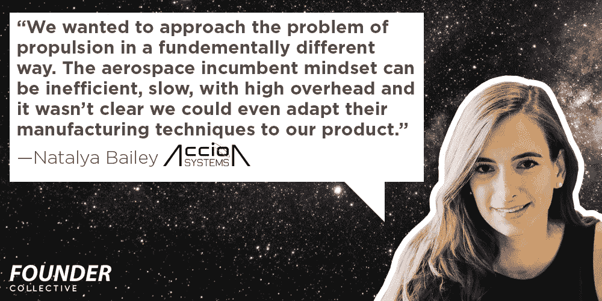
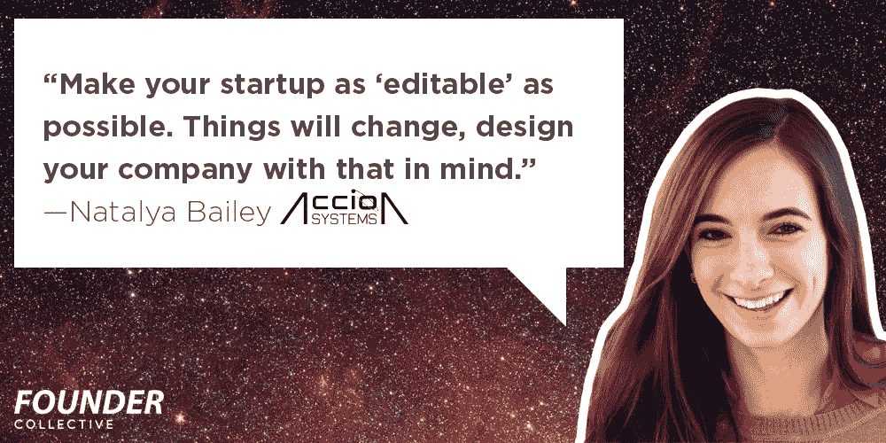
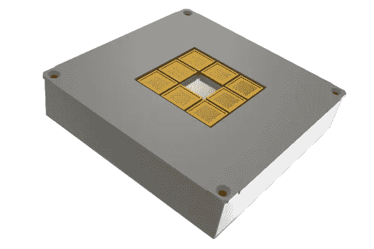

# 为异常聪明的人建立公司和筹集资金

> 原文：<https://medium.com/hackernoon/company-building-and-fundraising-for-the-freakishly-smart-9a3ca3b84251>

Natalya Bailey—Startup co-founder, CEO, rocket scientist.

## 火箭科学家的创业生活

*由***，执行合伙人&* [*乔·弗莱厄蒂*](https://twitter.com/josephflaherty) *董事，C & C**

*史蒂夫·乔布斯、比尔·盖茨和马克·扎克伯格普及了一种观念，即可怕的少年企业家辍学重塑一个行业，这些断断续续的创始人为科技做出了不可估量的贡献。然而，没有理由一个专心致志的书虫不能成为创业公司的首席执行官。*

*麻省理工学院、斯坦福大学、哈佛大学、加州理工学院和其他精英研究型大学的天才们是公司想法的一个可耻的未被充分利用的来源，即使是在生物技术之外。作为一家在地球上两个最伟大的学术机构之间工作的风险投资公司，我们希望帮助揭开公司建设的黑暗艺术，并希望说服一些博士放弃他们的博士后计划，转而创办一家创业公司。*

**

*An Accion Booster “rocket.” *Photo:* [*Accion Systems*](https://twitter.com/AccionSystems)*

*首先，我们采访了为微型卫星制造离子推进系统的初创公司 [Accion Systems](http://www.accion-systems.com/) 的联合创始人兼首席执行官兼首席火箭科学家[娜塔莉亚·贝利](https://twitter.com/natalya926)。在过去的三年里，她在麻省理工学院的空间推进实验室获得了航空工程博士学位，在风险投资中筹集了[1050 万美元将她的研究产品化，并与美国国防部](https://techcrunch.com/2016/05/12/accion-systems-raises-series-a/)签订了[650 万美元的合同——还有其他成就。](http://www.satellitetoday.com/technology/2015/06/18/accion-systems-awarded-3-million-dod-contract/)*

# *1.决定创办一家公司*

## *没有什么是在真空中发展起来的*

*火箭是在真空中发射的，但不是在真空中研发的。学院派企业家需要寻找催化剂，证明这个行业已经为他们的产品做好了准备。*

*例如，离子推进引擎早于第一个手持计算器，但直到最近，它们的整个市场一直是军方和 DishTV 每年发射的 10 亿或 20 亿美元的卫星。幸运的是，一些情况同时发生了变化。小型卫星变得可行且有风险支持。一批新的航空/航天企业家对非传统方法持开放态度，并热衷于不会因爆炸而烧尽风险资本的非挥发性推进系统。MEMs 制造技术使得发动机的制造成本更低。Natalya 的研究符合所有这些规范，并作为一个创业的跳板。*

*这是一个经典的背景转变，但这需要企业家能够将对新兴科学领域的兴趣与忍受初创公司的不确定性的意愿结合起来——更不用说量子粒子、材料科学和其他难以建模的非确定性物理学了。*

## *不要急于领证*

**

*学者们倾向于认为，将他们的技术推向市场的最快方式是与一个成熟的行业领导者合作，这个领导者可以处理运营一家公司的所有棘手问题，从人力资源管理到看似肮脏的销售流程。娜塔莉亚不想让她的新技术商业化碰运气，或者让一家公司有不正当的动机。*

*“我们想用一种完全不同的方式来解决推进问题，”她说。“航空业现有的思维模式可能效率低、速度慢、开销大，而且我们甚至不清楚是否能让他们的制造技术适应我们的产品。”*

*开创自己的事业是一个冒险的赌注，因为她正受到严肃行业参与者的关注，但想到自己是另一个齿轮，看着自己的技术在一家大公司衰落，她创办了 Accion。*

## *创业是一门通过/失败的课程*

**

*学术界的一次失败实验为未来更好的实验提供了素材。创业失败意味着无法支付信任你的团队的工资。*

*2000 年代中期，娜塔莉亚第一次尝到了创业的滋味，她与人合伙创办了一家初创公司。创始人对参与、责任和股权纠纷的期望很混乱。启动失败。船员们好几年都不能互相交流。"我想在自己的火箭公司工作，但我搞砸了。"*

*尽管这并没有让她变得富有，但却给了她一个宝贵的教训，尽管代价不菲。“让你的创业尽可能‘可编辑’，”她说。“事情会变，在设计你的公司时要考虑到这一点。”*

# *2.经营公司*

## *创业不是一门科学*

**

*“在实验室里一次制造一件东西，并不等同于一件可复制、可制造的产品，”Bailey 说。供应链在关键时刻崩溃，导致团队争夺替代解决方案。每 105 个小部件中就有一个会因为几乎无法确定的原因而失败。博士出身的企业家从在大学实验室拥有一切可以想象的资源，到不得不从 Ebay salvage 拼凑解决方案。建立一家公司是一个混乱的过程。*

*这种重复工作的要求也意味着项目需要更长的开发时间。通过实验证明一个原理是不够的；这些发展必须付诸实践——这是学者们常常无法理解的。娜塔莉亚的导师提供的经验法则是，这比你预测的要花两倍的时间和两倍的费用。以她的经验，真正的倍数是 4 倍。*

*对于那些考虑在某个时候创办一家公司的人来说，开始开发 DIY 技能来构建原型永远不会太早。Natalya 在高中时加入了一个机器人团队，但由于缺乏机械专业知识，她被降级为维护团队的日志。毫无疑问，潜在的性别歧视可能是一个因素，但贝利也承认，她确实缺乏实际制作东西的经验。她最终通过业余爱好项目自学。“我试图制造一只机器狗，因为我的公寓里不能有一只真正的狗，”她补充道。"它跟随着我戴在脚踝上的 LED 手镯."*

**

*Bailey went from not being allow to use a soldering iron to piloting a 5-axis CNC. Photo: [Career Contessa](http://www.careercontessa.com/interviews/natalya-brikner-ceo-aerospace-engineering-accion/)*

*从那以后，她被福布斯杂志评为制造业 30 名 30 岁以下的人之一——对于一个曾经被认为不适合拿烙铁的人来说，这已经不错了！*

## *像工程师一样分配股权*

*在联合创始人之间分配股权是一门棘手的艺术，很少会是一个平稳的过程。感情受伤，争吵随之而来。到了分配股份的时候，贝利把这个过程当成了一个工程问题。*

*受诺姆·乏色曼的《创始人的困境》*一书的启发，团队分解了公司成立头三年需要的技能和专业知识，根据重要性对这些职责进行加权，并根据每个团队成员的预期贡献给他们赋值。没有人对拆分感到高兴，但每个人都明白其中的逻辑。**

## *寻找导师*

*原始智能只能携带一个；来之不易的专业知识可能比 20 点智商更有价值。娜塔莉亚明智地聘请了世界知名的企业治疗师安娜·罗利和担任雷神公司首席执行官十年的比尔·斯旺森作为她羽翼未丰的企业的顾问。*

***“安娜****帮助我进行沟通——从创始团队，每个人都可以在午餐桌上决定今天在网站上工作，到一个有 20 人的公司，你说的一切都很重要，你没说的一切都很重要，这是一个奇怪的转变，”娜塔莉亚说。"她帮我完善了我沟通风格的方方面面。"***

***“比尔是一本关于商业经验和轶事的活百科全书，帮助解决管理问题，比如如何与不认同公司价值观的高绩效员工打交道，”她说。“我可以告诉比尔，我需要介绍给波音公司的人，今天结束时，我会被介绍给首席执行官。”***

## ***管理学术的艺术***

***学术界的生活可能是愉快的——棕色袋子讲座、大学同事和美丽的校园是初创公司无法比拟的额外待遇——源源不断的 La Croix 没有终身职位。***

***那么，如何吸引聪明人离开麻省理工学院或哈佛大学的长椅呢？纵容他们的学术冲动。Accion 无法与谷歌的“百分之二十时间”竞争，但她确实鼓励交叉训练。例如，一名技术员工对将他的统计敏锐度应用于市场研究很感兴趣。贝利让他负责进行市场分析。它允许员工在为团队提供可操作信息的同时拓展思维。***

## ***不要在管理上投资不足***

***过去几年，娜塔莉亚的职业轨迹就像一艘火箭船，但也有成长的烦恼。例如，她理解聘请高级技术经理的理论需要，但总觉得有更迫切的迫切需要。只有在她聘请了一位才华横溢的副总裁后，她才能够专注于 30，000 英尺的视野，看看她从一次招聘中能获得多少优势。***

# ***3.为异常聪明的人筹款***

************

***Accion Systems has supplemented venture capital with grants from the Department of Defense. *Images: Accion Systems****

***CB Insights 记录了近年来太空创业公司和其他“T2”前沿技术领域资金的增长。尽管如此，让非天体物理学家投资火箭科学还是很困难的。显然，它有助于瞄准具有相关专业知识的特定合作伙伴——[我作为一名电信企业家](http://investors.intelsat.com/phoenix.zhtml?c=131114&p=irol-newsArticle&ID=1698343)发射过卫星，并在该领域有一些基础知识，但 Natalya 提供了更多一般性建议。"保持怀疑的态度，在别人之前证明自己是错的."她的意思是预测潜在投资者的担忧，包括对太空的不熟悉，太空是一个商业风险。无情地将行话从你的套牌中剔除，将学术挑战转化为更容易理解的商业故事。***

## ***为什么 VC >政府资助***

***从政府机构筹集资金似乎是一个明智的想法，尤其是非稀释性拨款，但也存在挑战。***

***不可能安排创新，但每个政府项目都有时间表。资金在一段固定的时间内发放，为了获得更多资金，公司必须拿出具体的成果。相比之下，风险投资界的进步和视野要重要得多。***

***通过将企业与政府拨款捆绑在一起，它很容易就结束在一个痉挛的雇佣/解雇跑步机上，明星员工经常因资金不足而被解雇。风险投资可能很难管理，但通过求助于政府，首席执行官们有效地将每次选举变成了对其业务的公投。***

***Natalya 鼓励企业家采用一种混合模式，风险资本用于探索未知领域，而政府资金用于将探索提炼为可销售的产品。***

****要了解更多信息，请在 Twitter 上关注* [*娜塔莉亚*](https://twitter.com/natalya926?lang=en) *和*[*Accion Systems*](https://twitter.com/AccionSystems)*并访问他们的网站*[【www.Accion-Systems.com】](http://www.accion-systems.com/)*。****

******************

> ***[黑客中午](http://bit.ly/Hackernoon)是黑客如何开始他们的下午。我们是 [@AMI](http://bit.ly/atAMIatAMI) 家庭的一员。我们现在[接受投稿](http://bit.ly/hackernoonsubmission)，并乐意[讨论广告&赞助](mailto:partners@amipublications.com)机会。***
> 
> ***如果你喜欢这个故事，我们推荐你阅读我们的[最新科技故事](http://bit.ly/hackernoonlatestt)和[趋势科技故事](https://hackernoon.com/trending)。直到下一次，不要把世界的现实想当然！***

******