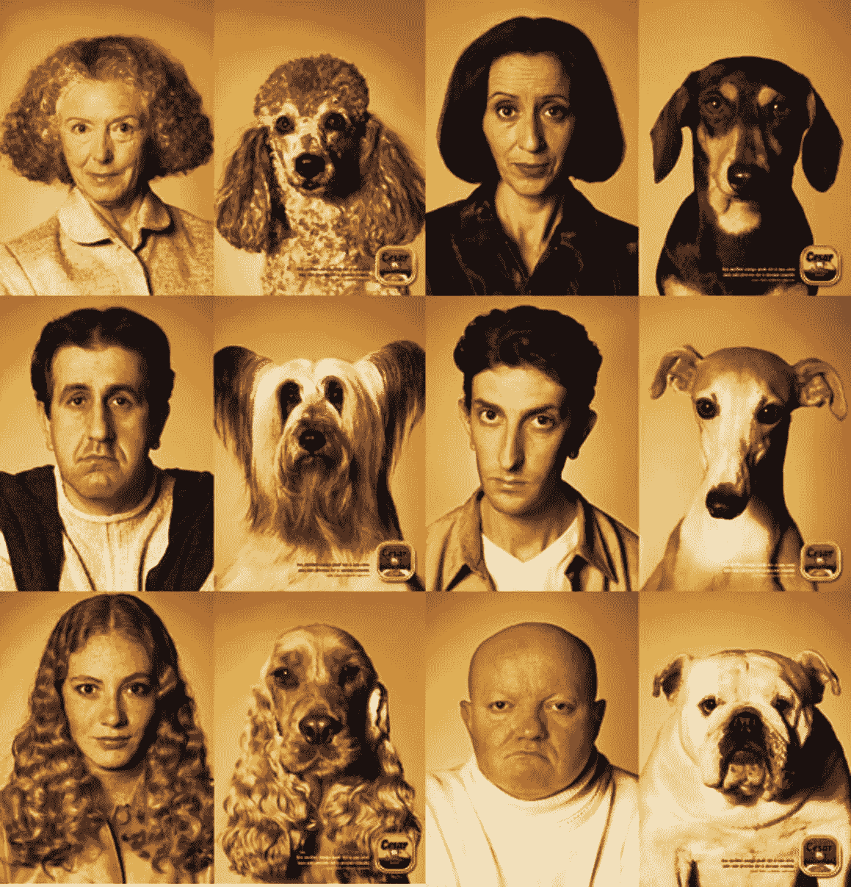
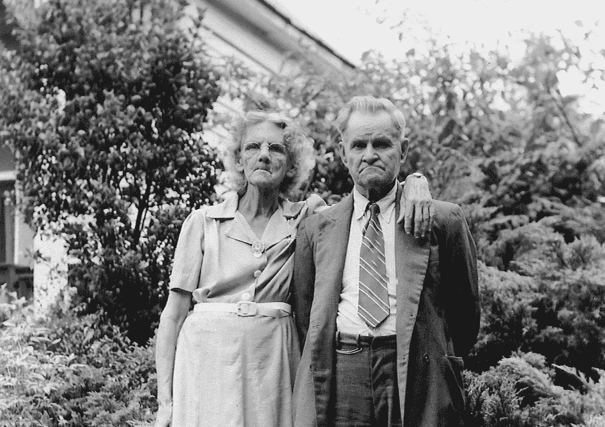
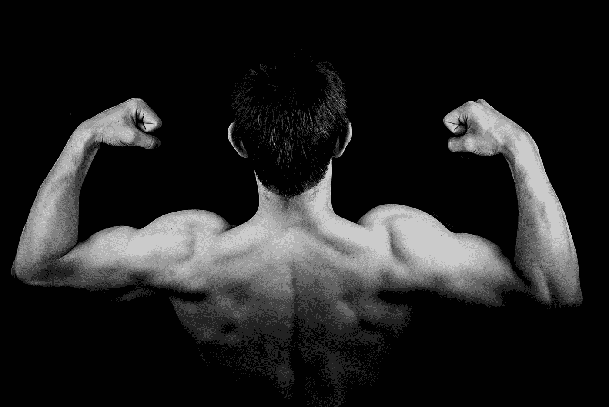

# 公司文化——秘诀是什么？

> 原文：<https://medium.com/hackernoon/company-culture-what-s-the-secret-c219c78ba8b0>

你有没有注意到人们长得像他们的狗？或者年龄越大，[已婚夫妇](https://psiloveyou.xyz/tagged/marriage)看起来越像？[商业](https://hackernoon.com/tagged/business)也不例外。公司实际上看起来像他们的领导者。高层不仅有一种基调，还有一种个性、信仰，甚至是高层的“形象”。公司[文化](https://hackernoon.com/tagged/culture)始于高层，止于高层。

A CESAR DOG FOOD CAMPAIGN FOCUSED ON HOW WE LOOK LIKE OUR DOGS. COMPANY CULTURE COULD BE COMPARED THE SAME WAY.

我们曾经和一个喝醉的 CEO 共事过。他有一双大力水手都会嫉妒的手臂。我们环顾了一下公司，大部分其他人都很健康。办公室里设备齐全的健身房也没有坏处。每个人甚至穿得像首席执行官。

我们与另一家公司合作，该公司的首席执行官很随便。他的衣服有点皱。他有几天的阴影(不是在潮人的方式)。他的办公室到处都是成堆的文件。猜猜我们在公司看到了什么。衣服皱巴巴，5 天阴影，办公桌凌乱的人。

一个并不比另一个更成功。事实上，两家公司都非常成功。

> 公司呈现出其领导层的特征。

大力水手 CEO 有一种苦干、长时间工作和期待完美的态度。他担心太多的员工工作过度。你猜他们这种行为是从哪里来的？

人长得像他们的狗是有原因的。该理论认为，人们渴望相似的物体和同伴。他们很熟悉。从进化的角度来看，熟悉的物体造成的威胁较小。我们自然会被它们吸引。

此外，我相信你已经注意到配偶看起来像他们的另一半。这种现象在结婚多年后更加明显。为什么？研究发现，随着我们在一起的时间越来越长，我们开始做出相似的面部表情。这构建了相同的面部肌肉，导致我们看起来很像。

Older couples tend to look alike, don’t they?

作为领导者，我们负责塑造正确的肌肉(萎缩错误的肌肉)来实现我们的目标。肌肉的建立——字面意思——决定了公司的外观、价值观、行为和表现。

Are you building the right muscles?

当领导层发生变化时，公司也会发生变化。我们与一家公司合作，在一个领导者的领导下，这家公司非常关心公司的员工。一位新的首席执行官带来了一个新的守卫，公司的个性发生了变化，只关注业绩。公司的整个个性都变了。

当大学或 NFL 教练不受欢迎时，这种情况每个赛季都会发生。下个赛季，我们会看到同样的球员，但不同的球队会有不同的结果。这就是高层基调的影响。

这就是我们为你们这些领导者关注[的原因。这些领导人已经练就了把别人放在第一位的肌肉。猜猜什么样的领导为你们领导工作？你猜对了，更适合你们领导。](http://dandoadvisors.com/effective-leadership-type/)

得到你想要和需要的东西的最好方法是展示它。

[ [喜欢你读的书吗？将 Dando 的领导力建议直接发送到您的收件箱。](http://dandoadvisors.com/newsletter) ]

**知道**
人长得像他们的狗。更重要的是，公司的外表和行为都像他们的领导者。人们做人们看到的事情。领导力更多的是你做什么，而不是你说要做什么。

**感受**
打造正确的领导肌肉，让别人萎缩，需要有意识的意向性。真的真的很难。通往领导天堂的道路确实要经过地狱。但是值得。你正在锻炼的肌肉(个人态度、责任感、职业道德、专注、如何应对压力等)。)将在整个组织中逐级传播。

在你的公司走一圈，随机问五个人你在高层的语气是什么。他们怎么说？他们为什么这么说？向同样的五个人询问企业文化。这听起来像你的行为和个性吗？根据这些答案，你需要改变什么？

> [黑客中午](http://bit.ly/Hackernoon)是黑客如何开始他们的下午。我们是 AMI 家庭的一员。我们现在[接受投稿](http://bit.ly/hackernoonsubmission)并乐意[讨论广告&赞助](mailto:partners@amipublications.com)机会。
> 
> 如果你喜欢这个故事，我们推荐你阅读我们的[最新科技故事](http://bit.ly/hackernoonlatestt)和[趋势科技故事](https://hackernoon.com/trending)。直到下一次，不要把世界的现实想当然！

