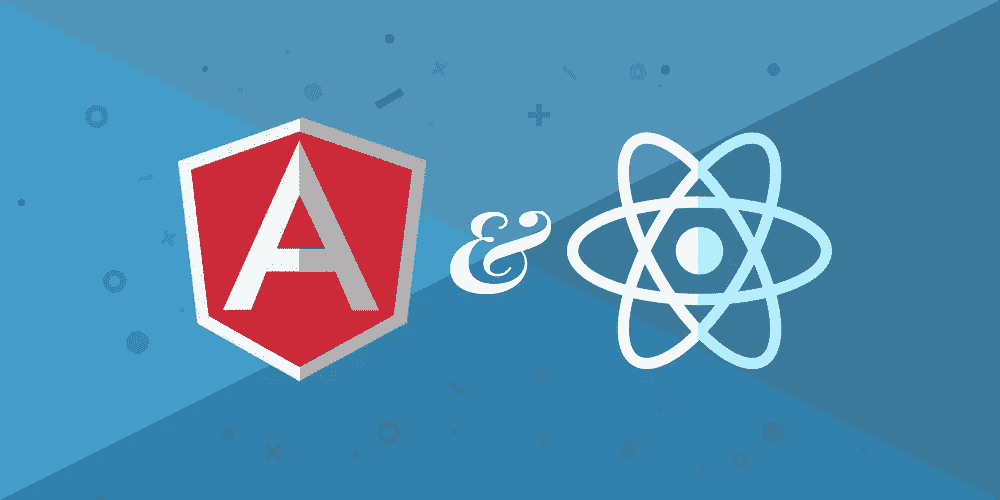
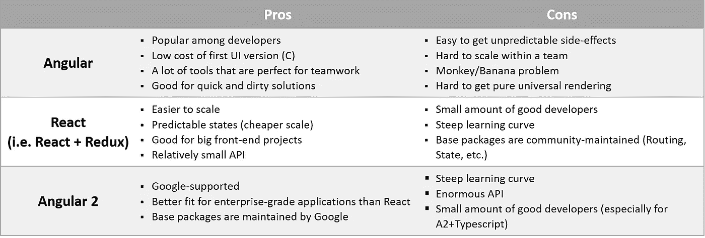

# 对比 Angular 和 React:dash bounk+2 年经验

> 原文：<https://medium.com/hackernoon/comparing-angular-and-react-dashbouquet-2-years-experience-e052001fb8ca>

在过去的几年里，**团队有很多不同的项目，其中包括 Angular，Angular2 和 React。因为现代发展趋势包括使用如此庞大的库，许多开发人员争论，哪一个是最好的。因为我们与 Angular 和 React 都合作过，所以我们想分享我们的观点，讨论各自的优点和缺点，并就每个库的最佳使用给出一些建议。**

**几年前，我们开始了 Angular 的工作，从那时起，我们有超过 50 个项目，在规模和技术堆栈上都有所不同。在我们的工作中，我们倾向于不断提高生产率，尽可能少花时间，同时不断取得优异的成果。因此，至关重要的是，我们要使用最好、最有效的工具，并迅速决定哪些工具值得使用，哪些不值得使用。**

**下面是一个表格，我们在其中给出了 Angular 和 React 的优缺点:**

****

**开发人员倾向于选择 Angular 而不是 React，这是一个优势，因为在这种情况下，使用框架更方便。此外，谷歌趋势支持我们关于角流行的观点。**

**我们有几十个 Angular 项目，它们都有一个共同点——Angular 一直是快速和相对简单的 UI 解决方案的完美选择。所以，如果你有一个业务逻辑复杂的应用，那么选择 React + Redux 会更好。**

**另一个角度上的缺点是很有可能产生副作用。例如，如果你在工作过程中做错了什么，它将最有可能导致另一件事等等。同样，你会让更多的开发人员参与到这个项目中来，而副作用会相互叠加。一旦扩大规模，就很容易失去对质量的控制。相反，在使用 Angular2 和 React 时，由于可预测的状态容器和不变量，没有出现这样的问题。**

**Angular 还有一个问题，我们称之为猴子/香蕉问题。意思是，如果你想给猴子一个香蕉，看看猴子会如何处理它，你必须先建造整个丛林。与 Angular2 不同，使用 React，您可以轻松获得更多可测试的组件，因为它拥有发达的生态系统。
对于 React 和 Angular2 cons 来说，最大的问题之一就是缺乏优秀的开发者。尽管 React 是一个相当小的框架，但开发者仍然需要考虑很多事情:状态管理、与服务器的交互、测试等等。**

**这只是我们对这三个框架的全部想法的一部分。因为在[**dash bounk**](https://dashbouquet.com/)我们从来不偏心，我们诚实的选择是 React + Redux/Saga。我们更喜欢它，因为我们主要处理大而复杂的应用程序。然而，我们不介意更多地使用 Angular，并从中获得更多的经验。**

**[*安东·沙利尼科夫*写的](https://www.linkedin.com/in/anton-shaleynikov-45812a1/)**

************

> **[黑客中午](http://bit.ly/Hackernoon)是黑客如何开始他们的下午。我们是 [@AMI](http://bit.ly/atAMIatAMI) 家庭的一员。我们现在[接受投稿](http://bit.ly/hackernoonsubmission)并乐意[讨论广告&赞助](mailto:partners@amipublications.com)机会。**
> 
> **如果你喜欢这个故事，我们推荐你阅读我们的[最新科技故事](http://bit.ly/hackernoonlatestt)和[趋势科技故事](https://hackernoon.com/trending)。直到下一次，不要把世界的现实想当然！**

****