# 比较各种序列化程序的性能

> 原文：<https://medium.com/hackernoon/comparing-the-performance-of-various-serializers-8cc459a24c21>

已经有[串行化器](https://maxondev.com/serialization-performance-comparison-c-net-formats-frameworks-xmldatacontractserializer-xmlserializer-binaryformatter-json-newtonsoft-servicestack-text/)的[基准](http://theburningmonk.com/2014/08/json-serializers-benchmarks-updated-2/)上的[各种](http://geekswithblogs.net/LeonidGaneline/archive/2015/05/06/serializers-in-.net.-v.2.aspx) [文章](https://www.hanselman.com/blog/ProperBenchmarkingToDiagnoseAndSolveANETSerializationBottleneck.aspx)。甚至[各种](https://github.com/sqfasd/node-serialization-benchmark) [github](https://github.com/thekvs/cpp-serializers) [项目](https://github.com/aumcode/serbench) [都存在](https://github.com/mtth/avsc/wiki/Benchmarks)没有附带文章。这适用于每一种语言，证明了性能对某些人有多重要。

然而，创建可重复的、一致的基准非常困难。这并不奇怪，正如 Hanselman 指出的，有许多因素需要控制:

*   CPU 关联性/进程优先级
*   测试机器上其他正在运行的进程
*   如果存在，处理垃圾收集而不扭曲结果
*   使用正确的时间测量通话
*   正确使用测试中的框架/库
*   考虑结果异常值
*   以易于理解的方式显示结果

可能还有其他一些我忽略的因素。毫不奇怪，许多现有的基准会因为缺少一点或多点而受到批评。让我们来看一些:

**GLD。SerializerBenchmark**

尽管它已经被 [serbench，](https://github.com/aumcode/serbench)取代，我还是想给它一些关注，因为它说明了很多疏漏，尽管乍一看它似乎是一个有价值的信息来源。

你注意到 GLD 的第一件事。SerializerBenchmark 是一个生成错误:

这显然需要手动下载 DLL，如代码中的[注释所述。解决这个问题，不要忘记输入“100”作为程序参数，正如在](https://github.com/leo-gan/GLD.SerializerBenchmark/blob/2c8c6428684bf5ded1e16f6ee4289bf74a44322e/GLD.SerializerBenchmark/Serializers/ApJsonSerializer.cs#L2-L3)[文章](http://geekswithblogs.net/LeonidGaneline/archive/2015/05/06/serializers-in-.net.-v.2.aspx)中所述。这会产生以下输出:

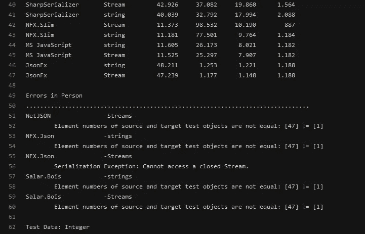

Full output [here](https://gist.github.com/Oipo/9d9825d4df50a399497e747f03e933f0)

如您所见，并非所有测试都成功运行。有大量的例外和检查是失败的，这使得其他基准之间的比较更加困难，甚至是它自己的基准。更不用说这篇文章没有给出完整的输出来进行比较。

除了运行它的问题，我还注意到了几个测量问题:

*   它不设置 CPU 关联性，也不设置进程优先级
*   在 [Jil 序列化器](https://github.com/leo-gan/GLD.SerializerBenchmark/blob/2c8c6428684bf5ded1e16f6ee4289bf74a44322e/GLD.SerializerBenchmark/Serializers/JilSerializer.cs#L24-L26)中，可以被默认的选项是 done [这里是](https://github.com/Oipo/SerializerComparison/blob/7e8085e5bf290ff023f77dcf5fe86d42c5cbda80/SerializerComparison/Program.cs#L35)。
*   另外，在 [Jil 序列化器中，](https://github.com/leo-gan/GLD.SerializerBenchmark/blob/2c8c6428684bf5ded1e16f6ee4289bf74a44322e/GLD.SerializerBenchmark/Serializers/JilSerializer.cs#L22)构造 StreamWriter 不是必需的，但是如果您需要它用于 WebAPI 之类的东西，它是受支持的
*   尽管[父类](https://github.com/leo-gan/GLD.SerializerBenchmark/blob/2c8c6428684bf5ded1e16f6ee4289bf74a44322e/GLD.SerializerBenchmark/ISerDeser.cs#L10)包含一个可重写的初始化成员，但它实际上从未被重写，并且[有时](https://github.com/leo-gan/GLD.SerializerBenchmark/blob/2c8c6428684bf5ded1e16f6ee4289bf74a44322e/GLD.SerializerBenchmark/Serializers/DataContractJsonSer.cs#L31) [甚至](https://github.com/leo-gan/GLD.SerializerBenchmark/blob/2c8c6428684bf5ded1e16f6ee4289bf74a44322e/GLD.SerializerBenchmark/Serializers/DataContractSerializer.cs#L31) [在序列化调用期间使用了](https://github.com/leo-gan/GLD.SerializerBenchmark/blob/2c8c6428684bf5ded1e16f6ee4289bf74a44322e/GLD.SerializerBenchmark/Serializers/BondJsonSerializer.cs#L34)。Jil 之类的序列化器使用大量反射，但只在第一次调用时使用，这使得 initiliaze 函数对于获得正确的结果至关重要。
*   [NetJSON 序列化程序](https://github.com/leo-gan/GLD.SerializerBenchmark/blob/2c8c6428684bf5ded1e16f6ee4289bf74a44322e/GLD.SerializerBenchmark/Serializers/JsonNetSerializer.cs#L20)包含不必要的额外 StringWriter
*   垃圾收集器[没有在每次测试运行之间运行](https://github.com/leo-gan/GLD.SerializerBenchmark/blob/2c8c6428684bf5ded1e16f6ee4289bf74a44322e/GLD.SerializerBenchmark/Tester.cs#L61-L72)，导致在关键代码执行期间可能的垃圾收集。
*   所有结果都是平均的，因此无法看出最小值和最大值是多少，也无法明显看出有多少测试落在某个范围内(即看有多少抖动)

中使用的序列化程序做了大量的工作。NET 环境。但是我不相信这个基准能输出非常一致的测量结果。

**Serbench**

GLD。SerializerBenchmark 的 README 指向了这个项目。然而，在撰写本文时，GLD 项目的一些缺点似乎也存在于 Serbench 中。 [Jil 序列化程序](https://github.com/aumcode/serbench/blob/4e7a0e7d64cd20c348bdfc4205691a63d61ddf76/Source/Serbench.Specimens/Serializers/JilSerializer.cs)包含相同的不必要的 stringreader/writer，Jil 仍未正确初始化，并且未设置 CPU 关联和进程优先级。

它似乎在每次运行前收集垃圾，移除重复的 StringWriter，在每次运行时给 Jil 一个新的 Options 对象，并添加 Apolyton。FastJson 引用直接放在存储库中。尽管如此，也没有提到已经进行了内存分析，以确定收集是专门诱导的还是在测试运行期间发生的。另外，serbench [创建了一个额外的线程](https://github.com/aumcode/serbench/blob/4e7a0e7d64cd20c348bdfc4205691a63d61ddf76/Source/Serbench/TestingSystem.cs#L137)来运行所有的测试，这让我觉得很奇怪。

然而，我无法让 serbench 工作。显然它需要一种叫做 [NFX](https://github.com/aumcode/nfx) 的东西，这种东西能够将结果写入各种输出，比如 RDBMS。看起来他们的目标是一个模拟并行运行的序列化程序的基准，应该比通常显示的合成基准更真实。虽然链式标杆管理肯定会很有趣，但我对他们试图证明什么持怀疑态度。将序列化器隔离在合成基准中使得它们很容易比较，但是一旦引入整个软件栈链，就必然会遇到每个人都有自己的组合的问题。很快，您将不得不创建一个包罗万象的基准测试套件，它可以在多个平台上运行，具有可插拔的框架和可插拔的序列化器。

诚然，我没有花太多的时间让它工作，但我希望能够打开项目，并按下开始，它应该工作。我希望他们将来会使它更容易使用。

**简单速度测试**

虽然不是大量序列化程序的完整基准，但它提供了创建序列化程序的相对简单的设置。

[其中一个例子](https://github.com/theburningmonk/SimpleSpeedTester/blob/develop/examples/JsonSerializersBenchmark/JsonSerializersSpeedTest.cs)展示了如何使用它，在这个例子中，你可以看到它没有在 GLD 和塞尔本奇项目中发现的较小的疏漏。它只在必要的地方使用流，虽然不会比较有流和没有流的同一个库。它也做[垃圾收集，](https://github.com/theburningmonk/SimpleSpeedTester/blob/develop/src/SimpleSpeedTester/Core/Test.cs#L101)但是像 GLD 一样，它把所有的[结果平均成一个数字](https://github.com/theburningmonk/SimpleSpeedTester#getting-started)。

虽然结果相当可信，但这里我也遗漏了 CPU 关联性和进程优先级。我可以看到这对于快速的一对一比较有效，但对于完整的基准测试套件无效。

**更好的对比？**

我确信我还没有在。NET 环境，我的时间毕竟有限。然而，我确实[创建了一个项目](https://github.com/Oipo/SerializerComparison)，它旨在以一种隔离的、合成的基准风格，为各种各样的序列化程序考虑尽可能多的因素。

**硬件&软件**

在适当的基准测试中，为了最小化差异和增加可再现性，通常会陈述所使用的硬件和软件。

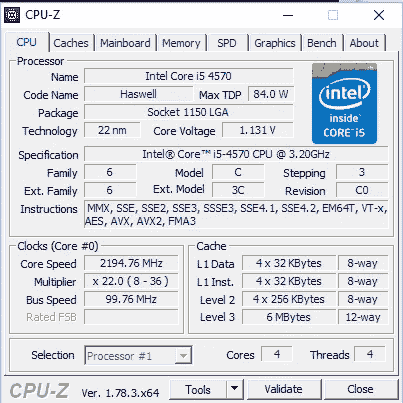

正如你在这些截图中看到的，我在非超频的 i5–4570 上运行所有测试

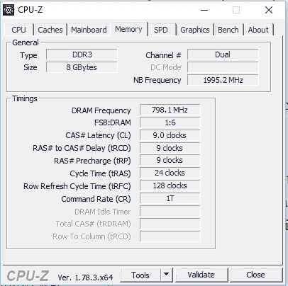

具有 8 GB 的 RAM，时钟/时序如下。

至于软件，我运行的是 64 位 Windows 10 Professional，有最新的更新，关闭了除文件浏览器以外的所有应用程序，但禁用了自动更新和所有隐私敏感设置。我注意到，在后台下载和安装更新时，自动更新很容易占用您所有的磁盘 I/O 和一个完整的 CPU 内核。这对于基准测试来说是不可行的。

我使用过 Visual Studio 2017(不是更新版本)和。NET Framework 4.6.2 来编译 C#解决方案。

有关 C#中使用的库，请参见 [packages.config](https://github.com/Oipo/SerializerComparison/blob/7e8085e5bf290ff023f77dcf5fe86d42c5cbda80/SerializerComparison/packages.config) 。

对于 NodeJS，我使用的是 7.7.4 版本

对于 C++我用的是 Visual Studio 2017(不是更新版本)搭配麦片 1.2.2(使用 rapidjson 和 rapidxml)、protobuf 3.2.0(静态库可以在资源库上找到[)](https://github.com/Oipo/SerializerComparison/tree/7e8085e5bf290ff023f77dcf5fe86d42c5cbda80/CppSerializerComparison)

**方法论**

大多数其他基准测试所做的，是创建两个对象进行序列化和反序列化，连续运行多次，然后计算平均值。虽然这为您提供了所需总时间的表示，但它确实丢失了一些有价值的数据。

对于这个项目，我想创建一个中等大小的对象，分别测量序列化和反序列化，并将每次运行存储在一个测量列表中。这样我就可以创建一个 [OHLC 图](http://en.tradimo.com/tradipedia/ohlc-chart/)。然而，我要改变各个点的定义。高和低将分别是测量的最高时间和最低时间，但开放点将是第 20/100 次测量，而关闭点将是第 80/100 次测量。

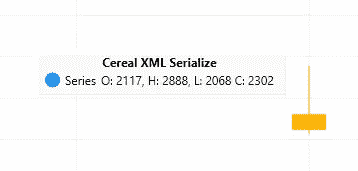

在左边你可以看到一个重复 250 次的例子。最快的样本(L 代表低电平)是 2117 s，最慢的样本(H 代表高电平)是 2888 s。所有测量值都按从低到快的顺序排列。第 20/100 个测量值(O)是第 50 个测量值，即 2117 s。第 80/100 个测量值(C)是第 200 个测量值，即 2302 s。您可以看到大多数样本(其中的 60%)都在 2117–2302s 范围内，只有几个异常值低于该范围，但有更多异常值高于该范围。

通过这种方式，您可以了解库的抖动/一致性程度，并对库的性能有一个大致的了解。

此外，所有基准测试进程都将在 CPU #0 上运行(因此设置了 CPU 亲缘关系)，具有较高的进程优先级，并且将作为管理员运行，因此前两个设置可以由进程本身来完成。

最后一步，我将分析内存，看看垃圾收集是否严格地在我希望的时候发生，而不是在测试期间。

我的第一个测试将是在 x86 和 x64 上的各种设置中的 Jil(正常、流、有和没有数据对象类的属性、有和没有选项)。

我的第二个测试是在 x86 和 x64 上用 C#编写一些 JSON 序列化程序。

第三个测试是在 x86 和 x64 上用 C#编写一些二进制序列化程序。

我的第三个测试将比较 C#中的几个序列化器与 C++和 NodeJS 中的序列化器。

**代码**

为了确保我做得正确，我想让你看一下我的一些代码。

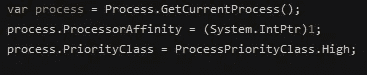

程序做的第一件事是设置亲和力和优先级。

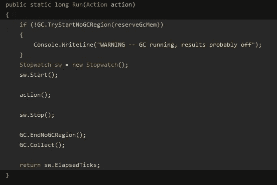

Full code [here](https://github.com/Oipo/SerializerComparison/blob/7e8085e5bf290ff023f77dcf5fe86d42c5cbda80/SerializerComparison/TestRunner.cs#L48-L62)

这是用于运行单个测量的代码。。NET 4.6 引入了 GC。TryStartNoGCRegion 函数，它允许您告诉垃圾收集器预分配内存，并告诉它在结束该区域之前不要运行垃圾收集。我尝试在调用动作前[分配 1M](https://github.com/Oipo/SerializerComparison/blob/7e8085e5bf290ff023f77dcf5fe86d42c5cbda80/SerializerComparison/TestRunner.cs#L23) 。

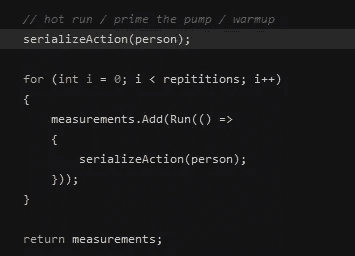

Full code [here](https://github.com/Oipo/SerializerComparison/blob/7e8085e5bf290ff023f77dcf5fe86d42c5cbda80/SerializerComparison/TestRunner.cs#L74-L84)

每次测试都是预热，所以我们不测量冷启动时间。然后测试运行 250 次重复，这是[硬编码的](https://github.com/Oipo/SerializerComparison/blob/7e8085e5bf290ff023f77dcf5fe86d42c5cbda80/SerializerComparison/TestRunner.cs#L24)。从技术上讲，这是所有测试中唯一被抛弃的“度量”。

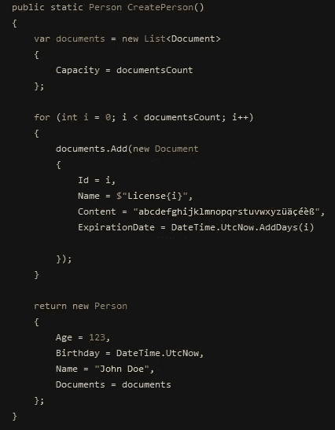

Full code [here](https://github.com/Oipo/SerializerComparison/blob/7e8085e5bf290ff023f77dcf5fe86d42c5cbda80/SerializerComparison/TestRunner.cs#L343-L369)

对于所有测试，我创建了一个包含 1000 个文档的对象。我试图给出一个代表性的对象，包含日期时间，UTF-8 字符串和一个整数。我意识到更多的组合是可能的，但我不确定它们是否会增加很多。

当然，具体的操作有一些变化，例如当需要流时，或者当在运行测试之前将预先加载了 json/xml/binary 内容的特定文件读入内存时，或者当库需要不同类型的人员/文档时，但是这是所有类型的基本结构。

**结果—测试#1**

Click for bigger view. Ser = Serialization test, Des = Deserialization test, StrSer = Stream Serialization, StrDes = Stream Deserialization, x86 run, be aware of the Y-axis not starting at 0

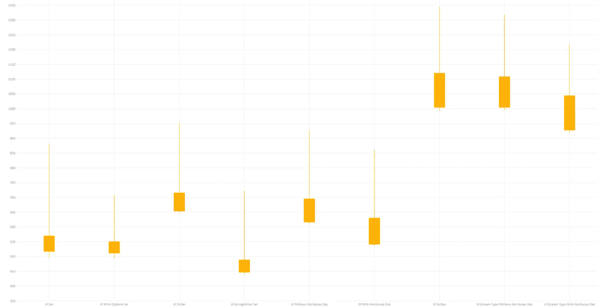

Click for bigger view. Ser = Serialization test, Des = Deserialization test, StrSer = Stream Serialization, StrDes = Stream Deserialization, x64 run, be aware of the Y-axis not starting at 0

我很抱歉没有让 Y 轴从 0 开始，我正在使用[实时图表，](https://lvcharts.net/)，我还没有找到如何改变这一点。如果你知道怎么做，请告诉我！

您在这些图中看到的第一件事是 Jil 快速且一致，尤其是对于 JSON 序列化程序。大多数呼叫都在 1 毫秒以下。一致性可能是由于速度快，我们将在接下来的测试中看到。其次，流序列化减慢了它的速度，但 stringwriter 显然加快了它的速度。第三,“With Attributes”意味着数据对象是用类的 DataContract 和 Serializable 属性创建的。但是实际发生的情况是 Jil 无法识别一些 DataContract 属性，这导致 datetimes 没有被序列化/反序列化。所以你在图中看到的加速完全归因于此。最后，有流的反序列化比没有流的要慢得多，这是一个遗憾。将 Jil 与 WebAPI 一起使用时，使用流 API 而不是直接版本。

这个概要文件将在最后，因为所有的结果都来自于一次基准测试。

**结果—测试#2**

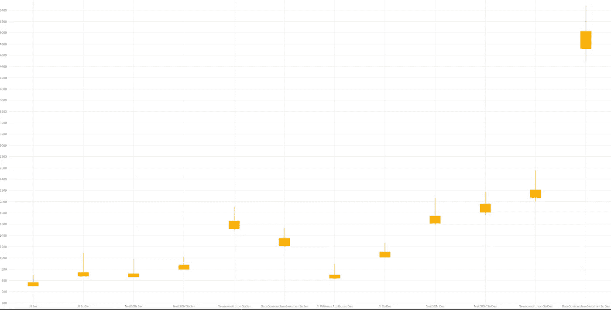

Click for bigger view. Ser = Serialization test, Des = Deserialization test, StrSer = Stream Serialization, StrDes = Stream Deserialization, x86 run, be aware of the Y-axis not starting at 0

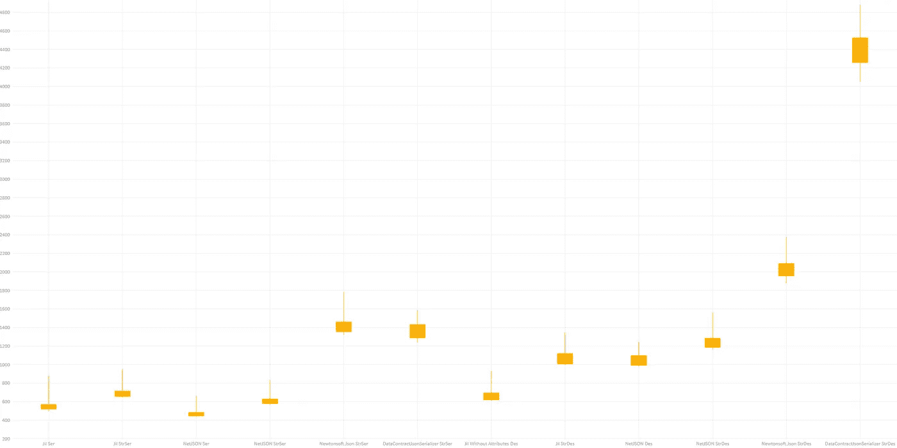

Click for bigger view. Ser = Serialization test, Des = Deserialization test, StrSer = Stream Serialization, StrDes = Stream Deserialization, x64 run, be aware of the Y-axis not starting at 0

这就是开始变得有趣的地方！GLD 的发现之一。SerializerBenchmark 是 NetJSON 比 Jil 快——但不是在这个基准中！除了 x64 序列化，Jil 要快得多。即使在 x64 序列化的情况下，NetJSON 也要快大约 75 秒，而在 x64 反序列化的情况下，NetJSON 每次调用要慢 374 秒。

纽顿软件。JSON 比 Jil 和 NetJSON 慢 2-3 倍，但是真正慢的是 DataContractJsonSerializer 反序列化器，它带有。NET 框架。它比 Jil 和 NetJSON 慢 6-8 倍，也是所有框架中最不一致的。我不知道为什么。

**结果—测试#3**

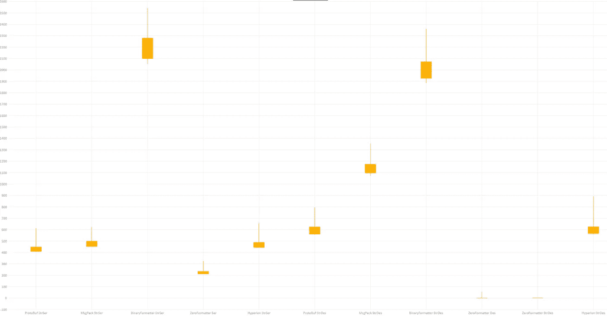

Click for bigger view. Ser = Serialization test, Des = Deserialization test, StrSer = Stream Serialization, StrDes = Stream Deserialization, x86 run, be aware of the Y-axis not starting at 0

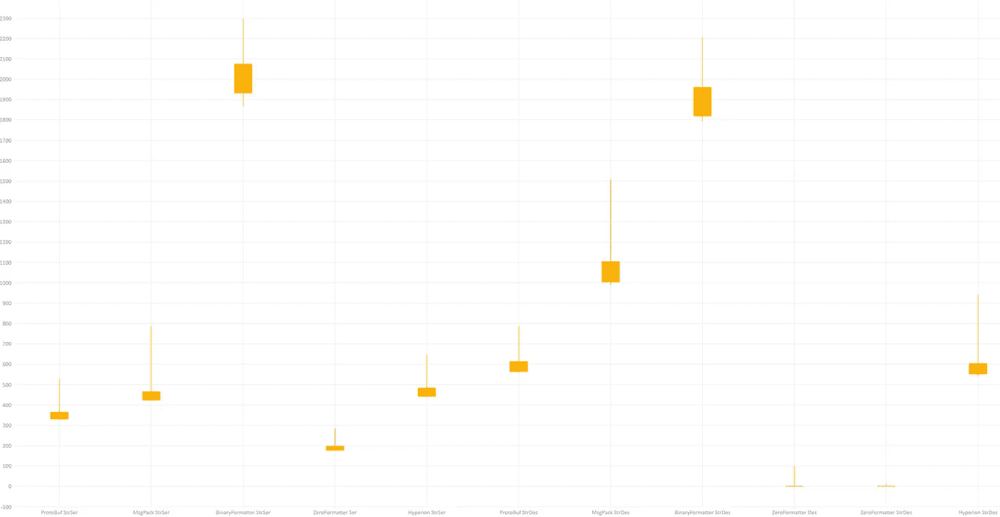

Click for bigger view. Ser = Serialization test, Des = Deserialization test, StrSer = Stream Serialization, StrDes = Stream Deserialization, x64 run, be aware of the Y-axis not starting at 0

正如我所料，二进制序列化程序甚至比 JSON 序列化程序更快。毕竟，他们不需要解析文本。但我真正感到惊讶的是，ZeroFormatter 的速度如此之快。它在 github 上的大胆声明确实不是谎言。比 Hyperion(Wire 的继任者)和 protobuf 都快。

如果你将 Hyperion 或 Protobuf 与 Jil 或 NetJSON 进行比较，你不会发现太多的速度差异——至少在 C#中是这样。MsgPack 有点慢，但你真的想避开 BinaryFormatter。

**结果—测试#4**

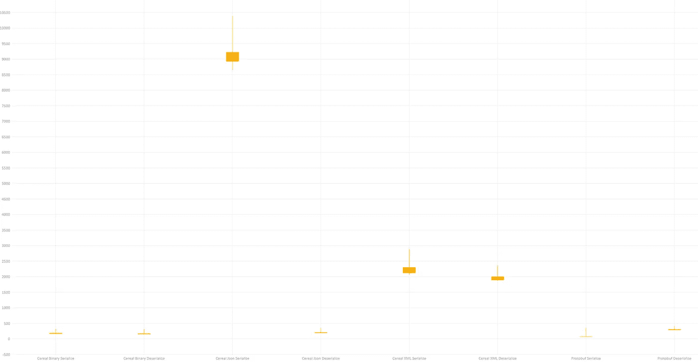

Click for bigger view. Ser = Serialization test, Des = Deserialization test, StrSer = Stream Serialization, StrDes = Stream Deserialization, C++ x64 run, be aware of the Y-axis not starting at 0

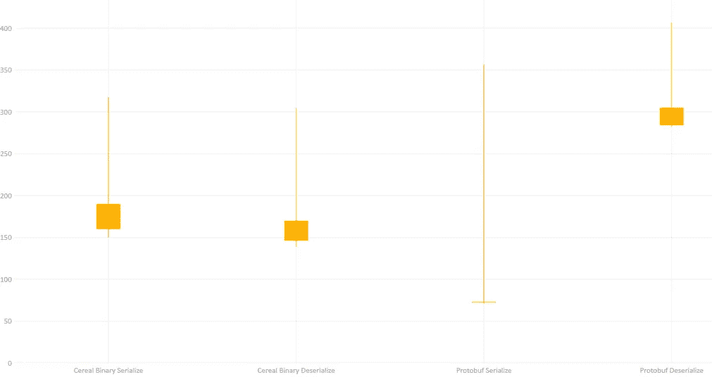

Click for bigger view. Ser = Serialization test, Des = Deserialization test, StrSer = Stream Serialization, StrDes = Stream Deserialization, c++ x64 run

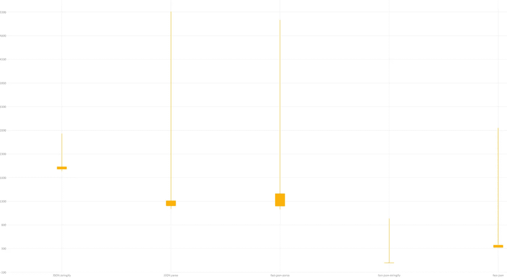

Click for bigger view. Ser = Serialization test, Des = Deserialization test, StrSer = Stream Serialization, StrDes = Stream Deserialization, nodejs x64 run, be aware of the Y-axis not starting at 0

这最后三张图是关于 C++、C++和 Node 中的序列化器。JS 分别。

关于第一幅图，有趣的是，我曾期望 C++中的 JSON 和 XML 序列化比 C#中的要快。但不知何故，谷类 JSON 序列化和 DataContractJsonSerializer 反序列化一样慢。不过，反序列化的速度非常快。我不确定我是发现了性能缺陷还是做错了什么。这就是为什么在第二张图中，我去掉了 JSON 和 XML，我发现 Protobuf 在 C++中确实更快。然而更重要的是，因为 C++没有额外的垃圾收集指标，所以结果非常一致。第二张图可能看起来和 C#一样不稳定，但实际上都在几百秒之内。

第三个也是最后一个图是一对节点的结果。JS 序列化程序。当然是默认的一个和一对声称更快的情侣。不过，我想我可能会在 js 中处理一些获得准确时间的问题。节点。JS 支持 hrtime，应该是准确的，但还是我的结果到处都是。我不确定我是否能调用节点。JS 基准准确。

**结果—分析**

为了确保我的 C#基准测试不会受到垃圾收集的阻碍，我做了一个内存分析。

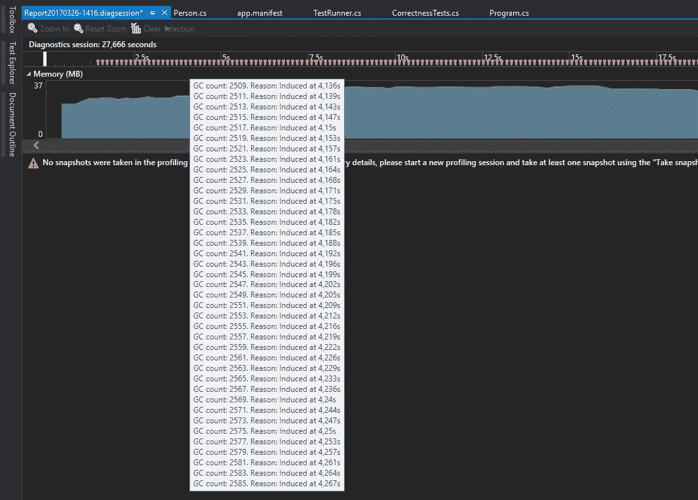

Garbage Collection

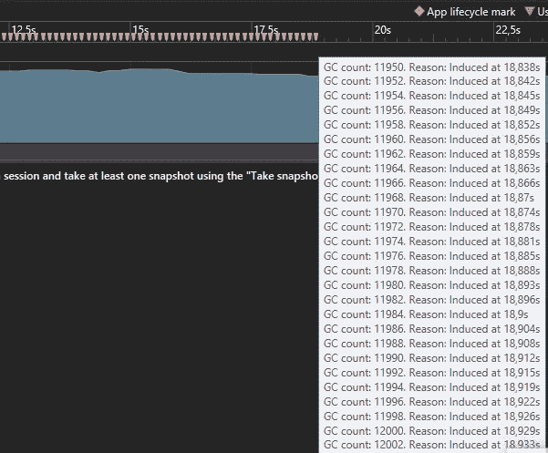

Garbage Collection

正如您所看到的，垃圾收集只发生在 GC。调用 Collect()。

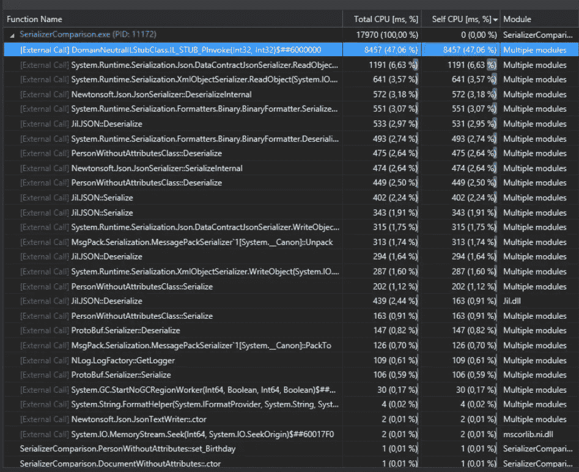

CPU Profile

在 CPU 配置文件中，大部分时间花在一些 P/Invoke 上。我大胆猜测，这是我正在做的垃圾收集器的事情，因为一个 GC。每 4 毫秒收集一次。否则，CPU 时间将用于序列化库。

原始测量可以在这里找到: [C# x86](https://github.com/Oipo/SerializerComparison/blob/7e8085e5bf290ff023f77dcf5fe86d42c5cbda80/measurements-csharp-x86.txt) 、 [C# x64](https://github.com/Oipo/SerializerComparison/blob/7e8085e5bf290ff023f77dcf5fe86d42c5cbda80/measurements-csharp-x64.txt) 、 [C++](https://github.com/Oipo/SerializerComparison/blob/7e8085e5bf290ff023f77dcf5fe86d42c5cbda80/measurements-cpp.txt) 和[节点。JS](https://github.com/Oipo/SerializerComparison/blob/7e8085e5bf290ff023f77dcf5fe86d42c5cbda80/measurements-nodejs.txt) 。

**结论**

在这篇(相当长的)文章中，我已经展示了大多数基准在进行度量时会遗漏一些步骤，正确地进行度量是困难的，并且二进制序列化肯定比 JSON 序列化快。

毫无疑问，我没有使用任何你将在软件中使用的数据对象进行测试，但我认为可以肯定地说，Jil 和 NetJSON 是我为 C#测试的最快的 JSON 序列化程序，而 ZeroFormatter 无疑是我测试的最快的二进制序列化程序。

但是如果你真的真的想要每盎司的性能，你仍然必须使用 C++，或其他静态编译语言。

如果你已经坚持到现在——感谢你的阅读！我希望你和我做这个的时候一样开心。如果你有任何问题，不要犹豫问。

> [黑客中午](http://bit.ly/Hackernoon)是黑客如何开始他们的下午。我们是 [@AMI](http://bit.ly/atAMIatAMI) 家庭的一员。我们现在[接受投稿](http://bit.ly/hackernoonsubmission)，并乐意[讨论广告&赞助](mailto:partners@amipublications.com)机会。
> 
> 如果你喜欢这个故事，我们推荐你阅读我们的[最新科技故事](http://bit.ly/hackernoonlatestt)和[趋势科技故事](https://hackernoon.com/trending)。直到下一次，不要把世界的现实想当然！

