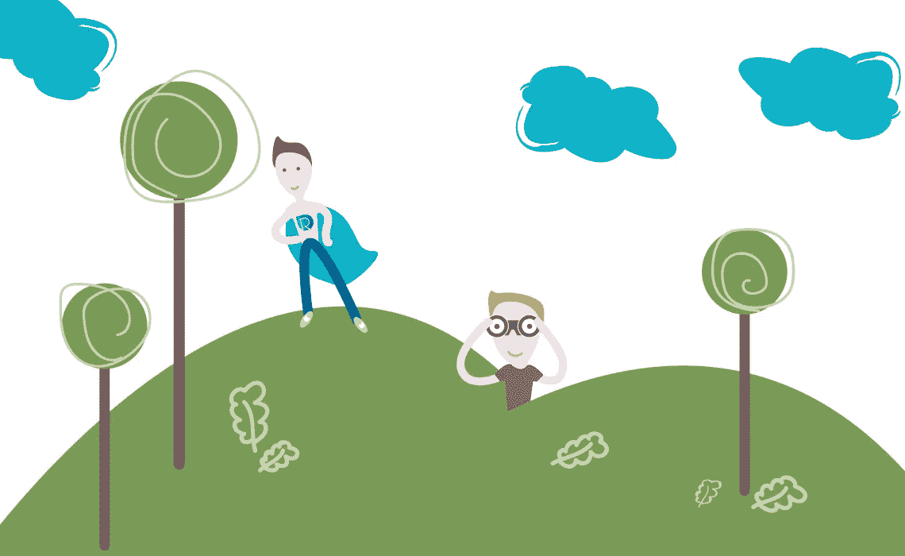

# 竞争对手分析。识别和建立质量标准

> 原文：<https://medium.com/hackernoon/competitor-analysis-identifying-and-establishing-criterion-of-quality-f7f255cf35f1>

有时候，商业理念是从竞争对手分析的种子中成长起来的。很可能有些人决定拥有自己的生意，是因为对市场上的产品进行内部比较，比较不同公司为他们的用户准备的功能。真正有趣的是，到底是什么驱使人们去做生意:优势和明显的利润，还是一些弱点和缺陷，在他们看来很容易改进？老实说，每次我们在市场上选择产品时，都会进行竞争对手分析。当然可以！甚至在我们寻找早餐玉米片的时候，我们也在分析优势和劣势。如果你是为自己购买产品进行分析，或者是为你的企业进行专业的竞争对手分析，这没有太大的区别——在任何情况下，你都应该观察和收集细节。

# 当发明自行车是个坏主意时

当英雄真好。当你面对一个问题并找到解决方法时，你就在自己开辟一条路。但是，如果有人浪费时间去制造已经存在的东西，那也是一种愚蠢。竞争对手分析可以帮助你找出什么是已经实施的，人们习惯于什么。(1)事实是，你未来用户的用户体验也是他们使用你竞争对手产品的体验。这是合乎逻辑的。

当然，你的产品是独一无二的，更加与众不同，但是直到你将你的想法变成现实，你的业务开始运转——你的用户正在使用一些东西。你应该尊重你的用户，你需要在你的产品之前了解他们的用户体验。因此，竞争分析的最佳时机是产品生命周期开发的最开始。你能从中学到什么？

*   采纳已经存在的最佳想法和解决方案
*   避免竞争对手的错误
*   了解您所在区域的标准和操作可用性
*   获得关于提高可用性的想法
*   意识到你的事业现在在哪里，你可以朝哪个方向前进
*   了解趋势

# 开始之前

如果我们对高质量的分析感兴趣，以正确的方式识别你的竞争对手是最重要的因素之一。为了更好地识别它们，我们可以把它们按类别分开；直接和间接竞争对手。

*直接竞争对手* —当你的产品相同或非常相似时。例:两个面包店有新鲜面包。

*间接竞争对手*——当你的产品不同，但你在解决同样的用户需求。一家面包店在卖普通的小麦面包，但第二家面包店在卖 lavash 和 pita。产品是不同的，但它们解决的是用户的相同需求。

再举一个直接/间接竞争对手的例子:寿司店“A”是寿司店“B”的直接竞争对手，但两者都是披萨店的间接竞争对手。

所以，首先做两份清单——一份是直接竞争对手，一份是间接竞争对手。你会用不同的方式分析它们。通过与利益相关者的访谈和研讨会，获得了它们的一些利弊。但是更深的理解总是给我们更多的想法和技巧，我们可以很快在我们的商业战略中使用它。

# 如何分析直接竞争对手

为了进行比较和分析，我们需要确定什么是我们业务的关键 UX 因素。然而因素可能是不同的，所以你可以自由选择更适合你的。这取决于你的兴趣，你想在业务的哪个方面有所提高。UX 顾问萨尼塔·卢斯蒂卡向我们展示了一些 UX 品质因素。(2)

**关键 UX 因素:**

*   导航:它能帮助我们找到我们要找的东西吗？
*   行动号召:他们不讨厌吗？它们是否有吸引力，是否与用户的任务相关？
*   内容布局:内容是否容易扫描？
*   内容层次:定位在那里舒服吗？
*   可读性:分析类型和大小，文本框的组织
*   路标:这些标志容易阅读吗？它们有帮助和意义吗？
*   信任和可信度:是否友好和可理解？

要分析你的直接竞争对手，根据标准浏览并记录一些错误或好的想法就足够了。尽可能多地找出错误。要批判。试着理解用户在使用服务时的感受。观察自己——使用他们的产品感觉如何？一个好的餐馆老板在其他餐馆吃饭是为了了解那里怎么样，发现新的想法，了解潮流，感受氛围。

# **如何分析间接竞争对手**

当对直接竞争对手的一切都很清楚时，我们需要对间接竞争对手做什么？分析它们有什么好处？又该如何选择呢？

间接竞争对手是客户的替代购买选择。如果一个人想解渴，他或她可以选择苏打水或绿茶。在这种情况下，这两种产品都可以饮用，但却是完全不同的类别。准确地解决用户的问题——渴望——会让他们成为间接竞争对手。当你分析一个直接竞争对手时，你加深了对产品的了解。但是当你发现你的间接竞争对手时，你更了解市场。

# **间接竞争对手分析以获得更好的用户体验**

是什么促使用户改变主意，喜欢另一个类别，另一个解决问题的方案？如果我们谈论的是间接竞争对手，我们比较的不是产品，而是需求。更重要的是，我们在比较解决问题的方式，也就是我们用户的行为，他的生活方式，他的思维方式。这当然更加困难。如果我们致力于改善用户体验，间接竞争对手是我们应该更加关注的话题。仅仅设计出比我们的直接竞争对手更好的产品是不够的，还应该设计出比市场上的同类产品更好的产品。(3)

# 供分析的问题

有一些问题可以让你更好地了解你需要关注间接竞争对手的哪些方面:

*   在这种情况下，使用他们的产品显然更好/更差？
*   使用该产品是否需要额外/更少的努力？
*   您可以实现哪些功能？
*   你能评估哪些错误？

尽可能往前走。试着认识到你可以在你的业务流程中使用和涉及到什么。你很快就会发现，当你在进行间接的竞争对手分析时，你的脑海中会涌现出许多令人捧腹的想法。

# 竞争对手的 SWOT 分析

分析竞争对手的基本工具是 SWOT(优势、劣势、机会、威胁)分析。这种模式组织得如此之好，以至于新一代的分析和营销人员并不急于改变它。事实上，SWOT 分析是识别、修正、组织和分析你的竞争对手的数据的完美工具。SWOT 分析的目的可能不同，例如:

*   创建营销行动计划
*   重组团队
*   发现公司内部的问题
*   改善工作流程
*   激励团队
*   找到解决办法
*   分析竞争对手

诸如此类。该工具是通用的，我们将向您解释如何使用它，尤其是在竞争对手分析中。唯一的区别是将组织好的数据转换成您未来的利润。那么在你的关注下应该做哪些更高利润的分析转化呢？我们将分别考虑每张画布。

当你发现竞争对手的**优势**时:

*   想一想，你能把哪一个融入到你的生意中，并保持你自己的个性
*   把你的竞争对手的优势视为你不应该低于他们的界限
*   让它的优点成为你的普通特征

当你发现竞争对手的**弱点**时:

*   当你把想法变成生意时，试着去评估它们
*   为每个问题找到解决方案
*   好好记住它们，并把它们记在心里

当你发现竞争对手的**机会**:

*   想一想为什么他还没有实施它们——找一个解释
*   让它们在你的业务中成为现实

当你发现竞争对手的**威胁**时:

*   避开他们
*   发现你的竞争对手如何避免他们

SWOT 做好了真的有用。注意细节，和你的团队一起做。它更有效率，是的——它给你越来越多的创造和解决问题的机会。

现在，我们正在准备一篇关于用户研究的新文章，其中将包括改善工作流程的技巧和诀窍。

参考资料:

1.  进行可靠的 UX 竞争分析。丹佛斯媒体。更多信息请点击:[http://danforth . co/pages/2014/03/01/conducting-a-solid-UX-competitive-analysis/](http://danforth.co/pages/2014/03/01/conducting-a-solid-ux-competitive-analysis/)
2.  UX 设计-竞争对手评论。萨尼塔·卢斯蒂卡。更多信息请点击这里:【https://www.slideshare.net/SanitaLustika/competitor-re 
3.  营销竞争对手分析。奥罗拉·梅内盖罗。更多信息请点击:[https://interconnected strategy . com/marketing-competitor-analysis/](https://interconnectedstrategy.com/marketing-competitor-analysis/)

来源:[Redentu.com](https://redentu.com/competitor-analysis-identifying-and-establishing-criterion-of-quality)