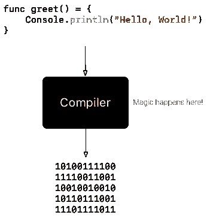
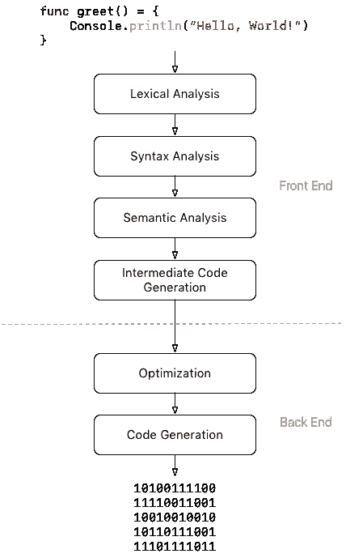
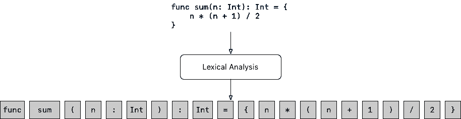
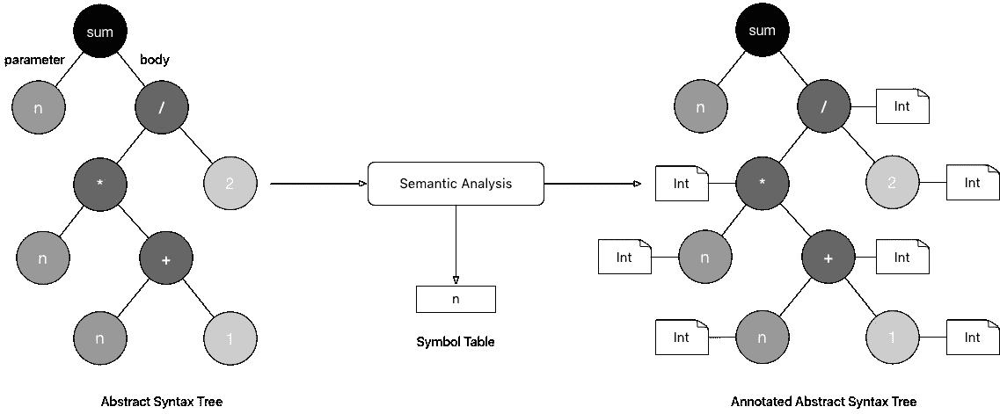
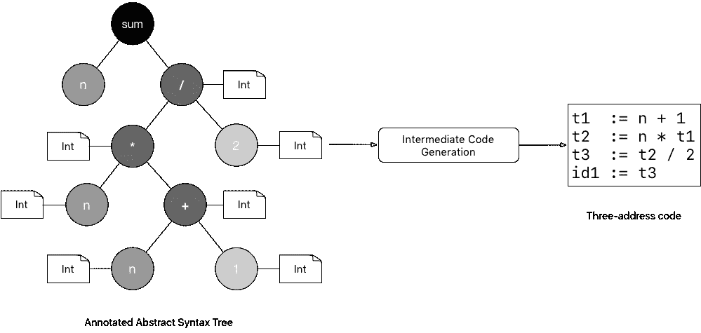
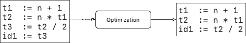
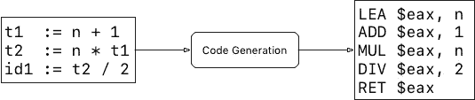

# 编译器和解释器

> 原文：<https://medium.com/hackernoon/compilers-and-interpreters-3e354a2e41cf>


Sliding doors, [Kanō Sanraku](https://en.wikipedia.org/wiki/Kan%C5%8D_Sanraku)

欢迎来到 [*让我们构建一种编程语言(LBPL)* 系列](https://hackernoon.com/lets-build-a-programming-language-2612349105c6)的第二篇文章。如果你不熟悉这个系列， [LBPL](https://hackernoon.com/lets-build-a-programming-language-2612349105c6) 的目的是带你从 0 到 1 实现一种编程语言。

这篇文章对编译器和解释器的结构进行了高度概括。

# 什么是编译器？

编译器最简单的定义是一个程序，它将以高级编程语言(如 JavaScript 或 Java)编写的代码翻译成可由计算机或另一个程序(如虚拟机)直接执行的低级代码(如汇编)。

例如，Java 编译器将 [Java](https://en.wikipedia.org/wiki/Java) 代码转换为 [JVM](https://en.wikipedia.org/wiki/Java_virtual_machine) (Java 虚拟机)可执行的 [Java 字节码](https://en.wikipedia.org/wiki/Java_bytecode)。其他例子有 [V8](https://en.wikipedia.org/wiki/V8_(JavaScript_engine)) ，谷歌的 JavaScript 引擎，它将 JavaScript 代码转换成机器码，或者 [GCC](https://en.wikipedia.org/wiki/GNU_Compiler_Collection) ，它可以将用 C、C++、Objective-C、Go 等编程语言编写的代码转换成本机机器码。



# 黑盒子里有什么？

到目前为止，我们把编译器看作是一个神奇的黑盒子，它包含了一些把高级代码转换成低级代码的咒语。让我们打开那个盒子，看看里面是什么。

编译器可以分为两部分。

*   第一个通常被称为**前端**扫描提交的源代码中的语法错误，检查(并在必要时推断)每个声明变量的类型，并确保每个变量在使用前都已声明。如果有任何错误，它会向用户提供信息性的错误消息。它还维护一个名为**符号表**的数据结构，该表包含源代码中所有*符号*的信息。最后，如果没有检测到错误，另一个数据结构，代码的*中间表示*，从源代码建立，并作为输入传递给第二部分。
*   第二部分，**后端**利用*前端*构建的*中间表示*和*符号表*生成底层代码。

前端和后端都在一系列阶段中执行操作。每个阶段从它之前的阶段发出的另一个数据结构生成一个特定的数据结构。

前端的阶段一般包括**词法分析**、**语法分析**、**语义分析**和**中间代码生成**而后端包括**优化**和**代码生成**。



Structure of a compiler

## 词汇分析

编译器的第一阶段是*词法分析*。在这个阶段，编译器将提交的源代码分解成称为**词位**的有意义的元素，并从词位生成一系列**标记**。

一个*词位*可以被认为是源编程语言中唯一可识别的字符串，例如*关键字*如`if`、`while`或`func`、*标识符*、*字符串*、*数字*、*运算符*或*单字符*如`(`、`)`、`.`或`:`。

*标记*是描述*词位*的对象。除了*词位*(词位的实际字符串)的值之外，它还包含诸如其类型(*它是关键字吗？* *一个标识符？* *一个操作员？* …)及其在源代码中出现的位置(行号和/或列号)。



Sequence of lexemes generated during lexical analysis

如果编译器遇到一串它不能为其创建一个*标记*的字符，它将通过抛出一个错误来停止执行；例如，如果遇到格式错误的字符串或数字或无效字符(如 Java 中的非 ASCII 字符)。

## 语法分析

在语法分析过程中，编译器使用词法分析过程中生成的*标记*序列生成一个树状数据结构，称为**抽象语法树**，简称 **AST** 。AST 反映了程序的语法和逻辑结构。


Abstract Syntax Tree generated after syntax analysis

语法分析也是检测最终语法错误并以信息性消息的形式报告给用户的阶段。例如，在上面的例子中，如果我们在定义了`sum`函数后忘记了右括号`}`，编译器应该返回一个错误，指出缺少`}`，并且该错误应该指向缺少`}`的行和列。

如果在这一阶段没有发现错误，编译器转到*语义分析*阶段。

## 语义分析

在语义分析时，编译器使用语法分析时生成的 *AST* 来检查程序是否符合源编程语言的所有规则。语义分析包括

*   **类型推断**。如果编程语言支持类型推断，编译器将尝试推断程序中所有非类型化表达式的类型。如果类型被成功推断，编译器将使用推断的类型信息在 *AST* 中注释**相应的节点。**
*   **型式检查**。在这里，编译器检查赋给变量的所有值和操作中涉及的所有参数的类型是否正确。例如，编译器确保没有类型为`String`的变量被赋予`Double`值，或者类型为`Bool`的值没有被传递给接受类型为`Double`的参数的函数，或者我们没有试图用`Int`、`"Hello" / 2`来除`String`(除非语言定义允许)。
*   **符号管理**。除了执行类型推断和类型检查，编译器还维护一个名为**符号表**的数据结构，其中包含了程序中遇到的所有符号(或名称)的信息。编译器使用*符号表*来回答诸如*这个变量在使用前声明了吗？*、*同一个作用域内是否有 2 个同名的变量？* *这个变量的类型是什么？* *这个变量在当前作用域内可用吗？*还有很多。

语义分析阶段的输出是一个**注释 AST** 和**符号表**。



## 中间代码生成

在语义分析阶段之后，编译器使用*注释的 AST* 生成一个中间的和机器无关的底层代码。一种这样的中间表示是 [**三地址码**](https://en.wikipedia.org/wiki/Three-address_code) 。

*三地址码* ( *3AC* )最简单的形式是一种语言，其中一条指令是一个赋值，最多有 3 个操作数。

*3AC* 中的大多数指令都是`a **:=** b **<operator>** c`或`a **:=** b`的形式。



上图描述了一个 *3AC* 代码，该代码由在函数编译期间创建的*注释 AST* 生成

```
**func** sum(n: **Int**): **Int** = {
    n * (n + 1) / 2
}
```

中间代码生成结束了编译器的*前端*阶段。

## 最佳化

在优化阶段，即*后端*的第一阶段，编译器使用不同的优化技术来改进生成的中间代码，例如通过使代码更快或更短。

例如，对前一个例子中的 *3AC* 代码的一个非常简单的优化就是去掉临时赋值`t3 := t2 / 2`，直接给`id1`赋值`t2 / 2`。



## 代码生成

在这个最后阶段，编译器将优化的中间代码翻译成机器相关代码、*汇编*或任何其他目标低级语言。



# 编译器与解释器

让我们以编译器和解释器之间的区别来结束这篇文章。

解释器和编译器在结构上非常相似。主要区别在于解释器直接执行源编程语言中的指令，而编译器将这些指令翻译成高效的机器代码。

解释器通常会生成一个有效的中间表示，并立即对其进行评估。根据解释器的不同，中间表示可以是一个 *AST* 、一个*带注释的 AST* 或一个独立于机器的低级表示，如*三地址码*。

# 下一步是什么？

请阅读下一篇文章，在这篇文章中，我们将深入探讨词法分析，并回顾为 Blink 构建词法分析器所需的所有概念。你也会因为完成第一个挑战而弄脏你的手。

你已经到达终点了。🎉

> [黑客中午](http://bit.ly/Hackernoon)是黑客如何开始他们的下午。我们是 [@AMI](http://bit.ly/atAMIatAMI) 家庭的一员。我们现在[接受投稿](http://bit.ly/hackernoonsubmission)，并乐意[讨论广告&赞助](mailto:partners@amipublications.com)机会。
> 
> 如果你喜欢这个故事，我们推荐你阅读我们的[最新科技故事](http://bit.ly/hackernoonlatestt)和[趋势科技故事](https://hackernoon.com/trending)。直到下一次，不要把世界的现实想当然！