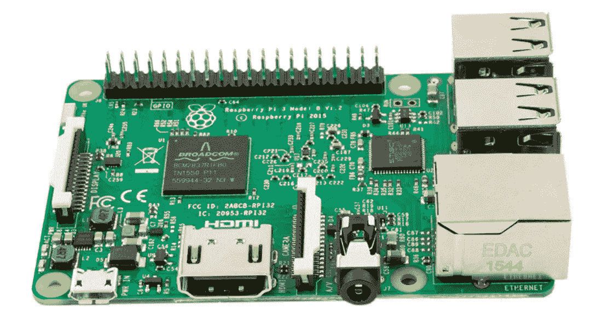

# Linux 上树莓 Pi 的交叉编译 Rust

> 原文：<https://medium.com/hackernoon/compiling-rust-for-the-raspberry-pi-49fdcd7df658>



让我们在 Rust 中构建一个简单的“Hello Pi”[程序](https://hackernoon.com/tagged/program)，并为运行 [Linux](https://hackernoon.com/tagged/linux) 版本的 Raspberry Pi 编译它。我用的是覆盆子 Pi 3 和 Raspbian。为什么我们要在 PC 上编译这个？假设您在 PC 上开发您的应用程序，那么在 PC 上编译和测试它并且只将二进制文件发送到 RPi 会快得多。

我们需要 [rustup](https://github.com/rust-lang-nursery/rustup.rs) 来使用不同版本的 Rust 并选择编译目标。这是一个工具链安装程序。

```
curl https://sh.rustup.rs -sSf | sh
```

如果你有一个以前安装的 Rust，那么 rustup 会要求你删除它，这样 rustup 就可以管理不同的 Rust 版本。继续为您的环境安装默认的 Rust 版本。

为了编译 Raspberry Pi，我们需要为 ARM 平台安装正确的工具链。型号 2 和 3 支持 ARMv7，型号 1 支持 ARMv6。RPi 有一个浮点处理器，所以我们想要 *gnueabihf* (我相信 hf 是硬浮点)，而不是 *gnueabi* 。本文将重点介绍型号 2 & 3。

添加防锈工具链:

```
$ rustup target add armv7-unknown-linux-gnueabihf
```

而正确的 C 编译器:

```
$ sudo apt-get install gcc-4.7-multilib-arm-linux-gnueabihf
```

我们需要将我们的构建目标添加到~/。cargo/config，以便 rust 知道使用哪个链接器。

```
[target.armv7-unknown-linux-gnueabihf]
linker = "arm-linux-gnueabihf-gcc-4.7"
```

# 创建我们的项目

安装 Rust 将安装货物，Rust 包管理器。我们可以用它来创建一个新项目。

```
$ cargo new hello-rpi --bin
$ cd hello-rpi
```

我们仍然可以通过运行 *cargo run 在 AMD64 上本地运行我们的项目。*为我们使用的 RPi 构建我们的项目。

```
$ cargo build --target=armv7-unknown-linux-gnueabihf
```

让我们看看我们是否已经成功创建了 arm 二进制文件

```
$ file target/armv7-unknown-linux-gnueabihf/debug/hello-rpitarget/armv7-unknown-linux-gnueabihf/debug/hello-rpi: ELF 32-bit LSB  shared object, ARM, EABI5 version 1 (SYSV), dynamically linked (uses shared libs), for GNU/Linux 2.6.32, 
```

成功！当我们将 hello-rpi 转移到我们的 Raspberry Pi 时，我们将能够运行它并得到一个奇妙的“hello world！”在命令行上！现在我们可以编译了，我们可以开始开发一些更有趣的东西。

*第 2 部分即将推出…*

[](http://bit.ly/HackernoonFB)[](https://goo.gl/k7XYbx)[](https://goo.gl/4ofytp)

> [黑客中午](http://bit.ly/Hackernoon)是黑客如何开始他们的下午。我们是阿妹家庭的一员。我们现在[接受投稿](http://bit.ly/hackernoonsubmission)并乐意[讨论广告&赞助](mailto:partners@amipublications.com)的机会。
> 
> 如果你喜欢这个故事，我们推荐你阅读我们的[最新科技故事](http://bit.ly/hackernoonlatestt)和[趋势科技故事](https://hackernoon.com/trending)。直到下一次，不要把世界的现实想当然！

